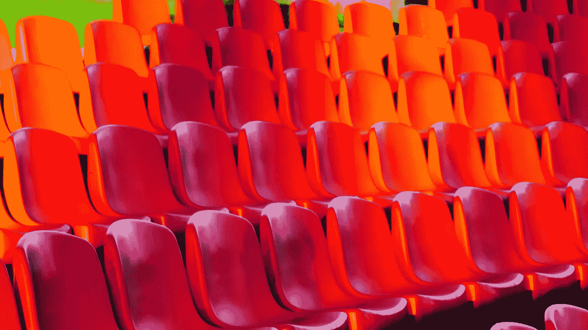
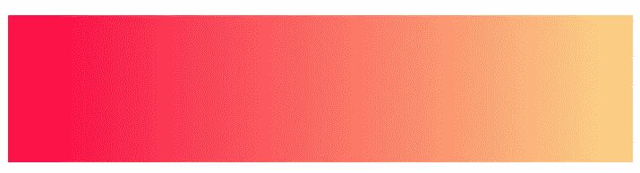
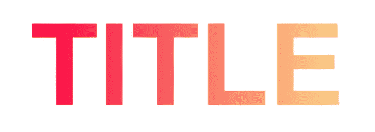
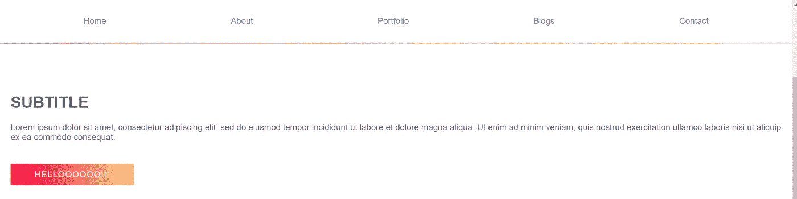

# 使用 CSS 渐变创建简单的页面装饰

> 原文：<https://betterprogramming.pub/some-easy-page-decorations-with-css-gradient-b847fb74e1db>

## 为您的网站或应用程序添加美丽的渐变



[亚历杭德罗·巴尔巴](https://unsplash.com/@albrb?utm_source=unsplash&utm_medium=referral&utm_content=creditCopyText)在 [Unsplash](https://unsplash.com/s/photos/gradient?utm_source=unsplash&utm_medium=referral&utm_content=creditCopyText) 上拍摄的照片

`linear-gradient`或`radial-gradient`最常用于添加渐变背景。但是你知道吗，我们可以使用渐变来创建充满活力的文本，给它们加下划线，添加分隔线和样式按钮。

最好的例子是 Instagram stories 上用户资料周围出现的渐变边框。

你甚至可以建立一个网站，像我的 [**作品集**](https://nivedhasamy.netlify.app/) 使用各种渐变风格。

## TL；速度三角形定位法(dead reckoning)

你可以参考本文讨论的风格，使用 React 和 Sass 实现，[这里](https://stackblitz.com/edit/react-vrp7nk)。

# 基础

在这篇文章中，我们必须创建一个基本的渐变背景来装饰元素。让我们重温一下基本知识:

为了创建一个基本的渐变，我们使用`linear-gradient`或`radial-gradient`的方法来传递一些颜色和你喜欢颜色流动的方向。我将使用颜色为`#fc0142`和`#FBD786`的`linear-gradient`向右流动。

```
background: linear-gradient(to right, #fc0142, #FBD786);
```

我们得到:



我们在传递的颜色数量和方向上有更高级的定制。更多可以参考[官方文档](https://developer.mozilla.org/en-US/docs/Web/CSS/CSS_Images/Using_CSS_gradients)。

# 渐变文本

创建背景后，要将背景裁剪为文本，我们使用两个神奇的属性:

*   这将在我们的文本中绘制背景
*   `text-fill-color: transparent;`:这将删除已经设置的默认文本颜色(大多数情况下是黑色)，这样我们就可以看到我们创建的渐变背景

**注意:** `text-fill-color`还没有标准化；因此，我们需要将它与`-webkit-`扩展一起使用。

如果没有这些属性，文本和背景只会重叠。

以及一些风格:

```
//HTML<div class="title"> TITLE </div>//CSS.title {
 display:inline-block;
 font-size: 150px;
 background: linear-gradient(to right, #fc0142, #FBD786);
 -webkit-background-clip: text;
 -webkit-text-fill-color: transparent;
}
```

## 哒哒！



# 渐变下划线


要做到这一点，我们需要对 CSS 中的伪元素和类有一些了解。首先，让我们看看风格:

```
//HTML<div class="gradUnderline">Subtitle</div>//CSS
.gradUnderline{
 position: relative;
 display: inline;
}.gradUnderline::**after**{
 content: ""; 
 position: absolute;
 left: 0; 
 bottom: 0px;
 background: linear-gradient(to right, #fc0142, #FBD786);
 height: 3px;
 width:100%;
}
```

## **详情**

*   `[::after](https://developer.mozilla.org/en-US/docs/Web/CSS/::after)`:在所选元素末尾添加内容的伪元素。在我们的例子中，我们在包含类`gradUnderline`的元素所包含的文本后面创建一行。
*   `content`:添加到`content`的文本或图像出现在包含`gradUnderline`类的元素之后。因为我们只需要添加一行，所以我们将它留空。这个属性很神奇，在实现工具提示中被广泛使用。
*   `position`:用于决定元素必须出现在屏幕上的什么位置。使用`absolute`，页面布局中没有为元素创建空间——它有点像是被踢出并飞过文档。它与父元素中的`relative`成对出现，在`top`、`right`、`bottom`和`left`等值的帮助下设置它在页面上的位置。这里，我们将`left`和`bottom`设置为`0`,这样该行出现在底部并从文本的左侧开始。详情请参见此处的。

您也可以添加转场以获得更好的效果。

# 渐变按钮

这是最容易创建的元素。只需用`linear-gradient`方法对按钮的`background`属性进行样式化。

```
//HTML
<button class="gradBtn" type="text"> HELLOOOOOO!! </button>//CSS
.gradBtn{
  **background: linear-gradient(to right, #fc0142, #FBD786);**
  /* additional style */
  height: 40px !important;
  line-height: 40px !important;
  font-size: 16px !important;
  letter-spacing: 1px;margin: 25px 0;
  padding: 0 45px !important;color: $text-btn !important;
  border: none !important;
  box-shadow: none;
}
```


# 有趣的锻炼

尝试使用上面的概念用渐变来设计你的导航栏，如下所示:



# 解决办法

解决方法在[这里](https://stackblitz.com/edit/react-vrp7nk?file=style.scss)。

感谢阅读！快乐造型！