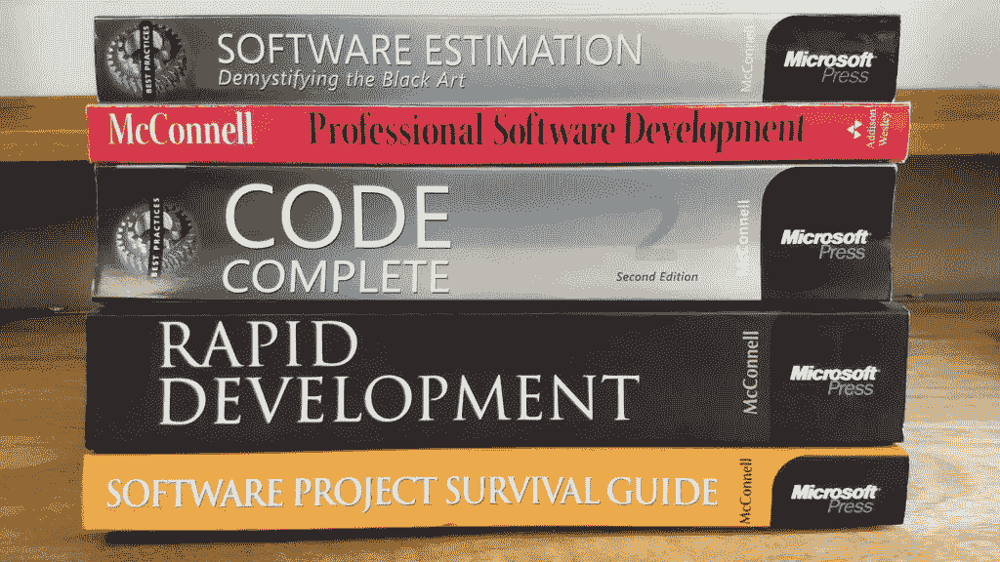

# 来自《软件构造实用手册:代码完整》的一些想法

> 原文：<https://betterprogramming.pub/some-ideas-from-the-practical-handbook-of-software-construction-code-complete-3118e34d7085>

## 改变你看待软件构造的方式

[*代码完整*](https://www.amazon.com/Code-Complete-Practical-Handbook-Construction/dp/0735619670) 是一本关于软件工程的书，由史蒂夫·麦康奈尔撰写，于 1993 年出版。你可能会说有点老了。

也许吧，但是这本书里的观点是惊人的，将会改变你看待软件构造的方式。我想分享一些我发现的启示。

请记住，这里给出的笔记是本书中存储的知识的最小集合。我希望这篇文章能鼓励新读者去尝试这本书。

# 编码与软件构造

尽管术语编码和软件工程经常互换使用，但它们并不完全相同。

软件构建指的是编码和调试，但也包括设计、单元测试、集成测试和书中明确描述的其他活动。

当我们说“编码”时，我们通常指的是将预先存在的设计翻译成计算机语言的机械动作。因此有编码员和软件工程师。

# 证明文件

你可能遇到过一个编程教授，如果你的编程作业没有被恰当地记录下来，他会扣掉你很多分。

你不喜欢那样，是吗？我明白。但是仔细想想。构建的产品，即源代码，通常是程序员唯一可用的文档，因此，源代码必须具有尽可能高的质量。

当你写代码时，想想你的读者和你的程序员同事，他们有一天将不得不维护代码库。让他们的生活更轻松。

# 隐喻

编程最具挑战性的部分是将问题概念化。

隐喻经常提供从不同角度看问题的有用见解。解决问题的能力比知道具体的解决方案更有价值。

你是如何发展这项技能的？你编程。

我开始寻求在无限长的时间里每天解决至少一个编程挑战。这个我以后会多讲。它基于复合改进的思想，在[这篇文章](https://jamesclear.com/continuous-improvement)中有所描述。

# 质量保证不仅仅是测试

软件质量保证不仅限于测试。测试不能揭示在先决条件开发或问题定义阶段引入的问题。

由于不正确的问题定义，您可能有一个功能完整的程序来解决错误的问题。

您可能有一个解决了正确问题的程序，但是由于不正确的先决条件开发而没有包括所有期望的功能。

最后，由于糟糕的架构设计，你可能用正确的特性解决了正确的问题，但却用了错误的方法。

明确的需求防止你猜测用户想要什么。

提示:有一个问题定义，一个系统要解决的问题的清晰陈述。

重要异议:请记住，稳定的需求通常是一个神话。随着系统的进展，客户会改变他们的需求，因为随着项目的进展，他们会理解他们自己的需求。

# 编程语言

你的编程工具不必决定你如何思考编程。将*编程为*语言，而不是将*编程为*语言。

*   用一种语言编程*:用一种语言编程的程序员将他们的思想局限于该语言提供的结构。因此，如果语言是原始的，他们的思想也将是原始的。*
*   将*编程为*一种语言:编程为一种语言的程序员将首先决定他们想要表达什么思想，然后决定如何使用该语言提供的工具来表达这些思想。

这些想法在*代码完成*中有更详细的描述。我仍在消化这本书。强烈推荐，好好享受！