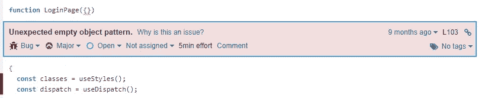
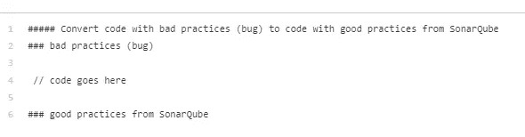
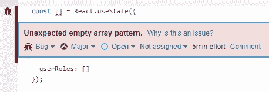
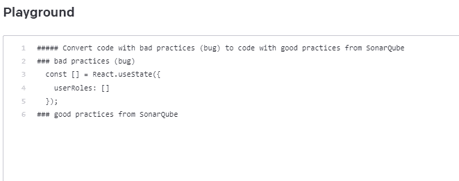
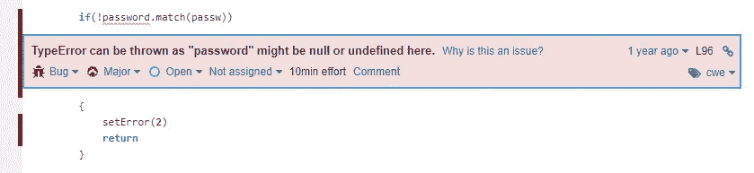
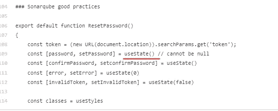
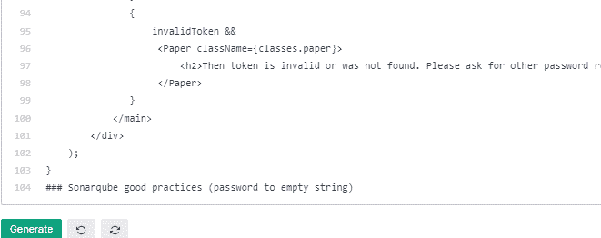
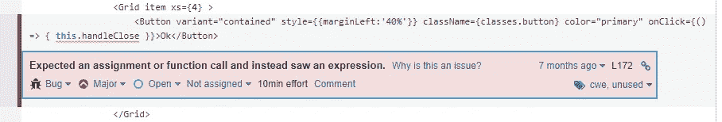
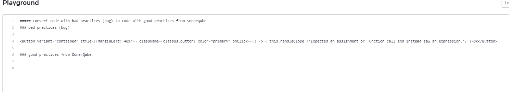
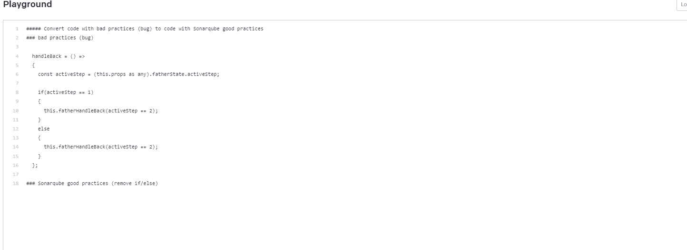

# SonarQube 与开放源代码

> 原文：<https://betterprogramming.pub/sonarqube-with-openai-codex-48d29bae35cb>

## 可以在 SonarQube 中使用 Open AI Codex 引入一个简单的自动更正按钮吗？

自从我(通过我的初创公司)接触到开放的人工智能法典以来，它一直是尝试一些次要东西的借口，这个绝对值得一篇文章！

最近我用 SonarQube 更新了管道，看看从长远来看是否有用。显然，当第一次运行它时，你会发现几十个错误(如果代码库足够大的话)。我的情况是这样的:

这里所有的错误都很容易纠正。然后我有了一个想法“法典必须能够做到这一点，对吗？至少经过适当的调整”。那么让我们来看一些用例吧！

# 搭建舞台

首先，添加**最小必要上下文**会更好，或者换句话说，不要传递整个文件，只传递发生 bug 的那部分代码，就像函数一样。然后，你需要正确的打开 Codex 设置，否则，你将得不到任何有用的东西。转到[翻译编程语言](https://beta.openai.com/examples/default-translate-code)，并更改为以下文本:

这足以给它一些背景。

# 用例 1:反应状态变量

这是所有方法中最基本的，图像本身就说明了一切:

这当然是一个拷贝/过去。从来没见过这样的事！

现在让我们看看法典是如何解决这个问题的:

看起来不错！它保留了上下文，并且状态变量以正确的方式命名。

# 用例 2:变量和空引用

这个更复杂，需要一些调整。问题很简单:

问题是状态变量`password` 从未定义(`useState()`)开始。所以我用整个钩子试了一下，得到了这个:

不更正！经过几次尝试，我找到了一个解决办法，给法典一些明显的线索，以创造一个更好的环境。

因此，只需添加(空字符串的密码)即可:

正如我们所看到的，名称中带有“password”的两个变量都得到空字符串。

# 用例 3: JSX 使用错误的 onClick 格式调用

现在我们的情况让我确信我应该早点做这个“SonarQube 的事情”。这可能是一个错误，或者很可能是一个初级开发人员试图关闭编译器。

经过几次尝试后，我可以通过在同一行中添加错误文本作为注释来使它工作:

它工作得非常好，可以纠正错误并删除评论！！！

# **用例 4:删除过时的代码**

让我们以一个纯 javascript 用例结束。即使我们认真对待代码审查，我们仍然会得到这样的东西:

在这里，我们想删除评论(代码气味)，以及错误。这是一个用例，捕捉到了法典的一些限制。就我个人而言，我无法解决代码的味道。这可以用时间来完成，但可能是在 bug 之前的一个单独的批处理中。

为了解决这个 bug，添加(remove if/else)达到了目的。

# **结论**

我是从这个问题开始头脑风暴的，“在 SonarQube 中使用开放 AI Codex 可以引入一个简单的自动更正按钮吗？”，我的回答是响亮的**是的。**这不是一个微不足道的特性，因为需要构建一个仔细的请求消息，但是这些用例证明了一些潜力。即使有些人不同意，GTP-4 还在路上，有 **500x** 更多的参数。