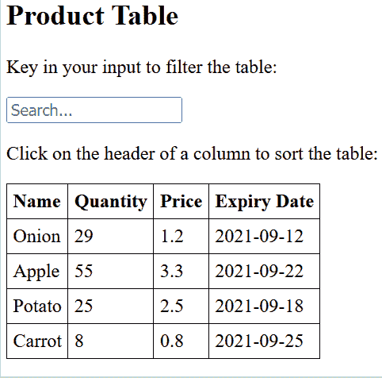
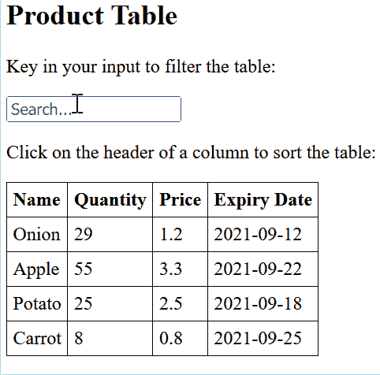
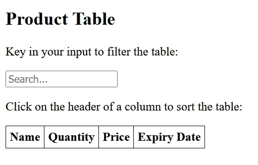
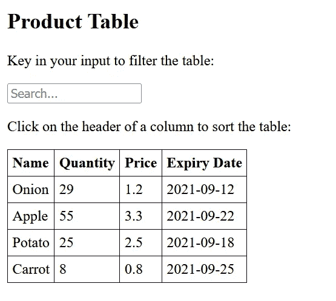

# 用 JavaScript 对表格中的动态数据进行排序和过滤

> 原文：<https://betterprogramming.pub/sort-and-filter-dynamic-data-in-table-with-javascript-e7a1d2025e3c>

## 用普通 JavaScript 构建定制的可重用排序函数


由[扬·安东宁·科拉尔](https://unsplash.com/@jankolar?utm_source=unsplash&utm_medium=referral&utm_content=creditCopyText)在 [Unsplash](https://unsplash.com/s/photos/sort?utm_source=unsplash&utm_medium=referral&utm_content=creditCopyText) 上拍摄

通过阅读本文，您将学会用普通 JavaScript 为动态创建的表实现一般的排序和过滤功能。在本教程结束时，您应该能够获得以下结果:



作者 Gif

根据上面的 gif，只需单击列的标题，就可以根据列值按升序或降序对表格进行排序。这适用于任何类型的数据，无论是字符串、整数还是浮点，只要数据中没有未定义的值。

除此之外，您可以在表格上方的输入框中键入任何关键字，以过滤与输入文本相关的数据行。过滤与表格排序协同工作，使前端用户能够无缝地获得所需的信息。

事实上，您甚至可以根据自己的用例对其进行定制。例如，您可以实现自己的代码来突出显示表中的匹配单元格，如下所示:



作者 Gif

为了保持简洁，实现将:

*   编码在一个文件中
*   使用模拟合成数据

在实际的用例中，你应该将 HTML、CSS 和 JavaScript 分离到不同的文件中。此外，数据应该通过某种形式的 API 调用获得，而不是硬编码到文件中。

# 履行

在工作目录中创建一个名为`app.html`的新文件。

## 超文本标记语言

将以下代码附加到文件中并保存它:

该代码包含以下内容:

*   元数据和外部字体——箭头图标的超棒样式表
*   表格的简单 CSS 样式
*   输入和一个带有几个标题的表

您可以根据自己的喜好在任何浏览器中打开该文件。您应该会看到以下用户界面:



作者图片

## 变量初始化

让我们继续初始化`script`标签中的以下元素对象:

```
var table = document.getElementById('mytable');
var input = document.getElementById('myinput');
```

接下来，创建一个合成的对象数组作为我们数据的数据。

```
var tableData = [
{name: 'Onion', quantity: 29, price: 1.2, expiry: '2021-09-12'}, {name: 'Apple', quantity: 55, price: 3.3, expiry: '2021-09-22'}, {name: 'Potato', quantity: 25, price: 2.5, expiry: '2021-09-18'}, {name: 'Carrot', quantity: 8, price: 0.8, expiry: '2021-09-25'}
];
```

每个对象包含以下字段:

*   名称(字符串)
*   数量(整数)
*   价格(浮动)
*   到期时间(字符串形式的日期)

继续定义以下变量，这些变量用作表格排序时在上下箭头之间切换的参考:

```
var caretUpClassName = 'fa fa-caret-up';
var caretDownClassName = 'fa fa-caret-down';
```

## 排序功能

进行表格排序的技巧如下:

*   清除表格中的所有行
*   对数据数组进行排序
*   遍历数据数组中的每一项，并将其作为一行添加到表中

在 JavaScript 中，数组有自己内置的排序函数[对元素排序并返回一个新数组。此外，它接受一个可选的比较函数，其定义如下:](https://developer.mozilla.org/en-US/docs/Web/JavaScript/Reference/Global_Objects/Array/sort)

> “……定义排序顺序的函数。如果省略，数组元素将被转换为字符串，然后根据每个字符的 Unicode 码位值进行排序。— Mozilla

让我们基于[堆栈溢出](https://stackoverflow.com/questions/979256/sorting-an-array-of-objects-by-property-values)中的一个推荐答案来实现可重用排序函数:

该函数适用于任何数据类型，可以按如下方式调用:

```
// assuming that data is an array
data.sort(sort_by('price', true));
```

## 清除图标功能

之后，在排序函数下面创建一个名为`clearArrow`的新函数。它主要负责清除表格标题旁边的所有箭头图标。

## 切换图标功能

随后，添加以下函数，用于在单击标题时切换箭头图标:

它将首先分配相应的元素并设置底层 id t。这主要是因为当用户点击`span`或`i`标签时会触发`onclick`事件。

然后，它将清除标题中的所有箭头图标，并确定所使用的图标。如果图标是向上箭头，它将变为向下箭头，并将`reverse`标志设置为`false`。否则，它将设置为箭头向上，并将`reverse`标志设置为`true`。

然后，它将通过传入相应的字段和反向变量对数据数组进行排序。

## 填充表格数据功能

最后，调用`populateTable`函数，实现如下:

`populateTable`函数背后的概念非常简单。首先，清除所有底层的 HTML 文本。

然后，遍历数据数组并创建一个新的表行。对于每次迭代，创建相应的单元格，并根据指定的属性分配数据。这里不建议模块化单元的创建和数据分配，因为这样会影响顺序。

## 过滤表数据功能

最后，调用`filterTable`函数。这个函数负责根据 input 元素中的关键字过滤表格。

与操纵底层数据数组的表排序不同，数据过滤代码基于对 CSS 的修改。它由以下步骤组成:

*   获取输入值
*   获取表体中的所有`TR`元素
*   遍历所有的`TR`元素并获取底层的`TD`元素
*   在输入值和每个`TD`元素内`textContent`的值之间进行字符串比较
*   根据之前的字符串比较，修改`TR`元素 CSS 以隐藏或显示

## 事件监听器

使用以下代码对文件进行最后的润色:

当您加载页面时，它会填充整个表格。代码片段还将`onclick`事件添加到表格的所有标题中。除此之外，它还会向输入元素添加`onkeyup`事件。

# 试验

## 用户界面

当您重新加载页面时，应该会看到以下用户界面:



作者图片

## 排序和过滤

只需单击任何标题即可对表格进行排序。此外，您可以在输入框中键入任何文本来过滤表格:


作者 Gif

## 用户化

此外，您可以根据自己的喜好轻松定制代码，因为它是普通的 JavaScript。假设您想在数据过滤时突出显示相应的单元格。您可以通过如下修改`filterTable`功能来实现:

break 语句被删除，代码中包含一个将背景色设置为黄色的条件语句:

```
cell.style.backgroundColor = 'yellow';
```

下面的 gif 展示了过滤表格时的外观:


作者 Gif

您可以在以下[要点](https://gist.github.com/wfng92/ad6af87204da8e36647a365ca90d5af8)中找到完整的代码:

# 结论

让我们回顾一下你今天所学的内容。

本文以插图和对本教程预期结果的解释开始。

然后，探讨了实施过程。它概述了基本的 HTML 样板模板，然后转移到 JavaScript 代码。

它强调并详细解释了排序和过滤功能的实现。除此之外，它还介绍了一些杂项功能，比如切换箭头图标和动态填充数据数组。

最后，展示了如何定制底层函数并在从表中过滤数据时添加背景突出显示。

感谢你阅读这篇文章。请随意查看我的其他文章。祝你有美好的一天！

# 参考

1.  [堆栈溢出—根据属性值对对象数组进行排序](https://stackoverflow.com/questions/979256/sorting-an-array-of-objects-by-property-values)
2.  [w3schools —过滤器/搜索表](https://www.w3schools.com/howto/howto_js_filter_table.asp)