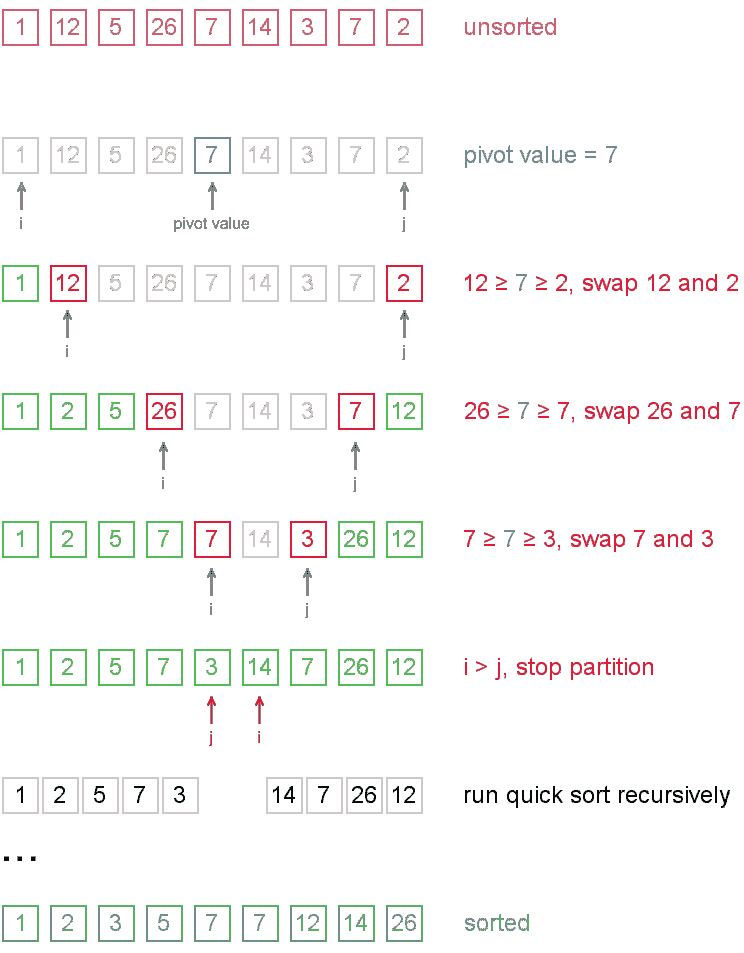
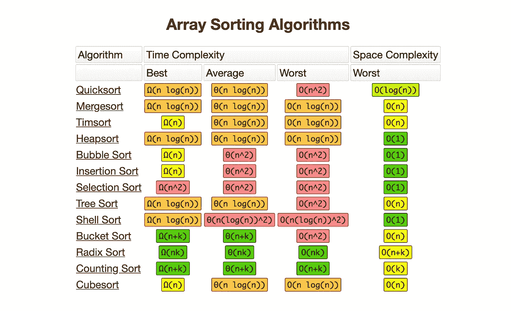

# 使用快速排序算法快速排序

> 原文：<https://betterprogramming.pub/sort-quickly-with-the-quicksort-algorithm-d2d9a7e3856b>

## 算法 101

照片由[苏拉娅·欧文](https://unsplash.com/@traxing?utm_source=unsplash&utm_medium=referral&utm_content=creditCopyText)在 [Unsplash](https://unsplash.com/s/photos/sorting?utm_source=unsplash&utm_medium=referral&utm_content=creditCopyText) 拍摄

在学习计算机科学的时候，我学到的第一件也是最重要的事情就是算法。一个算法是一组被设计用来执行特定任务的指令。这可以是简单的过程，也可以是复杂的操作。

# 什么是排序，为什么它很重要？

排序是按照某种顺序对数组中的元素列表进行排序的过程。可以按升序和降序来做。

排序使得快速搜索集合中的数据元素成为可能，例如，我们每天在手机上试图查找联系人号码时使用的二分搜索法技术。

# 排序技术有多少种？

有两种类型的排序技术:整数排序和比较排序。比较排序在算法的每一步对比较元素进行排序，以确定一个元素应该在另一个元素的左边还是右边。

我最喜欢的排序算法之一是*快速排序算法*。

# 快速排序算法是如何工作的，有哪些步骤？

快速排序使用分治法对数组进行排序。分而治之是一种技术，通过将元素数组分解成子数组，求解子数组，然后将数组重新组合在一起以对整个数组进行排序。

以下是快速排序使用的步骤:

## **划分**

1.  选择一个枢纽元素，A[y]。
2.  将数组划分为两个子数组:A[x，…，y-1]使所有元素都小于 A[y]，A[y+1，…，z]使所有元素都大于或等于 A[y]。

## **征服**

用 quicksort 对子数组 A[x，…，y-1]和 A[y+1，…，z]进行递归排序。

## **联合收割机**

子数组已经排序，在此之后什么也不做。

# **快速排序算法的时间复杂度**

Big-O 备忘单

## ***最佳情况***

最好的情况是分区过程总是选择中间的元素作为轴心。在这种情况下，算法仅使用*O*(*n*log*n*)时间。

## ***普通案件***

对于一般情况，我们需要考虑数组的所有可能排列，并计算每个排列所花费的时间，这对一个大的元素列表来说是很多的。

为了对一个由 *n* 个元素组成的数组进行排序，quicksort 需要花费 *O* ( *n* log *n* )的时间，对所有 *n* 进行平均！等概率排列 n 个元素。

## ***最坏情况***

最糟糕的情况发生在分区过程总是选择最大或最小的元素作为轴心的时候。最坏的情况会发生在数组已经按升序或降序排序时，在这种情况下，快速排序需要花费 *O* ( *n* )的时间。

在这里，您可以找到用 Java 实现的快速排序示例: