# 按索引和值对 Python 熊猫数据帧进行排序

> 原文：<https://betterprogramming.pub/sorting-a-python-pandas-dataframes-by-index-and-value-7306ac754014>

## 更好的分类


照片由[莎伦·麦卡琴](https://www.pexels.com/@mccutcheon?utm_content=attributionCopyText&utm_medium=referral&utm_source=pexels)从 [Pexels](https://www.pexels.com/photo/bricks-chalks-close-up-colorful-1148521/?utm_content=attributionCopyText&utm_medium=referral&utm_source=pexels) 拍摄

# 分类熊猫数据帧

熊猫数据帧可以按索引和值排序:

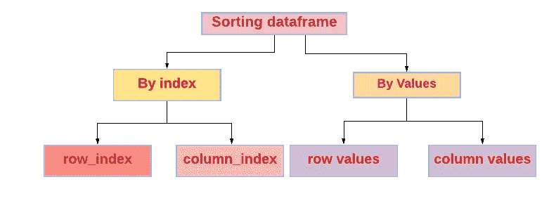

作者图片

我们可以通过行值/列值对 pandas 数据帧进行排序。同样，我们也可以按行索引/列索引排序。

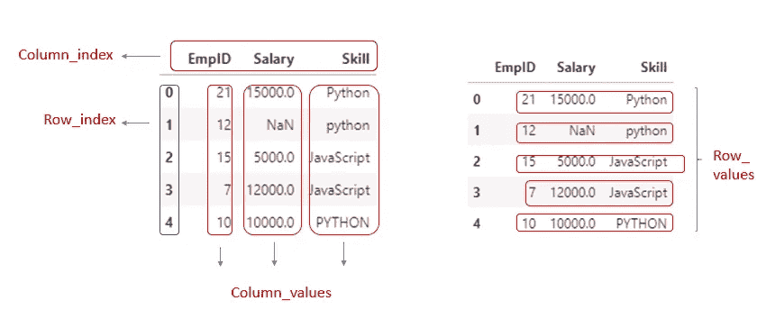

作者图片

# **按数值排序的熊猫数据帧**

```
DataFrame.**sort_values**(*by*, *axis=0*, *ascending=True*, *inplace=False*, *kind='quicksort'*, *na_position='last'*, *ignore_index=False*, *key=None*)
```

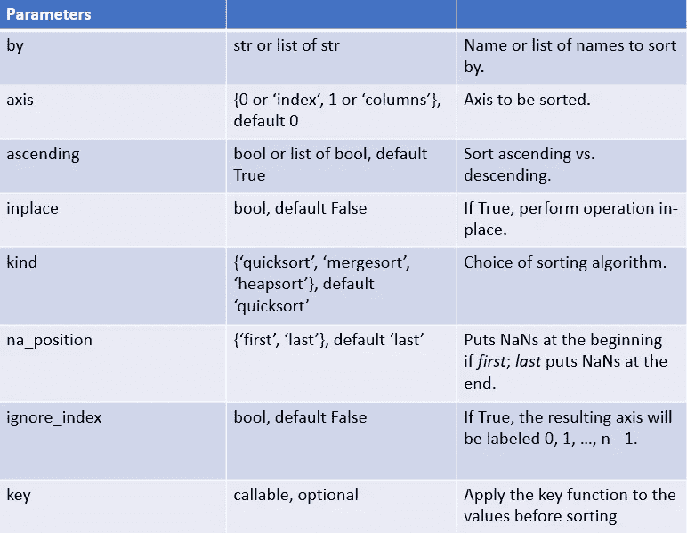

图片来源:作者

返回类型为DataFrame 或 None。

如果排序后的`inplace`返回类型为`None`，否则返回 DataFrame。

## **1。按一列排序数据帧**

通过读取 CSV 文件创建数据帧。

```
**import** pandas **as** pd
df=pd.read_csv(**"C:\pandas_experiment\pandas_sorting\data1.csv"**)
df
```

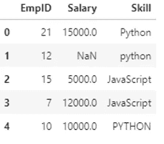

数据帧

现在，按照一列中的值对数据帧进行排序(`EmpId`)。

```
df.sort_values(**'EmpID'**)
```

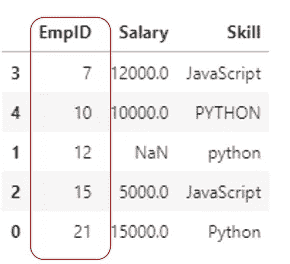

按“EmpID”中的值对数据帧进行排序

默认情况下，它将按升序排序。该指数也将得到维护。
返回类型是数据帧。它不会修改原始数据帧。

## **2。按一列降序排列数据帧**

按列 EmpID 对数据帧进行降序排序。不得不提`ascending=False`。

返回类型是数据帧。它不会修改原始数据帧。

`df.sort_values(‘EmpID’,ascending=False)`

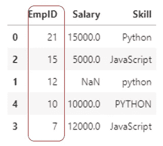

按 desc 顺序按“EmpID”中的值对 df 排序

## **3。按两列排序数据帧**

按列`Skill`和`EmpID`对数据帧进行排序。如果列`Skill` 中的值相同，那么它将根据第二列`EmpID`中的值进行排序

```
df.sort_values(by=[**'Skill'**,**'EmpID'**])
```

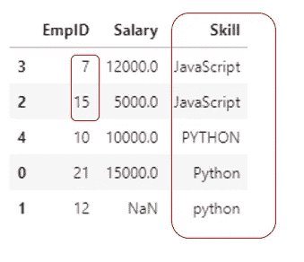

基于“Skill”和“EmpID”中的值对 df 进行排序

首先，它将根据`“Skill”`列中的值进行排序。由于列`Skill`中的值`JavaScript`是相同的，那么它将再次按照`EmpID` 中的值以升序排序。

返回类型是数据帧。它不会修改原始数据帧。

## 4.按两列不同的顺序对数据帧进行排序

按列`Skill`和`EmpID`对数据帧进行排序。一列按升序排列，另一列按降序排列。

```
df.sort_values(by=[**'Skill'**,**'EmpID'**],ascending=[**True**,**False**])
```

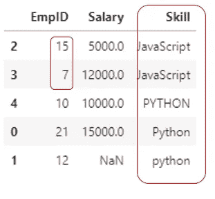

按两个不同顺序的两列中的值对 df 进行排序

首先，dataframe 将根据`“Skill”` 列中的值按升序排序。由于列`Skill`中的值`JavaScript`是相同的，那么它将按照`EmpID` 中的值降序排序。

返回类型是数据帧。它不会修改原始数据帧。

## 5.通过将 NaN 放在前面来排序数据帧

通过将缺失值`NaN`放在首位来对数据帧进行排序。不得不提参数`na_position=”first”`

```
df.sort_values(**"Salary"**,na_position=**'first'**)
```

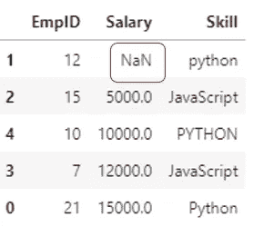

通过首先放置缺失值(NaN)对 df 进行排序

返回类型是数据帧。它不会修改原始数据帧。

## 6.就地排序数据帧

如果参数 inplace 设置为真(`inplace=True`)，它将执行 inplace 操作。修改原始数据帧本身。返回类型为 None。

```
df.sort_values(**"Salary"**,inplace=**True**)
df
```

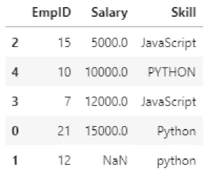

原地排序

## 7.通过忽略索引对数据帧进行排序。

对数据帧进行排序将保持相同的索引。如果我们想忽略索引，然后不得不提及`ignore_index=True`
，那么产生的轴将被标记为 0，1，…，n-1。

```
df.sort_values(**"Salary"**,ignore_index=**True**)
```

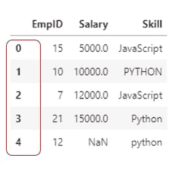

通过忽略索引对数据帧进行排序。

## 8.使用 key 函数对数据帧进行排序

排序前对值应用 key 函数。这类似于内置`sorted()`函数中的关键参数，显著的区别是这个关键函数应该是矢量化的。它应该期待一个`Series`并返回一个与输入形状相同的序列。它将独立应用于`by`中的每一列。- [Python 文档](https://pandas.pydata.org/pandas-docs/stable/reference/api/pandas.DataFrame.sort_values.html)

```
df.sort_values(by=[**"Skill"**],key=**lambda** x:x.str.lower())
```

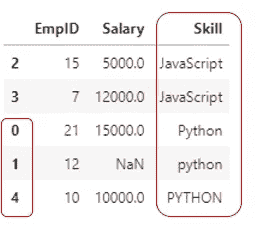

使用关键功能排序

按键功能(`str.lower()`)应用于`“Skill”` 列中的所有值，然后进行排序。如果包含相同的值，则根据行索引进行排序。

如果在`“Skill”`列上没有调用按键功能，大写字母将首先排序。

```
df.sort_values(by=[**"Skill"**])
```

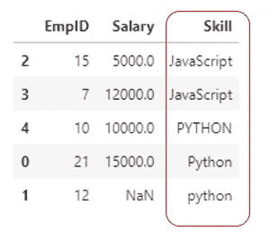

在没有关键功能的情况下，按“技能”列中的值对 df 进行排序

## 9.按字符串长度排序数据帧

按字符串长度排序数据帧。给定的键函数为
`key=lambdax:x.str.len()`，它将计算给定列中值的长度(`“SKill”`)。根据`“Skill”`列中值的长度，它将对数据帧进行排序。

```
df.sort_values(by=[**"Skill"**],key=**lambda** x:x.str.len())
```

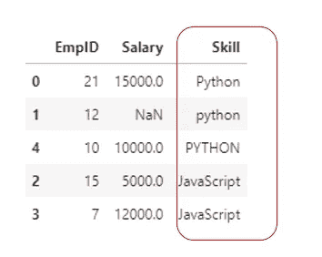

根据“技能”列中的字符串长度对数据帧进行排序

## 10.按行值对数据帧排序

我们也可以通过特定的行值对数据帧进行排序。

创建包含数字的数据帧。

```
df = pd.DataFrame(data={**'x'**:[10,30,20], **'y'**:[1,2,3],**'z'**:[5,15,10]})
df
```

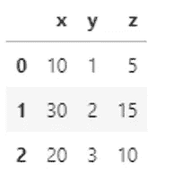

数据帧

我们可以根据特定行中的值对数据帧进行排序。我们来排序`row 0` 默认情况下，它会对行中的值进行升序排序。

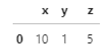

要排序的行

```
df.sort_values(by=0,axis=1)
```

`by=0`表示第 0 行。

`axis=1`表示要排序的列。

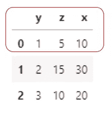

基于 row0 值对数据帧进行排序

如果要排序的行包含不同的数据类型，会引发`TypeError`。

```
df1 = pd.DataFrame(data={**'x'**:[10,10,**"d"**], **'y'**:[**'a'**,5,**'c'**],**'z'**:[5,15,**'a'**]})
df1
```

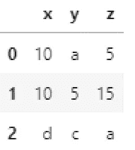

数据帧 df1

如果我们按 row0 对 dataframe 进行排序，就会产生`TypeError`。`row 0`包含 string 和 int。

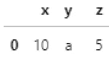

按第 0 行排序

```
df1.sort_values(by=0,axis=1)
```

`Output:
**TypeError**: ‘<’ not supported between instances of ‘str’ and ‘int’`

但是我们可以根据行 1 和行 2 对数据帧 df1 进行排序。第 1 行仅包含`int`，第 2 行仅包含`str`。

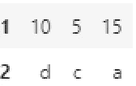

第 1 行和第 2 行

```
df1.sort_values(by=2,axis=1)
```

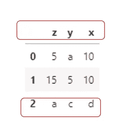

按行 2 对数据帧排序

# 熊猫。DataFrame.sort_index

```
DataFrame.**sort_index**(*axis=0*, *level=None*, *ascending=True*, *inplace=False*, *kind='quicksort'*, *na_position='last'*, *sort_remaining=True*, *ignore_index=False*, *key=None*)
```

按标签对对象排序(沿轴)。

如果`inplace`参数为`False`，则返回按标签排序的新数据帧，否则更新原始数据帧并返回`None`。

## 1.按行索引对数据帧排序

创建数据帧。

```
df=pd.read_csv("C:\pandas_experiment\pandas_sorting\data2.csv") 
df
```

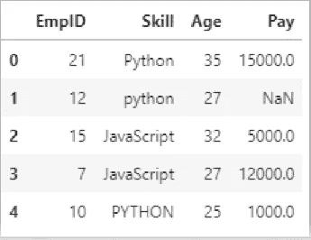

将`EmpID`列设置为行索引。

```
df.set_index(**'EmpID'**,inplace=**True**)
```

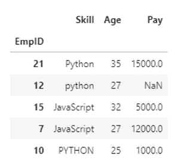

EmpId →行索引

我们可以按行索引和列索引对数据进行排序。

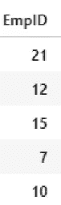

行指数

```
df.sort_index()ordf.sort_index(axis=0)
```

两者是一样的。`axis=0`表示按行索引排序。

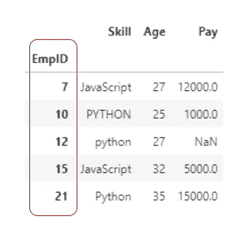

按 row_index 排序

默认情况下，它将按升序排序。

## 2.按列索引对数据帧排序

通过引用`axis=1`按列索引对数据帧进行排序。


列指数

```
df.sort_index(axis=1)
```

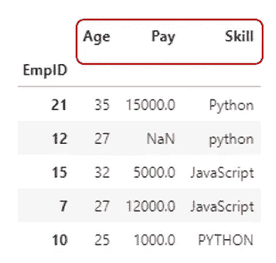

按 column_index 排序

默认情况下，它将按升序排序。

## 3.具有多索引的排序数据帧

创建数据帧并将两列设置为 row_index。

```
df=pd.read_csv(**"C:\pandas_experiment\pandas_sorting\data2.csv"**) 
df.set_index([**"EmpID"**,**"Age"**],inplace=**True**)
```


具有多索引的数据帧

现在，我们可以按 row_index EmpID 和 Age 对数据帧进行排序。
如果给定`level=0`，将根据 row_index `“EmpID”`排序

```
df.sort_index(level=0)
```

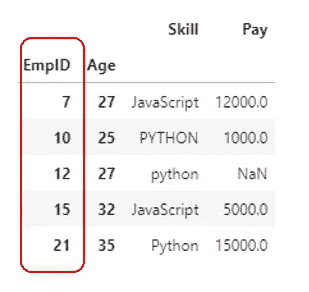

仅根据 row _ index“EmpID”排序

如果`level=1`表示将根据 row_index `“Age”`对数据帧进行排序

默认情况下，`sort_remaining=True`，即如果按级次和指标排序是多级的，则在按指定级次排序后，也按其他级次排序。

在本例中，它将按级别 1 ( `“Age”`)排序，如果值相同，则它将按另一个索引(`“EmpID”`)排序

```
df.sort_index(level=1)
```

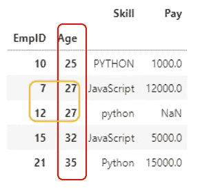

按级别排序，多索引

## 4.将具有多索引的数据帧仅排序一级

通过提到一个级别和`sort_remaining=False`，我们可以只按一个级别对多索引的数据帧进行排序。

```
df.sort_index(level=**"Age"**,sort_remaining=**False**)
```

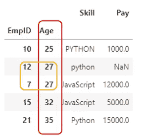

仅按一个级别排序，多索引 df

在本例中，`EmpID`索引没有排序。数据帧仅根据`“Age”` 索引排序。

## 5.按索引降序排列数据帧

如果我们提到`ascending=False`，它将根据提到的索引对数据帧进行降序排序。

```
df.sort_index(axis=0,ascending=False)
```

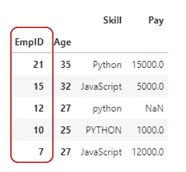

按 desc 顺序按行索引对数据帧排序

# 结论:

*   如果`inplace=False`，排序熊猫数据帧将返回一个带有排序值的数据帧。否则如果`inplace=True`，它将返回`None`，并且它将修改原始数据帧本身。
*   默认情况下，所有排序只按升序进行。如果我们提到，`ascending=False`它会按降序排序。

## GitHub 链接:

我的 jupyter 笔记本和代码中用到的 CSV 文件可以从我的 [GitHub 链接](https://github.com/IndhumathyChelliah/pandas_experiment/tree/master/pandas_sorting)下载。

## 我关于熊猫的其他博客:

[索引和切片 Python 熊猫数据帧](https://medium.com/towards-artificial-intelligence/indexing-and-slicing-python-pandas-dataframe-ed79f9a08176)

## 资源(Python 文档):

`[pandas.DataFrame.sort_values](https://pandas.pydata.org/pandas-docs/stable/reference/api/pandas.DataFrame.sort_values.html)`

`[pandas.DataFrame.sort_index](https://pandas.pydata.org/pandas-docs/stable/reference/api/pandas.DataFrame.sort_index.html#pandas.DataFrame.sort_index)`

`[multi_column sorting](https://pandas.pydata.org/docs/user_guide/categorical.html?highlight=sorting#multi-column-sorting)`

## 进一步阅读

[](https://medium.com/dev-genius/indexing-vs-slicing-in-python-de01cd99c499) [## Python 中的索引与切片

### 了解索引和切片

medium.com](https://medium.com/dev-genius/indexing-vs-slicing-in-python-de01cd99c499) [](https://pub.towardsai.net/indexing-and-slicing-python-pandas-dataframe-ed79f9a08176) [## Python 熊猫数据帧的索引和切片

### 熊猫数据帧的不同索引方法。

pub.towardsai.net](https://pub.towardsai.net/indexing-and-slicing-python-pandas-dataframe-ed79f9a08176) 

*如果你喜欢阅读我更多关于 Python 和数据科学的教程，
关注我的* [***中型***](https://medium.com/@IndhumathyChelliah) *。*

*感谢阅读！*