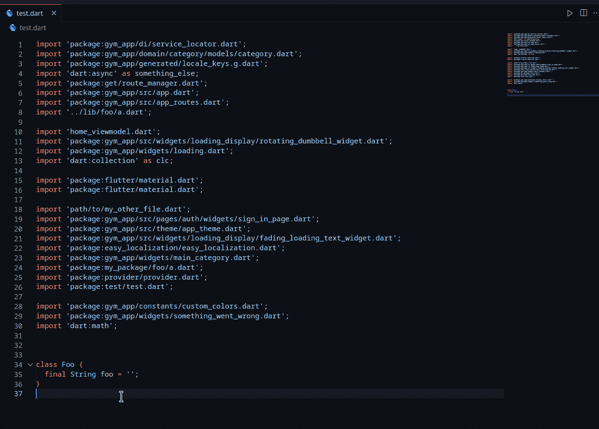

# 我写了一个 VS 代码扩展来排序你的 Flutter 项目的导入

> 原文：<https://betterprogramming.pub/sorting-your-flutter-projects-imports-ffb88b4502f>

## 轻松排序您的 dart 导入


由[布雷特·乔丹](https://unsplash.com/@brett_jordan?utm_source=medium&utm_medium=referral)在 [Unsplash](https://unsplash.com?utm_source=medium&utm_medium=referral) 上拍摄的照片

# TL；速度三角形定位法(dead reckoning)

> Dart 导入分类器扩展做了一件主要的事情:它将你的导入从一团乱麻转换成整洁一致的东西。

# 介绍

在很大程度上，IDEs 负责为您组织导入。我不是一个狂热的 IntelliJ 用户，但我经常欣赏它让进口产品看不见、想不起来的方式。

我想在 VS 代码中实现同样的功能，但是我在市场上找不到任何扩展来实现我想要的行为。所以，像任何过于雄心勃勃的程序员一样，我决定自己写！

# 描述

Dart 导入分类器扩展做了一件主要的事情:它将你的导入从一团乱麻转换成整洁一致的东西。



对混乱的导入进行排序和分组

# 设置您自己的配置

您可以使用默认配置，也可以根据自己的需要进行定制。扩展可以使用正则表达式来配置，所以没有限制。

下面是一个配置示例:

扩展配置示例(settings.json)

根据上面的例子，扩展将查找匹配 Flutter 规则的导入，然后是 Dart，然后是所有其他的。这些标签实际上并不用于分类过程。它们只是在这里帮助您跟踪每个规则的作用。

这是这些规则的演示。以下是一堆乱七八糟的进口货:

未分类进口的例子

上面的代码经过排序后变成如下所示:

分组和排序导入的示例

您会注意到每个组之间有新的行，并且组内的导入按字母顺序排序。

您可以通过设置以下规则来关闭组之间的换行符:

```
"dartimportsorter.leaveEmptyLinesBetweenGroups": false
```

# 如何使用

您可以使用快捷键`Ctrl + Alt + O`运行扩展，或者您可以使用命令面板`Ctrl + Shift + P -> Dart: Sort Imports`。

最后，您可以设置扩展名，以便在保存文件时对导入内容进行排序。为此，请设置以下规则:

```
"dartimportsorter.sortOnSave": true
```

# 为什么要对进口商品进行分类？

当我第一次开始编写这个扩展时，真的是因为我喜欢看到我的导入被分组和组织起来。但是后来，我发现了几个(有点)令人信服的原因:

1.  您的导入在文件的开头更紧凑。您知道应该立即跳过哪个部分来获得实际的代码。您也可以折叠整个块以使其更容易。
2.  如果需要，您可以更快地找出并修复不正确的导入。

# 关于扩展

注意:这一部分并不真正讨论扩展的功能，而是讨论开发过程。

我把开发这个扩展的过程当作一个游戏场，尝试了一些我读到的编程/架构技术。主要是清洁建筑(鲍勃大叔)。我在这里还没有真正应用它，但是它激励我应用坚实的原则(或者至少尝试一下)。

我设法通过使用[t 插入](https://www.npmjs.com/package/tsyringe)注入依赖关系来实现控制反转。这允许我将事情彼此分离，并正确地进行单元测试，而不涉及 vs 代码扩展 API。

在编写测试方面，我不是最有经验的人，但是我必须承认，测试极大地增加了我对我在代码中实现的变化的信心，无论是添加功能还是重构。为了确保一切正常，我需要做的只是在 bash 中编写一个小命令，如果它亮起绿灯，那么我就可以开始了。

如果你对贡献感兴趣或者你想要求一个功能，这里有回购的[链接](https://github.com/aziznal/dart-import-sorter)

另外，这里有一个[到 VS 代码市场](https://marketplace.visualstudio.com/items?itemName=aziznal.dart-import-sorter)的链接

编码快乐！