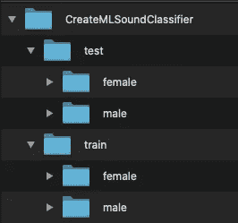
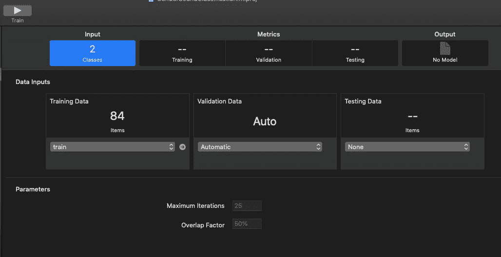
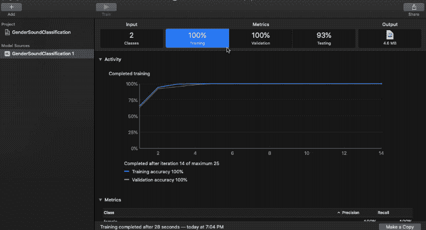
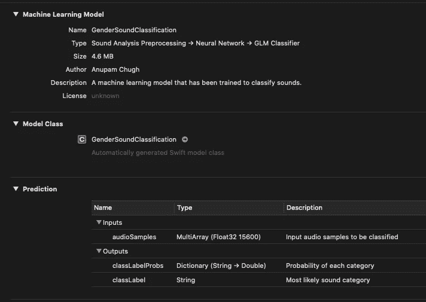
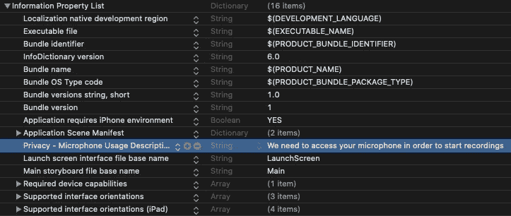

# 使用 Core ML 3 和 Create ML 在 iOS 上进行声音分类

> 原文：<https://betterprogramming.pub/sound-classification-using-core-ml-3-and-create-ml-fc73ca20aff5>

## 使用 SoundAnalysis 框架和使用 Create ML 构建的核心 ML 模型，通过现场音频流中的声音进行识别


照片由[凯恩·莱因霍尔德森](https://unsplash.com/@kanereinholdtsen?utm_source=medium&utm_medium=referral)在 [Unsplash](https://unsplash.com?utm_source=medium&utm_medium=referral) 拍摄

在 WWDC 2019 期间，Create ML [获得了自己的独立身份](https://developer.apple.com/videos/play/wwdc2019/430/)。这就像某种起源故事，让位于一系列全新的功能。Create ML 现在是 Xcode 11 附带的一个单独的应用程序。

苹果再一次通过 Create ML 展示了他们对手机上的机器学习有多认真。他们最近在 Create ML 框架方面的进步对移动机器学习开发人员来说是一大福音，因为这些改进允许他们在没有太多机器学习专业知识的情况下轻松创建自己的模型。

目前，Create ML 支持以下类型的模型:

*   图像分类器
*   目标检测
*   **声音分类**
*   文本分类和单词标签
*   活动分类器——用于预测行走、跳跃、摇摆等身体动作。来自运动传感器输入。
*   推荐系统


快速浏览新的创建 ML 模板选择器向导

Create ML 具有易于使用的可视化界面，使得非数据科学家也可以快速构建自己的机器学习模型。

## 行动（或活动、袭击）计划

*   收集音频文件的标记数据集
*   训练创建 ML 模型
*   通过使用`SoundAnalysis`和`AVKit`框架使用核心 ML 3 模型的声音分类

> 要使用 Create ML 构建声音分类模型，需要 Mac Catalina 和 Xcode 11。要部署生成的 Core ML 3 模型，需要 iOS 13 或以上的操作系统。

# 收集我们的数据集

对于男女声音分类，我们从[vox celes](http://www.robots.ox.ac.uk/~vgg/data/voxceleb/)数据集中提取了一些音频(`.wav`)文件，并将其与来自 [Wav 源](http://wavsource.com/)的一些录音混合在一起。

声音分类器模型在 16 kHz 音频下运行。因此，鼓励使用相同范围内的数据集，以确保模型的最佳性能。

由于 Create ML 的`MLSoundClassifier`模型结构只使用第一个通道，而丢弃了其他通道，因此传递单通道音频文件用于训练是一个好主意。

出于演示的目的，在本文中我们将使用一个小型数据集，而不太强调准确性。



# 用 Create ML 构建我们的模型

接下来，我们将创建一个新的 Create ML sound classifier 项目，并在输入中添加 training 文件夹。您可以选择添加验证数据或将其设置为自动。



Create ML 自动识别培训文件夹中的课程和音频文件。对于分类器，至少需要两个类。

现在只需按下 ***Train*** 按钮，让 Create ML 进行特征提取、预处理、训练和验证。完成后，您可以拖放或者选择 testing data 文件夹来评估模型。测试数据集应该是模型以前没有见过的东西。



从收集数据集到构建核心 ML 3 模型，我花了大约 30 分钟，所以在这段时间内，上面的精度是不错的。

我们的模型现在可以部署了。Create ML 允许您使用 Mac 的内建麦克风来运行预测。

在下一节中，我们将在一个 iOS 应用程序中部署上面的核心 ML 3 模型，该应用程序可以从现场音频流中识别男性和女性的声音。

# 在 iOS 应用程序中部署我们的核心 ML 3 模型

现在是时候在 Xcode 11 的 iOS/macOS 应用程序中使用之前构建的 Core ML 3 模型来执行基于语音的音频分类了。

## 方法

*   使用 AudioEngine 捕获实时音频流
*   使用 SoundAnalysis 框架观察音频缓冲结果
*   运行`[SNClassifySoundRequest](https://developer.apple.com/documentation/soundanalysis/snclassifysoundrequest)`对观察到的音频流进行分类

## 入门指南

首先，让我们将核心的 ML 3 模型拖放到一个新的 Xcode 11 项目中:



## 隐私使用说明

我们需要在`info.plist`文件中添加麦克风的隐私使用描述，以便收听音频流。下图展示了如何做到这一点:



## 初始化

我们需要导入 SoundAnalysis 和 AVKit 框架，并初始化模型和某些属性，如下所示:

```
import AVKit
import SoundAnalysisprivate let audioEngine = AVAudioEngine()
private var soundClassifier = GenderSoundClassification()
var inputFormat: AVAudioFormat!
var analyzer: SNAudioStreamAnalyzer!
var resultsObserver = ResultsObserver()
let analysisQueue = DispatchQueue(label: "com.apple.AnalysisQueue")
```

如果上面代码中的一些初始化没有意义，不要担心——我们将在下面的小节中讨论它们。

## 开始音频采集

我们需要使用`AudioEngine`框架，它是`AVFoundation`的一部分，开始从麦克风捕获音频流。

通过从`audioEngine`访问`inputNode`，我们可以在总线上安装一个音频抽头来观察节点的音频流输出。

```
private func startAudioEngine() {//create stream analyzer request with the Sound Classifierdo{
try audioEngine.start()
}
catch( _){
print("error in starting the Audio Engine")
}}
```

在上面的代码中，我们将在输入节点总线上添加声音分类请求和声音分析器。

## 创建声音流分析器

接下来，我们需要使用 SoundAnalysis 框架创建一个音频流分析器。它以本机格式捕获音频引擎的流，如下所示:

```
inputFormat = audioEngine.inputNode.inputFormat(forBus: 0)
analyzer = SNAudioStreamAnalyzer(format: inputFormat)
```

## 创建声音分类器请求

现在，我们需要通过在`SNClassifySoundRequest`中传递核心 ML `model`实例来创建一个声音分类器请求。

在您的`startAudioEngine`函数的开头添加以下代码:

```
do {
let request = try SNClassifySoundRequest(mlModel: soundClassifier.model)
try analyzer.add(request, withObserver: resultsObserver)
} catch {
print("Unable to prepare request: \(error.localizedDescription)")
return
}
}
```

在上面的代码中，我们已经向`SNAudioStreamAnalyzer`添加了声音分类请求实例。分类器最终将结果返回给观察者对象`resultsObserver`。

该类的实例实现了`SNResultsObserving`协议方法，该方法为每个声音分类结果触发，如下所示:

`GenderClassifierDelegate`是一个自定义协议，用于在 UILabel 中显示最终预测:

```
protocol GenderClassifierDelegate {
    func displayPredictionResult(identifier: String, confidence: Double)
}extension ViewController: GenderClassifierDelegate {
    func displayPredictionResult(identifier: String, confidence: Double) {
        DispatchQueue.main.async {
            self.transcribedText.text = ("Recognition: \(identifier)\nConfidence \(confidence)")
        }
    }
}
```

## 分析音频流

最后，我们可以通过设置一个单独的串行调度队列来分析音频流，该队列分析来自`inputNode`的音频缓冲区，如下面的代码所示:

## 运行音频引擎并进行预测

最后，我们可以运行我们的音频捕获方法，并对音频缓冲流进行分析和分类，以确定性别类别标签。

只需在您的`viewDidLoad`和`viewDidAppear`方法中添加以下代码片段:

```
override func viewDidLoad() {
        super.viewDidLoad()

        resultsObserver.delegate = self
        inputFormat = audioEngine.inputNode.inputFormat(forBus: 0)
        analyzer = SNAudioStreamAnalyzer(format: inputFormat)
        buildUI()
}
override func viewDidAppear(_ animated: Bool) {
        startAudioEngine()
}
```

为了测试这个应用程序，我使用了两个视频，一个是 WWDC 的(男性声音)，另一个是 youtube 的(识别女性声音)。这是我们得到的结果:

我们从用于声音分类的小数据集得到的结果

基于我们模型中 100 多个文件的小数据集，上述结果是相当准确的。默认情况下，我们的声音分类模型为各种声音返回“男性”。您可以尝试为不同类别(环境、机器人、鸟类)添加更多声音类别标签，并构建自己的数据集。

Xcode 项目的完整源代码以及包含几个`wav`文件的数据集可以在这个 [GitHub 资源库](https://github.com/anupamchugh/iowncode/tree/master/CoreML3SoundClassifier)中找到。

# 结论

通过使用新的`MLSoundClassifier`模型和`SoundAnalysis`框架，我们很快就能够从现场音频流中对语音进行分类，即使只有很小的数据集。

Create ML 允许移动机器学习开发者快速训练和测试他们自己的模型，而无需过于深入地挖掘机器学习。

这就结束了。我希望你喜欢阅读。