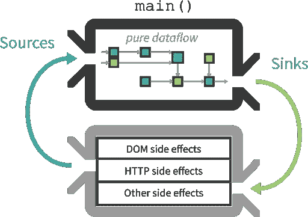
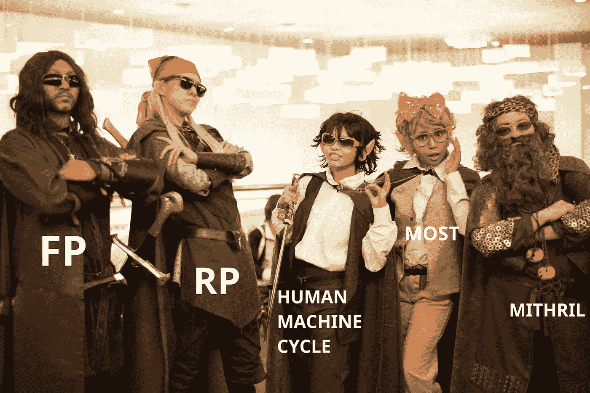
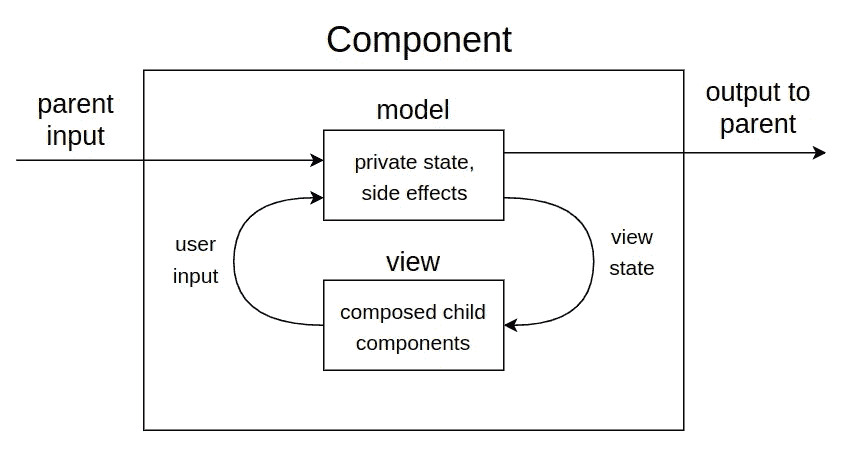
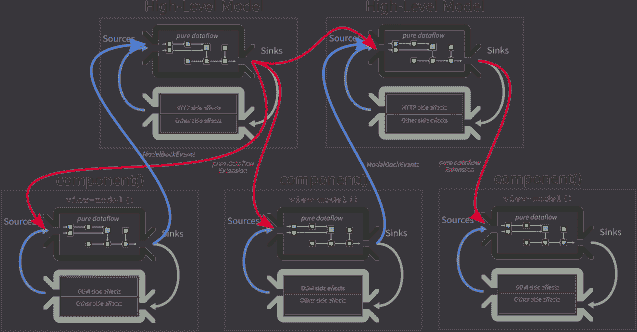
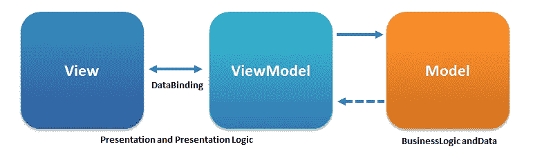
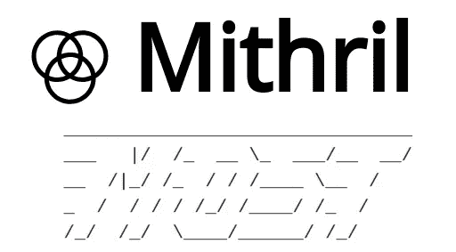

# 使用 Mithril 和 Most 核心的 SPA 功能反应式编程

> 原文：<https://betterprogramming.pub/spa-functional-reactive-programming-60fe13639f33>

单页应用程序(SPA)的近期历史见证了反应式编程(RA)作为主导开发范例的兴起(T2)。基于事件流的概念，反应范式是一种声明性的方式来管理应用程序状态的变化(相对于传统的[命令式编程](https://en.wikipedia.org/wiki/Imperative_programming))。流(也称为可观察的)是一种反应式数据结构，类似于电子表格应用程序中的单元格。当您更改一个值时(生成一个表示值更改的事件)，该事件会在所有相关“单元”上传播，并在必要时更新相关值。我们可以有多种口味的流:[连续/离散](http://vindum.io/blog/behaviors-and-streams-why-both/)、[热/冷](https://staltz.com/why-we-actually-built-xstream.html)、[同步/异步](https://mostcore.readthedocs.io/en/latest/concepts.html#event-propagation)等。

> 反应式编程就像一个电子表格:当某个东西发生变化时，所有依赖于它的东西都会自动变化，以此类推。

[(差不多)*一切都可以是流*](https://gist.github.com/staltz/868e7e9bc2a7b8c1f754) ！照片由[马太·亨利](https://unsplash.com/@matthewhenry?utm_source=medium&utm_medium=referral)在 [Unsplash](https://unsplash.com?utm_source=medium&utm_medium=referral) 上拍摄

## 函数式编程的优势

软件开发中另一个正在进行的革命是对[函数式编程](https://en.wikipedia.org/wiki/Functional_programming) (FP)相对于[面向对象编程](https://en.wikipedia.org/wiki/Object-oriented_programming) (OOP)的优势的认识。几十年来，OOP 被视为编程和开发软件的最佳方式，而 FP 则被降级为学术的、不切实际的选择。

现在，不可变状态、[幂等性、纯度](https://en.wikipedia.org/wiki/Pure_function)、副作用隔离和函数可组合性的明显优势，以及成功的 FP 语言(Haskell、OCaml、JavaScript FP 扩展等)的兴起，将渗透到工业软件开发中。

纯洁很难，但你不会后悔。由[艾萨克·史密斯](https://unsplash.com/@isaacmsmith?utm_source=medium&utm_medium=referral)在 [Unsplash](https://unsplash.com?utm_source=medium&utm_medium=referral) 上拍摄的照片

## FP + RP = FRP 幸福

将 RP 和 FP 混合在一起，我们得到了 f[functional reactive programming](https://en.wikipedia.org/wiki/Functional_reactive_programming)(FRP)，这是开始我们未来的、革命性的 web 项目(或者至少是它的一部分)的一个很好的组合。

FRP 结合了类似电子表格的状态管理的有效性和 FP 的所有优点:不变性、纯度、可组合性等。

## Cycle.js

在寻找 FRP JavaScript 框架的圣杯的过程中，今天，我们的目的地显然是 [Cycle.js](https://cycle.js.org) 。我不会太深入这个框架，但是 Cycle 无疑是关于 FRP 的最佳选择之一，也是最面向 FP 的选择之一。顾名思义，该框架是关于从用户生成的 DOM 事件(或其他机器生成的事件)到业务逻辑(反应性数据结构)再到新的 DOM 表示(和其他副作用)的单向数据流，然后从下一个事件重新开始。

Cycle.js 数据流(来源:[https://cycle.js.org](https://cycle.js.org))

这是一种透明干净的方式来表现人机交互。
但是对于这种单一的循环，这可能不是管理深度嵌套组件的最简单方法，尤其是当组件与传统代码(jQuery 插件、第三方前端 SDK 等)交互时。嗯，这不是不可能的——你可以编写“[驱动](https://cycle.js.org/drivers.html#drivers)”来包装第三方代码，并将源/接收器从父组件向下传递到子组件，但这并不那么容易。

## 一个周期来统治他们！还是没有？

如果每个组件都有自己的周期呢？这肯定是一个更复杂的架构。但它可能有助于扩展您的 SPA，减少组件耦合，并简化第三方库集成，而不会失去我们代码的功能优势。你可以把每个组件看作一个独立的人机交互循环。每个组件实例都有一个状态，状态通过 FP 定义生成一个 DOM 表示，人们与 DOM 交互，生成的事件改变状态，循环重新开始。

FPR 研究员。原创照片由 [Aoshi_88](https://www.flickr.com/photos/27299321@N05)

## 涡轮

深潜 Gitlab/Github，我发现了[涡轮](https://github.com/funkia/turbine)，一个基于固体 FP 理论的框架，探索每个组件架构的循环。

涡轮部件数据周期(来源 https://github.com/funkia/turbine)

但是 Turbine 维护父组件的循环规则，将状态流传递给子组件。明确的说，这是一个很好的做法；这样，从高级组件到嵌套组件，数据方向是线性的。但是这强加了组件/子组件绑定。

## 去耦子组件

我们试着更务实一点。DOM 是一个肮脏、不纯和奢华的地方，许多技术和方法汇聚于此(jQuery 插件、Google Maps SDK、脸书 SDK、CSS 和所有其他构建 web 体验的东西)。我们的提议是提供一种方式来表达组件级别的副作用(保持它们被很好地发出信号),并使视图生成功能成为一个[主动元素](https://cycle.js.org/model-view-intent.html#model-view-intent-what-mvc-is-really-about-why-css-selectors),而不是像 Cycle 或 Turbine 那样的被动元素。此外，组件可以向高层模型流发送事件信号，打破了单一数据方向的规则。

提议的架构。组件(嵌套与否，不重要)扩展高层模型流网络，从相关 DOM 接收事件。作为副作用，它们可以在高级模型上产生事件。这就像是 MVVM 建筑的玻璃钢演变。

传统 MVVM 建筑(来源:维基百科)

通过这种更改的规范，可以保持对事件作出反应的逻辑，并生成新的纯本地状态，但使每个组件都能够对自己的事件作出反应。更重要的是，这对父组件是完全透明的。父组件不需要知道子组件如何与肮脏的 DOM 世界或高级模型流交互。

嵌套组件的隔离和解耦使得将反应流网络细分为两层变得很自然。它们是与许多组件(外部数据同步、高级业务逻辑等)相关的逻辑的*高级模型层*。)，以及*视图-模型层，*负责对组件视图事件做出反应并更新组件状态。视图模型可以从高层模型层接收事件，并将事件发送回模型。

如果在这个分布式架构中，副作用被隔离在 DOM 和其他驱动程序中，那么副作用可以由 reactive streams 网络在组件级别直接管理。重要的是指出副作用发生的地方，不要把纯的和不纯的混在一起。正如我们将看到的，函数式反应式编程库提供了一种隔离副作用的适当方法。

## TODOMVC:示例应用程序

现在让我们用通常的 TodoMVC 例子来尝试一下这个架构。本文探讨的思想可以用许多现有的 SPA 框架和功能流库来实现。在这种情况下，我选择了 [Mithril](https://mithril.js.org/index.html) ，这是一个最小且快速的 vdom 框架，它以几 kb 的代码提供了一个标准且高效的路由解决方案，我还选择了 [Most Core](https://mostcore.readthedocs.io/en/latest/) ，这是一个高性能的一元反应事件流库，我认为它是“最”实用的一个。

[秘银 2](https://mithril.js.org/index.html) + [最核心](https://mostcore.readthedocs.io/en/latest/):我们喜爱的 libs

> 该项目是一个 ES6 模块 app，可以由 Google Chrome 运行，无需 transpilation(外部依赖除外)。
> [储存在这里](https://github.com/FbN/todomvc-mm)
> [现场演示在这里](https://eloquent-wiles-a36b02.netlify.com/#!/)

文件被细分以显示层:

*   模型(/app/js/model)
*   视图-模型(/app/js/vm)
*   视图(/app/js/view)

## 约定

在提议的解决方案中，我们使用大多数适配器作为脏 DOM 世界和纯 VM 之间的粘合剂。

> 适配器是一对纠缠在一起的事件流和一个函数(我们称之为触发器),用来在流中引发(引起)事件。

为了清楚地表达流/触发器的纠缠，我们使用后缀“$”表示流，使用后缀“_$”表示触发器。所以函数 **_$ <名>** 被触发纠缠到流函数 **$ <名>** 。
基于这个约定，我们创建了一个助手函数来批量生成触发器/流，以及一个从我们的 VM 和视图生成标准 Mithril 组件的函数(参见 js/mm.js)。

## 成分

> 组件是一种封装部分视图的机制，使代码更容易组织和/或重用。

在 Mithril 中，组件可以用三种不同的语法形式来表达:POJO、Class 和 [Function(又名 closure)](https://mithril.js.org/components.html#closure-component-state) 。正如你可能猜到的，我们将使用函数一。在这种形式中，组件是一个函数，在组件实例化时被调用一次，并返回一个至少带有一个**视图**属性的 POJO。

view 属性是每次呈现对象时调用的函数，返回组件 vnode 树(以及 DOM 表示)。

除了视图属性之外，我们可以添加一个附加属性来挂钩 [DOM 对象生命周期](https://mithril.js.org/lifecycle-methods.html):

*   **oninit** :第一次对象初始化时调用一次。
*   **oncreate** :当 DOM 对象被渲染并附加到页面时。此时，我们可以改变真正的 DOM 对象。这是与第三方 SDK 或库合作的好时机。
*   **onupdate** :类似 oncreate，但每次更新对象的 DOM 时调用。
*   **onremove** :在从文档中移除 DOM 元素之前调用。

为了最大限度地粘合在一起，我们创建了一个名为' **mm** '的函数(参见 app/js/mm.mjs)，它被赋予一个 VM 和一个返回标准 Mithril 组件的视图。

结果组件将配置生命周期事件，以启动和管理我们从虚拟机返回的大多数流。

每个组件实例都有一个不可变的状态图。状态在组件声明时被初始化，并作为 VM 流处理的结果被替换。

## 高级模型

模型是标准的 ES6 模块，可以导出大多数流/触发器和其他有用的方法。在我们的示例中，Todo 模型提供流/触发器来管理任务列表(参见 [/app/js/model/todo.mjs](https://github.com/FbN/todomvc-mm/blob/master/app/js/model/todo.mjs) )。为了方便起见，它导出了组件使用的几个纯函数。为了弄清楚模型中的内容和视图中的内容，模型考虑了逻辑的使用。如果它是关于应用程序的核心业务逻辑或影响许多组件，它可能会出现在一个模型中。如果它是一个管理单个组件行为的逻辑，就像它的表现一样，它就进入了 VM。

## 查看模型

虚拟机是我们架构的核心。每个 VM 都是一个纯函数，它接受一个**不可变 vnode** (我们使用了不可变 js，但这不是强制的)输入，并返回一个大多数触发器/流的集合。vnode 可用于检索视图上组件定义中声明的属性。

VM 可以导入模块流，并依赖它们来构建其内部流网络。

VM 可以声明产生副作用的流([见 tap](https://mostcore.readthedocs.io/en/latest/api.html#tap) )。一个常见的副作用是触发模型流上的事件。从 VM 返回的所有流都将在组件 init(由 Mithril oninit)上运行，并且它们将持续到组件被移除(在 Mithril onremove 触发的事件之后，资源将由 Most 清理)。

VM 返回的流有三种不同的管理方式:

*   状态流:重新创建组件状态，导致[重绘](https://mithril.js.org/redraw.html)；
*   效果流:导致重绘；
*   生命周期流。

如果返回的流的名称等于一个状态键名称，那么该流将用于更新该状态属性(我们可以将该流称为"**状态流**")。

每个组件状态的重新创建(当状态流接收到一个事件时发生)都会导致额外的副作用，即请求 vdom 的 [*redraw*](https://mithril.js.org/redraw.html) (调用 Mithril redraw 方法)。

除了状态流，我们还可以返回其他任意的流(我们称之为“**效果流**”)。效果流(其名称与状态属性的名称不一致的流)对于管理必须以组件 DOM 开始和结束但不改变组件内部状态的副作用非常有用(例如，高级模型上事件的触发)。效果流将重绘副作用生成为状态流。

VM 可以返回的第三种类型的流是生命周期流。**生命周期流**是将与 Mithril 生命周期事件挂钩的流。因此，如果您希望在初始化/更新/删除时发生一些事情，您可以依赖这些流。生命周期流有名字——**$ oncreate，$oninit，$onupdate，$ on delete**——默认情况下不会触发 Mithril 重绘。

## 视角

视图是最简单的部分。这是一个生成[主动](https://medium.com/hacking-and-gonzo/reactive-vs-proactive-development-180017c47fda) vdom 树的纯函数。作为输入，它接收两个映射:不可变的状态映射和可用于捕捉 DOM 事件的触发器集合。

## 把它们放在一起

我们的代码被有意地细分成模块，以展示如何扩展 SPA。虚拟机可以用于构建不同的组件，也可以组合在一个视图中使用，该视图对不同的功能进行分组。这些视图可以很容易地被 JSX 替换(这里没有这样做，以绕过编译)。

我们可以创建一个或多个组件模块，将初始状态、VM 和视图放在一起，创建和导出组件，以便在视图中使用。

app 导入路由中用作页面的高层组件(见/app/js/ [app.mjs](https://github.com/FbN/todomvc-mm/blob/master/app/js/app.mjs) )。

## 结论

我们与 Mithril 和 Most Core 合作，以分布式循环、每个组件、双向流的方式开发 SPA。这种建筑与古老的 MVVM 原则并不遥远。它肯定没有 Cycle、JS 或 Turbine 那么优雅和纯粹，但它可能是最容易扩展和与第三方库集成的(有待演示)。

**资源链接**

*   [Cycle.js](http://v)
*   [涡轮](https://github.com/funkia/turbine)
*   [Github Repo—todom VC Mithril+most core](https://github.com/FbN/todomvc-mm)
*   [代码现场演示](https://eloquent-wiles-a36b02.netlify.com/#!/)