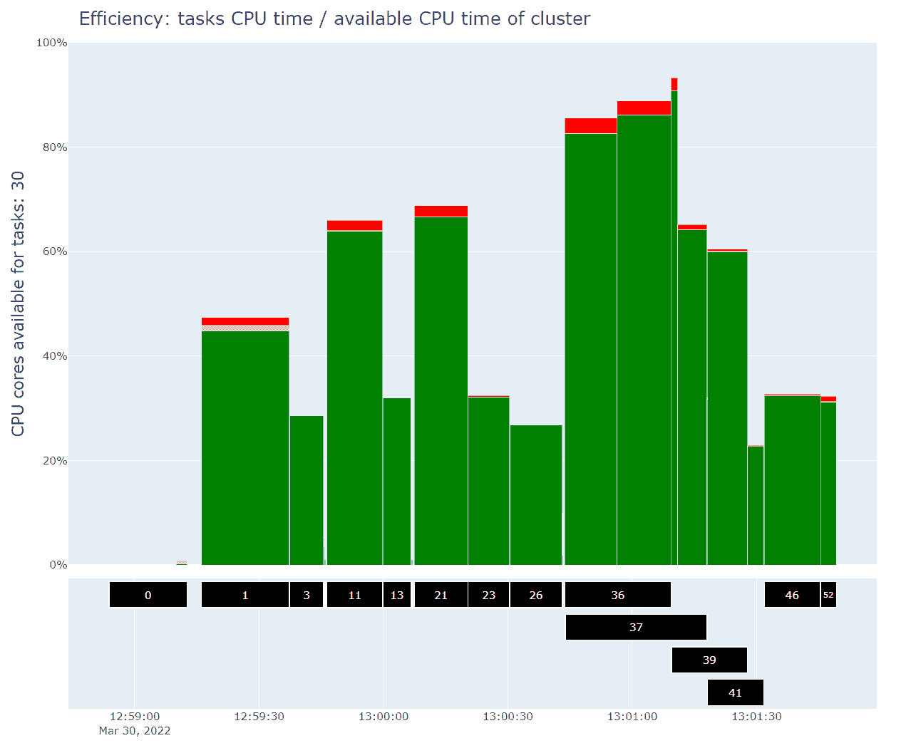
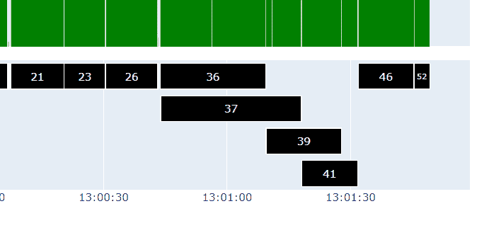
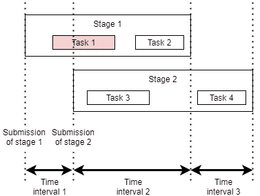
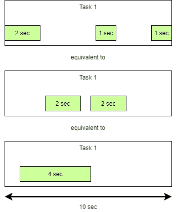
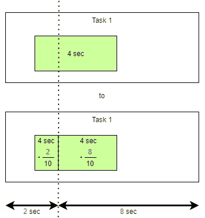

# 遇见“火花”:火花性能一览

> 原文：<https://betterprogramming.pub/spark-sight-spark-performance-at-a-glance-c2316d2a251b>

## 我创建的一个开源项目


Jez Timms 在 [Unsplash](https://unsplash.com?utm_source=medium&utm_medium=referral) 上拍摄的照片

[**spark-sight**](https://github.com/alfredo-f/spark-sight) 是一个不太详细的、更直观的表示，从性能的角度来看，它描述了 spark 应用程序内部正在发生的事情。

这个故事是一个系列的一部分:

1.  第一部分:这个故事
2.  第二部分: [**“火花-景象”显示溢出:数据失真和执行器内存**](https://medium.com/@alfredo.fomitchenko/spark-sight-shows-spill-skewed-data-and-executor-memory-9169b79ca66e)

我爱 Spark，但不爱 Spark UI。

这就是为什么，起初，我很兴奋地发现[数据机制](https://www.datamechanics.co/)正在开发[快乐](https://github.com/datamechanics/delight)，与世界分享

*   从 Spark 应用程序中收集信息的开源代理；
*   一个**闭源**仪表板，显示 Spark 应用程序在 CPU 效率和内存使用方面的性能。

尽管这项服务是免费的，

1.  您需要将他们的定制监听器集成到 Spark 应用程序中，该监听器收集数据并将其发送到他们的服务器；
2.  你的老板可能很难批准这种做法(隐私问题)，或者完全不能批准(例如，你的应用程序在没有互联网接入的 VPC 中运行)。

我愿意收集我所知道的关于 Spark 的一切，我接受了重新创造同样令人惊奇的快乐体验的挑战，以供每个人享受和贡献。

这就是为什么我与你分享 [**火花-景象**](https://github.com/alfredo-f/spark-sight) 。


*   花费在“实际工作”上的 CPU 时间
*   随机读取和写入花费的 CPU 时间
*   花费在序列化和反序列化上的 CPU 时间
*   每个执行者的溢出强度(立即发布！阅读该系列的第 2 部分: [**【火花-景象】显示溢出:扭曲的数据和执行者记忆**](https://medium.com/@alfredo.fomitchenko/spark-sight-shows-spill-skewed-data-and-executor-memory-9169b79ca66e) )
*   (即将到来的)每个执行器的内存使用情况



[**spark-sight**](https://github.com/alfredo-f/spark-sight) 并不意味着完全取代 Spark UI，相反，它提供了一个阶段的鸟瞰图，让您一眼就能识别出执行的哪些部分可能需要改进。

# 奇妙的图形

Plotly 图由两个 x 轴同步的图表组成。

## Top:任务可用 CPU 内核的效率


## 底部:阶段时间线



# 不要再说了，让我立即使用它

要安装它，

```
$ pip install spark-sight
```

为了迎接它，

```
$ spark-sight --help
```

为了启动它，

*   Unix 操作系统

```
$ spark-sight \
    --path "/path/to/spark-application-12345" \
    --cpus 32 \
    --deploy_mode "cluster_mode"
```

*   Windows PowerShell

```
$ spark-sight `
    --path "C:\path\to\spark-application-12345" `
    --cpus 32 `
    --deploy_mode "cluster_mode"
```

将会打开一个新的浏览器选项卡。

欲了解更多信息，请前往[**spark-sight Github repo**](https://github.com/alfredo-f/spark-sight)。

# 好吧，但你是怎么做到的？

Spark 事件日志是一个简单的文本文件，Spark 本身能够将它存储在某个地方，供您打开和浏览:

```
--conf spark.eventLog.enabled=true
--conf spark.eventLog.dir=file:///c:/somewhere
--conf spark.history.fs.logDirectory=file:///c:/somewhere
```

如 [Spark 文档](https://spark.apache.org/docs/latest/monitoring.html#executor-task-metrics)中所述，隐藏在文本文件中的是性能数据:

*   SparkListenerTaskEnd 事件:任务进行混排、序列化、反序列化以及执行它原本应该做的“实际工作”的时间
*   SparkListenerStageCompleted 事件:对应阶段处于已提交状态的时间

给定**一个阶段**，一个阶段的效率是

1.  **已用 CPU 时间** :
    该阶段所有任务“实际工作”
    的总 CPU 时间
2.  **可用 CPU 时间** :
    阶段提交期间所有集群节点的总 CPU 时间(空闲或繁忙)

# 很简单，对吧？

号码

# 平行阶段

在集群上，可以同时提交多个阶段。因此，您实际上无法单独计算一个阶段的效率，因为在此期间，集群可能正在执行其他阶段。

我们需要改变效率的定义。

给定**一个时间间隔**，该时间间隔的效率是

1.  **已用 CPU 时间**:

    a̶c̶r̶o̶s̶s̶̶a̶l̶l̶̶t̶h̶e̶̶t̶a̶s̶k̶s̶̶o̶f̶̶t̶h̶e̶̶s̶t̶a̶g̶e̶
    在该时间间隔内提交的所有阶段的所有任务的总 CPU 时间
2.  **可用 CPU 时间** :
    该时间间隔内所有集群节点的总 CPU 时间(空闲或繁忙)
    ̶a̶c̶r̶o̶s̶s̶̶a̶l̶l̶̶c̶l̶u̶s̶t̶e̶r̶̶n̶o̶d̶e̶s̶̶d̶u̶r̶i̶n̶g̶̶t̶h̶e̶̶s̶t̶a̶g̶e̶̶s̶u̶b̶m̶i̶s̶s̶i̶o̶n̶

# 嗯，哪个时间段？拆分任务

您可能认为阶段界限可能就足够了，但是任务可以跨越这些界限。在下图中，请注意任务 1 跨边界运行:



如何将任务指标一分为二？

对于任务 1，报告关于 CPU 使用的复合信息。例如，以下情况被等效地报告为

*   任务运行了 10 秒钟
*   该任务使用了 CPU 秒钟

```
{
  "Event":"SparkListenerTaskEnd",
  "Stage ID":0,
  "Task Info": {
    "Task ID":0,
    "Task Metrics": {
      "Executor CPU Time": **4000000000 (nanoseconds)**
    }
}
```



分割任务的最简单的解决方案是根据分割的持续时间按比例分割 CPU 使用和其他指标(从技术上来说，我们假设时间间隔内的概率是均匀分布的)。



请注意，这个近似值可能会产生伪像，例如超过 100%。

# 这个数字

我使用了 Python 库 [Plotly](https://plotly.com/python/) ，如此简单，使你能够简化一个简单的可视化，就像这个，提供一个轻量级和交互式的界面。

请注意，可视化在上面讨论的时间间隔上有所改进。事实上，顶部的条形图进一步划分了时间间隔，确定了阶段的第一个和最后一个任务实际开始的时间。


# 下一步是什么？

## 中期的

我计划为添加图表

*   每个执行者的溢出强度(立即发布！阅读系列文章的第 2 部分: [**【火花-景象】显示溢出:扭曲的数据和执行器内存**](https://medium.com/@alfredo.fomitchenko/spark-sight-shows-spill-skewed-data-and-executor-memory-9169b79ca66e) )
*   每个执行器的内存使用量

然后将这个简单的图形转换成成熟的 Dash (Plotly)应用程序来提高 UX。

## 长期的

我计划添加

*   从其他数据源(如 S3、GCS、Azure Storage、HDFS 等)读取 Spark 事件日志的能力
*   同时显示多个 Spark 应用程序，以便可以比较性能(例如，您使用不同的`spark.sql.shuffle.partitions`、`spark.executor.memory`、…)运行相同的应用程序)
*   展示了同时在同一集群上运行的多个 Spark 应用程序的效率
*   考虑集群的非静态配置(现在假设 CPU 的数量不变)

# 你的下一步是什么？

*   鼓掌这个故事
*   阅读本系列的第 2 部分: [**【火花-景象】显示溢出:扭曲的数据和执行器内存**](https://medium.com/@alfredo.fomitchenko/spark-sight-shows-spill-skewed-data-and-executor-memory-9169b79ca66e)
*   未来的故事请跟随我
*   如果你觉得这个项目有用，去看看[**spark-sight Github repo**](https://github.com/alfredo-f/spark-sight)吧，不要太在意星星和手表按钮
*   如果你遇到任何问题，直接去[**spark-sight Github repo**](https://github.com/alfredo-f/spark-sight)那里，不要在发布按钮上太温柔

