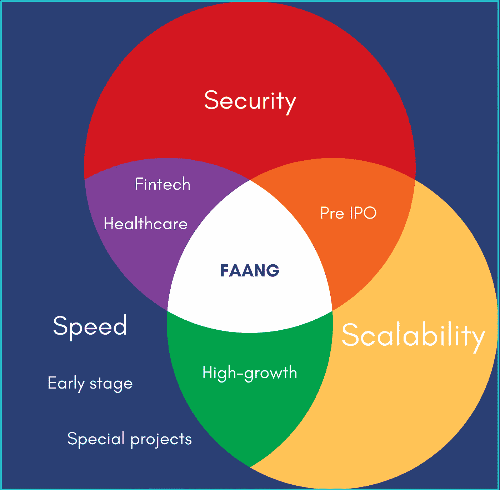

# 速度、安全性和可伸缩性:仅选择 2 个！

> 原文：<https://betterprogramming.pub/speed-security-and-scalability-pick-only-2-5e61c637b08e>

## 你如何衡量一个工程组织的效率？


图片来源[博洛夫索娃](https://www.instagram.com/bolovtsova/)

本文将把这个问题分成三个属性:速度、安全性和可伸缩性(称之为 3S)。

首先，我们将描述当工程团队同时试图在 3S 方面表现出色时所面临的一些挑战。

接下来，我们将回顾各种规模的公司如何改变战略以适应其业务需求。最后，我们将看看一些有趣的趋势，这些趋势可能会在他们的旅程中帮助一些工程团队。

# 什么是 3S？

## **速度**:一个想法走向市场所需的时间

指标:上市时间，发布的特性数量。

观察到的特征:

*   个人贡献者有很大的自主权，可以快速行动
*   进行更改时，流程和检查更少
*   创新是一个差异化因素。
*   这可能会导致功能退化和技术债务。

## 安全:将安全控制纳入信息系统的过程

指标:安全事件的数量，按严重性、合规性成就进行加权。

观察到的特征:

*   个人贡献者共享所有权，并保持相互负责
*   进行更改时需要许多流程和检查
*   创新可能被视为一种风险
*   合规性和安全性需求成为关键项目，有时会接管产品路线图

## **可伸缩性:**系统改变大小或容量的能力

指标:性能和正常运行时间指标

观察到的特征:

*   个人贡献者依赖工具和自动化。在初始阶段，设置这种自动化可能是复杂且耗时的
*   自动化程度提高
*   基础设施作为代码
*   多区域、多云
*   技术债务会损害可扩展性

# 为什么试图超越 3S 会适得其反？

虽然这三个属性是善意的，但它们有时可能会成为相反的力量。让我们举几个例子。

**速度与安全的对抗:***为了防止开发者被封锁，可以给他们一些系统的完全访问权。但是这也违反了安全要求。*

**针对速度的可伸缩性:***一个可伸缩性目标可以是使用多个地区，可能是多个云提供商。但是对于开发人员来说，这将使发布和部署过程变得更加复杂。这也产生了一个新的问题；应用程序数据现在存储在许多地方。*

**安全性对抗可扩展性:***为了提高安全性，每个新系统或库在使用前都可能需要一个批准过程。但这可能意味着引入新的工具或技术来提高可伸缩性(例如:Kubernetes)会更慢。此外，在最坏的情况下，创新是一种风险，这会造成僵局。*

我们可以提供更多关于将光标放在哪里的论点，并对所有这些例子进行情绪化的讨论。每个公司的答案可能不同。但重点是，这些可能是相反的力量。如果一个企业的资源有限，它可能希望做出明智的决定，将重点放在哪里，以减少这些摩擦点。

在业务不需要的时候引入不必要的复杂性可能是有害的。也许目前的团队不具备所需的所有技能，所以他们需要提升。这可能会降低上市能力。一些团队会从事一些后来证明并不需要的项目。相反的力量可能会导致激烈的讨论和延迟决策。最终，它会对士气产生负面影响，并导致人员流失。

我们可以将 [CAP 定理](https://en.wikipedia.org/wiki/CAP_theorem)进行类比，说明一个工程团队不可能同时在速度、可伸缩性和安全性方面表现出色，从而进一步推进这一点。

> **CAP** 定理指出，分布式系统不能同时具有 **C** 一致性、 **A** 可用性和 **P** 分区容忍度。

大免责声明:这不是要放弃一个属性，而是接受在当前阶段应该把重点放在另外两个属性上。通过清楚地陈述公司现在需要什么，并就可接受的折衷方案进行沟通，工程团队将更加专注。一个伟大的领导者会在他们的信息中预见到更进一步，并解释他们将如何在未来解决今天的权衡。并在时机到来时做好相应的准备。

# 选哪个 3S？



早期创业公司把速度看得比什么都重要。他们希望通过快速发布新产品功能来找到他们的市场并让他们的客户满意。

一些行业，如金融或医疗保健行业，可能会认为安全和速度(T21)是应该关注的首要因素。

经历高增长的更杰出的创业公司通常更喜欢可扩展性和速度。如果他们在一个赢家通吃的市场中竞争，这种策略将允许他们执行他们的产品路线图，并更快地进入新的市场。如果他们正在准备 IPO 或进行全球扩张，他们的合规性要求将使他们转向关注安全性和可扩展性。

最后，拥有多年经验的大型科技公司有时间学习，并自己经历了许多阶段。因此，他们拥有一些最好和最大的工程团队；他们擅长 3S。

对于大公司来说，将一个独特的项目分拆成一个独立的实体以使其更快地发展也并不罕见，有时也被称为内部创业。

# 3S 的下一步是什么？

没有人能预测未来，但我们可以观察市场的一些趋势，并报告我们从用户那里听到的一些反馈。

# *速度:招聘是瓶颈，新一波创业公司正在到来*

早期融资正处于历史最高水平，这些初创公司正在竞相寻找自己的市场。如今，影响速度的头号障碍似乎是技术招聘。因为招聘很慢，他们想用更少的人做更多的事。新一波 PaaS 和软件简化了日常工程任务。

简化云计算是我们 [Opta](https://github.com/run-x/opta) 的使命，但还有许多其他新创公司的目标是帮助开发者。我们的用户中有几个令人兴奋的例子: [Canvas](https://blog.runx.dev/how-the-canvas-team-uses-opta-to-make-data-easier-to-explore-f5615647cc43) ，它为非技术团队带来了 SQL，还有 [Union.ai](https://union.ai/) ，它简化了机器学习。

# *可伸缩性:Kubernetes 采用、多种云以及对固执己见的框架的需求*

向 Kubernetes 迁移是一个大的行业趋势。但是它带来了一些挑战和频繁的升级。使用 Kubernetes 是一个旅程，而不是目的地。这种复杂性有时会被误解，并且会因占用工程资源而对产品路线图产生负面影响。

最新的 [HashiCorp 云状态](https://www.hashicorp.com/state-of-the-cloud)调查报告称，多云现已成为新常态。云提供商非常不同，支持许多提供商将为工程团队带来更多工作。我们的客户希望他们的云提供商上有 Kubernetes，但不一定对他们应该如何配置它有强烈的意见。他们需要最佳实践，例如应用程序监控和基础架构即代码。

# *安全性:Kubernetes 网络和 IAM 需要帮助*

在这里，再次移动到 Kubernetes 创造了更多的复杂性。大多数云提供商提供运行集群的服务，但这取决于用户为其集群设置网络(入口、服务网格)和 IAM。有些公司从 Kubernetes 开始；他们不想从空白状态开始。从负载平衡器到运行在集群上的应用程序单元，他们喜欢使用能够提供个性化方式来配置网络堆栈的产品。

# 我们所看到的

本文通过考虑 3S 来考察工程效率:速度、安全性和可伸缩性。对于许多公司来说，试图过早地在所有 3S 上超越会造成不必要的复杂性，增加技术债务。这最终会给工程团队带来挫败感，并导致人员流失。

根据企业所处的阶段和市场，同时关注一两个属性可能是有意义的。清晰地交流当前的策略和权衡将有助于工程团队保持专注。

最新的趋势，如技术招聘危机和 Kubernetes 的流行，已经让一些公司转向简化工程任务的新产品，以便他们可以用更少的员工来执行他们的路线图。

# 如何轻松管理团队的基础设施

我们的免费开源工具 Opta 为您的团队降低了云基础设施和管道的大部分复杂性。它是一个构建在 Terraform 之上的基础设施即代码框架，允许您使用高级结构快速设置定制的云基础设施。

```
**Want to Connect?**If you run into any issues in the installation stage, you can reach out to the contributors in [our slack channel here](https://slack.opta.dev/)
```