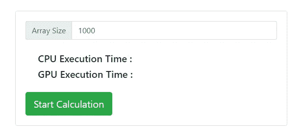
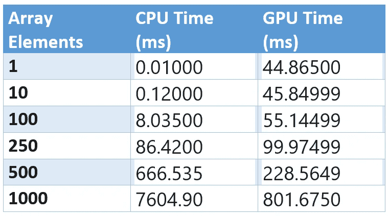

# 使用 GPU.js 将您的角度项目加速 10 倍

> 原文：<https://betterprogramming.pub/speed-up-your-angular-projects-by-10x-with-gpu-js-92c4b2bad4e3>

## 了解如何在 Angular 中使用 GPU 编程


卢卡斯·凯普纳在 [Unsplash](https://unsplash.com?utm_source=medium&utm_medium=referral) 上的照片。

作为开发人员，我们总是寻找机会来增强我们构建的应用程序的性能。但是当涉及到计算繁重的任务时，我们的选择很少，这些任务取决于 CPU 的性能。

那么，如果我们将 GPU 的能力与我们的 web 应用程序结合起来，会发生什么呢？

在本文中，我将向您展示使用 [GPU.js](https://github.com/gpujs/gpu.js) 将 GPU 编程集成到您的 Angular 项目中的步骤。我还会做一个性能对比，讨论什么时候该用 GPU，什么时候不该用。

# 将 GPU.js 与 Angular 一起使用

如果你对 GPU.js 一无所知，也不用担心。随着进程的进行，我会提供相关的细节。让我们从创建一个新的 Angular 项目开始。

## 1.初始化新的角度项目

要创建一个新的 Angular 项目，只需运行`new`命令:

```
ng new <project-name>
```

如果你之前没有在你的机器上配置 Angular，我建议你遵循他们的[文档](https://angular.io/docs)。

之后，您可以运行`ng serve`命令并在浏览器中打开`[http://localhost:4200/](http://localhost:4200/)`来测试项目。


## 2.安装 GPU.js

正如我最初提到的，GPU.js 是一个 JavaScript 加速库，可用于通用计算目的。

如果运行设备中没有 GPU，使用 GPU.js 不会使您的应用程序过时。如果设备中没有 GPU，它可以退回到常规的 JavaScript 引擎。所以，用 GPU.js 不会有什么坏处。


来源: [GPU.js](https://gpu.rocks/#/)

像任何其他 JavaScript 库一样，GPU.js 也可以在 npm 或 yarn 中使用。您可以使用其中任何一个来安装 GPU.js:

```
npm install gpu.js — save
or
yarn add gpu.js
```

现在我们可以开始处理我们的第一个 GPU.js 函数了。

## 3.用 GPU.js 编写内核函数

我将让这个应用程序编写一个函数来计算两个数字的乘法，并向它们提供不同大小的数字数组，以查看它们的执行时间。

先说 GPU 函数:

在函数开始的时候，我已经初始化了一个新的 GPU 对象。然后我使用 GPU.js 中的内置函数`gpu.createKernel()`创建了一个名为`multiplyMatirx`的内核函数。

两个数字数组和矩阵大小作为输入参数传递给该函数，乘法将在其中发生。

JavaScript performance API 函数用于计算时间，而`performance.now()`函数将记录 GPU 执行的开始和结束时间。

## 4.编写 CPU 函数

现在我们要为 CPU 执行写一个等价的函数。为此，我使用了`for`循环，想出了这个小函数:

除此之外，我还使用了一个名为`generateMatrices()`的函数来生成两个包含随机数的数组:

## 5.创建简单的用户界面

现在我将实现一个简单的 UI，用户可以在其中输入数组的大小并查看执行时间。



## 6.运行应用程序并查看性能

现在一切都设置好了，完整的代码如下所示:

# 让我们看看性能差异

现在，是时候检查我们可以从 GPU.js 获得的性能提升，看看我们是否可以将它用于所有事情，或者是否有任何限制。

为此，我用不同的数组大小多次执行该程序，结果非常有趣:



执行时间

正如你所看到的，当任务的规模很小时，CPU 表现很好。对于所有 200 以下的数组大小，CPU 显示出最佳的执行时间，而 GPU 则需要相当长的时间来完成任务。

因此，CPU 适用于不太复杂或计算量不大的任务。

但是当数组大小增加时，GPU 的性能开始比 CPU 好得多。当数组大小为 1，000 时，GPU 的性能大约是 CPU 的十倍。

当任务的重量很重且更复杂时，GPU 表现良好。

使用 GPU 时，您应该注意为 GPU 选择最佳任务并充分利用它。因此，我邀请大家在下一个 Angular 应用程序中尝试一下 GPU.js，看看性能的提升。

感谢您的阅读！