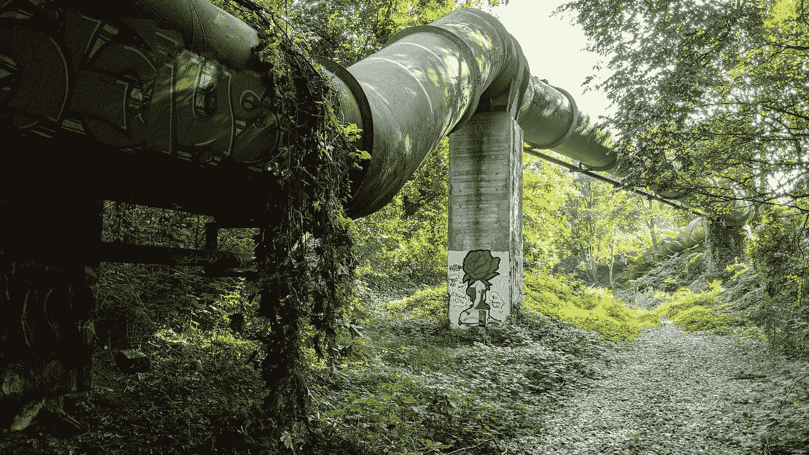
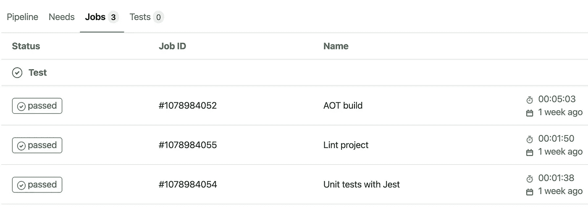
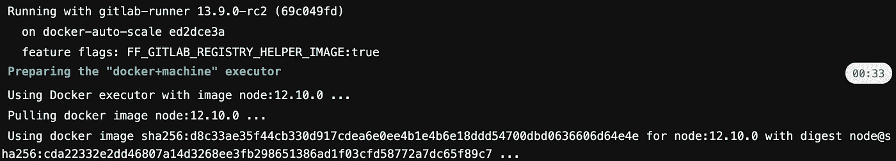
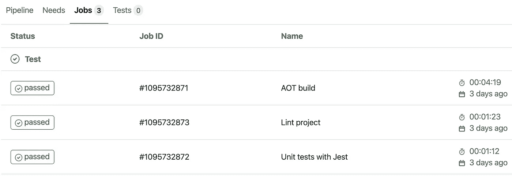
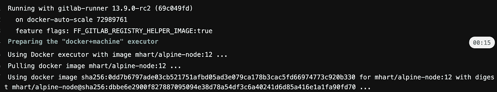
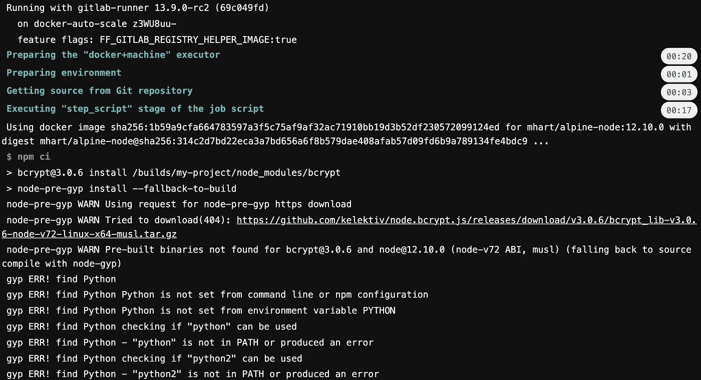

# 使用更小的 Docker 映像加快您的 CI 渠道

> 原文：<https://betterprogramming.pub/speed-up-your-ci-pipeline-with-smaller-docker-images-4e08dfed08c9>

## 你需要下载的越少，你就能跑得越快

在 [Unsplash](https://unsplash.com?utm_source=medium&utm_medium=referral) 上由[Florian wchter](https://unsplash.com/@allodium?utm_source=medium&utm_medium=referral)拍摄的照片。

CI/CD 允许开发人员和组织更快地前进。通过自动化任务，如构建、测试和部署软件，我们在日常任务上花费的时间更少，而有更多的时间在实际的应用程序上。GitLab、CircleCI 和 GitHub 等提供的解决方案使我们能够轻松地创建 CI/CD 作业。

一般来说，CI/CD 作业应该在一个独立的 Docker 容器中运行。这样，您就可以拥有一个可重现的构建环境。例如，您可以使用托管在 Docker Hub 上的 Node.js 映像。然后，您的作业在基于选定图像的容器中运行。该容器拥有构建应用程序所需的所有节点依赖项。

与许多事情一样，“少即是多”的格言也适用于 CI/CD。毕竟，我们不想要长时间运行的作业。但是，我们也不想牺牲 CI/CD 平台的优势。

在这篇文章中，我将分享一个可能的方法来加快你的管道。对于代码示例，我将使用 GitLab CI。

# 如何使用较小的 Docker 映像减少 CI/CD 作业时间

通常，您选择的 CI/CD 平台允许您使用 YAML 文件配置作业和管道。对于 GitLab CI，我们希望在我们的存储库中有一个`.gitlab-ci-yml`文件。我们现在感兴趣的是`image`配置选项。`image`关键字是 Docker 执行器运行以执行 CI 任务的 Docker 映像的名称。

我们的第一次尝试是这样的:

先简单说一下这个配置:

*   我们告诉 GitLab 默认使用一个[节点镜像](https://github.com/nodejs/docker-node)(版本 12.10.0)。
*   我们在每个作业之前运行`npm ci`来安装依赖项。
*   我们有三项工作，构建、测试和 lint 我们的应用程序。

这个配置没什么特别的毛病。但是，如果您看一下上面的日志，您会发现下载和准备节点映像花了 33 秒。33 秒听起来可能不算多，但就计费分钟数而言，它可以很快累加起来。原因是像这里使用的“完整”映像除了节点之外还包含许多其他东西，比如运行时库和版本控制软件。

现在我们有了一个基线，我们可以通过使用一个更小的图像来尝试改进它。在下面的例子中，我使用了一张阿尔卑斯山节点的图片。Alpine Linux 比大多数发行版基础映像小得多，因此一般来说映像也小得多。除了这一变化之外，配置与上面相同。

我们现在只剩下 15 秒来下载和准备节点映像！这还不到设置完整节点映像所需时间的一半。对于只需要修改一行代码的东西来说，这是一个相当大的改进。

特别是前端项目最有可能与较小的 Docker 映像兼容，因为它们除了 Node 之外几乎不需要任何东西。

# 较小 Docker 图像的警告

不过，有时候你需要一个完整的图像。在下面的例子中，我试图在一个使用了 [bcrypt](https://github.com/kelektiv/node.bcrypt.js) 库的 Express.js 项目中使用一个 alpine-node 图像。在日志中，我们看到我们的 alpine-node 映像不满足正确安装项目依赖项的所有要求。因此，工作失败了，我们需要使用一个满足项目需求的映像。

# 结论

感谢您阅读这篇关于如何通过使用较小的 Docker 映像来加速 CI/CD 作业的短文。正如你所看到的，很容易尝试不同的 Docker 图像，如`alpine-node`，看看它是否适合你。总的来说，从小图像开始是个好主意。如果它不符合您的要求，您仍然可以在必要时切换到另一个图像。

你知道其他加快 CI/CD 工作的技巧吗？请在评论中告诉我。