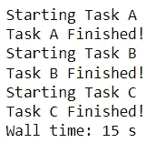
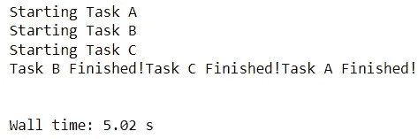

# 使用 Python 中的多线程加速数据收集工作

> 原文：<https://betterprogramming.pub/speed-up-your-data-collection-efforts-with-multithreading-in-python-61f3b3cc06df>

## 数据检索不一定是一个人的工作

照片由[兰迪·法特](https://unsplash.com/@randyfath?utm_source=medium&utm_medium=referral)在 [Unsplash](https://unsplash.com?utm_source=medium&utm_medium=referral) 上拍摄

许多项目需要某种形式的数据收集，这需要从数据库和网站等外部来源获取信息。

不幸的是，随着数据检索任务数量的增加，数据收集过程会变得冗长而耗时。

幸运的是，用户在执行数据拉取时，可以通过合并多线程来节省长时间的运行。

在这里，我们强调多线程的好处，并讨论如何将它集成到程序中，以加快 Python 中的数据收集操作。

# 为什么是多线程？

多线程使用户能够通过同时运行进程的不同部分(称为线程)来更快地执行操作。

考虑下面的函数，它需要大约五秒钟来运行。

代码输出(由作者创建)

如果函数需要五秒钟来执行，那么运行三次需要多长时间？

代码输出(由作者创建)

这是显而易见的。整个操作总共需要大约 15 秒钟。

然而，当有大量任务时，这种安排的效率低得令人难以忍受。如果函数需要迭代成百上千次，这种方法会有多麻烦？

幸运的是，如果感兴趣的任务彼此独立，用户可以通过利用多线程来减少完成操作所需的时间，多线程将任务分布在多个线程中。

# Python 中的多线程

Python 允许用户将多线程与提供了`ThreadPoolExecutor`类的`concurrent.futures`包结合在一起。

这个类最强大的特性之一是`map`方法，它很像内置的 map 方法，用给定的参数集合映射感兴趣的函数。

我们可以使用这个类通过多线程并发执行任务来加速前面的操作。

代码输出(由作者创建)

`ThreadPoolExecutor`不是一次执行一个任务，而是在同一时间内执行多个任务，从而大大减少了运行时间。

# 用于数据收集的多线程

多线程适用于 I/O 绑定的任务，这些任务需要花费大量时间与某种形式的外部系统(如数据库或 web 服务器)进行交互。由于数据收集过程通常需要从外部源接收数据，因此使用多线程来改进此类过程是切实可行的。

多线程通常用于执行操作，如从网站上删除数据、读取文件或使用效率更高的 API 进行调用。

举个简单的例子，假设我们希望使用[大学域名和名称 API](https://github.com/Hipo/university-domains-list/) 收集数据，它提供给定国家的大学信息。

使用下面的函数，可以获得任何给定国家的大学名称的数据。

目标是获得 248 个不同国家的大学信息。如果没有多线程，这个函数可以通过一个简单的循环一次收集一个国家的大学数据。

代码输出(由作者创建)

以这种方式收集所有国家的数据大约需要 14 秒钟。虽然这种方法可以完成工作，但效率非常低。

让我们看看通过使用`ThreadPoolExecutor`类在十个线程中执行该函数来获得相同的数据需要多少时间。

代码输出(由作者创建)

通过使用多线程并发地用 API 执行数据检索节省了大量时间。

# 限制

虽然您可能正在评估多线程减少数据收集过程运行时间的能力，但是您可能会想:为什么不仅仅使用它来收集数据呢？我们为什么不用多线程来加速每一个感兴趣的操作呢？

简单来说，这种技术有其自身的局限性。

虽然多线程适用于 I/O 相关的任务，但在处理 CPU 相关的任务时，它就不够用了。CPU 相关的任务主要依赖于 CPU 的处理能力。

在这样的操作中加入多线程可能是无效的，甚至会产生更长的运行时间。

因此，如果您正在处理计算密集型过程，如训练机器学习模型或处理图像，多线程不是一个合适的解决方案。对于这种情况，考虑探索更可行的替代方案，如多处理。

# 结论

照片由[普拉蒂克·卡蒂亚尔](https://unsplash.com/@prateekkatyal?utm_source=medium&utm_medium=referral)在 [Unsplash](https://unsplash.com?utm_source=medium&utm_medium=referral) 拍摄

多线程是数据收集工作的宝贵资产。

也就是说，本文主要是提倡使用这种技术，并没有过多地探究实现多线程的最佳 Python 模块。

我个人更喜欢使用`concurrent.futures`包中的`ThreadPoolExecutor`类，因为它的接口简单。然而，还有其他选项可以用来执行多线程(例如，`threading`模块)。

请随意探索在 Python 中结合多线程的各种方法，并尝试一下，看看哪种方法最适合您。

编码快乐！