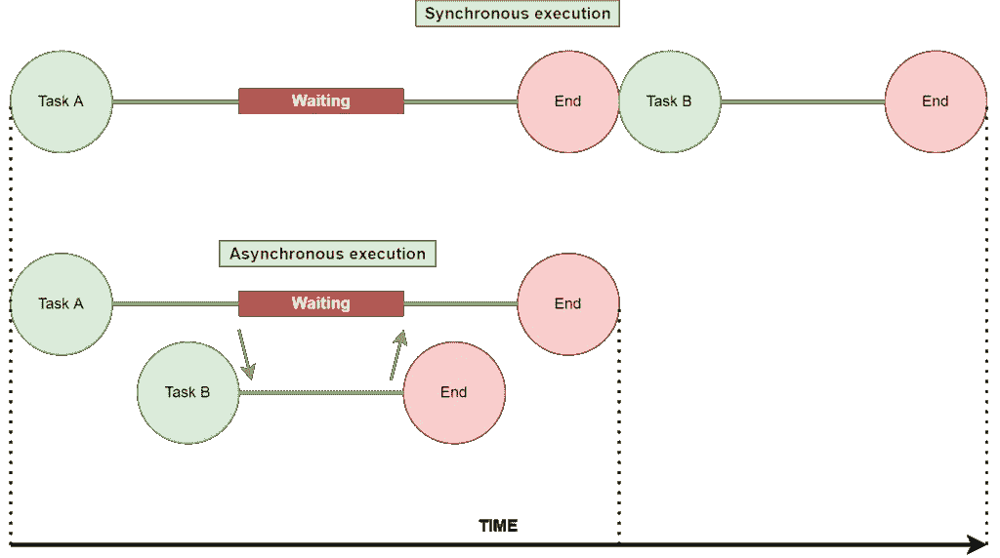
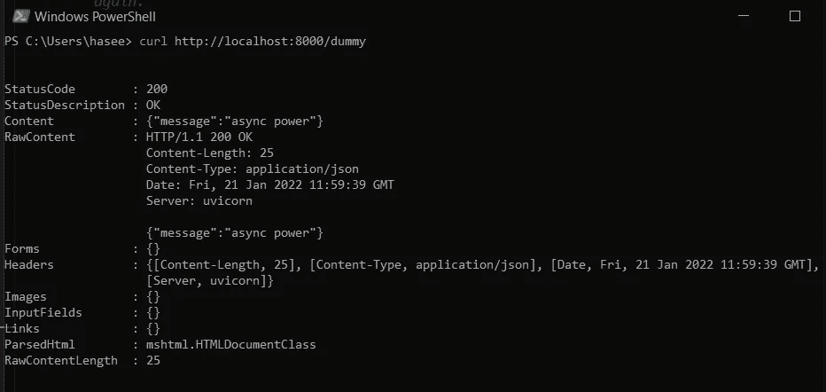

# 使用这个库，以 100%的线程利用率加速您的 Python 代码

> 原文：<https://betterprogramming.pub/speed-up-your-python-code-with-100-thread-utilization-using-this-library-31378a45f0ec>

## FastAPI 带来惊人的单线程性能—优化您的代码，大幅提升性能！


由 [Verne Ho](https://unsplash.com/@verneho?utm_source=medium&utm_medium=referral) 在 [Unsplash](https://unsplash.com?utm_source=medium&utm_medium=referral) 拍摄的照片

Python 有许多 web 框架，最流行的是 Django 和 Flask。
我自己最熟悉 Flask，并广泛使用它来构建爱好项目和提高我的编程技能。

然而，就像科技领域的所有事物一样，新的框架也在不断地被开发。作为一名程序员，了解最新最棒的东西是很重要的。

FastAPI 是一个用于 Python 的 web 框架，在许多方面类似于 Flask 的简单性。FastAPI 的不同之处在于，它运行在 ASGI web 服务器上(比如 uvicorn)，而 Flask 只运行在 WSGI web 服务器上。这种差异会导致巨大的性能差距。

ASGI 是 Python 中的一个新兴趋势，所以了解它是很重要的。使用 FastAPI 和 ASGI，开发高性能 Python 应用程序变得非常容易。我们将看到如何在 FastAPI 中开发一个简单的 API，然后我们将它与 Flask 进行比较，看它到底快了多少。

让我们开始吧！

首先，快速介绍一下 WSGI 和 ASGI。

# WSGI 与 ASGI

WSGI 代表 **Web 服务器网关接口**。简单地说，这个软件位于 web 服务器(比如 nginx)和 Python web 框架(比如 Flask)之间。它指定了 web 服务器应该如何将请求转发到 web 框架。WSGI 于 2003 年首次发布，所以你可以想象它有多古老。WSGI 本质上是同步的。这可能会导致执行缓慢。

ASGI 代表**异步服务器网关接口**。ASGI 是将取代 WSGI 的新兴趋势。关键的区别在于 ASGI 支持带有异步代码的 web 框架。也就是说，它本质上是异步的。如果你的代码是异步的(例如，如果它使用`**async await**`)，这可以加速执行

迷茫？别担心。这里有一个简短的例子来强调同步和异步执行之间的区别。



同步与异步执行。请注意异步节省了大量时间。

如您所见，在同步执行(WSGI)中，一个线程一次只能处理一个请求。因此，如果当前请求有一些阻塞代码，需要等待一些结果，就会浪费大量时间(正如上图中的等待块所示)。
只有当整个**任务 A** 完成后，线程才能移动到**任务 B** 。

另一方面，在异步执行(ASGI)中，一个线程可以处理多个请求。当执行在**任务 A** 上等待时，线程可以跳到**任务 B** 上，并在**任务 A** 返回所需的时间内完成它。然后线程跳回到任务 A 并完成它。从上面的图表中，我们看到，通过异步执行，我们以这种方式节省了大量时间。更重要的是，通过异步执行，我们 100%地利用了线程，这意味着 ***更少的等待和更多的工作*** 。这使得某些应用程序的性能得到了巨大的提升。

简而言之:使用异步代码，线程可以在相同的时间内做更多的工作。这导致单位时间内完成更多的工作。这就是性能提升的来源。

# 标杆管理

理论很好，但更有趣的是看到一个真实的例子来说明性能差异。

首先为 FastAPI 安装以下库:

```
pip3 install fastapi[all]
```

我们对 FastAPI 使用以下代码:

我们有两个端点:根端点`***/***`和第二个端点`dummy`。
根端点执行一些繁重的工作，我们通过将计时器设置为 20 秒来模拟这些工作。

我们将端点本身定义为`async`，并使用`await`关键字来表示线程可以在这个调用结束返回时去做其他工作。我们也使用`asyncio`的睡眠功能，因为它支持`async`和`await`。`dummy`端点只是返回一条消息。

如您所见，在 FastAPI 中定义 API 非常简单。我们只需要初始化一个 FastAPI 应用程序，并用`@app`符号定义端点。

以下代码用于 Flask:

代码与 FastAPI 的代码相同。

这个想法是，我们调用根端点，当它等待 20 秒时，我们调用`dummy`端点。

这里是关键点:如果接口是异步的(ASGI)，对`dummy`的调用应该立即返回。

*注意:我们在 Flask 中将* `*threaded*` *标志设置为 false，因为我们只想测试单线程性能以供学习之用。对于多线程应用来说，关键的要点仍然应该是相同的。*

使用以下命令启动 FastAPI 服务器:

```
uvicorn tfastapi:app --reload
```

您可以在控制台中检查它在哪个端口上运行。默认为端口`8000`。

接下来，打开两个终端窗口。(我在 Windows 上使用 PowerShell，也可以使用 Git Bash 或 Linux 或 macOS 终端)

在第一个粘贴卷曲命令:

```
curl [http://localhost:8000](http://localhost:8000)
```

在第二个例子中，粘贴下面的 curl 命令来点击`dummy`端点:

```
curl [http://localhost:8000/dummy](http://localhost:8000/dummy)
```

按下第一个窗口上的`Enter`，然后按下第二个窗口。
您应该注意到对`dummy`的请求几乎立即返回:



FastAPI 中异步端点的立即返回

如果您等待 20 秒，对 root 的调用应该会返回。

这里发生了什么事？线程首先处理对根的调用。在等待睡眠功能时，调用`dummy/` 端点。然后线程跳转来处理请求。一旦它被处理，线程返回处理根请求。

现在让我们看看 Flask 的情况。

您可以使用以下命令运行 Flask 服务器:

```
py tflask.py
```

它应该在端口`5000`上运行。

接下来，像以前一样将 curl 请求复制并粘贴到 root，然后将 curl 请求复制并粘贴到`dummy`。
首先运行根请求，然后运行另一个请求。

你会注意到，对`dummy/` 的呼叫不会立即返回！两个请求返回都需要 20 秒。这里发生了什么事？

尽管代码是异步的，但是 Flask 使用了服务器框架接口的 WSGI 实现。这意味着 Flask 中的端点不是真正异步的。我们向 root 用户发出请求，它会等待。当我们向线程*发出第二个请求时，线程*不会跳转来处理这个请求。它会等待对根的请求被处理。换句话说，代码会等待 20 秒钟，然后再做其他事情。在这段时间内，线程除了等待之外什么也不做！如此低效！

# 结论

在这篇文章中，我们回顾了同步和异步代码。我们还学习了 WSGI 和 ASGI 接口实现。

我们了解了 FastAPI 如何帮助实现 100%的线程利用率，并显著提高缓慢代码的速度。

要利用 FastAPI，您需要做的就是在每个端点前使用`async`，并确保您的代码是异步的。实际上，我想进一步阐述这最后一点，并发表一些一般性意见:

*   ASGI 仍然很新，所以可能很难找到它的文档。与 WSGI 相比，它也较少被测试。
*   如果你想获得性能提升，你的代码需要是异步的。并非所有的图书馆都支持这一点。例如，Python 的某些数据库库只有同步实现。在这种情况下，您可能不会获得太多的性能提升。
*   最后，FastAPI 支持类型提示，并且与 Pydantic 集成得很好。你可以查看我的帖子[这里](/writing-robust-and-error-free-python-code-using-pydantic-151a135a9ff0)了解更多。

感谢您的阅读。

*原载于*【https://haseebkamal.com】