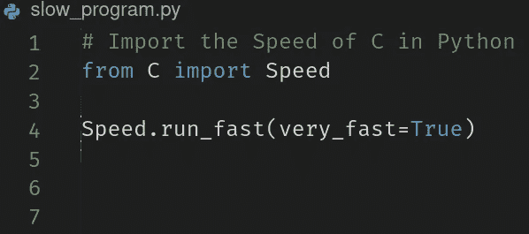

# 用 C 扩展加速你的 Python 代码库

> 原文：<https://betterprogramming.pub/speed-up-your-python-codebases-with-c-extensions-94859875eb70>

## 给你的 Python 程序带来 C 语言的速度


照片由[保罗·史密斯](https://unsplash.com/@sumo?utm_source=medium&utm_medium=referral)在 [Unsplash](https://unsplash.com?utm_source=medium&utm_medium=referral) 上拍摄

Python 既简单又强大，已经成为最流行的编程语言之一。尽管如此，它有时缺乏像 C 和 Java 这样的静态类型和预编译编程语言的宝贵速度。

# Python 为什么慢？

你可能知道，Python 一般是通过一个[解释器](https://g.co/kgs/eJyYmN)实现的。与 C 和 Java 等语言相比，这可能会导致代码执行相当缓慢，这些语言具有编译的实现，并且其源代码被预先编译成[机器](https://g.co/kgs/rAZgv2) / [字节](https://g.co/kgs/WuXQ2o)代码。但是，这个主题超出了本文的范围。

# 如何提高 Python 代码的速度？



除非必须执行计算量很大的操作，否则 Python 的速度通常不是问题。这就是 C 扩展派上用场的地方。

*C 扩展是一种用 C 编写函数、将它们编译成 Python 模块并在源代码中作为普通 Python 库使用的方法。*

为了更好的性能和/或低级功能，许多流行的模块实际上是用 C 或 C++(例如`[numpy](https://numpy.org/), [pandas](https://pandas.pydata.org/), [tensorflow](https://www.tensorflow.org/)…`)编写的。

一些快速免责声明:

*   c 扩展不适用于除了 [Cpython](https://en.wikipedia.org/wiki/CPython) 之外的 Python 实现。这应该不是问题，因为 Cpython 是默认的。
*   建议您具备 C 编程语言的基础知识。然而，如果你只懂 Python，你应该可以毫无问题地理解。

# 如何构建一个 C 扩展

作为一个例子，让我们实现经典的`fib(n)`函数。`fib(n)`接受一个数字`n`，并返回斐波那契数列中相应的数字。然后我们将比较 Python 和 C 版本的性能。

首先你需要 Python C API `Python.h`。这是一个 C 头文件[包含了与 Python 接口所需的一切。](https://gcc.gnu.org/onlinedocs/cpp/Header-Files.html#:~:text=A%20header%20file%20is%20a,Header%20files%20serve%20two%20purposes.)

## Python API 安装

*   在 Linux 上，你通常必须安装`python-dev`或`python3-dev`包，如果还没有的话。(请注意，在某些发行版中，软件包名称可能会有所不同)
*   默认情况下，如果用默认安装程序安装，Windows 应该附带 Python。
*   MacOs 也应该自带 Python。如果没有，`brew reinstall python`应该可以解决这个问题。

现在，打开您选择的代码编辑器并创建 C 模块文件。它应该按照惯例来命名——类似于`module_name.c`，尽管你可以随意命名。这里我们称之为`c_module.c`。

在开始编写扩展代码之前，您需要包含一些核心定义和声明。

出于兼容性目的，建议您将这些行放在文件的开头。

因为在 Python 中一切都是对象，所以我们的`c_fib(n)`函数应该返回一个对象，确切地说是一个`PyObject`指针(在`Python.h`中定义)。

然后需要*声明从模块中导出哪些函数*以使 Python 可以访问它们。

## 定义模块方法

每个导出的方法都表示为一个结构，包括:

*   导出的方法名(在本例中为`"c_fib”`)
*   要导出的实际方法(`c_fib`)
*   方法采用的参数类型(在本例中为`METH_VARARGS`)。这来自于关于`METH_VARARGS` : *的文档“这是典型的调用约定，其中方法具有类型* `*PyCFunction*` *。该函数期望两个* `*PyObject**` *值。第一个是* `*self*` *对象为方法；对于模块函数，它是模块对象。第二个参数(通常称为* `*args*` *)是一个表示所有参数的元组对象。”*
*   描述该方法的`const char*`

## 定义模块

该模块表示为一个结构，如上面的代码所示。它是自文档化的，除了我们设置为`-1`的 [m_size](https://docs.python.org/3/c-api/module.html#:~:text=PyDoc_STRVAR%20is%20used.-,Py_ssize_t%20m_size,-%C2%B6) 参数。从文档中:

> 将`m_size`设置为`-1`意味着模块不支持子解释器，因为它具有全局状态。

## 模块初始化功能

当模块被导入并初始化时，调用`PyMODINIT_FUNC`。注意，函数名必须以`PyInit_`开头，以模块名结尾，因此是`PyInit_c_module()`。

这些只是 Python API 的一些功能。欲了解更多信息和特性，请访问 API 的[文档页面](https://docs.python.org/3/c-api/index.html)。

# 将您的扩展编译成 Python 模块

一旦 C 代码完成，你必须把它编译成 Python 模块。幸运的是，有很多内置工具可以让你做到这一点。

创建一个 Python 脚本，通常命名为`setup.py`，并插入以下代码:

这个脚本有很多功能，但是我们将只使用`build`和`install`命令。有关更多信息，请查看[文档](https://docs.python.org/3/distutils/setupscript.html)或运行带有帮助标志的脚本:

```
 python3 setup.py --help
```

从命令行运行以下命令:

```
python3 setup.py build
```

这将创建一个名为`build`的目录，并将编译后的库放入其中。完成后，运行以下命令:

```
python3 setup.py install
```

这将在您的系统上安装刚刚构建的库，使它们可以从任何地方访问。

*请注意，您可能需要 root/admin 权限才能这样做。你不必在系统范围内安装它，但是如果你跳过安装过程，你将不得不使用* [*相对导入*](https://realpython.com/absolute-vs-relative-python-imports/) *来使用扩展。*

# 在 Python 程序中使用 C 扩展

在 Python 文件中，使用您选择的名称导入新创建的模块。在我们的例子中，它是`c_module`:

如您所见，该扩展可以像任何其他 Python 模块一样使用。

# 与普通 Python 版本相比如何？

现在让我们比较一下`c_fib`函数和它的普通 Python 对应物。我们将使用内置的`time`模块:

输出:

```
Input: 5
py_res=5, py_time=5.245208740234375e-06
c_res=5, c_time=1.6689300537109375e-06
```

不出所料，C 函数更快。

*注意，你可能在不同的机器上得到不同的时间，但是相同代码的 C 版本总是更快。*

现在让我们尝试一些更大的数字:

```
Input: 10
py_res=55, py_time=3.147125244140625e-05
c_res=55, c_time=2.6226043701171875e-06Input: 30
py_res=832040, py_time=0.40490126609802246
c_res=832040, c_time=0.004115581512451172Input: 40
py_res=102334155, py_time=50.17047834396362
c_res=102334155, c_time=0.4414968490600586
```

当涉及到大数时，C 版本明显优于 Python 版本。如果您只需要做一些简单的计算，可能不值得用 C 实现它们，因为性能差异很小。然而，对于非常耗时的操作或需要重复多次的函数，Python 的速度可能不够。

这是 C 扩展真正大放异彩的地方。您可以将所有繁重的工作留给 C，但仍然使用 Python 作为您的主要语言。

# C 扩展的真实用例

假设您必须执行一些繁重的计算，无论是加密算法、深度学习模型训练还是处理大量数据。c 扩展可以减轻 Python 的负担，加快应用程序的速度。

如果您想构建一个低级接口或者直接在 Python 内存上工作，那会怎么样？如果你知道如何处理原始指针，那么 c 扩展是一个不错的选择。

如何优化一个已经存在的 Python 应用程序，该应用程序性能很差，但您不想(或不能)用另一种语言重写它？c 扩展是答案。

或者，如果您只是一个希望自己的代码尽可能快地运行的优化顽固分子，但您仍然想要一些用于网络、GUI 等的高级抽象，该怎么办呢？在这种情况下，C 扩展绝对是你最好的朋友。

> 时间是我们总是希望拥有更多的东西。明智地投资。

# 结论

无论您是沉迷于性能和效率的 Python 开发人员，还是喜欢混合使用不同技术的人，或者您只是想尝试一些新东西，Python 的 C 扩展都是您开发人员工具箱中的绝佳补充。它们不仅为您提供了几乎免费的性能，还可以扩展 Python 的功能，将它从过时的技术堆栈中拯救出来。

感谢您的阅读。