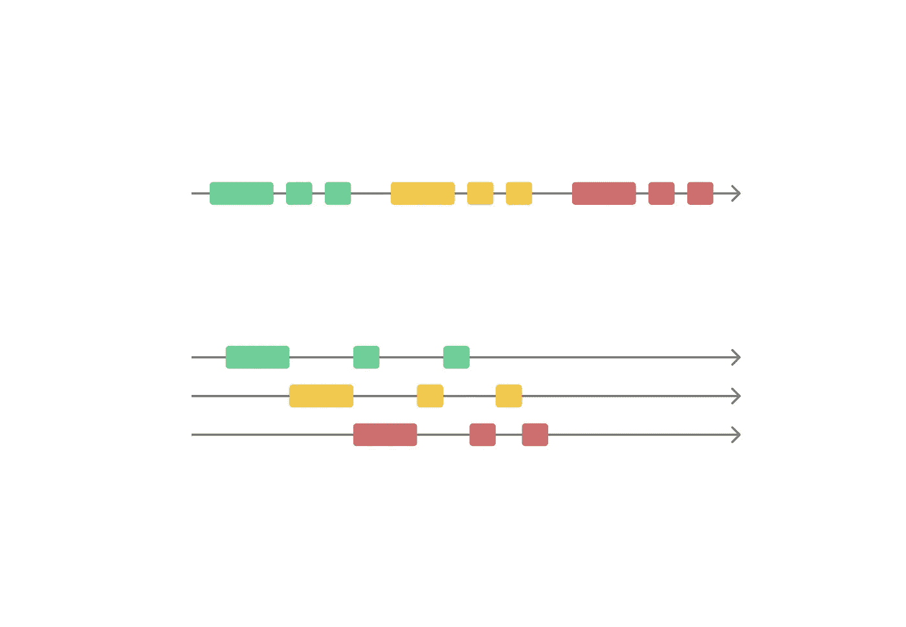
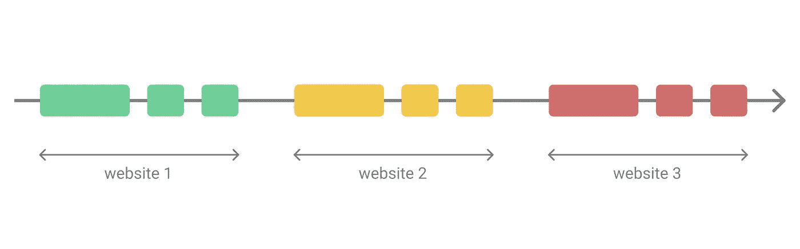
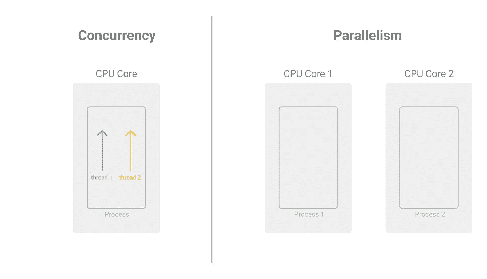
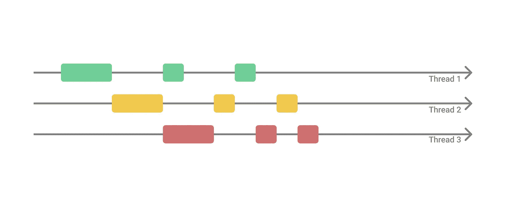

# 通过并发加速您的 Web 抓取项目

> 原文：<https://betterprogramming.pub/speed-up-your-web-scraping-projects-with-concurrency-89f548422100>

## 在网页抓取中使用多线程技术，可以快速完成网页抓取任务



作者照片。

Web 抓取是一项越来越多地用于不同领域中的许多项目的任务(例如，抓取软件项目的样本数据、用于训练机器学习模型的数据等。).在大多数项目中，我们使用 Selenium、Beautiful Soup 和 Scrapy 等工具来帮助我们从网站上收集数据。

但是，我们面临的一个普遍问题是网页抓取极其耗时！如果我们在 web 抓取和优化代码方面不太有经验，我们可能最终不得不迭代几次才能得到一个完美运行的代码程序，每次运行可能需要几个小时甚至几天！

实际上，只需对大多数程序做一个简单的调整，我们就可以将网络抓取任务的速度提高许多倍。

这可以通过使用 Python 中的多线程(并发)来实现，这是我在本文中重点介绍的(您可能也听说过多线程)。

可能不容易理解所有涉及的概念以及正确的做法，但我会尽我所能全面解释，并用清晰的例子来解释(在 Google Colab 笔记本中)！我还将介绍一些不同的方法来使用多线程和线程安全实践。请随意跳到与您相关的部分。

# 是什么让网页抓取变慢？

当抓取网页时，会发生一些事情:

*   从网站检索/提取数据。
*   以您想要的格式解析数据。
*   将数据保存在输出文件(如 CSV、JSON 等)中。).

这是一个非常依赖 IO 的任务，大部分时间都花在从一个网站(或者等待网络)中提取数据，然后解析并保存数据。

然而，如果我们不利用并发性、并行性或任何类似的东西，整个 web 抓取过程将变得非常耗时。



换句话说，我们的程序顺序地从网站 1 获取数据，解析数据，然后保存数据。无论它访问多少个网站，这个过程都会重复，这会花费*很多*时间，因为它是顺序发生的。

考虑到这一点，想想我们是否可以尝试优化我们的网络抓取程序。

如果我们知道从一个网站上提取数据需要花费最多的时间，我们怎样才能让它更快呢？肯定有办法加快整个过程…

# Python 中的并发性

首先，什么是并发？

并发是指在一个 CPU 内核上的一个进程中同时运行多个线程(每个线程都是一个独立的执行序列)。这些线程中的每一个都与其他线程共享相同的内存空间。

*仅供参考:你可能也听说过术语并行。这是指在 CPU 的不同内核上运行多个独立的进程。在 Python 中，您可以利用* `*multi-processing*` *来这样做，但是根据您的程序的上下文，可能不鼓励这样做。我不会在本文中讨论多重处理。我们将关注并发性。*

我创建了下面的插图来帮助可视化并发性和并行性之间的区别(当然，这是一个简化的视图):



作者照片。

## 全局解释器锁(GIL)

当我们谈到 Python 中的多线程和并发性时，必须提到全局解释器锁(或 GIL)。

在 Python (CPython 实现)中，有一种叫做 GIL 的东西可以确保一次只能运行一个线程(因为 CPython 的内存管理不是线程安全的)。有了 GIL，我们可以确信我们的线程不会面临任何竞争条件。

尽管一次只能运行一个线程，但是利用并发性还是要快得多，因为如上所述，web 抓取是一个非常依赖于 IO 的任务，其中要花费大量时间等待网络。多线程可以大大提高网页抓取的速度。

为了便于说明，这就是它看起来的样子！



作者照片。

来举几个例子吧！

在本文的其余部分，我们将收集[IMDb 100 部最受欢迎的电影](https://www.imdb.com/chart/moviemeter)并保存到一个`.csv`文件中。

我可能会写一篇单独的文章来详细介绍如何进行网络抓取，但是我现在不打算写，因为这不是这篇文章的目的。

为了进行 web 抓取，我将使用 [Python 请求](https://requests.readthedocs.io/en/master/)和 [Beautiful Soup](https://www.crummy.com/software/BeautifulSoup/bs4/doc/) (为了便于 HTML 解析)来获取所需的数据。您不需要任何额外的现成工具。

如前所述，我准备了[一个 Google Colab 笔记本](https://github.com/daryllman/multithreaded-webscraper/blob/master/multithreaded_webscraping.ipynb)(点击“在 Colab 中打开以运行笔记本”)，但我建议在阅读完这篇文章后才访问它，因为大多数解释都包含在这里。无论如何，我也将在这里介绍代码的所有部分。

如果你已经熟悉网络抓取，请随意跳过下一部分。

*首先，在你打算刮之前，请检查一下网站是否为你提供了获取你需要的信息的 API。许多网站，如*[*Twitter*](https://developer.twitter.com/en/docs/twitter-api)*都提供这样的 API，因为他们知道许多人都在他们的网站上搜集数据，他们宁愿提供一个可靠的 API 渠道让你获取数据，也不愿让你给他们的主要网络服务器增加压力。*

# 网页抓取(无多线程)— IMDb

简单解释一下我们在这里做什么，在`main` 函数下，我们将运行`extract_movies`函数，它将提取指定网站中所有 100 部电影的 URL 链接:

有了这些独立的 100 个电影的 URL 链接，我们就可以访问每个链接来提取更多关于电影的信息(标题、日期、等级、情节文本等)。).

之后，我们将这些信息作为一个行条目保存在一个`movies.csv`文件中。

下面的代码看起来有点复杂，但我们只是使用 Beautiful Soup 来尝试在将内容写入文件之前提取我们需要的内容:

抓取 100 个电影链接总共需要大约 106 秒(没有多线程)。接下来让我们看看多线程需要多长时间。

# 多线程网页抓取

将多线程引入现有的 web 抓取代码程序非常简单。我们只需要导入`concurrent.futures`，使用`ThreadPoolExecutor`(Python 3.2 及以上版本新增)。

如果您比较这两个代码(使用和不使用多线程)，除了包含几行新代码的代码片段之外，看起来几乎是相似的:

这是一个非常简单的压缩 API 函数供我们使用，因为它将帮助我们管理线程。如果我们指定使用十个线程，在任何时间点，将有十个线程，这将帮助我们抓取电影链接，直到所有 100 个电影链接完成。

1.  首先，我们需要指定我们想要使用的线程总数。我建议用几个数字来测试这个，因为它最终会达到一个上限。在我的实现中，我发现十个线程是一个不错的数字。请注意，拥有十个线程并不意味着它的运行速度会快十倍。
2.  在`executor.map`下，我们只需要输入我们希望线程运行的函数(`extract_movie_details`)和函数的输入参数列表(`movie_links`)。

请不要过度，以非常快的速度刮。不要给网络服务器太多压力，因为你可能会被阻塞。

*注:在网页抓取中使用多线程(甚至是多处理)只是一种方便简单的提高程序速度的方法。然而，如果你打算大规模地运行它，有其他的方法可以做到。但是从伦理上来说，这个想法并不是自私地发送垃圾邮件，并通过你的请求给网络服务器增加压力，因为你并不是唯一访问这个网站的人。所以，请适度这样做。否则，你的 IP 地址可能会被完全封锁(我会写一篇单独的文章)。*

那么，用多线程刮 100 个电影链接需要多长时间？

大概需要 19 秒。这大约快了五倍！只需对代码进行一些简单的修改，我们就可以节省大量的开发时间。

# 3.多线程+锁定的网页抓取

尽管我已经提到过，根据我们实现 web 抓取程序的方式(这可能很复杂)，GIL 确保在任何时间点只能运行一个线程，但我们可能不确定某些实现/功能是否是线程安全的。

例如，特别是最后一部分，我们试图将结果保存到一个`.csv`文件中，这可能不是线程安全的，这取决于你实现它的内容和方式。在您不确定的情况下，您可以额外实现一个锁来让您安心。假设它不是线程安全的，让我们看看如何使用锁。

```
import threading
csv_writer_lock = **threading.Lock()** *# only one thread can hold this lock at one time
...*
```

想法很简单:我们创建一个锁，并且在任何时间点只有一个线程可以持有这个特定的锁来写入`.csv`文件。这可以防止一些非线程安全的情况发生(覆盖等)。).

自己决定是否真的需要这个。在大多数情况下，不实现锁或共享队列的普通多线程就足够了。

# 4.多线程+共享队列的网页抓取

确保线程安全的另一种方法是使用共享队列。这个想法也很简单。我们首先创建一个共享队列，在这里我们可以向队列中添加信息/数据(并等待)来执行特定的任务。一个接一个——一次一个——线程将帮助我们运行这个任务。

为了简单起见，我稍微调整了一下程序。`extract_movie_details`功能将在最后运行一个`write_to_file`功能:

```
def extract_movie_details(movie_link):
...
   **write_to_file**({'title': title, 'date': date, 'rating': rating, 'plot_text': plot_text})
```

我们初始化一个全局共享队列(`extraction_queue`)，它将帮助我们写入`.csv`文件。

对于`extraction_queue.put(movie_details)`，我们正在将电影细节添加到队列中。当队列不为空时，它将继续执行定义的任务，您必须为每次执行使用`.task_done()`将该任务设置为 done:

在`main`函数中，我们将创建一个线程来帮助在守护进程(后台进程)中运行这个提取函数，直到它完成:

使用共享队列可能稍微复杂一点，但是我认为这可以为您的程序提供更多的灵活性和控制。

我只是在这里分享一个例子，以防你将来决定在更复杂的程序中使用它。很多时候，我觉得你不需要用这个。

附加提示:总是通过运行较小的数据集来测试，以检查你的程序是否如预期的那样运行。如果您正在抓取一个大型数据集，包含日志记录是一个很好的做法！万一你的程序行为异常，你知道它发生在哪里和为什么。

# 结论

感谢阅读。希望这篇文章对你有帮助。如果你看到任何错误，请随时评论，这样我可以更新，我们可以一起学习！