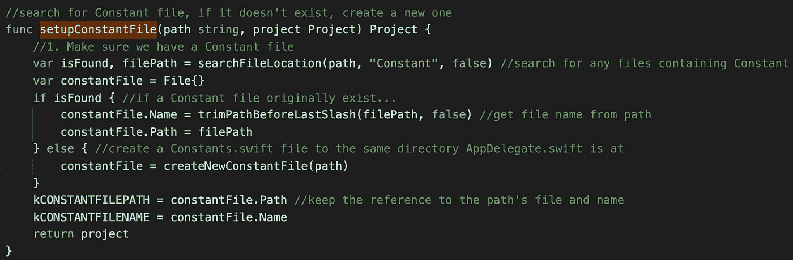
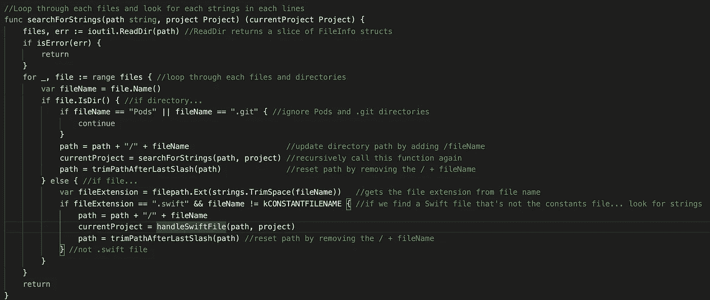
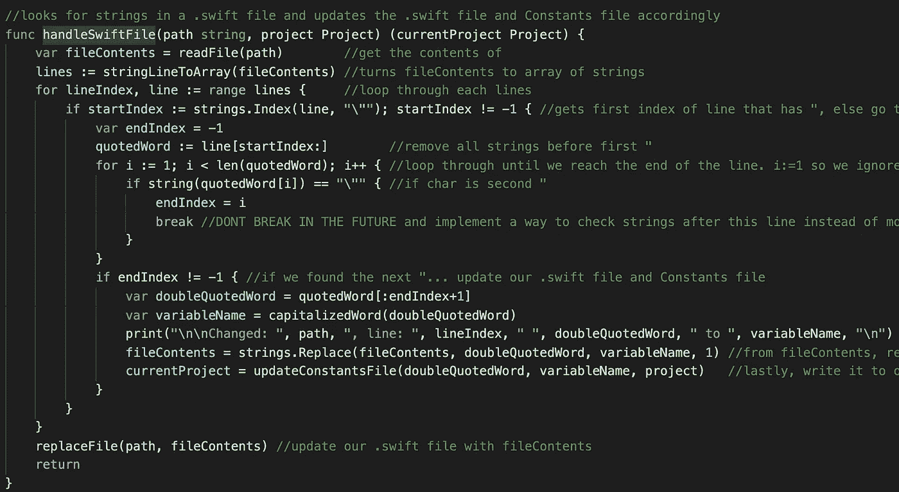

# 我如何使用 Go 加速 iOS 开发

> 原文：<https://betterprogramming.pub/speeding-up-ios-development-using-go-979425dea4ec>

## 通过将所有字符串移动到 Constants.swift 文件中，将可翻译的字符串转换为 NSLocalizedString，最后，使用 Google 的云翻译 API 填充并翻译所有可本地化的. String 文件


安娜在 [Unsplash](https://unsplash.com/s/photos/technology?utm_source=unsplash&utm_medium=referral&utm_content=creditCopyText) 上的照片

当我考虑将哪个项目作为我在 [Make 学校的](http://makeschool.com) [围棋课程](https://make-school-courses.github.io/BEW-2.5-Strongly-Typed-Languages/#/)的最终项目时，这些问题摆在了我面前:

*   什么实用程序、API 或库对您的日常生活影响最大？
*   我能自动做些什么来提高自己和他人的工作效率？

我有幸参加了这个国家第一个也是唯一一个由世界上最好的后台教练 Dani 教授的围棋课程。在七周内，我达到了超乎我想象的水平。我不仅学习了 Go 的并发概念，还制作了非常酷的应用程序，如[静态站点生成器](https://github.com/SamuelFolledo/MakeSite)、一个 [web scraper](https://github.com/SamuelFolledo/MakeScrape) 和我的[最终项目](https://github.com/SamuelFolledo/StringsUtility)，作为一名程序员，我希望它能加速 iOS 开发。

# 问题

字符串是编程世界中最常见的数据类型之一，因为它们包含向用户显示的消息文本，用于字典或 JSONs，以便与后端通信。问题是，重复输入字符串使它们容易出现错别字。必须在确保拼写正确的同时输入它们，这可能是相当烦人的。


[https://i.ytimg.com/vi/AMShoQ_qdc0/maxresdefault.jpg](https://i.ytimg.com/vi/AMShoQ_qdc0/maxresdefault.jpg)

# 解决办法

我做了一个应用程序，递归搜索项目中所有`.swift`文件中的所有字符串，并将这些字符串转换为一个全局常量变量。在 [Make School 为期两周的春季集训](https://github.com/Make-School-Courses/INT-1.3-AND-INT-2.3-Spring-Intensive)期间，我决定更进一步，自动化更多无聊的字符串任务，并添加以下功能:

*   将所有常量文件中的所有可翻译字符串转换为 NSLocalizedString。
*   通过查找 Localizable.strings 文件并用可翻译的字符串填充它们来检测开发人员想要支持的语言。
*   翻译所有 Localizable.strings 文件中的所有字符串。
*   在程序导致意外错误的情况下撤消功能。

# 利益

*   字符串的自动完成。
*   保证没有意外的错别字。
*   在一个文件中轻松管理所有字符串。
*   每个文件可能只需要两个字符串，也可能需要一百万个。
*   所有可本地化的文件中没有重复的字符串。
*   可翻译字符串的 NSLocalizedString
*   在几秒钟内支持 41 种以上的语言

# 它是如何工作的？

**注意**:为了**使用自动翻译功能**，该项目需要额外但快速完成谷歌云翻译的[基本设置](https://cloud.google.com/translate/docs/basic/setup-basic)，以便获得。json 文件，允许你向 Google 的 API 发送字符串。点击[此处](https://github.com/SamuelFolledo/StringsUtility)了解更多信息。完成设置后，您就有了。要导出的 json 文件，运行一次该行并继续:

```
export GOOGLE_APPLICATION_CREDENTIALS=[PATH] 
```

例如:

```
export GOOGLE_APPLICATION_CREDENTIALS=/Users/Samuel/Downloads/StringsUtility-Tester-785c7f11aedf.json
```

假设您已经克隆了[字符串实用程序](https://github.com/SamuelFolledo/StringsUtility)项目，开始设置，以及可选的 Google Cloud Translation 的[基本设置](https://cloud.google.com/translate/docs/basic/setup-basic)，下面是它的工作方式:

*   为了构建和运行，它需要一个指向项目的路径目录或任何包含。swift 文件或项目不会做任何事情。
*   运行`run main.go — dir=REPLACE_FOR_PROJECT_PATH`。
*   它首先在存储路径的项目中搜索一个`Constant`文件，如果它存在的话，或者创建一个新的路径。



*   现在我们有了一个存储常量变量的地方，我们可以开始递归搜索所有的字符串。目录内的 swift 文件通过了。



命令`ioutil.ReadDir()`查看一个路径中的所有文件，并且可以区分目录和实际文件。如果文件是一个目录，再次递归运行这个函数。如果该文件是一个. swift 文件，我们现在可以开始在该文件中搜索字符串。

最后一步是搜索字符串，然后更新。swift 文件和相应的常量文件。



上面的代码是在我的期末考试期间写的，现在已经被优化得更干净，并在我的 2 周强化期中遵循最佳实践。查看我的 GitHub repo 来看完整的源代码。如果你有任何问题，建议，雇用，或希望这个项目得到优化，并遵循贵公司的标准和自动化字符串任务，随时联系[我](https://www.makeschool.com/portfolio/SamuelFolledo)。

# 重要链接

*   [Samuel Folledo 的弦乐实用项目](https://github.com/SamuelFolledo/StringsUtility)
*   [让学校的春季密集](https://github.com/Make-School-Courses/INT-1.3-AND-INT-2.3-Spring-Intensive)
*   [GitHub:制作学校课程— BEW2.5](https://github.com/Make-School-Courses/BEW-2.5-Strongly-Typed-Languages/blob/master/Project/MakeUtility.md)
*   [制作学校](http://makeschool.com)