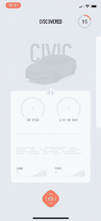
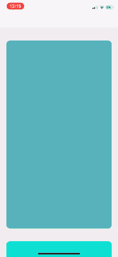
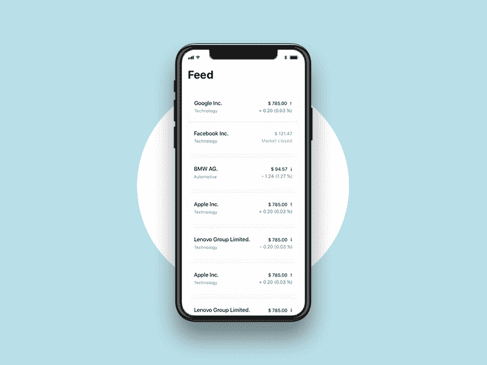
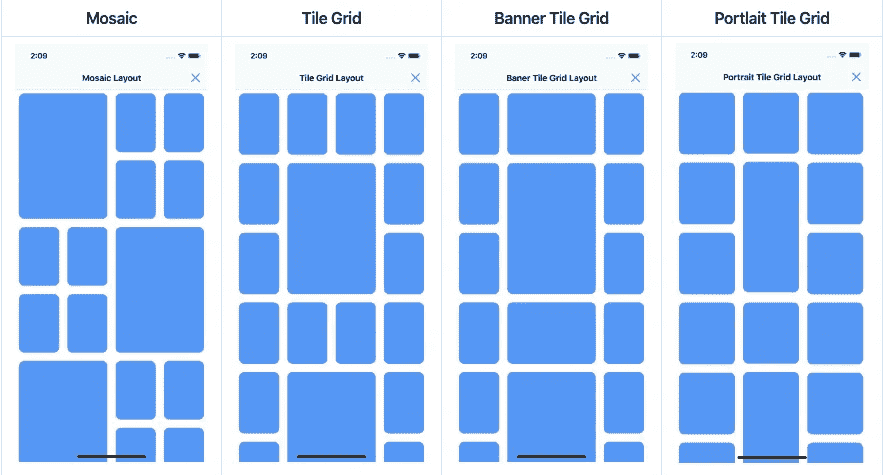
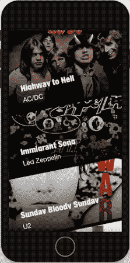
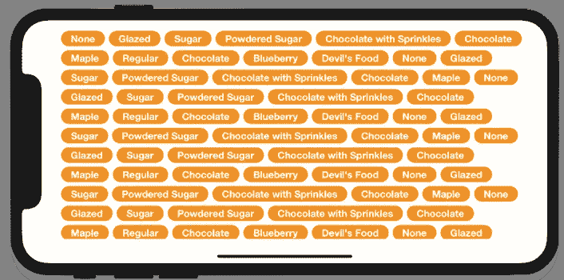
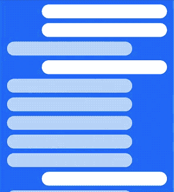

# 使用这 7 个库增加应用程序收藏视图的趣味

> 原文：<https://betterprogramming.pub/spice-up-your-apps-collection-views-with-these-7-libraries-cda2379ce4d7>

## 从 UICollectionViewLayout 和 FlowLayout 到新的 CompositionalLayout，我们已经涵盖了所有内容


[freestocks.org](https://unsplash.com/@freestocks?utm_source=medium&utm_medium=referral)在 [Unsplash](https://unsplash.com?utm_source=medium&utm_medium=referral) 上的照片

`CollectionViews`在提供一种建立灵活布局结构的方法方面远远超过`TableViews`。使用`UICollectionViewLayout`或`UICollectionViewFlowLayout`可以很容易地构建复杂的布局。

虽然流布局是`UICollectionViewLayout`的子类，但是它仍然可以提供进一步的定制。根据你开始构建的布局类型，你可以在普通但超级强大的`UICollectionViewLayout`和高度可定制的`UICollectionViewFlowLayout`之间选择。

iOS 13 诞生了[复合布局](https://medium.com/better-programming/ios-13-compositional-layouts-in-collectionview-90a574b410b8)，它提供了一种新的创建复杂布局的声明方式。

在接下来的部分中，我们将浏览一些有趣的库，它们以自己独特的方式实现了定制的集合视图布局。

# 1.CarLensCollectionViewLayout

从水平滚动布局开始，这显示了类似卡片的动画，具有通常用于显示图像/图标的顶视图和保存内容的底视图。



这一个使用`UICollectionViewFlowLayout`并且可以以如下方式集成:

```
collectionView.collectionViewLayout = CarLensCollectionViewLayout()//orUICollectionView(frame: .zero, collectionViewLayout: CarLensCollectionViewLayout())
```

随后，我们需要用`CarLensCollectionViewCell`扩展`UICollectionViewCell`，并在初始化时调用`configure(topView: UIView, cardView: UIView)`。

[](https://github.com/netguru/CarLensCollectionViewLayout) [## 网络大师/CarLensCollectionViewLayout

### 一个易于使用的卡片式动画收藏视图布局🎉CarLensCollectionViewLayout 创建于…

github.com](https://github.com/netguru/CarLensCollectionViewLayout) 

# 2.VerticalCardSwiper

接下来，我们有一个惊人的刷卡布局——在 Tinder 等约会应用和 Shazam 等歌曲发现应用中可以看到。这完全定制了`CollectionView`及其流程布局。



要集成它，只需从下面的链接安装 pod，并将`VerticalCardSwiper`类添加到您的视图中。

[](https://github.com/JoniVR/VerticalCardSwiper) [## JoniVR/VerticalCardSwiper

### Shazam Discover UI 和 Tinder 的联姻，由 Swift 中的 UICollectionView 构建。这个项目的目标是…

github.com](https://github.com/JoniVR/VerticalCardSwiper) 

# 3.素食卷

这里有一个有趣的定制`UICollectionViewFlowLayout`，它带来了基于流体的滚动效果。看一看:



要使用它，只需将依赖关系`pod 'VegaScrollFlowLayout'`添加到您的`PodFile`(或 Carthage，无论哪个适合您)中，并像这样设置集合视图的布局:

```
import VegaScrollFlowLayout

let layout = VegaScrollFlowLayout()
collectionView.collectionViewLayout = layout
layout.minimumLineSpacing = 20
```

[](https://github.com/AppliKeySolutions/VegaScroll) [## 应用解决方案/Vegas scroll

### 由 Applikey Solutions 制造在 Dribbble 上找到此项目，还可以查看 UICollectionView 的另一个流程布局…

github.com](https://github.com/AppliKeySolutions/VegaScroll) 

# 4.ibpcollectionviewpositionallayout

这一个将最新的 iOS 13 合成布局反向移植到 iOS 12 和更旧的版本，从而允许支持跨所有 iOS 版本构建复杂的嵌套集合视图布局。

[](https://github.com/kishikawakatsumi/IBPCollectionViewCompositionalLayout) [## kishikawakatsumi/ibpcollectionviewpositionallayout

### 将 uicollectionviewscompositionallayout 反向移植到更早的 iOS 12。新的 UICollectionViewCompositionalLayout 类具有…

github.com](https://github.com/kishikawakatsumi/IBPCollectionViewCompositionalLayout) 

# 5.集合视图倾斜布局

接下来，我们有一个扩展了`UICollectionViewLayout`类的布局，允许倾斜单元格具有动态高度。这提供了垂直和水平滚动支持。

[](https://github.com/yacir/CollectionViewSlantedLayout) [## yacir/collectionviewlandlayout

### CollectionViewSlantedLayout 是 UICollectionViewLayout 的一个子类，允许在一个…

github.com](https://github.com/yacir/CollectionViewSlantedLayout) 

# 6.BubbleCollectionViewLayout

这是一个定制的集合视图布局，以 filter chips UI 的形式显示条目单元格。

[](https://github.com/Mindinventory/BubbleCollectionViewLayout) [## mind inventory/BubbleCollectionViewLayout

### 用于使用自定义布局获取布局，如 UICollectionView 中的以下屏幕。最低操作系统 8.1 及更高版本，您可以…

github.com](https://github.com/Mindinventory/BubbleCollectionViewLayout) 

# 7.BouncyLayout

最后但同样重要的是，我们有一个自定义布局，显示滚动时的反弹效果，如下所示:

[](https://github.com/roberthein/BouncyLayout) [## 罗伯特·海因/BouncyLayout

### BouncyLayout 是一个集合视图布局，使您的单元格弹跳。你唯一需要做的就是导入…

github.com](https://github.com/roberthein/BouncyLayout) 

自定义收藏视图布局可以为您的 iOS 应用程序带来前卫的外观，增强用户体验。

这就结束了。我希望这些自定义布局库对你有用。