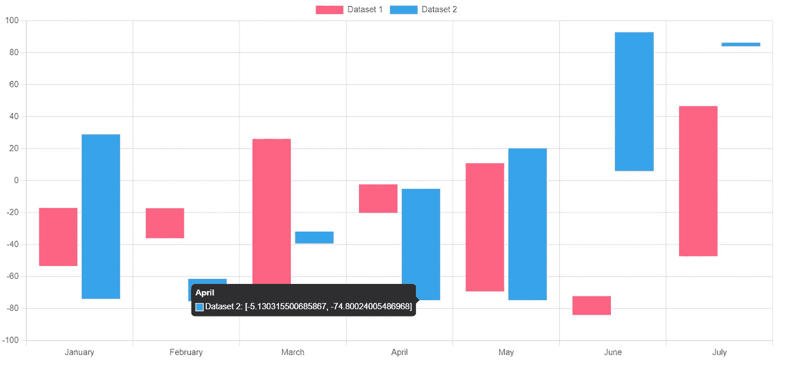
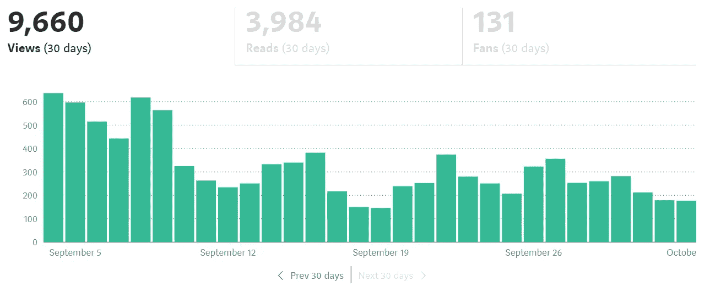
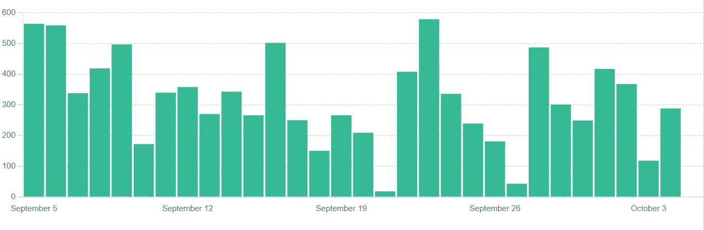
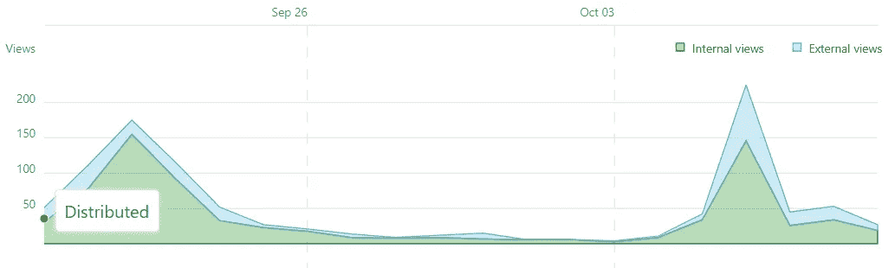
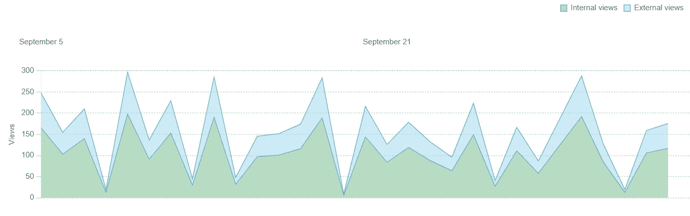
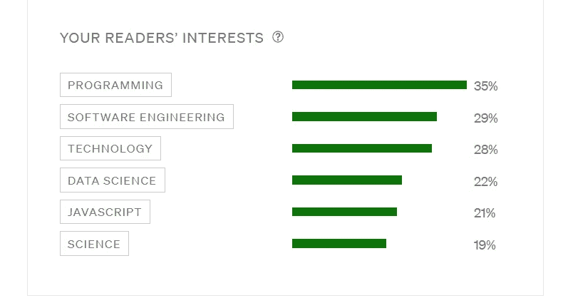
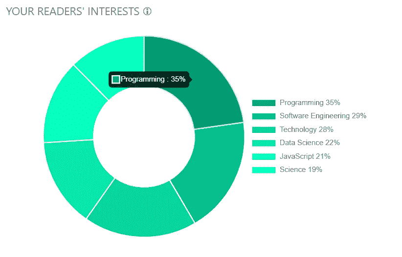

# 使用 Chart.js 为您的数据增添趣味

> 原文：<https://betterprogramming.pub/spice-up-your-data-with-chart-js-a3f5a2eac990>

## 让您的 web 应用程序中的数据脱颖而出

照片由[杰森·库德里特](https://unsplash.com/@jcoudriet?utm_source=medium&utm_medium=referral)在 [Unsplash](https://unsplash.com?utm_source=medium&utm_medium=referral) 上拍摄

用表格表示的数据已经成为过去。作为人类，我们的感知就是一切。它让我们了解和分析我们周围的事情。没有它，我们将迷失在黑暗的海洋中，不知道该走哪条路。

今天，从物流到人工智能，数据是所有公司成功的顶峰。如果不能通过图表等直观表示来分析我们的数据，公司将更难抓住看不见的机会。

在今天的文章中，我将与您分享如何在 React 中使用 Chart.js 来丰富您的数据。我们将定义什么是 Chart.js，如何实现条形图、折线图和圆环图，以及何时适合在应用程序中使用它们。

我们开始吧！

# 什么是 Chart.js？

Chart.js 是最流行的 JavaScript 库之一，它允许我们创建多功能图表来表示我们的数据。这个库为我们提供了各种图表类型，比如条形图、折线图、圆环图等等。更好的是，所有这些图表都可以根据您的应用程序主题进行定制，并且它们使用开箱即用的动画。

我在自己的应用程序中创建的许多图表，无论是个人的还是工作的，都使用了这个库。我需要的不仅仅是吸引人的外观，而是可以显示动态数据而不消耗性能，而这正是我们所需要的。

您可以在下面看到其中一个图表的示例。

Chart.js 浮动条形图

能够直观地分析您的数据是您的公司与众不同的地方。亚马逊和谷歌是掌握了分析艺术的公司的例子，并且能够很好地利用这个机会。

让我们看看 Chart.js 如何在我们的系统中发挥作用。

## 在应用程序中使用 Chart.js

既然我们已经在这里了，我想还有什么比向你们展示如何复制像 Medium 中的图表更好的方法呢？如果你作为一个作家熟悉这个平台，你知道有一个地方可以看到你所有发表文章的统计数据，就像下面这个一样。

中等统计条形图示例

通过复制其中的一些图表，这将使您更好地理解这个库是如何工作的，以及如何在您的应用程序中利用它。

让我们开始吧。

## 入门指南

为此，我们需要使用 CRA 创建一个新的 React 项目。

> `npx create-react-app charts`

完成之后，我们需要安装两个重要的依赖项:

*   chart.js
*   反应图 js-2

我们可以通过运行以下命令来实现:

> `npm install chart.js react-chartjs-2`

因为 Chart.js 是一个 JavaScript 库，所以我们用`react-chartjs-2`在 React 中实现它会更容易。这个额外的库允许我们将 Chart.js 元素作为 React 组件导入，这将使我们的代码更容易阅读和理解。

一旦完成，我们可以开始创建我们的第一个图表。

## 条形图

条形图是表示数据时最受欢迎的图表之一。当试图比较不同组之间的数据或跟踪一段时间内的量的变化时，条形图变得有用。

第一步是，嗯…生成一些数据。因为没有数据的图表是什么，我说的对吗？

为此，我们将简单地创建一个名为`ChartData.js`的新文件。多么有创意。在该文件中，我们应该包括以下内容:

ChartData.js

为此，我们将简单地为该图表的 31 天周期生成 31 个随机数据。很简单，对吧？让我们继续这个图表的核心部分。

因此，在我们的`App.js`文件中，我们需要添加以下内容:

App.js

我知道，这可能看起来有点混乱，但不要担心，我会为你分解。我们需要做的第一件事是从`react-chartjs-2`导入 React 条形图组件。这将允许我们包装 Chart.js 元素，并在我们的应用程序中显示它。

像许多图表组件一样，条形图包含一些重要的属性，可以在 Chart.js [文档](https://www.npmjs.com/package/react-chartjs-2)中找到。第一个将是`data`属性。这将我们的数据集传递给图表，因此它知道要显示什么。你可以看到我们在`initialData`对象中设置了它。我们的图表数据和标签都是使用我们在`ChartData.js`文件中定义的`generateData()`方法生成的。

我们图表中第二重要的属性是`options`属性。这允许我们操作图表的其他方面，如标题、标签、网格线，甚至动画。我不会详细介绍这些选项中的每一个是做什么的——因为有很多——所以我只在这里留下一个文档的链接。

最后，我们将条形厚度设置为 40，并用我们想要显示的颜色填充每个条形。

完成所有这些后，如果我们继续运行我们的应用程序，我们会得到如下所示的结果:

Chart.js 条形图示例

看起来和我上面展示的很相似，不是吗？

在这一点上，我鼓励你尝试一些设置，看看你能做些什么。你会注意到图表一开始就使用了动画，但是如果你愿意，你可以随时关闭它们。

这很简单，对吧？接下来，让我们看看如何使用折线图显示多个数据集。

## 折线图

像条形图一样，折线图在显示数据时也很常见。折线图让我们可以跟踪更短或更长时间内的变化。当我们的数据有较小的变化时，折线图实际上比条形图更好使用。

作为一个媒体作家，有一个部分你可以从内部和外部的角度来看你的故事。

中等折线图示例

如果我们看一下上面的图表，我们可以看到蓝色代表外部视图，而绿色代表内部视图。这张图表展示了多个数据集，以便我们的作者能够更好地理解我们的大多数观点来自哪里。

让我们看看如何创建一个如上图所示的折线图。

因为我们已经完成了大部分工作，所以为了在折线图中显示我们的数据，我们只需要做一些更改。

就像条形图一样，我们需要从`react-chartjs-2`库中导入折线图组件，如下所示:

接下来，我们需要修改我们的`App.js`文件的主体，如下所示:

请注意，我们不仅添加了一些属性，还添加了第二个数据集。这将允许我们分析外部和内部数据之间的差异。

现在，我们必须做的最大的改变之一是在我们的选项对象中。

看看我们是如何将`maxTicksLimit`从 5 改为 2 的。这允许我们在图表上显示 31 个标签中的 2 个，这也是原始图表显示它们的方式。我们还必须在 y 轴上添加一个标签，并处理图例，使其看起来有些相似。

完成所有这些更改后，运行我们的应用程序，我们会得到如下结果:

Chart.js 折线图示例

现在，它并不完全一样，因为这个库确实有一些限制。我在这个例子中也使用了随机数据，但是你已经明白了要点。

现在我们已经了解了基本的图表类型，让我们来看看我最喜欢的一种图表，圆环图。

## 圆环图

当我在应用程序中处理甜甜圈图表时，很难不感到有点饿。

圆环图通常用于显示分类数据。图表的每个部分显示特定类别的交易量。目前，据我所知，Medium 没有使用任何甜甜圈图，但我将向您展示我们如何从 Medium 中提取条形图，并将其修改为描绘更好画面的东西。

中型标签条形图示例

观察上面的图表，我们可以看到有 6 个不同的类别正在进行比较。这是在我们的甜甜圈图中使用的完美数据集。

像以前一样，我们需要确保从`react-chartjs-2`库中导入了甜甜圈图组件。

之后，我们应该继续更新我们的`App.js`文件的主体，如下所示:

这一次我决定对我们的数据进行硬编码，因为在这个例子中没有很多数据。每个切片用不同的颜色表示，我还创建了显示在右侧的自定义标签。这就是 Chart.js 带来的灵活性。

最后，我加入了一些选项来增加一些小的美感。

圆环图选项

> 您在上面看到的`callbacks`选项允许我们修改工具提示，每当我们将鼠标悬停在图表的某个部分时，工具提示就会显示出来。

所有这些完成后，我们看到了下面的图表。

Chart.js 圆环图示例

将上面的图表与 Medium 提供的图表进行比较，你可以看到我们是如何美化甚至是最基本的想法的。

# 结论

图表对任何公司的运营都至关重要。许多应用程序使用严重依赖这些可视化表示的仪表板。

我已经向您展示了将您的数据转换成更有吸引力的东西是多么容易。您已经看到了我们如何修改图表的任何方面，并真正使其适合任何应用程序。Chart.js 是完整的包，在可预见的未来，我看不到自己会使用任何其他库。

感谢您的阅读。