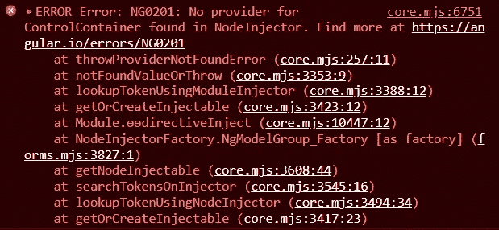
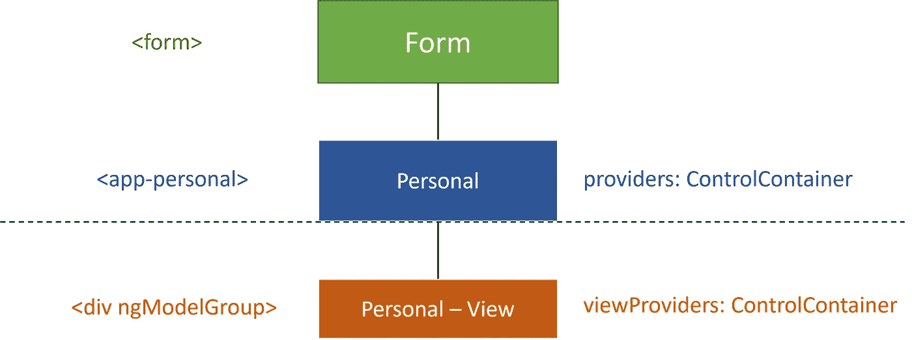

# 将角形嵌套形状拆分为子形状构件

> 原文：<https://betterprogramming.pub/split-angular-nested-forms-into-subform-components-dcf32d1fb10d>

## 如何将有角度的嵌套窗体变成更小的子窗体组件。


照片由 [DTatiana8](https://www.istockphoto.com/portfolio/DTatiana8) 拍摄

在我们的[上一篇文章](https://javascript.plainenglish.io/angular-custom-form-controls-nested-form-groups-made-easy-2ac09e91cf67)中，我们讨论了如何创建高度可重用和可移植的嵌套表单组。

尽管有时我们不得不处理更简单的情况，这并不证明实现像`[ControlValueAccessor](https://angular.io/api/forms/ControlValueAccessor)`和`[Validator](https://angular.io/api/forms/Validator)`这样的接口是正确的。

在这种情况下，我们可能希望遵循嵌套表单的子表单组件方式。在这种方法中，我们将大的表单分成更小的子表单，这些子表单在子组件中实现。

所以，没有进一步的到期，让我们开始吧！

# 利弊:何时使用

在我们深入研究实现细节之前，有必要提一下这种方法的主要优缺点，这样我们就知道会发生什么了。

主要的好处是我们得到了更小的子表单和更简单的实现。较小的代码片段更容易理解和维护。

主要的缺点是，我们只能将这些子表单与一个表单模块一起使用，这是实现中所选择的模块。所以，要么是模板驱动的表单，要么是反应式表单。不是两者都有。

长话短说，我们有意为了简单而牺牲可移植性。

# 模板驱动的表单

我们将从模板驱动的表单开始。

父组件通常包含两个子表单的所有代码。然而，根据这个解决方案，子表单是在单独的组件中实现的。因此，父组件具有以下模板:

```
<form>
  <app-personal></app-personal>
  <app-address></app-address>
</form>
```

我们将把注意力转向子表单组件之一，`personal`组件，它有以下模板:

```
<div ngModelGroup="personal" #personal="ngModelGroup">
  <p class="display-6">Personal Information</p>
  <app-required-field name="first" ngModel placeholder="First name">
  </app-required-field>
  <app-required-field name="last" ngModel placeholder="Last name">
  </app-required-field>
  <app-required-select
    placeholder="Select gender..."
    [options]="genderOptions"
    name="gender"
    ngModel
  ></app-required-select>
  <ng-container *ngIf="personal?.value?.gender === 'Other'">
    <app-required-field name="genderOther" ngModel placeholder="Specify">
    </app-required-field>
  </ng-container>
</div>h
```

*如果您想知道如何在我们的一个组件上直接使用* `*ngModel*` *，这在我们的* [*上一篇文章*](https://javascript.plainenglish.io/angular-custom-form-controls-nested-form-groups-made-easy-2ac09e91cf67) *中有很好的解释。*

有人可能会认为`NgModelGroup`会和顶级的`NgForm`合作。但事实并非如此。相反，我们将在控制台中得到一个“没有 ControlContainer 的提供者”错误。



这个问题的解决方法很简单。这是组件的类文件中的一行代码。不幸的是，解释没有修复本身那么简短。

```
@Component({
  selector: 'app-personal',
  templateUrl: './personal.component.html',
  styleUrls: ['./personal.component.scss'],
  viewProviders: [{ provide: ControlContainer, useExisting: NgForm }]
})
export class PersonalComponent implements OnInit {
  // ...
}
```

为什么我们需要在`viewProviders`中提供`ControlContainer`？

`[ControlContainer](https://angular.io/api/forms/ControlContainer)`类是`NgForm`、`NgModelGroup`、`NgFormGroupDirective`、`FormGroupName`和`FormArrayName`的超类。

作为一个指令，`NgModelGroup`将在树中查找它的父表单。其父级可能是:

*   另一个组，因为我们的表单可能有一个非常深的嵌套结构，一个组在另一个组中，等等
*   实际的父表单，就像我们的简单例子中只有一个嵌套层次

不管是哪种情况，它最终都必须解析为父表单，因为父表单完成了大部分繁重的工作。

在我们的例子中，我们有一个`NgModelGroup`找不到它需要的`NgForm`。但是在它的正上方有一个`NgForm`！为什么它找不到？

让我们来看看`NgModelGroup`的构造函数(原始源代码可以在[这里找到](https://github.com/angular/angular/blob/main/packages/forms/src/directives/ng_model_group.ts)):

```
export class NgModelGroup extends AbstractFormGroupDirective implements OnInit, OnDestroy {
  constructor(
    @Host() @SkipSelf() parent: ControlContainer,
    @Optional() @Self() @Inject(NG_VALIDATORS) validators: (Validator|ValidatorFn)[],
    @Optional() @Self() @Inject(NG_ASYNC_VALIDATORS) asyncValidators: (AsyncValidator|AsyncValidatorFn)[]) {
    super();
    // ...
  }
}
```

注入的`ControlContainer`实例有一个`@Host()`装饰器。`@Host()`装饰器限制`NgModelGroup`从其视图上方查看其`ControlContainer`依赖关系。所以它建立了某种界限。

这意味着，默认情况下，`NgModelGroup`只允许在当前组件视图中查找树。但是在我们的方法中，父表单和`NgModelGroup`不在同一个组件中。`NgModelGroup`在一个单独的子组件中！

之所以有这样的限制，是因为急于跨组件边界注册可能会有风险。例如，第三方组件将能够达到所有的方式，并注册到任何东西，导致意想不到的副作用。

因此，这个一行程序让我们绕过注册限制，提供缺失的`ControlContainer`，并使用依赖注入链中现有的`NgForm`。

```
viewProviders: [{ provide: ControlContainer, useExisting: NgForm }]
```

## **为什么我们用** `**viewProviders**` **代替** `**providers**` **？**

他们说一幅画胜过千言万语。因此，图表会使解释更容易理解。



虚线是由`@Host()`装饰器创建的边界。`ControlContainer`可以提供两种不同的电平。

如果我们使用`providers`提供`ControlContainer`，那么`NgModelGroup`仍然无法到达并看到它。相反，我们需要使用`viewProviders`在下面的级别提供它。

我们的长篇大论到此结束。但是，如果你需要使用它，解决方案只是一行代码。

你可以在下面的 StackBlitz 找到一个工作演示。你可能也想[订阅我的时事通讯](https://vkagklis.medium.com/subscribe)来关注更多类似的内容！

# 反应形式

同样的事情也适用于反应形式。嗯，差不多！

对于反应式表单，父组件的模板如下:

```
<form [formGroup]="form">
   <app-personal></app-personal>
   <app-address></app-address>
</form>
```

我们还必须在父组件类中实例化表单组。代码如下:

```
@Component({
  selector: 'app-parent-form',
  templateUrl: './parent-form.component.html',
  styleUrls: ['./parent-form.component.scss']
})
export class ParentFormComponent implements OnInit {
  public form: FormGroup = new FormGroup({});
  // ...
}
```

并且`personal`组件具有以下模板:

```
<div formGroupName="personal">
  <p>Personal Information</p>
  <app-required-field formControlName="first" placeholder="First name">
  </app-required-field>
  <app-required-field formControlName="last" placeholder="Last name">
  </app-required-field>
  <app-required-select
    formControlName="gender"
    placeholder="Select gender..."
    [options]="genderOptions"
  ></app-required-select>
  <ng-container *ngIf="parentForm.get('personal')?.get('gender')?.value === 'Other'">
    <app-required-field formControlName="genderOther" placeholder="Specify">
    </app-required-field>
  </ng-container>
</div>
```

我们必须再次提供缺失的`ControlContainer`，除了因为我们使用了反应式表单，我们需要使用依赖注入链中现有的`FormGroupDirective`。

```
@Component({
  selector: 'app-personal',
  templateUrl: './personal.component.html',
  styleUrls: ['./personal.component.scss'],
  viewProviders: [{ provide: ControlContainer, useExisting: FormGroupDirective }]
})
export class PersonalComponent implements OnInit {
  // ...
}
```

我们还没完呢！

反应式表单注册指令，其工作是获取我们已经创建的现有表单组和表单控件，并将它们与 DOM 匹配。

在我们的例子中，我们没有在父表单中定义表单控件。

```
public form: FormGroup = new FormGroup({});
```

没问题！我们可以在`PersonalComponent`中这样做。我们可以注入`FormGroupDirective`并在那里添加表单控件。

```
export class PersonalComponent implements OnInit, OnDestroy {
  parentForm!: FormGroup;
  constructor(
    private parent: FormGroupDirective,
    private fb: FormBuilder,
 ) { }

  ngOnInit(): void {
    this.parentForm = this.parent.form;
    this.parentForm.addControl(
      'personal',
      this.fb.group({
        first: ['', Validators.required],
        last: ['', Validators.required],
        gender: ['', Validators.required],
        genderOther: ['', Validators.required]
      })
    );
    // ...
  }
}
```

好了，现在我们完成了！😄

你可以在下面的 StackBlitz 找到一个工作演示。

# 结论

在本文中，我们研究了嵌套表单的不同方式。我们讨论了它的主要优点和缺点，以及何时使用它。最后，我们演示并解释了两种表单模块的方法，即模板驱动表单和反应式表单。

你可以在 AngularConnect 2017 的 [Kara Erickson](https://twitter.com/karaforthewin?lang=en) 精彩的[演讲](https://www.youtube.com/watch?v=CD_t3m2WMM8)中了解更多关于角形的知识。

感谢阅读！我希望你喜欢这篇文章，并且你学到了一些新的东西。

编码快乐！

***供进一步阅读:***

[](https://javascript.plainenglish.io/angular-zone-js-3b5e2347b7) [## 关于 Angular 你应该知道的 10 件事

### Zone.js 是什么？如何有角度地使用它？本问答指南将回答这些问题以及更多问题。

javascript.plainenglish.io](https://javascript.plainenglish.io/angular-zone-js-3b5e2347b7) [](https://javascript.plainenglish.io/angular-component-communication-81e5e02c6cbe) [## 角分量通信:6 种方式可供选择

### 了解 Angular 中数据共享和组件通信的 6 种不同方式。

javascript.plainenglish.io](https://javascript.plainenglish.io/angular-component-communication-81e5e02c6cbe) [](https://javascript.plainenglish.io/creating-reusable-configurable-angular-components-b7fcba2f5f38) [## 创建可重复使用和可配置的角度组件

### 使用 NgTemplateOutlet 和 NgComponentOutlet 指令创建可重复使用的角度组件。

javascript.plainenglish.io](https://javascript.plainenglish.io/creating-reusable-configurable-angular-components-b7fcba2f5f38)