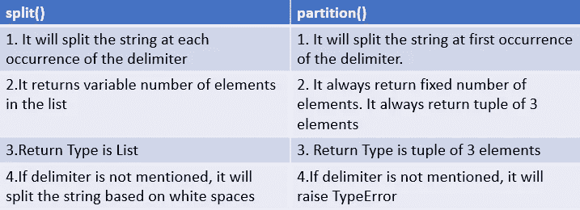

# Python 字符串中的 split()与 partition()

> 原文：<https://betterprogramming.pub/split-vs-partition-in-python-strings-9505d070af55>

## 有什么区别？


[格兰特·里奇](https://unsplash.com/@grantritchie?utm_source=unsplash&utm_medium=referral&utm_content=creditCopyText)在 [Unsplash](https://unsplash.com/s/photos/split?utm_source=unsplash&utm_medium=referral&utm_content=creditCopyText) 拍摄的照片

# 拆分()与分区()

在 Python 中，我们可以通过使用以下方法来拆分字符串。我们来详细看看这些方法。

```
1\. [split()](#8967)
2\. [rsplit()](#8887)
3\. [splitlines()](#54af)
4\. [partition()](#04ba)
5\. [rpartition()](#7482)
6\. [re.split()](#7d17)
7\. [Differences between split() and partition()](#8c4f)
8\. [Conclusion](#c345)
9\. [Resources](#223c)
```

# **split()**

> "返回字符串中的单词列表，使用 *sep* 作为分隔符字符串。如果给定了 *maxsplit* ，则最多完成 *maxsplit* 个拆分(因此，列表最多有`maxsplit+1`个元素)。如果没有指定 *maxsplit* 或者`-1`，那么对拆分的次数没有限制(进行所有可能的拆分)。”
> 
> — [Python 文档](https://docs.python.org/3/library/stdtypes.html#str.split)

`str.split(sep=None,maxsplit=-1)`

返回类型→列表

## **例 1:如果没有提到** `**sep**` **(分隔符)，它将根据字符串**中的空格分割字符串

```
a=**"Hello Python"** print (a.split())
*#Output:['Hello', 'Python']*
```

## **例 2:如果提到 sep(分隔符),它将根据分隔符**的出现次数进行拆分

```
colors=**'red-green-blue-yellow'** print (colors.split(**"-"**))
*#Output:['red', 'green', 'blue', 'yellow']*
```

## **例 3**

```
a=**"three times by three makes nine"** print (a.split(sep=**"three"**))
*#Output:['', ' times by ', ' makes nine']*
```

## **示例 4:提到了最大分割**

如果`maxsplit`被称为`1`，它只会在第一次出现时分裂。
如果`maxsplit`给定为`2`，它将只在前两次出现时分裂。

```
colors=**"red-orange-yellow-purple"** print (colors.split(**"-"**,maxsplit=1))
*#Output:['red', 'orange-yellow-purple']* print (colors.split(**"-"**,maxsplit=2))
*#Output:['red', 'orange', 'yellow-purple']*
```

## **例 5:如果 sep(分隔符)不在字符串中，它不会分割字符串——它会返回一个包含字符串本身的列表**

```
s=**"HelloPython"** print (s.split())
*#Output:['HelloPython']*
```

## **示例 6:sep(分隔符)也可以包含多个字符——它们被组合在一起**

```
colors=**"red<>green<>yellow<>blue<orange"** print(colors.split(**"<>"**))
*#Output:['red', 'green', 'yellow', 'blue<orange']*
```

# **rsplit()**

> "返回字符串中的单词列表，使用 *sep* 作为分隔符字符串。如果*最大分割*给定，最多*最大分割*分割，最右边的*最大分割*分割。如果没有指定 *sep* 或者`None`，任何空白字符串都是分隔符。除了从右边拆分，rsplit()的行为类似于 split()，"
> 
> — [Python 文档](https://docs.python.org/3/library/stdtypes.html#str.rsplit)

`str.rsplit(sep=None,maxsplit=-1)`

返回类型→列表

## **示例 1:如果没有提到 sep(分隔符),它将根据字符串中的空格分割字符串——仅与 split()相同**

```
a=**"Hello Python"** print (a.rsplit())
*#Output:['Hello', 'Python']*
```

## **示例 2:如果 maxsplit 被指定为 1，它将在从右边第一次出现时进行拆分；如果 maxsplit 给定为 2，它将在从右边开始的前两次出现时进行分割**

```
colors=**"red-orange-yellow-purple"** print (colors.rsplit(**"-"**,maxsplit=1))
*#Output:['red-orange-yellow', 'purple']* print (colors.rsplit(**"-"**,maxsplit=2))
*#Output:['red-orange', 'yellow', 'purple']*
```

# 分割线()

> "返回字符串中的行列表，在行边界处断开。除非 *keepends* 给定并且为真，否则换行符不包含在结果列表中。
> 
> — [Python 文档](https://docs.python.org/3/library/stdtypes.html#str.splitlines)

`str.**splitlines**([*keepends*])`

## **示例 1:根据换行符拆分字符串**

```
colors=**"red\norange\nyellow\npurple"** print (colors.splitlines())
*#Output:['red', 'orange', 'yellow', 'purple']*
```

## **示例 2:通过提及 keepends=True 来包含换行符**

```
colors=**"red\norange\nyellow\npurple"** print (colors.splitlines(keepends=**True**))
*#Output:['red\n', 'orange\n', 'yellow\n', 'purple']*
```

## **示例 3: split()与 splitlines()**

```
colors=**"red\norange\nyellow\npurple\n"** print (colors.splitlines())
*#Output:['red', 'orange', 'yellow', 'purple']* print(colors.split(**"\n"**))
*#Output:['red', 'orange', 'yellow', 'purple', '']*
```

# **分区()**

> 在第一次出现 *sep* 时拆分字符串，并返回一个包含分隔符之前的部分、分隔符本身和分隔符之后的部分的三元组。如果没有找到分隔符，则返回一个包含字符串本身的三元组，后跟两个空字符串。
> 
> — [Python 文档](https://docs.python.org/3/library/stdtypes.html#str.partition)

`str.partition(sep)`

返回类型→元组

## **示例 1:在 sep(分隔符)**第一次出现时拆分字符串

```
**colors="red-orange-yellow-purple"
print (colors.partition("-"))
*#Output:('red', '-', 'orange-yellow-purple')***
```

## **例 sep 作为空格给出**

```
s=**"Hello Python"** print (s.partition(**" "**))
*#Output:('Hello', ' ', 'Python')*
```

## 例 3:如果没有提到 sep，它将引发一个类型错误

```
s=**"Hello Python"** print (s.partition())
*#Output:TypeError: partition() takes exactly one argument (0 given)*
```

## **示例 4:如果在字符串中没有找到 sep，**它将返回一个包含字符串本身的三元组，后跟两个空字符串

```
s=**"HelloPython"** print (s.partition(**" "**))
*#Output:('HelloPython', '', '')*
```

# **rpartition()**

> 在最后一次出现的 *sep* 处分割字符串，并返回一个包含分隔符前部分、分隔符本身和分隔符后部分的三元组。如果没有找到分隔符，则返回一个包含两个空字符串的三元组，后跟字符串本身。
> 
> — [Python 文档](https://docs.python.org/3/library/stdtypes.html#str.rpartition)

`str.rpartition(sep)`

## **示例 1:在 sep(分隔符)**的最后一个位置拆分字符串

```
colors=**"red-orange-yellow-purple"** print (colors.rpartition(**"-"**))
*#Output:('red-orange-yellow', '-', 'purple')*
```

## **例 2:如果在字符串中没有找到 sep，** **一个三元组将**返回包含两个空字符串的**，后跟字符串本身**

```
s=**"HelloPython"** print (s.rpartition(**" "**))
*#Output:('', '', 'HelloPython')*
```

## **例 3:如果没有提到 sep，它将引发一个类型错误**

```
s=**"Hello Python"** print (s.rpartition())
*#Output:TypeError: rpartition() takes exactly one argument (0 given)*
```

# **re.split()**

> 通过*模式*的出现次数分割*字符串*。如果在*模式*中使用了捕捉括号，那么模式中所有组的文本也将作为结果列表的一部分返回。如果 *maxsplit* 不为零，最多 *maxsplit* 个拆分发生，字符串的剩余部分作为列表的最后一个元素返回。
> 
> — [Python 文档](https://docs.python.org/3.8/library/re.html#re.split)

`re.**split**(*pattern*, *string*, *maxsplit=0*, *flags=0*)`

返回类型→列表

## **示例 1:通过给定一个空格作为分隔符来拆分字符串**

```
s=**"Hello Python"
import** re
print (re.split(**" "**,s))
*#Output:['Hello', 'Python']*
```

## **示例 2:用单个分隔符分割字符串**

```
colors=**"red-orange-yellow-purple"
import** re
print (re.split(**"-"**,colors))
*#Output:['red', 'orange', 'yellow', 'purple']*
```

## **示例 3:使用 re.split 拆分带有多个分隔符的字符串**

`re.split(‘[&$-]’,colors`

`[&$-]` → `[]`用来表示一组字符。方括号中给出了多个分隔符。`re.split()`如果发现任何提到的分隔符，将会分割字符串。

```
colors=**"red&orange-yellow$purple"
import** re
print (re.split(**'[&$-]'**,colors))
*#Output:['red', 'orange', 'yellow', 'purple']*
```

## **示例 4:在出现除字母数字(a-z，A-Z，0–9)和下划线以外的任何字符时拆分字符串**

`re.split(‘\W’,colors)`

`\W` →匹配除 a-z、A-Z 和 0-9 以外的所有字符

```
colors=**"red%yellow,blue!orange@purple"
import** re
print (re.split(**'\W'**,colors))
*#Output:['red', 'yellow', 'blue', 'orange', 'purple']*
```

## **示例 5:在出现除数字之外的任何字符时分割字符串**

`re.split(‘\D’,num)`

`\D` →匹配除 0-9 以外的所有字符

```
num=**"1,2%3&4!5@6"
import** re
print (re.split(**'\D'**,num))
*#Output:['1', '2', '3', '4', '5', '6']*
```

## **例 6:给定一个最大分裂**

如果一个`maxsplit`被称为`1`，它将只在第一次出现时分裂。如果一个`maxsplit`被给定为`2`，它将只在前两次出现时分裂。

```
colors=**"red-orange-yellow-purple"
import** re
print (re.split(**"-"**,colors,maxsplit=1))
*#Output:['red', 'orange-yellow-purple']* print (re.split(**"-"**,colors,maxsplit=2))
*#Output:['red', 'orange', 'yellow-purple']*
```

# split()和 partition()之间的区别



图片来源:作者

# 结论

*   `str.split()` →它会根据分隔符(sep)的每次出现来拆分字符串
*   `str.partition()` →它将在分隔符(sep)第一次出现时拆分字符串
*   `str.rpartition()` →它将在分隔符(sep)的最后一次出现处
    拆分字符串
*   它将根据模式的出现来拆分字符串。可以使用多个分隔符来拆分字符串。

# 我的其他博客与字符串方法有关

[](https://levelup.gitconnected.com/remove-whitespaces-from-strings-in-python-c5ee612ee9dc) [## 在 Python 中移除字符串中的空格

### 在 Python 中使用字符串方法和正则表达式

levelup.gitconnected.com](https://levelup.gitconnected.com/remove-whitespaces-from-strings-in-python-c5ee612ee9dc) [](https://blog.devgenius.io/different-ways-to-replace-occurences-of-a-substring-in-python-strings-2911b1f7bf86) [## 在 Python 字符串中替换子字符串的不同方法

### 在 python 中使用字符串方法和正则表达式

blog.devgenius.io](https://blog.devgenius.io/different-ways-to-replace-occurences-of-a-substring-in-python-strings-2911b1f7bf86) [](/5-ways-to-find-the-index-of-a-substring-in-python-13d5293fc76d) [## 在 Python 中查找子串索引的 5 种方法

### 在 Python 中使用字符串方法和正则表达式

better 编程. pub](/5-ways-to-find-the-index-of-a-substring-in-python-13d5293fc76d) [](/5-different-ways-to-remove-specific-characters-from-a-string-in-python-b0e081839ab9) [## 在 Python 中从字符串中删除特定字符的 5 种不同方法

### 使用字符串方法、过滤器和正则表达式

better 编程. pub](/5-different-ways-to-remove-specific-characters-from-a-string-in-python-b0e081839ab9) 

# 资源(Python 文档)

*   `[str.split](https://docs.python.org/3/library/stdtypes.html#str.split)`
*   `[str.rsplit](https://docs.python.org/3/library/stdtypes.html#str.rsplit)`
*   `[str.splitlines](https://docs.python.org/3/library/stdtypes.html#str.splitlines)`
*   `[str.rpartition](https://docs.python.org/3/library/stdtypes.html#str.rpartition)`
*   `[re.split](https://docs.python.org/3.8/library/re.html#re.split)`

*关注此空间，获取更多关于 Python 和数据科学的文章。如果你喜欢看我的更多教程，就关注我的* [***中***](https://medium.com/@IndhumathyChelliah)[***LinkedIn***](https://www.linkedin.com/in/indhumathy-chelliah/)*[***推特******。***](https://twitter.com/IndhuChelliah)*

**点击这里成为中等会员:*[*https://indhumathychelliah.medium.com/membership*](https://indhumathychelliah.medium.com/membership)*