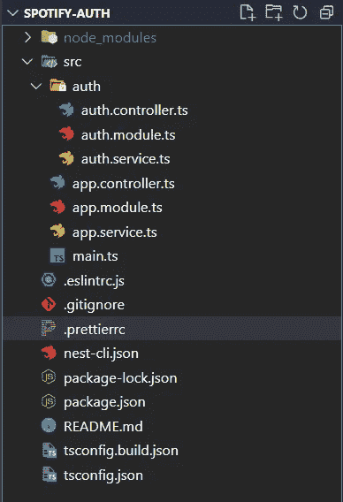
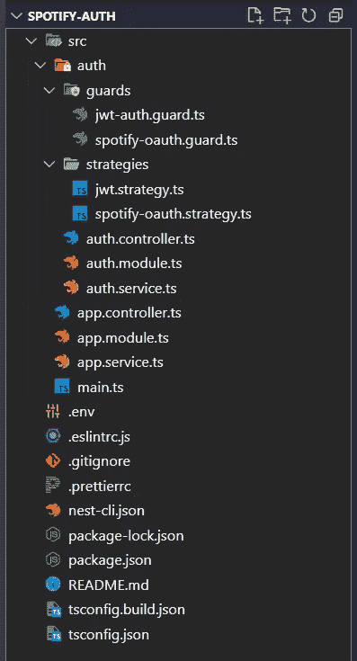

# NestJS 应用程序中的 Spotify OAuth2 身份验证

> 原文：<https://betterprogramming.pub/spotify-oauth2-authentication-in-a-nestjs-application-307b25b2e49e>

## 将 Spotify Web API 的 OAuth2 授权代码流策略集成到具有 TypeScript 和 NestJS 后端应用程序的 NodeJS 中


亚历山大·沙托夫在 [Unsplash](https://unsplash.com?utm_source=medium&utm_medium=referral) 上拍摄的照片

构建 API 时，应用程序最重要的部分之一是用户的安全性和身份验证。大多数框架都提供了一些关于如何实现不同身份验证策略的指南。例如，NestJS 在其[官方文件](https://docs.nestjs.com/security/authentication)中提出了 JWT 战略。

然而，一种广泛传播的身份验证策略是 OAuth2 方法，通常用于第三方服务，如脸书、谷歌和 Spotify 帐户，它提供了一种使用这些服务中的现有帐户来验证用户身份的方法，甚至可以代表经过验证的用户与这些服务进行交互。

由于没有将这种类型的身份验证与 NestJS 集成的官方文档，并且开发文章通常专注于 Google 和脸书的集成，本文提出了一种替代方案，使用 [Passport](https://github.com/jaredhanson/passport) 身份验证中间件和 [passport-spotify](https://github.com/JMPerez/passport-spotify) 策略将 [Spotify 授权代码流](https://developer.spotify.com/documentation/general/guides/authorization/code-flow/)与 [NestJS](https://nestjs.com/) 集成。

# 要求

本文重点介绍将 OAuth2 策略用于 Spotify 并与 NestJS 应用程序集成的过程，因此，在本文描述的过程之前，需要满足以下要求:

*   一个 NestJS 应用程序以其基本结构启动。对于这部分，遵循 [NestJS 文档](https://docs.nestjs.com/first-steps#setup)中的快速设置指南就足够了；
*   一个可以访问 Spotify 开发者仪表盘的 Spotify 帐户，以及一个使用其`CLIENT ID`和`CLIENT SECRET`凭据注册的应用程序。遵循关于如何使用 Spotify API 的循序渐进的官方文档[对本文来说就足够了。](https://developer.spotify.com/documentation/web-api/quick-start/)

如果你不熟悉 OAuth2 授权代码流程，请查看 Spotify Web API 文档提供的[指南。](https://developer.spotify.com/documentation/general/guides/authorization/code-flow/)

# 授权文件夹

准备好 NestJS 应用程序后，必须使用以下命令创建一个`auth` 资源——考虑到机器中已经安装了 [Nest CLI](https://docs.nestjs.com/cli/overview) :

```
nest g mo auth
nest g s auth --no-spec
nest g co auth --no-spec
```

这些命令创建一个`auth` 文件夹，其中包含基本模块、服务和控制器文件，但不包含任何文件。规格文件。一切就绪后，文件夹结构应该如下所示:



现在，必须安装以下依赖项:

```
npm install @nestjs/passport @nestjs/jwt passport passport-jwt passport-spotifynpm install -D @types/passport-jwt @types/passport-spotify
```

从现在开始，在身份验证方面，有 3 个功能必须在应用程序中可用:

1.  使用 Spotify OAuth2 授权代码流的用户登录；
2.  从 Spotify 检索用户信息并生成 JWT；
3.  使用 JWT 策略，这样就不需要每次在会话期间需要用户验证时都连接 Spotify OAuth2 服务器。

# 路线

对于之前描述的第一和第二功能，需要有一个带有路线`/login`和`/redirect`的控制器:

上述代码包含以下内容:

*   两条路线`/login`和`/redirect`都由`SpotifyOauthGuard` [自定义守卫](https://docs.nestjs.com/guards)守卫，该守卫执行稍后将描述的`passport-spotify`策略；
*   `login` 方法/路由是用户将访问以启动身份验证的端点；
*   `spotifyAuthRedirect`方法('/redirect' route)是用户成功登录后 Spotify OAuth2 服务将被重定向到的 URL
*   `spotifyAuthRedirect`方法:检索来自位于`req.user`属性的 Spotify 的用户信息——如果没有信息，意味着认证没有执行或失败，该方法将请求再次重定向到登录路由——将`user` req 属性设置为未定义(因为它将被进一步定义为 JWT 有效载荷),用它生成 JWT，并返回用户信息和 Spotify 令牌，应用程序可以使用这些信息和令牌根据定义的范围使用用户信息访问 Spotify Web API 中的路由。

# Spotify OAuth2 战略

当使用内置的 passport 策略时，必须创建一个自定义防护及其相应的策略。`SpotifyOauthGuard`只是一个扩展了`AuthGuard` 类的类，所以，在创建了/guards 文件夹后，在里面的`SpotifyOauthGuard`应该是这样的:

此外，命名的`spotify`策略必须在/strategies 文件夹中创建:

上面的代码负责连接 Spotify OAuth2 服务，并管理应用程序的重定向。流程是:

*   `SpotifyOauthStrategy`类使用 [passport-spotify](https://github.com/JMPerez/passport-spotify) lib 提供的策略扩展了`PassportStrategy`，并将其命名为‘Spotify ’,以便`SpotifyOauthGuard`能够识别它；
*   构造器方法使用`super` 方法调用 [passport-spotify](https://github.com/JMPerez/passport-spotify) `Strategy` 构造器方法，传递 spotify 应用凭证`CLIENT_ID`和`CLIENT_SECRET`(保存在。env vars，因为它们不得公开暴露)，[这里更好地描述](https://developer.spotify.com/documentation/web-api/quick-start/)，回调 URL，它与 auth.controller.ts 中定义的路由相同，'/redirect '，以及应用程序与用户信息交互所需的范围；
*   `super`方法还有一个回调函数，一旦用户的登录过程成功，在它被重定向到应用程序之前，这个函数就会被调用。该函数向将对“/redirect”路由做出的请求添加以下属性:user(包含用户的配置文件信息)和 authInfo(包含`refreshToken`、`accessToken`和`expires_in`信息)。

# 重定向和 JWT 一代

一旦实现了该策略，用户将被重定向到“/redirect”URL，并且在`auth.controller.ts`(前面已经介绍过)中，`spotifyAuthRedirect`方法将拦截 req 对象，提取`user`和`authInfo`属性，并将`user`传递给`authService`。利用用户的信息，`AuthService` 类中的`login`方法负责生成 JWT。auth.service.ts 应如下所示:

最后，在`auth.service.ts`中，`/redirect`路由返回一个包含`authInfo`和用户属性的对象，以及一个与 JWT 连接的设置为“承载”的报头认证。

# JWT 战略

这部分认证基本上如[官方 NestJS 文档](https://docs.nestjs.com/security/authentication#jwt-functionality)中所述。对于这一部分，需要在您的`.env`变量中定义一个`JWT_SECRET`，它是一个字符串，用于生成和加密/解密应用程序生成的 JWT，不得公开暴露。类似于 Spotify 的策略，有必要创建一个`JwtAuthGuard`类来扩展内置的 passport AuthGuard 和一个相应的名为“jwt”的类。在`/guards`文件夹中，创建如下`jwt-auth.guard.ts`文件:

/strategies 文件夹中相应的策略应该如下所示:

上面的代码是在用`JwtAuthGuard`修饰一条路线时执行的。`super()`方法提取由对受保护路由的请求提供的 JWT，用提供的`JWT_SECRET`解密它，并将一个`user`属性插入到 req 对象中，该对象包含先前插入到 JWT 有效负载中的信息。

需要强调的是，插入的`user`属性不同于`spotify-strategy`插入到`req`对象中的属性，这就是为什么在`spotifyAuthRedirect`方法中，在使用 jwt 策略登录之前`req.user`属性被设置为未定义的原因。

现在，任何认证路由都可以用`JwtAuthGuard`来修饰，如下所示:

# 授权模块和应用模块配置

一切就绪后，就该配置所有模块的实例化了。`AuthModule`类应该是这样的:

`auth.module.ts`文件定义了 auth 资源的所有提供者，并在`JwtModule`的实例化过程中注册了`JWT_SECRET`及其到期时间，这里定义为 3600 秒(1 小时)。

此外，AppModule 应该类似于:

`app.module.ts`实例化应用程序的所有模块，包括`ConfigModule`，这是使用流程中描述的所有 env 变量所必需的。

应用程序的文件夹和文件的最终状态应该如下所示:



# 结论

OAuth2 是一种将应用程序与外部应用程序(如广泛的社交媒体服务)集成的有趣方式，它利用一种简单的方式来登录用户，并向用户提供与这些应用程序相关的功能。

尽管 NestJS 没有提供进行这种集成的官方方法，但是有许多开源项目旨在简化这种认证方法，比如本文中描述和使用的方法。