# Spring Boot 缓存从零开始

> 原文：<https://betterprogramming.pub/spring-boot-caching-from-scratch-aaaf9717f407>

## 使用 EhCache 进行缓存的亲身体验

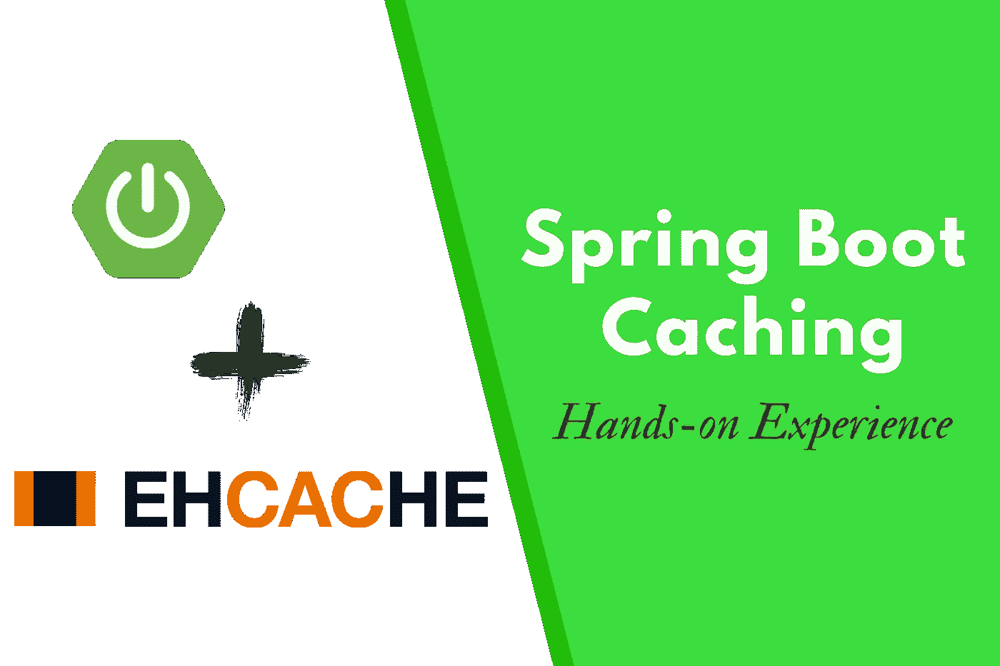

由作者设计

今天，我将向大家介绍一种提高应用程序性能的最佳方法。我见过这么多的应用程序，但大多数时候，他们没有优化。

作为开发人员，我们希望我们的应用程序提供出色的用户体验，因此我们需要采用各种技术来优化它们的速度和性能。

所以今天的文章是关于将你的应用程序提升到一个新的水平。让我们从基础开始。

# 1.什么是缓存？

缓存基本上就是临时存储数据以备将来参考。

以便将来对该数据的请求能够比通过访问数据的主存储位置更快地得到满足。这就尽可能地减少了数据库命中的次数。

缓存允许您有效地重用以前检索或计算的数据。

# 2.缓存的优势

我们已经讨论了缓存的主要好处。这可以总结如下。

*   **提高应用性能** —从内存缓存中读取数据速度极快。
*   **改善体验质量** —缓存可以显著改善内容提供商向消费者提供的体验质量(QoE)。
*   **降低数据库命中率和成本** —单个缓存实例可以提供数十万次 IOPS(每秒输入/输出操作)，有可能取代大量数据库实例。
*   **降低网络成本** —内容可以缓存在客户端和源之间网络路径的不同点上。当内容缓存在离客户端更近的地方时，请求将需要较低的网络活动。
*   **云托管中的成本效益** —如果您在基于云的平台(如 AWS)中部署应用程序，如果主数据库按吞吐量收费，您可以大幅降低成本。

# 3.缓存中的一般用例

缓存系统的主要实际用途是将其应用到企业应用程序中。除此之外，缓存还有很多流行的用例。这里有一些例子。

*   **内容交付网络**(CDN)——希望大家熟悉 bootstrap CDN 的。它通过在一组全球分布的缓存服务器上复制经常请求的文件，实际上改进了内容的交付。这就是 CDN 越来越受欢迎的原因。
*   **游戏** —我们都喜欢玩在线多人游戏。我们经常查看排行榜和玩家档案。所以有了数百万的游戏玩家，快速更新&获取这样的数据变得极其重要。缓存也用于这个用例。
*   **RDBMS 加速:**当处理数百万行时，关系数据库变得非常慢。大量数据会降低数据库索引的速度。在这种情况下，可能许多“选择”查询或读取查询可以在外部缓存，至少在某个小时间窗口内。

缓存可以实现到任何后端解决方案，如 node.js、.net、Django 等。我会选择 Spring Boot，因为这是我个人的最爱。

# 4.Spring Boot 缓存机制是如何工作的？

在 Spring 中，**缓存抽象**是一种机制，允许在对代码影响最小的情况下一致地使用各种缓存方法。我们可以将业务代码和缓存实现分开。

这种机制适用于 Java 方法。实际上，它用于昂贵的方法，如 CPU 或 IO 绑定。但是它可以通过缓存提供者进行高度定制。

每次当一个方法调用时，抽象都会对该方法应用一个缓存行为。它检查该方法是否已经为给定的参数执行过。

*   如果是，则返回缓存的结果，而不执行实际的方法。
*   如果没有，首先执行方法，然后缓存结果并返回给用户。

这里你看到了一个词，“缓存提供者”。我知道你对此很好奇。

Springs 缓存服务是一个抽象，而不是一个实现。因此，有必要使用缓存提供者或缓存实现来进行缓存。

在官方的 spring boot 文档中，它明确指定了 spring 支持的缓存提供者列表。

1.  一般的
2.  JCache (JSR-107) (EhCache 3、Hazelcast、Infinispan 等)
3.  EhCache 2.x
4.  黑泽尔卡斯特
5.  无限跨度
6.  沙发底座
7.  雷迪斯
8.  咖啡因

如果这些选项都不可行，那么就配置一个使用`ConcurrentHashMap`作为缓存存储的简单实现。如果 spring boot 应用程序中没有缓存库，这是默认设置。你可以从这里找到更多关于这些缓存的信息。

 [## 33.贮藏

### Spring 框架支持透明地向应用程序添加缓存。在其核心，抽象…

docs.spring.io](https://docs.spring.io/spring-boot/docs/2.1.6.RELEASE/reference/html/boot-features-caching.html#boot-features-caching-provider-simple) 

其中， **JCache** 是一个事实上的标准 Java 缓存 API，用于缓存数据。它是一个规范，但不是一个实现。它的目的是为不同的技术创造一种方法来提供一个公共的缓存接口。这个通用接口使得软件开发人员能够更容易地利用各种技术，因为它不需要被重写来与另一种技术一起工作。他们所要做的就是将缓存库从一个供应商换到另一个供应商。任何实现 JSR 107 的技术都应该遵守规范中的要求。

那么缓存提供者之间有什么不同呢？这是因为 JSR 规范中没有描述细节。如果没有特别提到需求，供应商可以自由地以自己的方式实现它。

例如，该 JSR 规范没有描述数据应该如何存储在高速缓存中，也没有描述高速缓存中的数据应该如何被保护。所以像 Ehcache、Hazelcast 等缓存可以用自己的方式实现它。在本文中，我主要向您展示 Ehcache，因为它是使用最广泛的基于 Java 的开源缓存。

# 5.EhCache 简介

Ehcache 是 Java 缓存领域的先驱之一。Ehcache 3.9 现已推出，它需要 Java 8+。

Ehcache 的主要特性:

*   快速且重量轻
*   可攀登的
*   灵活的
*   基于标准(JSR-107)
*   可扩张的
*   分布式缓存
*   开源许可

好吧！我相信您对缓存已经有了清晰的了解。让我们进入实现阶段。

您可以创建一个虚拟项目来测试这一点。在这里，我开发了一个用户管理系统来演示这些东西。

> **重要的**:我将从头开始实现这一点。如果您只想将 Eh-cache 添加到您当前的系统中，请跳到第 6 节

我希望你熟悉创建一个新的 spring boot 项目。你可以使用 [spring initializr](https://start.spring.io/) 或者直接从 IntelliJ Idea 中创建。我会用我最喜欢的。

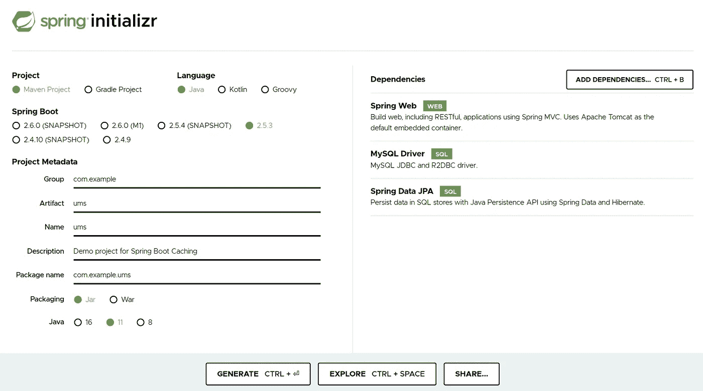

使用 spring initializr 创建一个新项目(图片由作者提供)

确保添加这些依赖项，因为它们是我们的应用程序的核心依赖项。

*   **Spring Web** —构建 REST API
*   **MySQL 驱动** —连接 MySQL 数据库
*   **Spring Data JPA**——更容易实现持久层

让我们创建一个用户模型、用户存储库、用户服务和用户控制器类来使我们的系统工作。因此，我们的项目将如下所示。

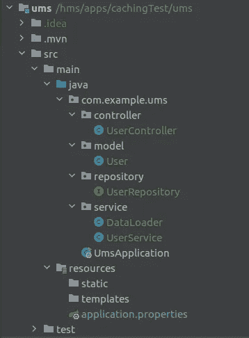

项目结构(图片由作者提供)

在`application.properties`文件中，我们需要定义我们的应用配置。

在 MySQL 配置中，我将数据库命名为 ums，并在 MySQL 数据库中预先创建了该数据库。

在用户模型中，我创建了 4 个变量。您可以根据自己的意愿定义任意数量的变量。

这里我们必须实现 serializable 类，因为 EhCache 是一个 Java 缓存，它不能总是将其映射存储为 Java 对象。

您需要添加 getters 和 setters 来访问这些值。然后我们需要创建一个用户存储库来获取我们的数据。

```
@Repository
public interface UserRepository extends JpaRepository<User, Integer>{
}
```

只需用一个 CURD 或 JPA 库进行扩展，这就足够我们测试了。然后是服务层。我上了两节课。一个用于初始数据加载过程，另一个用于获取数据。

这是数据加载器类，当应用程序启动时，它会将一些数据预加载到我们的数据库中。

在服务类中，我添加了一个名为`getAllUsers`的方法来获取所有用户。

> ***注意:*** 出于安全原因以及抽象原则，最好使用服务类的接口及其实现。但是在这里，我不会这样做，因为为了保持演示的简单性。

在用户控制器类中，我们定义 REST API 来获取用户列表。

好吧。我们的简单应用程序现在已经准备好了。让我们运行一下，检查一下是否一切正常。


测试应用程序(图片由作者提供)

如你所见，我们的服务器运行正常。现在是最好的部分。

# 6.缓存实现

## 添加 Spring Boot 缓存依赖项

为了给 spring boot 添加缓存机制，我们需要添加 spring boot 默认缓存。

```
<dependency>
    <groupId>org.springframework.boot</groupId>
    <artifactId>spring-boot-starter-cache</artifactId>
</dependency>
```

## 添加 EhCache 依赖项

```
<dependency>
    <groupId>org.ehcache</groupId>
    <artifactId>ehcache</artifactId>
    <version>3.9.6</version>
</dependency>
<dependency>
    <groupId>javax.cache</groupId>
    <artifactId>cache-api</artifactId>
    <version>1.1.0</version>
    <scope>runtime</scope>
</dependency>
```

我们还必须添加`cache-api`库，这允许我们使用实现 [JSR-107](https://www.jcp.org/en/jsr/detail?id=107) 的缓存库。

## 添加 EhCache 配置

如果使用 EhCache v3，则需要 JCache 和 EhCache。在以前的版本 2 中，不需要 JCache，因为它不是基于 JSR 标准构建的。

好吧。现在我们需要在 resources 文件夹中创建 EhCache XML 配置文件。(类路径)

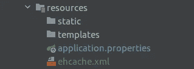

EhCache XML 文件位置(图片由作者提供)

这里我们必须定义缓存。`alies`代表我们缓存的名称。

> 基本上，缓存是键值存储。

因为缓存是键值存储，所以每次调用缓存的方法都需要转换成适合缓存访问的键。所以我们需要提供键类型和值类型。如果我们没有定义一个键，Spring Boot 默认键将被分配。

因为 Spring boot 使用参数来定义缓存值的键，所以我们必须从`org.springframework.cache.interceptor.SimpleKey`中改变`ehcache.xml`中的键类型

在这个配置文件中，我们正在创建一个名为`tasks`的缓存，它将能够存储任何类型的`List`，并将它缓存 30 秒。我们可以使用生存时间(ttl)属性来更改这个时间。

在 resources 标签中，我们配置缓存的层和容量。我在这里使用两层缓存。

*   **堆存储**:使用 Java 堆内存来存储缓存条目，并与应用程序共享内存。垃圾收集也会扫描缓存。这种记忆很快，但也很有限。这里我只允许堆上有 10 个条目。当空间已满时，将会发生驱逐。
*   **堆外存储**:使用 RAM 存储缓存条目。该内存不受垃圾收集的影响。仍然是相当快的内存，但是比堆上内存慢，因为缓存条目在使用之前必须移动到堆上内存。这里我只允许 10 MB 的堆外空间。

现在我们应该在`application.properties`文件中给出这个文件的路径。

```
spring.cache.jcache.config=classpath:ehcache.xml
```

您还需要通过使用`@EnableCaching`注释在 spring boot 应用程序类中显式启用 cashing。

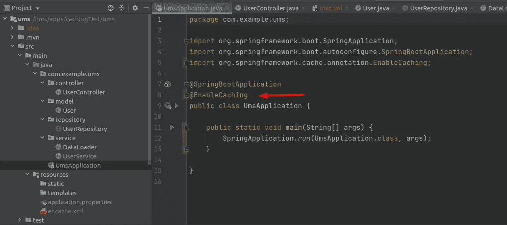

启用缓存(按作者分类的图像)

## 缓存实现

让我们看看如何在服务层实现 cash to one 方法。

有 4 种主要的注释可以用来实现缓存系统。让我们逐一探索。

`@Cacheable` —这是非常基本的注释，它表明调用方法的结果可以被缓存。

这将首先查询是否有缓存的数据。如果找到，直接返回原来的缓存数据。如果没有，请再次执行该方法，并将该方法的返回结果放入缓存中。

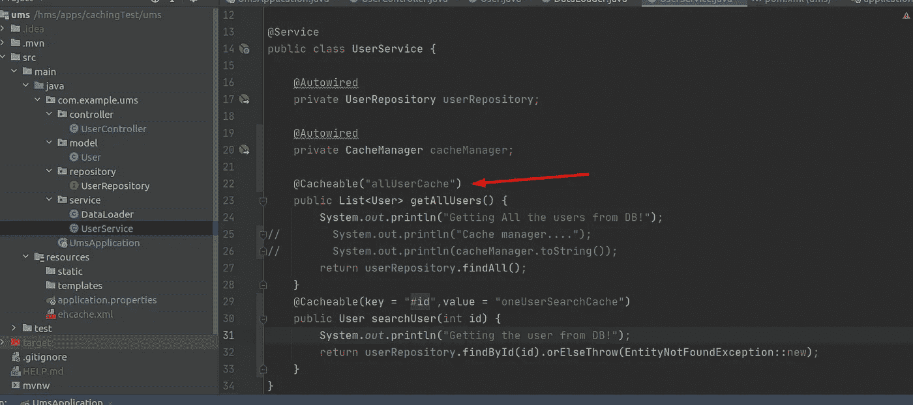

可缓存的注释(图片由作者提供)

这里，我们使用一个静态键作为“allUser ”,每次我们调用这个方法，我们都会得到相同的键。

密切关注`"'customerList'"`。我用单引号将它转义，否则你会得到一个`org.springframework.expression.spel.SpelEvaluationException`

这是一个特殊的表达方式，单引号使它再次成为一个`String`。

您可以使用这个依赖注入来检查当前运行的缓存提供者。

```
@Autowired
private CacheManager cacheManager;
```

打印它的值会给当前的缓存提供者。如果 EhCache 设置不正确，您可能会将并发缓存视为默认 cash。所以检查一下，确保你运行的是 EhCache。

# 7.在活动

现在是时候测试我们的应用程序了。

运行应用程序，然后打开浏览器或 postman 应用程序，并在端口 7000 上访问 REST 服务。

如果我们转到[http://localhost:7000/API/users](http://localhost:7000/api/users)*，*，那么我们将返回用户列表。一次又一次地检查，看看我们的缓存是否正常工作。

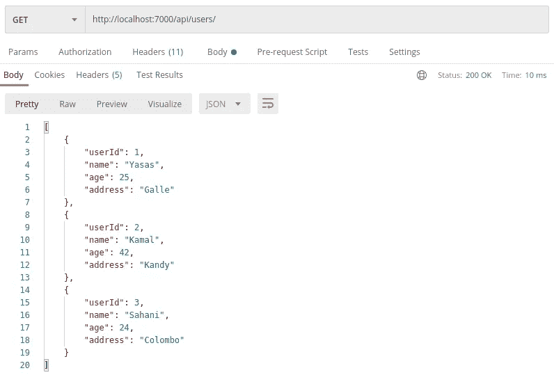

邮递员结果(图片由作者提供)

您可以检查打印语句，以了解缓存是否在工作。当您执行一个请求时，控制器将处理该请求。因此，首先它将收到的请求打印到控制器语句中。然后它将调用服务类来获取结果。

如果结果在缓存中，它将不会执行该方法，而是返回缓存中的结果。如果数据不在缓存中，它将打印`Getting All the users from DB! | Not Cached`语句。因此，您将看到，只有在第一次请求时，它才会执行服务方法，其他时候，它会从缓存中返回数据。

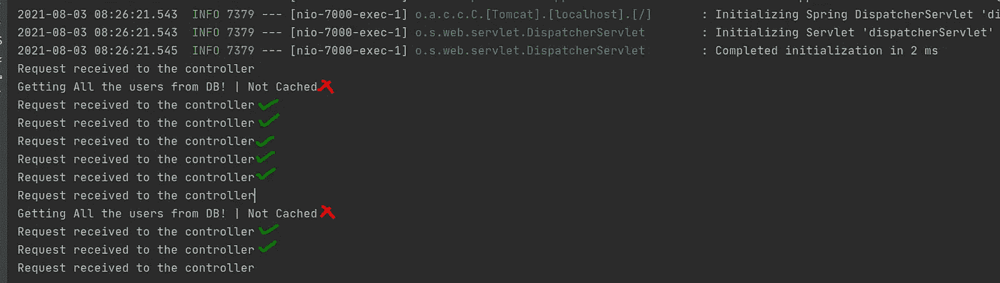

绿色勾号代表缓存的，红色叉号代表未缓存的响应(图片由作者提供)

> 注意:这样做只是为了演示，除非我们需要为我们的应用程序添加一个合适的日志系统。(希望您也意识到 log4j 漏洞:)

我为 ttl 和 max 堆类型定义了一些规则。如果这些一旦超过，它将再次从数据库中获得结果。

您可以测量每个请求所用的时间，并分析我们的缓存如何优化应用。

邮递员缓存 DNS。所以我们的测试可能会有偏差。这次可以用简单的旋度代替那个来过牌。此外，您可以从任何浏览器查看它。(使用匿名/私人模式)

```
curl -o /dev/null -s -w 'Total: %{time_total}s\n\n'  [http://localhost:7000/api/users](http://localhost:7000/api/users)
```

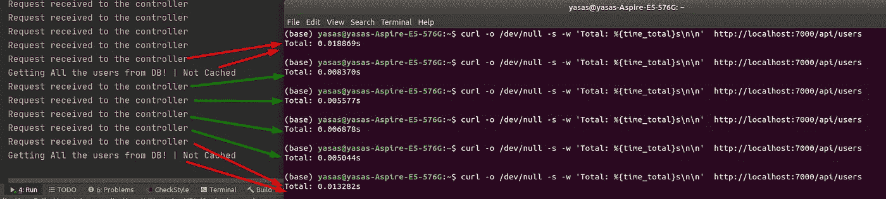

响应时间(图片由作者提供)

平均响应时间，

*   无缓存— 15 毫秒
*   带缓存— 5 毫秒

x3 中的时间减少了。看，多神奇啊！

在讨论其他注释之前，我将展示一个带有`cacheable`注释的例子。假设我们需要找到一个特定的用户。如何缓存它？

在服务类中，让我们定义方法。

这里你可以看到两个新的字段被注入到`cacheable`注释中。Key 表示唯一的键，值将是我们缓存的名称。

在控制器中，我们需要定义新的 API 端点。

```
@GetMapping(path = "/users/{id}")
public User getUser(@PathVariable int id) {
    System.*out*.println("Request received to the controller");
    return userService.searchUser(id);
}
```

现在我们必须定义缓存。在`ehcache.xml`文件中。

我们可以给值类型作为用户对象。让我们看看它是如何工作的。

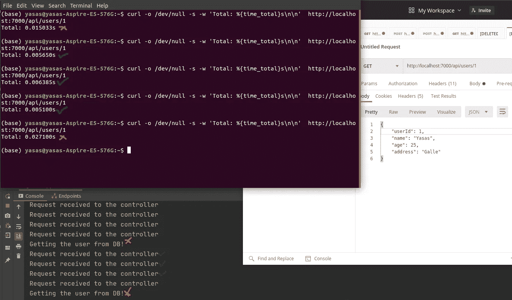

从缓存中查找特定用户(图片由作者提供)

# 8.其他注释

## 8.1 缓存

用于更新缓存的值。让我们看看下面的场景来理解缓存器。

在我们向系统添加一个新用户后，由于缓存机制的原因，它可能仍然会获得旧的用户列表。为了解决这个问题，我们需要在更新记录后通知缓存记录发生了变化。因此，我们需要在创建或更新记录时添加缓存 put。

让我们实际地看待问题和解决方案。

在控制器类中:

```
@PostMapping("/register")
public User createUser(@RequestBody User user) {
    System.*out*.println("Request received to the controller");
    return userService.addNewUser(user);
}
```

在服务类别中:

```
public User addNewUser(@RequestBody User user) {
    System.*out*.println("Registering the new user");
    return userRepository.save(user);
}
```

如果我们像这样为用户注册添加一个新的端点，那么在检索用户时就会遇到问题。之前我们创建了启用缓存的`getUserList`方法。因此它将从缓存中获取用户。当我们在数据库中添加一条新记录时，缓存不会注意到它并返回先前缓存的列表。

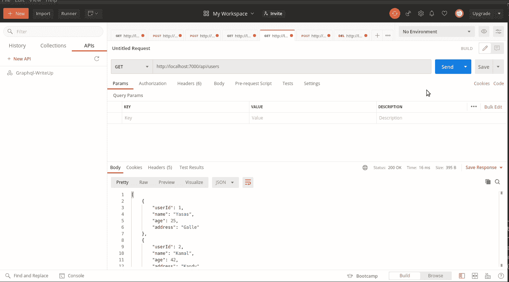

用户注册后，新用户列表不会更新(GIF by Author)

所以我们需要通知缓存。这就是为什么我们需要`CachePut`让我们看看解决方案。

首先，我们需要向方法添加注释。

你要记住的一点是，键值应该和前面的`getAllUser`方法一样。`getAllUser`方法返回一个用户列表，所以我们需要使这个方法返回相同的返回类型。

出于演示的目的，我使用了这种实现。但是在实践中，我们不会为了得到这么长的列表而增加缓存。(`getAllUser`方法)您不应该返回整个值集合，因为这会降低性能。您必须考虑分页概念。

当我们将数据放入现有的缓存中时，`ehcache.xml`文件没有任何变化。


实现缓存后(作者提供的 GIF)

## 8.2 缓存收回

删除记录时，缓存中仍可能有缓存的值。所以我们需要在删除一条记录后从缓存中删除相关的值。缓存收回用于此目的。它可以从缓存中移除一条或多条数据。

下面是服务类中的缓存收回实现。

该值指定了我们引用的缓存，使用`allEntries=true`，我们可以清除整个缓存。

此外，还可以基于特定的键来驱逐值。你可以试试

```
@CacheEvict(value = "first", key = "#cacheKey")
```

这将根据键删除值。

控制器类如下所示。

```
@DeleteMapping(path = "/users/{id}")
public boolean removeUser(@PathVariable int id) {
    System.*out*.println("Request received to the controller");
    return userService.removeUser(id);
}
```

您现在可以看到它是如何工作的。

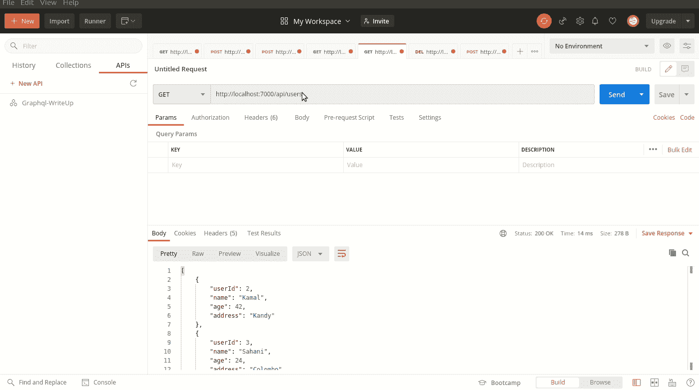

CacheEvict 演示(GIF 由作者提供)

我想我给你带来了缓存中最重要的部分。然而，这个旅程不会随着这篇文章而结束。我们需要深入挖掘，以获得更多关于缓存的知识。我计划为您带来下一篇基于缓存侦听器和条件缓存的文章。在此之前，请仔细阅读这段代码，并尝试进行各种更改。然后你会感受到缓存的力量。

# 资源

我的 GitHub 存储库中有完整的代码实现:

[](https://github.com/Yasas4D/UserManagementSystem) [## GitHub-yasas 4d/用户管理系统:Spring Boot 缓存

### 一个演示缓存实现的基本用户管理系统。

github.com](https://github.com/Yasas4D/UserManagementSystem) 

# 结论

在本文中，您了解了缓存的核心概念，并从头开始为 spring boot 应用程序实现了一种缓存机制。

感谢阅读！我希望这篇文章对你有所帮助。如果有任何问题、意见或建议，请随时联系我。
快乐编码！