# Spring Boot——通过 ArgoCD 和 GitHub 行动在 Kubernetes 上持续部署

> 原文：<https://betterprogramming.pub/spring-boot-continuous-deployment-on-kubernetes-with-argocd-and-github-actions-made-easy-cb228bb5f808>

## 部署变得简单

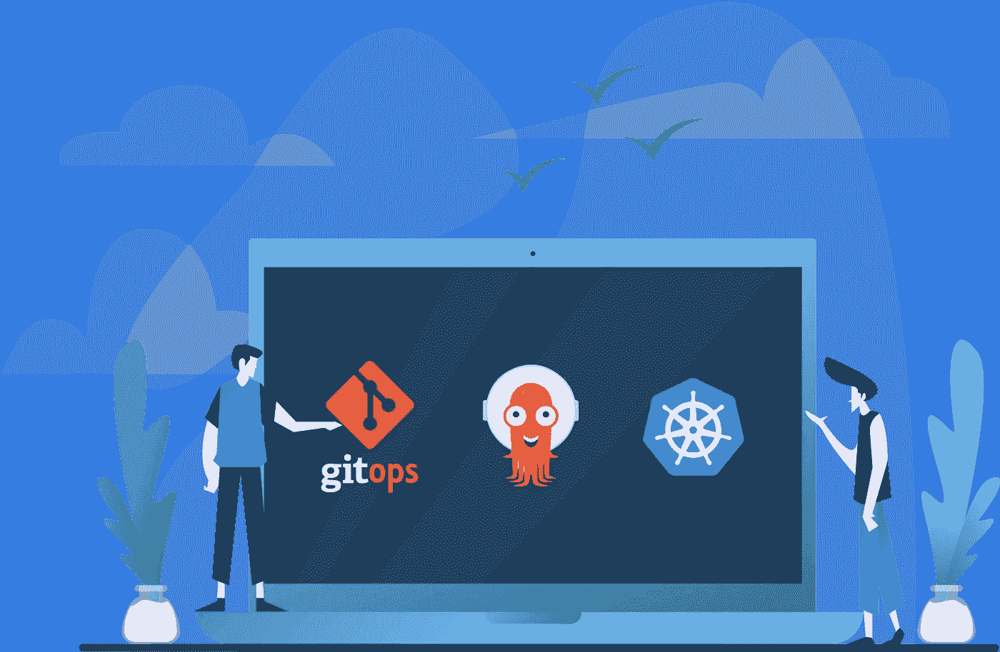

如今 [DevOps](https://en.wikipedia.org/wiki/DevOps) 、 [GitOps](https://www.gitops.tech/) 、[连续部署](https://en.wikipedia.org/wiki/Continuous_deployment)都是热门话题。有时它看起来像魔术，但实际上它的大部分真的很简单，每个人都应该采用它。自动化管道给我们带来了安全并节省了大量时间。本文中使用的所有工具都是免费的。

在本文中，我们将使用所有`master` 推送事件触发的 [GitHub 动作](https://docs.github.com/en/actions)创建一个非常基本的管道。它将执行项目测试、版本控制和构建。通常我们会在 *pull request open* 事件上运行测试，这样就不会有未测试的代码被合并到 master 中，但是为了简单起见，我将在本文中省略它。

我们将在我们的 [Kubernetes](https://kubernetes.io/) 集群中设置 [ArgoCD](https://argo-cd.readthedocs.io/en/stable/) (我将使用 [Docker Desktop](https://www.docker.com/products/docker-desktop/) 提供的集群)。ArgoCD 将监控我们的部署 [GitHub](https://github.com/) 库，并使用 [DockerHub](https://hub.docker.com/) 作为映像源，将每个更改部署到集群中。

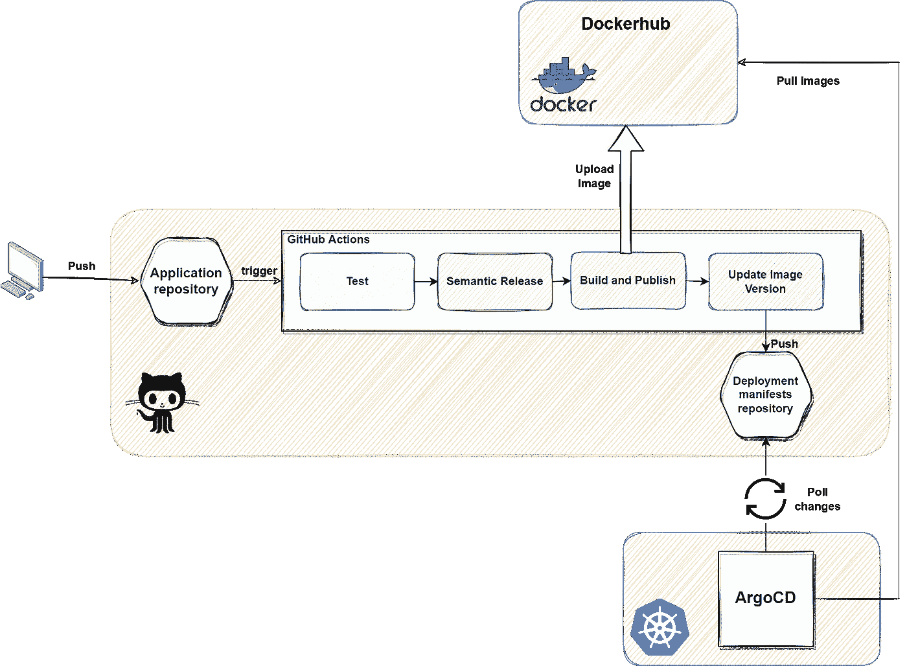

输送管道

首先，我们必须在 GitHub 上创建两个存储库。名字由你决定。

我将分别称它们为`continuous-delivery-application` 和`continuous-delivery-manifests`。

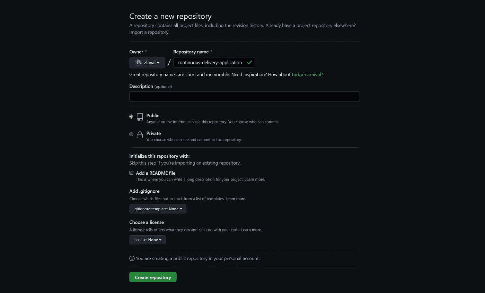

第一个是带有 REST 端点和单元测试的 [Spring Boot](https://spring.io/projects/spring-boot) 项目。可以通过[弹簧初始化](https://start.spring.io/)轻松生成。

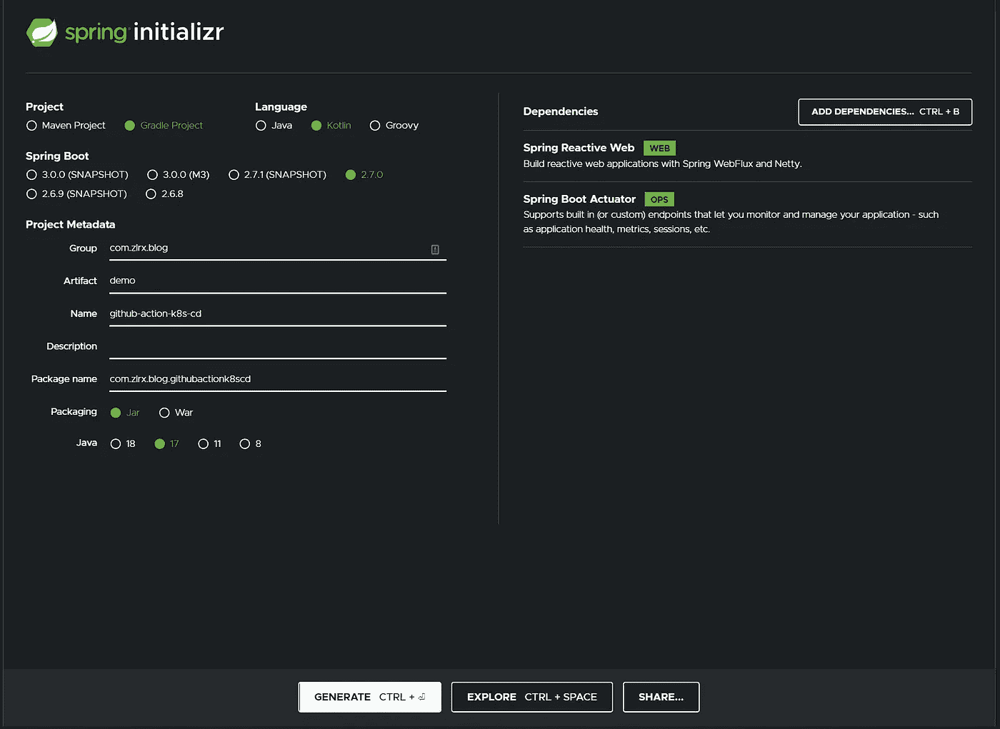

解压缩项目后，在您喜欢的 IDE(例如 IntelliJ)中打开它。

让我们创建一个返回用户对象列表的 REST 端点。我们将使用 [Kotlin](https://kotlinlang.org/) 协程作为反应端点。

路由器发出两个用户，并将他们序列化为 JSON 格式。您可以通过调用以下 URL 来测试端点:

```
[http://localhost:8080/api/v1/user](http://localhost:8080/api/v1/user)
```

然后为服务添加一个简单的单元测试:

现在，我们可以将第一个 CI 步骤添加到项目中。让我们在项目的根文件夹中创建一个新目录。

名称必须是`.github`，在这个文件夹中，我们必须创建另一个名为`workflows` *的目录。*

这是 GitHub 定义的动作的强制性命名约定。

在`workflows`文件夹中，我们创建一个名为`push-to-master.yml`的新文件。这是我们的部署描述清单。

主分支上的每一次推送都将触发工作流。该作业使单元测试得以运行。此时不需要写权限，但在下一个作业中需要。

这个任务在 Ubuntu 上运行，第一步是从资源库中签出项目。

之后，安装 JDK 17，最后调用 [Gradle](https://gradle.org/) 的`test` 命令来执行我们之前定义的单元测试。

在推送项目之前，使用以下命令使`gradlew` 可执行。

```
git update-index --chmod=+x gradlew
```

因为我们要设置使用[常规提交](https://www.conventionalcommits.org/en/v1.0.0/)的[语义发布](https://semantic-release.gitbook.io/semantic-release/)，所以让我们以提交消息后的 *feat:* 开始所有提交消息。稍后我会解释。

项目被推入 GitHub 后，我们可以在存储库的 Actions 页面上检查管道。

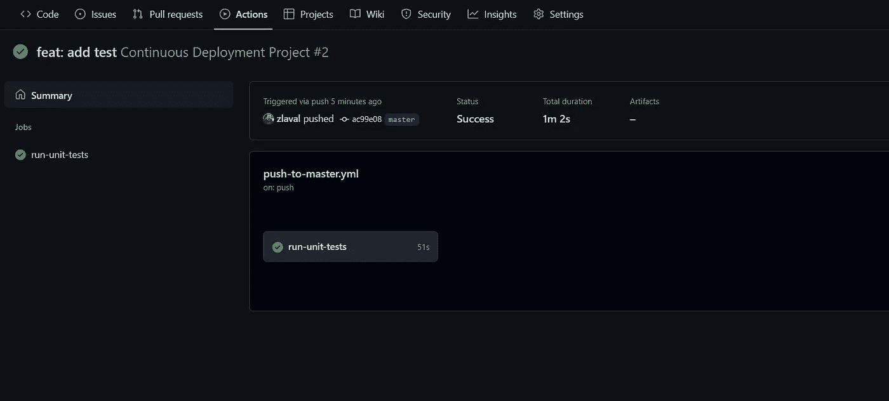

成功的单元测试

接下来我们将添加语义发布插件。这将自动更新项目版本。

SemRel 使用[常规提交标签](https://www.conventionalcommits.org/en/v1.0.0/#summary)来决定下一个版本。我们使用`feat`更新次要版本，使用`fix`更新路径。

还有很多其他的标签，请查看文档。

首先，我们必须在根文件夹中创建`gradle.properties`文件并添加下面一行:

```
version=0.0.1
```

并将`build.gradle.kts`文件中的`version` 更新为:

```
*version* = *project*.findProperty("version")!!
```

SemRel 是一个 NodeJS 插件，所以我们必须创建另一个名为`package.json`的文件，并在其中添加必要的语义发布插件。

插件将更新`gradle.properties` 文件中的*版本*，并连同自动生成的 changelog 一起提交回*主*。

在将新任务添加到工作流程之前，让我们运行`npm install`命令。

这将生成`package-lock.json`文件。

用新任务扩展`push-to-merge.yaml`清单。

该作业将检出主分支，并运行语义发布步骤。git 插件需要访问我们的存储库。

动作会自动将我们的令牌注入到工作流中，这样我们就可以使用`secrets.GITHUB_TOKEN`模板变量获取令牌并将其添加为环境变量。

*需求*结构确保`run_unit_test` 作业在该作业开始之前运行。没有它，这两个将同时运行。

推送修改后的文件并让工作流运行(不要忘记为提交消息添加 fix/feat 和冒号前缀)。当流水线完成时，我们可以拉出主分支并检查`gradle.properties`文件和`changelog.md`。

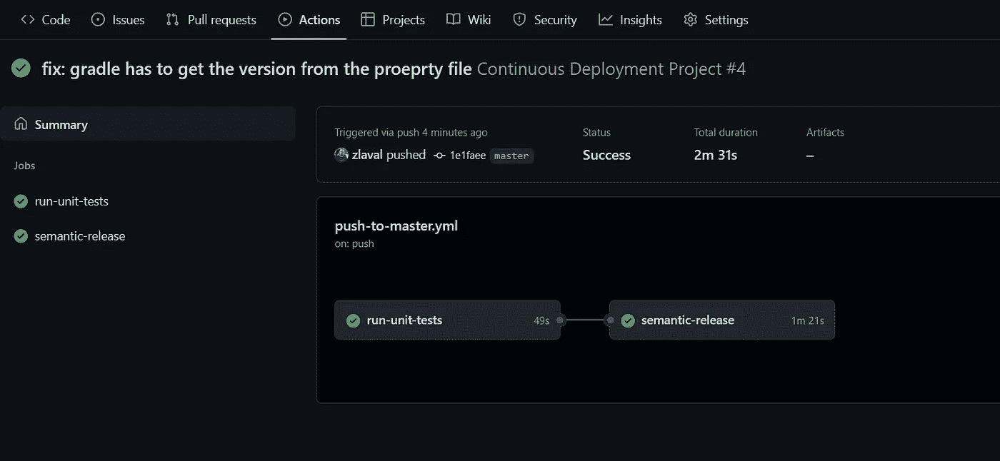

现在我们有两个任务在运行

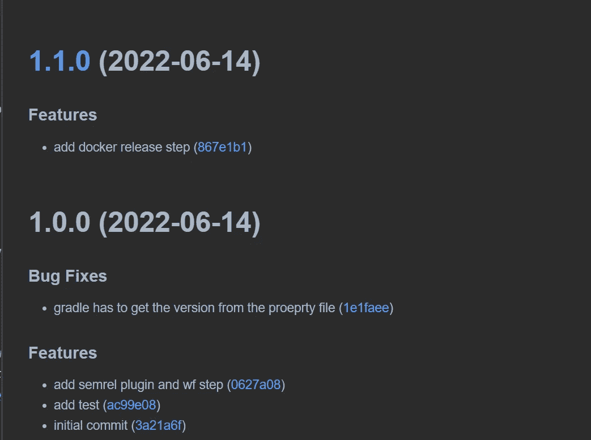

自动生成变更日志

我们使用 Jib 从应用程序中构建 Docker 容器。
将插件和配置放入`build.gradle.kts`文件。

我们使用亚马逊 Coretto Java 17 的基础映像。对于图像名称前缀，请使用您自己的帐户名称。

为了推动它，我们必须提供 DockerHub 凭证。我们将使用 GitHub Action Secrets 将它们作为环境变量注入。图像标签从项目版本中获取其值。这将由语义发布插件计算。

该容器暴露 8080 端口用于流量，9000 端口用于管理端口用于活跃度和就绪性探测。`mainClass` 名必须是包含主函数的类的完全限定名，对于 Kotlin，我们必须在它的末尾加上`Kt`，因为 Kotlin 将在这个名字上生成主类。`jvmFlags`帮助我们更好地使用容器的内存。

接下来，我们必须修改`application.yml`或`application.properties`文件，以便在管理端口上启用正常关机和健康探测。这在 Kubernetes 上是必要的。

我们可以将发布作业放入工作流文件中:

语义发布步骤

如您所见，这与测试工作相似。`Jib`将创建并推动图像到 DockerHub，但正如我所说，我们必须提供我们的凭据。您可以在“设置”选项卡上进行设置。

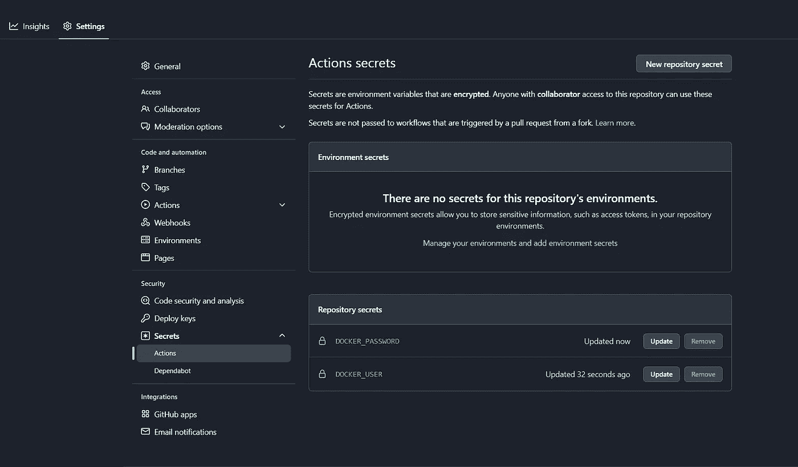

从左侧菜单中选择机密/操作，并使用*新存储库机密*按钮。

完成后，我们可以推动修改。当管道完成时，正确版本的映像应该在 DockerHub 上。

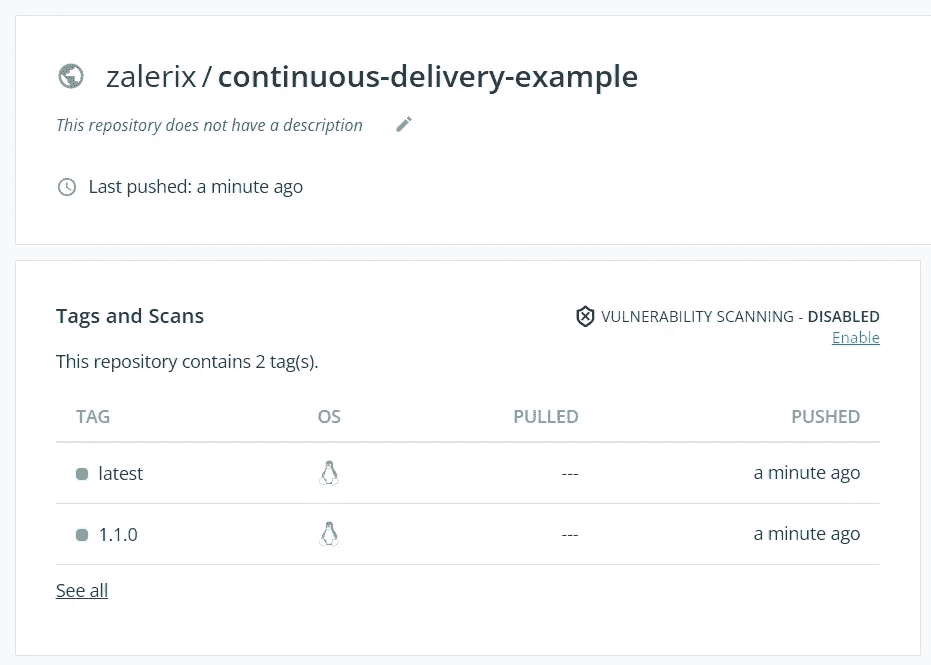

第二个项目包含 Kubernetes 部署的 [Kustomize](https://kustomize.io/) 清单。Kustomize 是 Kubernetes 的一个本地配置管理应用程序。其用途类似于头盔，但模板是自由的，默认情况下`[kubectl](https://kubernetes.io/docs/tasks/tools/)` [](https://kubernetes.io/docs/tasks/tools/)包含它。它可以将一堆资源分组并一起部署。

Kustomize 定义了基本模板和环境补丁。让我们在这个项目的根目录下创建两个文件夹。第一个叫做*底座*第二个叫做*叠加*。

我们将为应用程序创建一个简单的部署，并为可访问性和负载平衡创建一个集群 ip。

将`deployment.yml`添加到基本目录中。

部署

这将从图像中创建一个 [Pod](https://kubernetes.io/docs/concepts/workloads/pods/) 。我们还设置了健康探测器和资源限制。

我们使用以下内容创建`node-port.yaml`,这样集群中的其他应用程序将可以通过[上的其他 Pods 访问这个地址](http://cd-example-url:8080),并且它还将它绑定到 30001 端口上的 localhost。在实际应用中，您应该创建集群 IP 和入口控制器。

节点端口

Kustomize 使用`kustomization.yaml`进行操作。我们添加资源和基础映像。我们将从我们的管道中修改`newTag` 参数，这样我们就可以在每次主推送时更新镜像版本。

base/kustomization.yaml

接下来在`overlays`文件夹下创建一个名为`production`的新目录，并在其中添加另一个`kustomization.yaml` 文件。这将是我们的环境。我们现在不会使用任何补丁，但我们会为每个清单添加一个通用标签，并在该文件中链接基础库定制。

叠加/生产/kustomization.yaml

现在我们可以将它放入第二个存储库。

在存储库被推送后，返回到管道文件并定义最后一个作业。

首先，它检查应用程序项目的[主](http://cd-example-url:8080)分支，并从`gradle.properties` 文件中获取实际版本。我们将其设置为环境变量。GitHub Action 将这些保存在`$GITHUB_ENV`变量中。

在接下来的步骤中，它签出第二个项目。默认情况下，管道需要我们的个人访问令牌。操作只对当前存储库有权限。在下一部分，我将向您展示如何注册。

在最后一步中，我们使用 kustomize 命令进行映像版本更新，然后提交并将其推回存储库。

在 push (feat/fix)和管道完成后，必须在两个项目中设置项目版本。

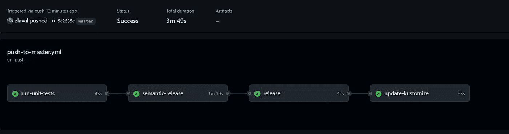

所有步骤都完成了

我们可以在概要文件设置(不是项目设置)下生成 PAT。从菜单中选择开发人员设置，然后单击个人访问令牌。您可以使用按钮生成新令牌。

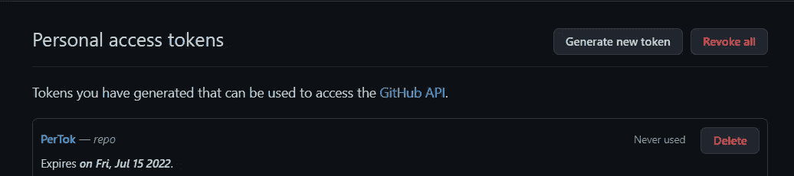

因为我们需要从管道推送到这个存储库，所以选择 repo 复选框并添加一个注释。

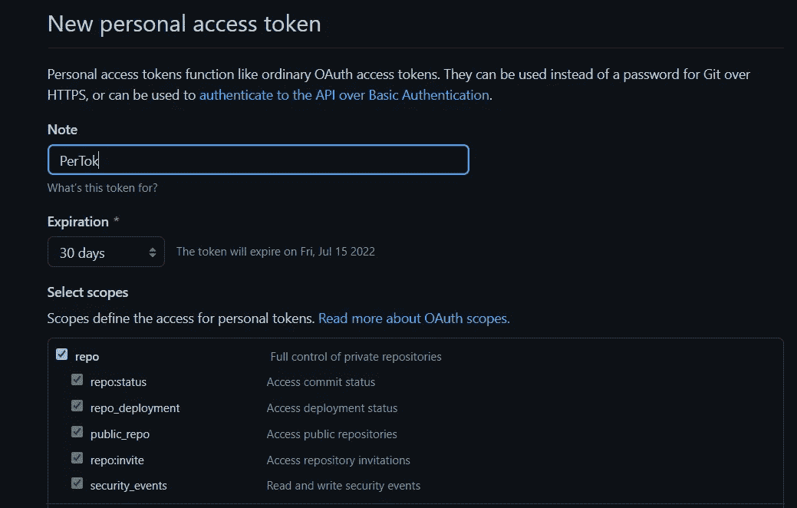

点击页面底部的生成按钮。
复制令牌并保存在某个地方，因为您无法再次检索它。然后创建一个`new project secret`，就像我们在使用这个值之前所做的那样，并且名称必须与我们在流水线步骤(PAT)中使用的名称相同。

## **设置 ArgoCD**

我假设您已经安装了 k8s 集群(启用 Kubernetes 的 Docker 桌面是实现这一点的最简单方法)

为了安装 ArgoCD，让我们运行以下命令。第一个创建一个新的命名空间，第二个部署 Argo。

```
kubectl create namespace argocdkubectl apply -n argocd -f [https://raw.githubusercontent.com/argoproj/argo-cd/stable/manifests/install.yaml](https://raw.githubusercontent.com/argoproj/argo-cd/stable/manifests/install.yaml)
```

我现在不打算创建入口控制器，所以只需使用以下命令将 Argo UI 从集群转发到您的本地计算机。

```
kubectl port-forward svc/argocd-server -n argocd 8011:443
```

去这个[网址](https://localhost:8011/)并登录。默认用户名是 *admin* 。
在终端中使用以下命令检索默认密码:

```
kubectl -n argocd get secret argocd-initial-admin-secret -o jsonpath="{.data.password}" | base64 -d
```

在创建应用程序之前，我们必须将我们的存储库添加到 Argo。让我们点击设置(cog)按钮并选择`repository` 菜单项。
我将选择`connect repo using ssh`选项，但您可以通过 https 或 app 登录回购。

添加名称、存储库 url 和您的私有 ssh 密钥，然后单击 *connect* 按钮。

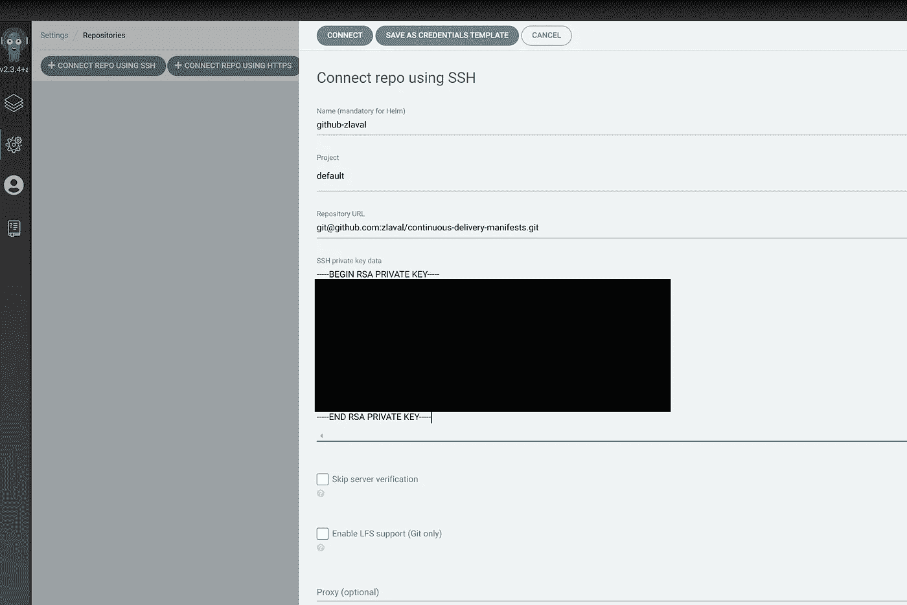

连接存储库

回到主页，让我们点击*新应用*按钮。

填写应用程序名称字段，可以使用任何字符串。这个项目就是`default`。

选择`automatic` 作为同步策略，并添加 git 库的 URL。路径是`overlays/production`。

接下来，我们必须设置集群 URL，这是本地集群的地址。对于 Docker Desktop，它是[http://kubernetes . default . SVC](http://kubernetes.default.svc.)，我们将把应用程序部署到 *default* 名称空间中。

点击*创建*按钮。

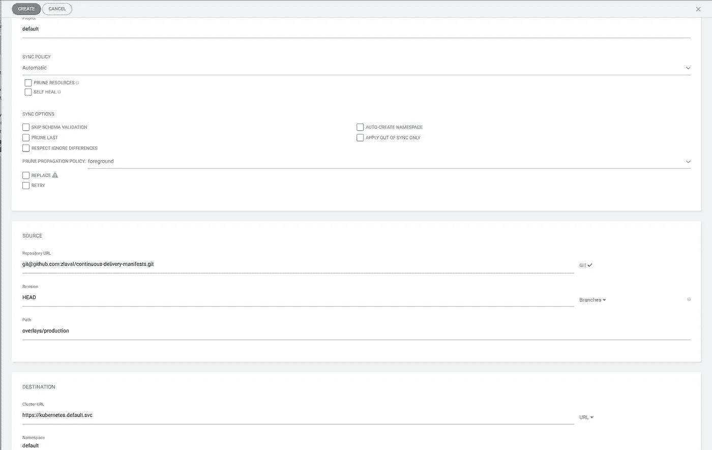

在主页上，您将看到该应用程序。等到它会健康。

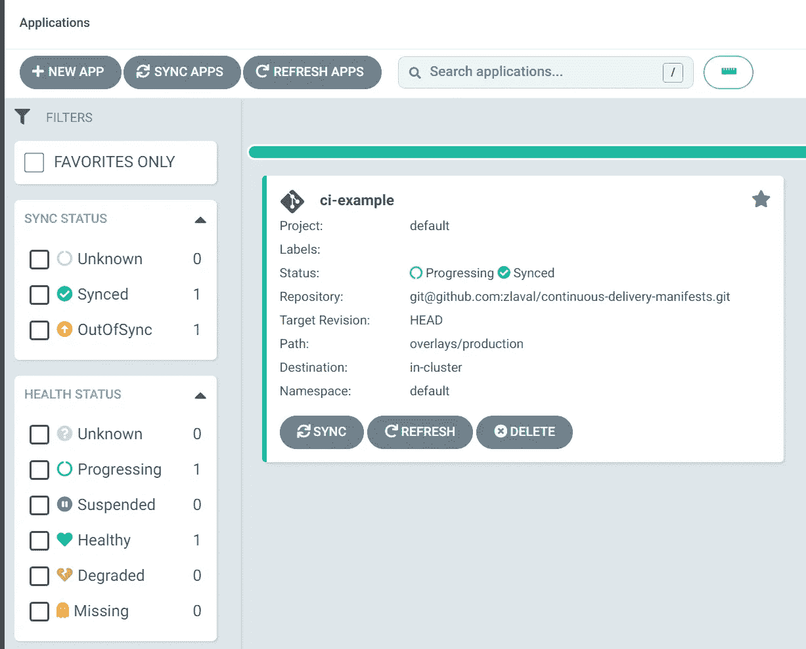

当应用程序启动并运行时，打开这个 URL 并检查结果。

单击应用程序的标题，我们可以检查部署的状态。

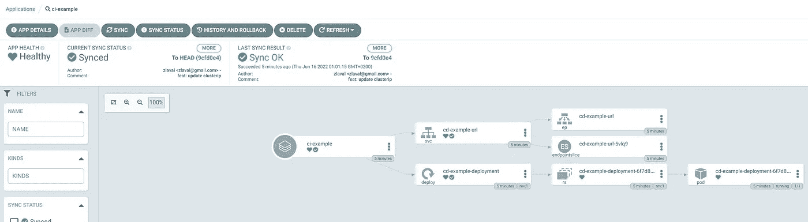

应用程序状态

现在让我们更改应用程序项目中的名称，并将其推回到 master branch。构建完成后，ArgoCD 将从存储库中获取更改，并部署新的应用程序版本。

根据构建时间的不同，有时可能需要 5 分钟，所以请耐心等待(默认的同步时间是 3 分钟)。

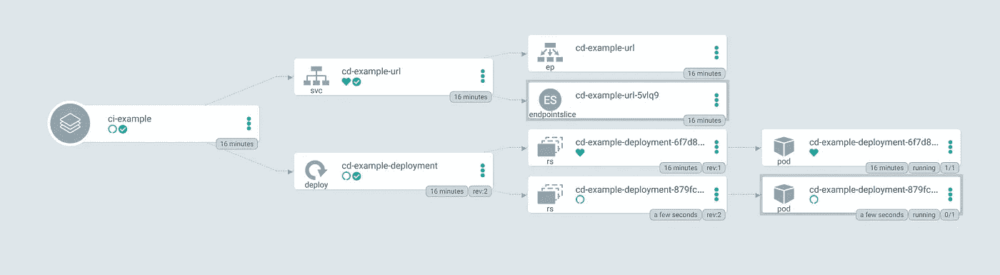

自动部署新版本

我们可以在这个管道中添加很多步骤，比如静态代码分析，将测试覆盖上传到 Codecov，等等。

GitHub 上提供了源代码:

*   [应用](https://github.com/zlaval/continuous-delivery-application)
*   [部署清单](https://github.com/zlaval/continuous-delivery-manifests)