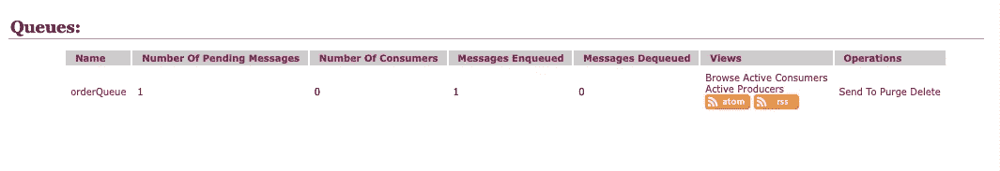
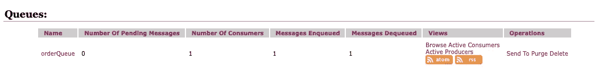

# Spring Boot 积分:控制反转

> 原文：<https://betterprogramming.pub/spring-boot-integration-inversion-of-control-d65c1a1dcf2a>

## 超越依赖注入

Mary jo Bautista[拍摄的照片](https://medium.com/u/a00cc4c4b2f9?source=post_page-----d65c1a1dcf2a--------------------------------)

很多时候，每当提到控制反转的概念时，第一个想到的就是依赖注入。对于本文，我还想介绍一下方法调用，这是 Spring Integration 大量使用的概念。

# 类型级耦合和系统级耦合

在深入代码之前，我们先来说说控制反转解决的耦合类型:类型级耦合和系统级耦合。

类型级耦合可能是最容易理解的——它是类型之间的耦合，通过使用依赖注入来解决。我打赌你们中的大多数人已经知道了这一点，但是为了清楚起见，让我在下面包括一个例子来演示这个概念。

假设我们有一个`OrderService`类，它正在其他类中被实例化。

具有类型级耦合的代码(在这种情况下，明确的类型耦合):

对`OrderService`的构造函数的改变将会影响其他所有实例化`OrderService`的类。

有了依赖注入——具体实例的创建被委托给框架，这是通过创建一个`OrderService`bean 并使用 XML 或 Java DSL 自动连接来实现的——这就不是问题了。

## 方法调用

关于依赖注入就说这么多了——现在让我们深入研究方法调用，它解决了系统级的耦合。

想象一下，我们正在使用之前的`OrderService`类的例子处理多个相互连接的系统:

鉴于上述情况，如果由于某种原因`warehouseService`不可用，那么我们将无法下订单。这可能是当前的业务规则，但是如果企业决定至少在仓库服务不可用时暂停订单，该怎么办呢？

这就是 Spring Integration 的方法调用通过解决系统级耦合而派上用场的地方。

我将演示一个简单的解决方案(用于演示目的),其中`Order`将被成功放置在`orderQueue`上，不管`warehouseService`是否可用。

正如我们在这里看到的，我们仍然在使用`warehouseService`，但是现在即使仓库服务不可用，一旦仓库服务再次可用，我们仍然能够处理订单。运行上面的代码将向`orderQueue`下订单。

ActiveMQ 管理控制台

一条消息排队！你可能已经注意到消费者的数量是`0`。这是因为我们还没有创建`warehouseService`本身，考虑到这个场景，我们可以得出结论，尽管没有意识到`warehouseService`，但是`OrderService`仍然在工作。

# 实现“仓库服务”

我们现在已经解决了之前在 Spring 集成中使用的系统级耦合，它大量使用了方法调用。如果你还在这里，那么和我一起实现`warehouseService`。

现在让我们运行我们已经创建的`warehouseService`并检查 ActiveMQ。

ActiveMQ 管理控制台

我们有一个消费者，一个消息入队，一个消息出队。

我们再次看到了 Spring Integration 的方法调用的美妙之处，它允许我们用`@ServiceActivator`声明性地标记`updateInventory`来处理来自`orderQueue`的消息。

# 结论

我希望你喜欢这篇文章。

编码快乐！