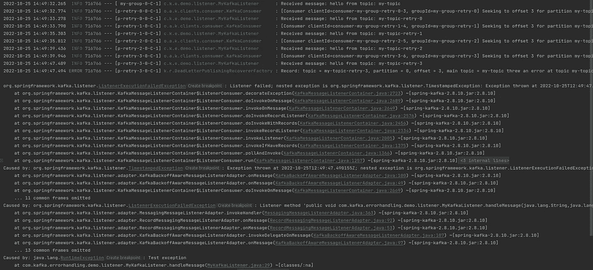

# Spring Boot，卡夫卡，非阻断重试——实践教程

> 原文：<https://betterprogramming.pub/spring-boot-kafka-non-blocking-retries-a-hands-on-tutorial-a0c425acc3dd>

## Spring Boot 应用程序中使用 RetryableTopic 的 Kafka 中的非阻塞失败消息处理


照片由 [Clément Hélardot](https://unsplash.com/@clemhlrdt?utm_source=medium&utm_medium=referral) 在 [Unsplash](https://unsplash.com?utm_source=medium&utm_medium=referral) 上拍摄

有时，当我们处理来自卡夫卡主题的消息时，会发生错误。例如，消费者服务或其他基础设施可能会关闭。我们希望确保不会丢失任何数据，并尝试处理失败的消息。

默认的 Kafka 失败处理行为会无限重试处理消息。这不是有益的，因为一些致命的错误无法修复，我们不应该重新处理它们。

我们可以使用`[RetryableTopic](https://docs.spring.io/spring-kafka/api/org/springframework/kafka/annotation/RetryableTopic.html)`注释来配置更健壮的策略来处理失败的消息，而不是依赖默认的实现。例如，我们可以将失败的消息发送到[死信队列](https://en.wikipedia.org/wiki/Dead_letter_queue)，限制重试次数，定义超时，排除致命异常再处理等。

在本教程中，我将向您展示如何通过几个简单的步骤在 Spring Boot 应用程序中实现`RetryableTopic`。

我们开始吧！

# 可重试主题介绍和优势

首先，让我们理解阻塞和非阻塞消息重试的区别。假设您在 Kafka 配置中配置了一个`@Bean`，尝试重新处理 N 次失败的消息。例如，考虑以下代码摘录:

修正了 Kafka 监听器工厂 Bean 的回退策略

消费者试图实时连续地重新处理失败的消息。主话题会被屏蔽。这里我们有一个`[FixedBackOff](https://docs.spring.io/spring-framework/docs/current/javadoc-api/org/springframework/util/backoff/FixedBackOff.html)`策略，尝试 3 次，恢复间隔为 5 秒。

如果所有重试尝试都失败，消息将被发送到死信队列(DLT)。在此之前，所有其他传入的消息都将被阻止，直到前面的消息得到处理。

这可能很危险，尤其是在重试间隔太长的情况下。

下面是我们如何通过使用`RetryableTopic`来改善这种情况:

*   主话题不屏蔽，其他消息可以处理。
*   失败的消息被发送到带有回退时间戳的重试主题。
*   如果失败的消息无法处理，它将被发送到下一个重试主题。
*   如果所有重试主题的处理都失败，消息将被转发到 DLT。
*   来自 DLT 的消息可以通过被发送回第一个重试主题来重试。

# 准备项目

我们将使用 HTTP `Get`请求生成消息，并使用 Kafka 消费消息。Kafka 监听器将使用`RetryableTopic`注释。

我已经为这个演示通过[https://start.spring.io/](https://start.spring.io/)创建了一个框架 Spring Boot 项目。

## 添加依赖项

我使用 Maven 作为构建工具。我们需要`pom.xml`中的以下依赖项:

项目相关性

*   `spring-boot-starter-web`依赖关系支持 web 应用程序的创建。
*   `spring-kafka`依赖项用于 Kafka 操作。
*   `lombok`依赖消除了样板代码的使用。

## 准备基础设施

要在本地运行 Kafka，让我们创建一个`docker-compose.yml`文件:

码头工人为卡夫卡作曲

*   我们有两个服务— `zookeeper`，是`kafka`所需要的。

## 配置 Kafka 属性

让我们配置一下`application.yml`:

应用程序的属性

*   我们要听的题目的名字叫做`my-topic`。
*   卡夫卡消费群体的名字叫`my-group`。
*   我们已经为序列化和反序列化配置了`KafkaProducer`和`KafkaConsumer`属性。
*   我们使用在`docker-compose.yml` 文件中定义的 Kafka 引导服务器的`29092`端口。

## 添加一个卡夫卡监听器

让我们创建一个卡夫卡式的听众:

*   我们使用`@ Component`注释在 Spring Boot 应用程序中注册 Bean。
*   我们有一个方法`handleMessage()`，在这里我们定义我们的 Kafka 监听器并使用`@RetryableTopic`。
*   当所有重试尝试都用尽时，消息被转发到`handleDlt()`方法，由`@DltHandler`注释指示。DLT 主题的默认名称是`my-topic-dlt`。
*   注意`throw new RuntimeException("Test exception")`零件是测试所必需的。

以下是一些基本属性:

*   属性定义了我们想要重试的次数。在这种情况下，我们将对原始主题进行 4 次重试加 1 次。
*   该应用程序将自动创建以索引值命名的后缀主题。例如，`my-topic-retry-1`。命名策略由`topicSuffixingStrategy`属性定义。
*   `backoff`属性指示应用程序在 1 秒钟内重试失败的消息。我们有一个乘数`2.0`。这意味着第二次尝试将在 2 秒后发生，第三次将在 4 秒后发生，依此类推。
*   属性让我们配置不想重试的异常。例如，忽略致命异常是一个很好的做法，比如`DeserializationException`。有关不可恢复故障的完整列表，请查看[文档](https://docs.spring.io/spring-kafka/reference/html/#backoff-handlers)。

`RetryableTopic`提供了其他强大的选项。如果您想查看它们，请访问[文档](https://docs.spring.io/spring-kafka/api/org/springframework/kafka/annotation/RetryableTopic.html)。

## 添加静止控制器

为了简单起见，让我们添加一个`RestController`来生成主题消息:

RestController 为 Kafka 主题生成消息

*   `produceMessage()`方法将向我们的 Kafka 主题发送消息。
*   默认情况下，`kafkaTemplate`是自动连线的。当然，如果我们需要自定义实现，我们可以配置自己的 Bean。

## 创建主应用程序

主应用程序如下所示:

主要应用程序

## 测试应用程序

现在，是测试的时候了！

1.  通过运行以下命令启动本地基础架构:

```
docker-compose up
```

2.运行主类- `KafkaErrorHandlingApplication.java`。

3.通过控制器发送测试信息。例如:

```
GET [http://localhost:8090/produce/hello](http://localhost:8090/produce/hello)
```

您应该在应用程序的控制台中看到监听器收到了消息。由于我们抛出了一个`RuntimeException`，消息将被转发到重试主题，并最终转发到 DLT。

日志如下所示:



spring boot 应用程序的控制台日志

完美！检查屏幕截图上的时间戳，查看重试尝试是否按照`BackOff`策略的配置进行。

此外，DLT 按预期工作:


由 DLT 处理的消息

# 结论

在本教程中，您学习了如何使用`RetryableTopic`注释来实现非阻塞的失败消息处理。我们看到了一些配置属性示例。

这个注释为我们提供了一个健壮的错误处理解决方案。但是，请记住，根据官方文档，目前它有一些限制:

> 通过使用这个策略，你就失去了卡夫卡对那个主题的排序保证。
> 
> 目前，该功能不支持类级`@KafkaListener`注释。

你可以在下面的**参考资料**部分找到这个演示的完整源代码的链接。

我希望你能从这篇文章中学到一些新的东西。如果你喜欢这个教程，你可能也会喜欢我的其他卡夫卡相关的文章:

[](/kafka-streams-how-to-process-a-csv-file-to-perform-calculations-173758da117d) [## Kafka Streams:如何处理 CSV 文件以执行计算

### 处理一个大的 CSV 文件，并根据历史天气记录计算日平均温度

better 编程. pub](/kafka-streams-how-to-process-a-csv-file-to-perform-calculations-173758da117d) [](/how-to-process-notifications-with-kafka-minio-and-python-8a288b12854) [## 如何用 Kafka、MinIO 和 Python 处理通知

### 通过 Kafka 发送存储桶通知，并使用 Python 处理记录

better 编程. pub](/how-to-process-notifications-with-kafka-minio-and-python-8a288b12854) 

感谢您的阅读，祝您编码愉快！

# 参考

*   [我的 GitHub 资源库](https://github.com/kirshiyin89/kafka-retryabletopic-demo)
*   [https://docs . spring . io/spring-Kafka/reference/html/# retry-topic](https://docs.spring.io/spring-kafka/reference/html/#retry-topic)