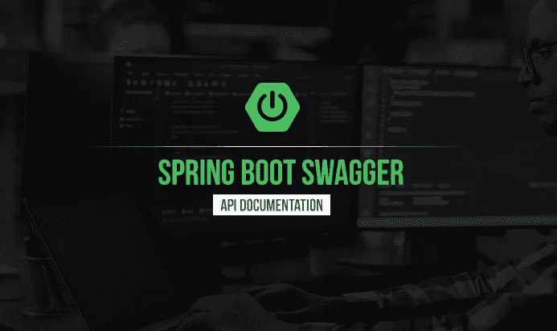
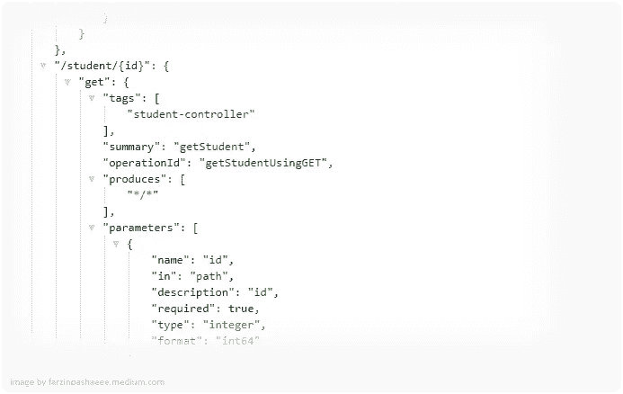
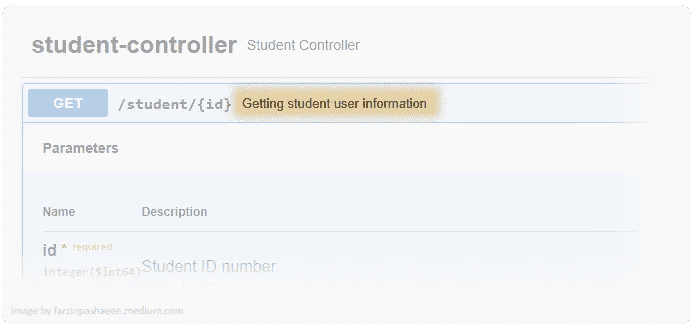
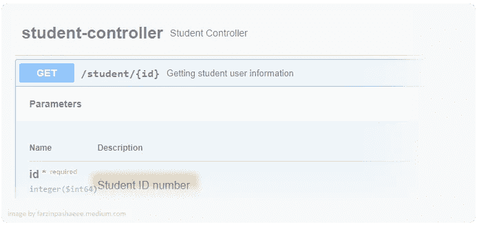
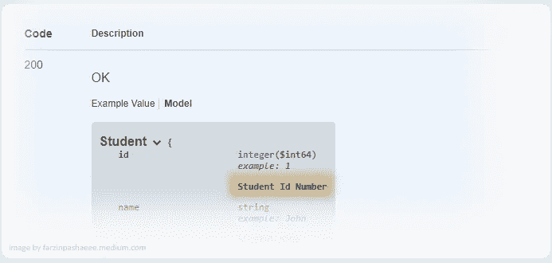

# Spring Boot 和斯瓦格——写好 API 文档

> 原文：<https://betterprogramming.pub/spring-boot-swagger-api-documentation-249b3cad7d9c>

## 文档变得简单



无论是在简单的移动应用程序中，还是在集成复杂的企业系统中，API 都是技术世界中的关键角色之一。任何应用程序都可以成为一个平台，方法是使用 API 为现有产品增强和添加服务。

拥有这些 API 的良好文档对它们的成功至关重要。API 文档是技术内容，包括使用和集成 API 的说明。可以把它看作是一本参考手册，其中包含了使用 API 所需的所有信息，比如请求和响应格式，以及如何开始使用它们。

对于 API，您总是可以有自己的文档格式，但是有一个标准或通用的格式会使它更具可读性。使用规范驱动开发(SDD)这样的良好实践也有助于保持文档的有效性。有几个规范可以用来开始编写文档，比如 [RAML](https://raml.org/) (RESTful API 建模语言) [OpenAPI](https://swagger.io/specification/) (以前的 Swagger)和 [API Blueprint](https://apiblueprint.org/) ，但是在本文中，我们将重点介绍 OpenAPI 和 Spring Boot 应用程序的 Swagger。

# 什么是霸气？

Swagger 是一组开源工具，帮助您描述基于 REST 的 API。这使得您可以自动构建漂亮的交互式 API 文档，自动为您的 API 生成多种语言的客户端库，并探索自动化测试等其他可能性。

# 入门指南

要开始使用 OpenAPI 并创建您的第一个 swagger 文档，您的应用程序中需要以下依赖项。

```
<dependency>     
    <groupId>**io.springfox**</groupId>     
    <artifactId>**springfox-boot-starter**</artifactId>
    <**version**>3.0.0</**version**>
</dependency>
```

使用 3.0.0 版本的 starter，请确保您拥有兼容版本的 starter 父依赖项。在我的情况下，我使用的是 2.4.0。

```
<**parent**>
   <**groupId**>org.springframework.boot</**groupId**>
   <**artifactId**>spring-boot-starter-parent</**artifactId**>
   <**version**>2.4.0</**version**></**parent**>
```

现在这些依赖项都已就绪，您需要提供`Docket` bean 来开始为开放 API 文档端点提供服务。为此，您可以使用带有`@Bean`注释的给定方法添加以下配置。

```
@Configuration
**public class** SwaggerConfig{
    @Bean
    **public** Docket getDocket() {
        **return new** Docket(DocumentationType.***SWAGGER_2***)
                .select()
                .apis(RequestHandlerSelectors.*any*())
                .paths(PathSelectors.*any*())
                .build();
    }
}
```

`select()`方法将返回`ApiSelectorBuilder`，它可用于管理公开的 swagger 端点。如果您需要特定路径或包的文档，您可以更改相关方法的输入。

```
**return new** Docket(DocumentationType.***SWAGGER_2***)
    .select()
    .apis(RequestHandlerSelectors.*basePackage*(**"fp.sw.controller"**))
    .paths(PathSelectors.*regex*(**"/student/*"**))
    .build();
```

在我们的例子中，我们使用了`any()`，这将导致记录所有的 API。准备好 Docket bean 并运行应用程序后，您可以使用以下端点获得 JSON 格式的机器可读版本的 API 文档。

```
[http://localhost:8080/v2/api-docs](http://localhost:8080/v2/api-docs)
```



现在为了有一个人类可读的版本和一些额外的测试特性，我们可以使用 swagger-UI 依赖项。您唯一需要做的就是在 POM 文件中添加以下依赖项。

```
<**dependency**>
   <**groupId**>io.springfox</**groupId**>
   <**artifactId**>springfox-swagger-ui</**artifactId**>
   <**version**>3.0.0</**version**>
</**dependency**>
```

如果您在添加此依赖项后运行您的应用程序，并访问下面的 URL，您将会发现一个基于 web 的 GUI，它描述了 API 并为您提供了测试 API 的功能。

```
[http://localhost:8080/swagger-ui/](http://localhost:8080/swagger-ui/)
```


默认情况下，根据您的 Docket 配置，您将在此页面上看到一个控制器列表。如果您扩展控制器，您会发现一个有效方法的列表( *GET、POST、PUT、DELETE、HEAD、OPTIONS* )，正如您在控制器中定义的那样。通过扩展每个方法，您将获得关于参数列表、内容类型、响应状态和..

## 带注释的文档

为了获得关于每个方法、参数和其余相关实体的更多细节，您可以使用一组注释来添加注释，这些注释稍后将由 swagger 呈现在 UI 中。以下是通过 swagger 记录 API 的一些最常用的注释:

`@ApiOperation` —使用方法上的注释，您可以为该方法添加一些描述，它将出现在 swagger UI 中端点路径的旁边。

```
@GetMapping(**"/{id}"**)
**@ApiOperation(value="Getting student user information")**
**public** ResponseEntity<Student> getStudent(
...
```



swagger-UI 中的 **@ApiOperation** 注释

`@ApiParam` —该注释将用于描述所请求方法中的参数。

```
@GetMapping(**"/{id}"**) **public** ResponseEntity<Student> getStudent(
        **@ApiParam(value = "Student ID number" , required = true , example = "1")**
        @PathVariable Long id ){
...
```



swagger-UI 中的@GetMapping 注释

`@ApiModelProperty` —可用于描述模型中用作请求或响应对象的属性。

```
**public class** Student {
    @ApiModelProperty(notes = **"Student Id Number"**, 
         example = **"1"**, position = 1)
    **private** Long **id**;

    @ApiModelProperty(notes = **"Student name"**, 
          example = **"John"**, position = 2)
    **private** String **name**;
}
```



swagger-UI 中的@ApiModelProperty 注释

你可以在这里找到完整的列表。

## 确保昂首阔步

因为您通过 swagger 暴露了一些敏感信息，所以建议在生产环境中禁用 swagger，或者至少保护它。为了保护它，您可以使用 Spring Security 并添加相关的 started，默认情况下，swagger 端点将使用基本的身份验证方法来保护。在 Spring Security 中，您可以利用很多灵活的认证和授权选项。

## 生成客户端库

使用 swagger 的另一个好处是，您可以使用 OpenAPI Swagger 规范来生成不同语言的客户端库或 SDK。Swagger Codegen 是可以用来创建这些库的工具之一。Swagger Codegen 可以通过为任何 API 生成服务器存根和客户端 SDK 来简化您的构建过程，这些 API 是用 OpenAPI(以前称为 Swagger)规范定义的，因此您的团队可以更好地专注于 API 的实现和采用。虽然该工具可以快速生成 40 种不同语言的客户端库，但它也可以与 SwaggerHub 集成。这使得通过该工具的云接口进行协作变得更加容易。

## 自动化测试

拥有一个机器可读的 Swagger 规范使您有可能使用其他应用程序来准备自动化测试。像[assertable](https://assertible.com/)和 [Postman](https://www.postman.com/) 这样的工具可以用来导入 Swagger 规范，并自动为每个端点和方法创建测试和断言。