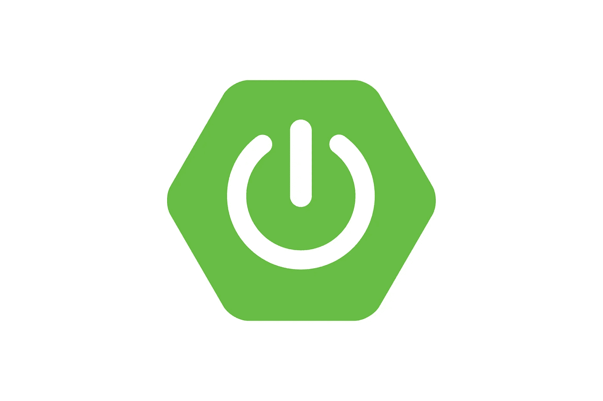
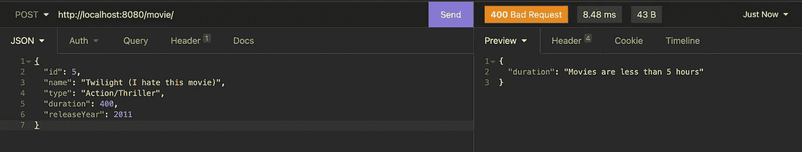
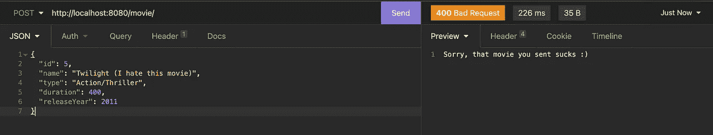
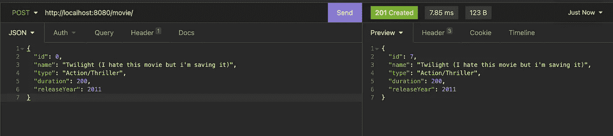
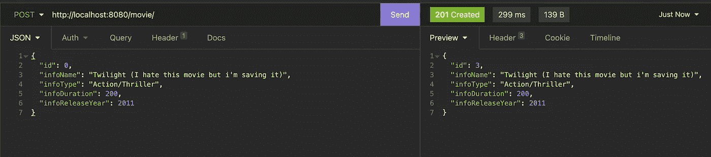

# 通过 Spring Boot 验证和 Bean 操作保护您的应用

> 原文：<https://betterprogramming.pub/spring-boot-validation-and-bean-manipulation-4fd546fe813b>

## 看一下处理安全性的两种方法



安全应用在其开发和生产阶段遵循若干安全措施，由于可能发生数据注入的风险，应用入口点是最重要的安全部分之一。Spring 提出了它的数据验证方法，改进了对这些特殊点的控制。

正如您已经猜到的，本文不仅仅是关于数据验证；它还涉及 bean 或自定义数据结构操作，这是每个开发人员都应该了解的两个重要的应用程序安全特性。

介绍得够多了，现在，让我们从我们需要实现的全球蓝图开始，您需要知道这两种机制都解决了两个安全漏洞:

*   **喷射攻击**
*   **数据库模式暴露**

听起来很糟糕，对吧？嗯，解决方案其实比你想象的要简单。首先，让我们先了解这两个问题，然后再寻求解决方案。

# 注入攻击

注入攻击是指恶意代码被注入网络，并从数据库中检索所有数据，然后将其发送给攻击者。正如您得出的结论，攻击使用您的应用程序的开放门户来获取所有存储的数据，它可以以多种类型伪装攻击，如 XSS、SQL、XPath、模板、代码、CRLF、LDAP、操作系统命令注入等。如果你使用 ORM 操作，你并不完全安全，但是你已经领先一步了。你提出的防御越多越好。

# 数据库模式暴露

主要是当这种情况发生时，它不会给攻击者带来很大的好处，但它仍然提供了一条有价值的信息，这是您构造您的**模式、数据类型和关系**的方式，在某些场景中，它变得至关重要。

# 数据有效性

在本教程中，我们将基于我们最后的[电影 API](https://github.com/xrio/simple-spring-boot-movies) 。

首先，让我们将 Spring boot 验证依赖项添加到 pom.xml 文件中。

```
<dependency> 
    <groupId>org.springframework.boot</groupId> 
    <artifactId>spring-boot-starter-validation</artifactId> 
</dependency>
```

其次，我们将使用一些验证规则来增强我们的电影模型。

```
// other imports
import javax.persistence.Entity;
import javax.persistence.GeneratedValue;
import javax.persistence.GenerationType;
import javax.validation.constraints.Max;
import javax.validation.constraints.Min;
import javax.validation.constraints.NotBlank;
import javax.validation.constraints.NotNull;

@Data
@Entity
public class Movie {

    @Id
    @GeneratedValue(strategy = GenerationType.SEQUENCE)
    @NotNull(message = "Id must not be null")
    private Long id;

    @NotBlank(message = "Name must not be blank")
    private String name;

    @NotBlank(message = "Type must not be blank")
    private String type;

    @Min(value = 1, message = "Movies are mainly more than a minute")
    @Max(value = 300, message = "Movies are less than 5 hours")
    private Long duration;

    @NotNull(message = "Release year must not be null")
    private Long releaseYear;

}
```

第三，我们改变了控制器端点的签名，这样它们就可以验证传入的请求体并抛出异常，而不是自定义异常。

```
package io.xrio.movies.controller;

...

import javax.validation.Valid;

@RestController
@RequestMapping("movie")
@Data
public class MovieController {

    ...

    @PostMapping("/")
    public ResponseEntity<?> save(@Valid @RequestBody Movie movie) throws Exception {
        if (movie == null)
            return ResponseEntity.badRequest().body("The provided movie is not valid");
        return ResponseEntity.status(HttpStatus.CREATED).body(movieService.save(movie));
    }

    @PutMapping("/")
    public ResponseEntity<?> update(@Valid @RequestBody Movie movie) throws Exception {
        if (movie == null)
            return ResponseEntity.badRequest().body("The provided movie is not valid");
        return ResponseEntity.ok().body(movieService.update(movie));
    }

    ...

}
```

`@Valid`确保传入的主体是有效的，否则将抛出一个`MethodArgumentNotValidException`

显然，我们移除了定制的异常，并用`Exception`类替换它，这样控制器就不会抑制控制器层中的异常，让默认的异常处理程序干涉，这将导致 500 服务器内部错误。相反，它将由我们将要创建的异常处理程序来处理。

```
package io.xrio.movies.controller.advice;

import org.springframework.http.HttpStatus;
import org.springframework.http.ResponseEntity;
import org.springframework.validation.FieldError;
import org.springframework.web.bind.MethodArgumentNotValidException;
import org.springframework.web.bind.annotation.ControllerAdvice;
import org.springframework.web.bind.annotation.ExceptionHandler;
import org.springframework.web.bind.annotation.ResponseStatus;

import java.util.HashMap;
import java.util.Map;

@ControllerAdvice
public class ValidationExceptionHandler {

    @ExceptionHandler(MethodArgumentNotValidException.class)
    public ResponseEntity<?> handleValidationExceptions(MethodArgumentNotValidException exception) {
        Map<String, String> errors = new HashMap<>();
        exception.getBindingResult().getAllErrors().forEach((error) -> {
            String fieldName = ((FieldError) error).getField();
            String errorMessage = error.getDefaultMessage();
            errors.put(fieldName, errorMessage);
        });
        return ResponseEntity.badRequest().body(errors);
    }
}
```

就像我们之前的电影异常处理程序一样，这个基于`ControllerAdvice`的处理程序将针对`MethodArgumentNotValidException`类型的异常，并通过检索验证违规来解决它们，将其包装在一个响应实体中，并使用 400 错误请求响应代码将其发送回用户。



*注意:将验证违规返回给用户是一个巨大的搅拌器，就像告诉一个入室抢劫者为什么他们没能抢劫你自己的房子。*

为了应对这种情况，我们将把它们打印在日志上，顺便说一下，只有生产环境管理员可以访问这些日志。我们的例外将是这样的:

```
import lombok.extern.slf4j.Slf4j;...@ControllerAdvice
@Slf4j
public class ValidationExceptionHandler { @ExceptionHandler(MethodArgumentNotValidException.class)
    public ResponseEntity<?> handleValidationExceptions(MethodArgumentNotValidException exception) {
        exception.getBindingResult().getAllErrors().forEach((error) -> {
            String fieldName = ((FieldError) error).getField();
            String errorMessage = error.getDefaultMessage();
            log.error(fieldName + ": " + errorMessage);
        });
        return ResponseEntity.badRequest().body("Sorry, that movie you sent sucks :)");
    }
}
```

发送相同的请求将导致以下结果:



只有生产环境管理员可以看到:


`@Slf4j`是使用[龙目语](https://projectlombok.org/)调用记录器的一种简称。

数据验证不仅是抵御注入攻击的一层，而且有助于保持数据整洁。

因为我们仍然在我们的端点中暴露我们的模型，是时候改变它了！

# 数据操作

# dto 简介

数据传输对象，也称为值对象(VOs ),将是在两个进程之间携带数据的对象，在我们的例子中，将是它们的结构而不是模型的结构被暴露。

我们的电影将如下:

```
import lombok.Data;import javax.validation.constraints.Max;
import javax.validation.constraints.Min;
import javax.validation.constraints.NotBlank;
import javax.validation.constraints.NotNull;@Data
public class MovieDTO { @NotNull(message = "Id must not be null")
    private Long id; @NotBlank(message = "Name must not be blank")
    private String name;
    @NotBlank(message = "Type must not be blank")
    private String type;
    @Min(value = 1, message = "Movies are mainly more than a minute")
    @Max(value = 300, message = "Movies are less than 5 hours")
    private Long duration;
    @NotNull(message = "Release year must not be null")
    private Long releaseYear;}
```

因为 dto 是要公开的对象，所以我们添加了一些验证规则。

*好了，我们已经公开了 dto，但是我们如何使用 dto 持久化数据呢？*

*答案是 dto 只存在于控制器层，换句话说，我们不能在服务和存储库层使用它们。*

也意味着我们需要一个转换机制，是的，我们需要一个`MovieConverter`。

让我们从集成 [ModelMapper](http://modelmapper.org/getting-started/) 依赖项开始，这将有助于以两种方式转换模型和 DTO:

```
<dependency>
    <groupId>org.modelmapper</groupId>
    <artifactId>modelmapper</artifactId>
    <version>2.3.5</version>
</dependency>
```

然后，我们添加它的基本配置，因此它将被视为 Spring Bean:

```
import org.modelmapper.ModelMapper;
import org.springframework.context.annotation.Bean;
import org.springframework.context.annotation.Configuration;@Configuration
public class ModelMapperConfig {

    @Bean
    public ModelMapper modelMapper() {
        return new ModelMapper();
    }
}
```

我不喜欢重复自己([枯燥的原则](https://en.wikipedia.org/wiki/Don%27t_repeat_yourself))这就是为什么我总是把多余的行为放到泛型类中，`AbstractConverter`会帮我们做到这一点:

```
import java.util.ArrayList;
import java.util.List;public abstract class AbstractConverter <DM, DTO> { public abstract DM convertToDM(DTO dto); public abstract DTO convertToDTO(DM dm); public List<DM> convertToDMs(List<DTO> dtos) {
        List<DM> dms = new ArrayList<>();
        for (DTO dto : dtos) dms.add(convertToDM(dto));
        return dms;
    } public List<DTO> convertToDTOs(List<DM> dms) {
        List<DTO> dtos = new ArrayList<>();
        for (DM dm : dms) dtos.add(convertToDTO(dm));
        return dtos;
    }}
```

我们的`MovieConverter`将继承`AbstractConverter`的电影模型和 DTO 作为类参数。

```
import io.xrio.movies.dto.MovieDTO;
import io.xrio.movies.model.Movie;
import org.modelmapper.ModelMapper;
import org.modelmapper.config.Configuration;
import org.springframework.stereotype.Component;@Component
public class MovieConverter extends AbstractConverter<Movie, MovieDTO> { private final ModelMapper modelMapper; public MovieConverter(ModelMapper modelMapper) {
        modelMapper.getConfiguration()
                .setFieldMatchingEnabled(true)
                .setFieldAccessLevel(Configuration.AccessLevel.PRIVATE);
        this.modelMapper = modelMapper;
    } @Override
    public Movie convertToDM(MovieDTO movieDTO) {
        return modelMapper.map(movieDTO, Movie.class);
    } @Override
    public MovieDTO convertToDTO(Movie movie) {
        return modelMapper.map(movie, MovieDTO.class);
    }
}
```

我用`@Component`注释修饰了`MovieConverter`，这样它可以在以后被注入到 MovieController 中。

模型映射器将通过简单的配置在`MovieConverter`构造函数中进行配置，由于模型和 DTO 具有相同的字段，映射现在将是可能的。

在测试我们的转换器之前，我们需要将它注入到控制器中，然后改变端点，以便它们现在可以处理 d to。

```
package io.xrio.movies.controller;import io.xrio.movies.converter.MovieConverter;
import io.xrio.movies.dto.MovieDTO;
import io.xrio.movies.service.MovieService;
import lombok.Data;
import org.springframework.http.HttpStatus;
import org.springframework.http.ResponseEntity;
import org.springframework.web.bind.annotation.*;import javax.validation.Valid;
import java.util.List;@RestController
@RequestMapping("movie")
@Data
public class MovieController { final MovieService movieService;
    final MovieConverter movieConverter; @PostMapping("/")
    public ResponseEntity<?> save(@Valid @RequestBody MovieDTO movieDTO) throws Exception {
        if (movieDTO == null)
            return ResponseEntity.badRequest().body("The provided movie is not valid");
        return ResponseEntity
                .status(HttpStatus.CREATED)
                .body(movieConverter.convertToDTO(movieService.save(movieConverter.convertToDM(movieDTO))));
    } @PutMapping("/")
    public ResponseEntity<?> update(@Valid @RequestBody MovieDTO movieDTO) throws Exception {
        if (movieDTO == null)
            return ResponseEntity.badRequest().body("The provided movie is not valid");
        return ResponseEntity
                .ok()
                .body(movieConverter.convertToDTO(movieService.update(movieConverter.convertToDM(movieDTO))));
    } @DeleteMapping("/{id}")
    public ResponseEntity<?> delete(@PathVariable Long id) throws Exception {
        if (id == null)
            return ResponseEntity.badRequest().body("The provided movie's id is not valid");
        return ResponseEntity.ok().body("Movie [" + movieService.delete(id) + "] deleted successfully.");
    } @GetMapping("/")
    public ResponseEntity<List<MovieDTO>> findAll() {
        return ResponseEntity.ok().body(movieConverter.convertToDTOs(movieService.findAll()));
    }}
```

那我们测试一下！



**太好了！但是它看起来和以前一样，只是代码更多！**

没错，所以让我们用不同的规则玩同样的游戏，现在我们的电影模型将不同于 DTO，以保护我们的 API 免受数据库模式暴露:

一些电影模型字段将被放在一个 info 类中，该类将被嵌入到电影中，这样我们将改变结构，让事情变得简单。

***注意:我删除了模型验证，因为它不再被使用或需要。***

```
import lombok.Data;import javax.persistence.*;
import javax.validation.Valid;
import javax.validation.constraints.NotNull;@Data
@Entity
public class Movie { @Id
    @GeneratedValue(strategy = GenerationType.SEQUENCE)
    private Long id; @Embedded
    private Info info;}import javax.persistence.Embeddable;@Embeddable
public class Info { private String name;
    private String type;
    private Long duration;
    private Long releaseYear;}
```

我们还需要更改 DTO 字段的名称，这样就不需要为模型映射器添加高级配置。

```
import lombok.Data;import javax.validation.constraints.Max;
import javax.validation.constraints.Min;
import javax.validation.constraints.NotBlank;
import javax.validation.constraints.NotNull;@Data
public class MovieDTO { @NotNull(message = "Id must not be null")
    private Long id; @NotBlank(message = "Name must not be blank")
    private String infoName;
    @NotBlank(message = "Type must not be blank")
    private String infoType;
    @Min(value = 1, message = "Movies are mainly more than a minute")
    @Max(value = 300, message = "Movies are less than 5 hours")
    private Long infoDuration;
    @NotNull(message = "Release year must not be null")
    private Long infoReleaseYear;}
```

最后测试它。



# 最后

数据验证和数据操作对于您的 API 开发和产品来说是一项非常有价值的资产，不仅可以增强安全性，还可以让您保持数据的形状，并在不改变自己的情况下适应用户的需求。

在这里找到源代码[。](https://github.com/xrio/simple-spring-boot-movies)