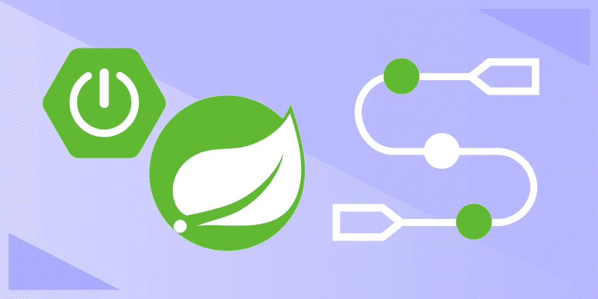
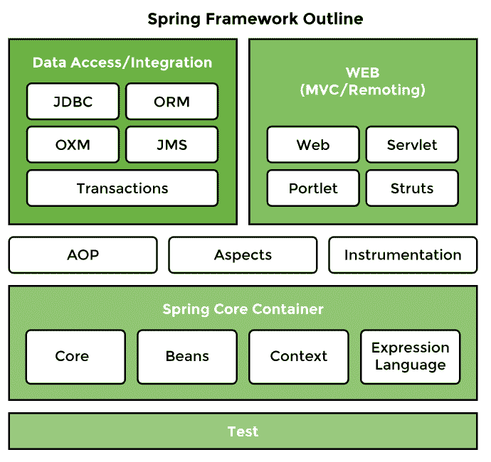
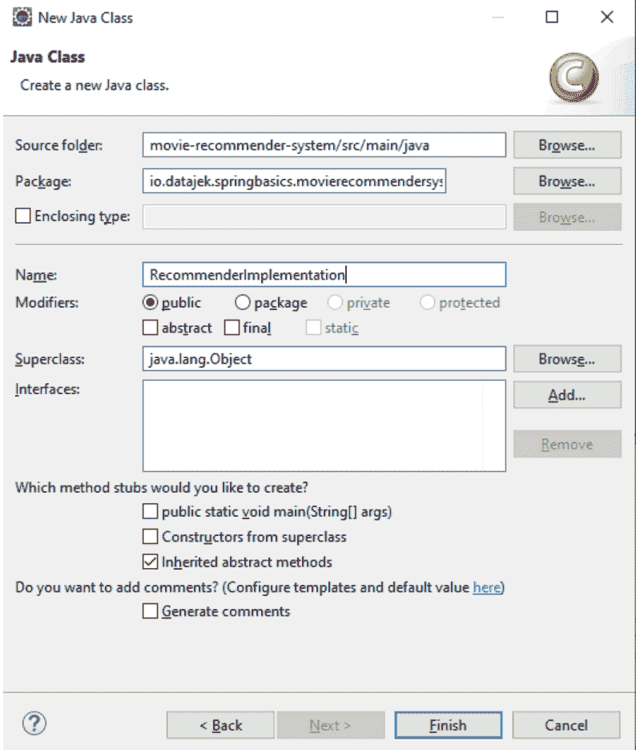

# Spring 框架教程:Spring 入门

> 原文：<https://betterprogramming.pub/spring-framework-tutorial-getting-started-with-spring-b1ec55d79b3d>

## 从突出到先进的功能—您需要知道的一切



图片来源:作者

虽然 Spring 框架经常被认为是过时的，但它仍然是全球企业所期望的流行的应用程序开发工具。Spring 提供了无与伦比的控制、顶级的安全性以及使用 Spring Beans 的省时依赖系统。

然而，Spring 也是出了名的难学，因为它有很多选项和复杂的工具集。

今天，我们将帮助您开始 Spring 开发之旅，向您介绍如何以及为什么使用 Spring 的初学者教程。最后，我们甚至会让你开始你的第一个春季作品集项目。

以下是我们今天要讲的内容:

```
[What is the Spring Framework?](#4d9a)[Salient Features of Spring](#b969)[Spring Architecture and Components](#5673)[Get Started With Spring](#a139)[Advanced Spring Concepts To Learn Next](#ec98)
```

# 什么是 Spring 框架？

Spring 是一个轻量级的开源应用程序开发框架，它使用 Java 企业版(Java EE)和企业 JavaBeans 模型(EJB)。

Spring 通常被认为是“框架的框架”，因为它支持 Java 生态系统中的其他集成框架，如 Struts、Hibernate 和 Tapestry。Spring 有许多针对特定用途的变体，比如 Spring MVC、Spring Boot 或 Spring Security。

Spring 以其依赖注入和控制反转(IoC)系统而闻名，它允许您轻松地创建大规模、松散耦合的应用程序。由于其速度、安全性和易于构建的交易系统，Spring 特别适合金融和企业应用程序。Spring developers 的顶级雇主是花旗银行、易贝、Visa 和摩根大通。

总的来说，Spring Framework 允许您创建安全的企业级应用程序，并且可以自动处理低级功能，如维护容器生命周期和管理依赖关系。

# 弹簧的优点

*   **普通旧 Java 对象(POJO)** : Spring 应用只是使用普通的 Java 对象，而不是服务器或企业容器。这使得应用程序更加轻量级。
*   **模块化:** IoC 和 MVC 允许您在应用程序中重用组件，而无需手动管理每个组件的依赖关系。
*   **对 Java 生态系统的强大支持** : Spring 创新性地使用了现有的技术，比如 ORM 框架、JEE 和 JDK 定时器。
*   可伸缩事务 : Spring 为本地事务和全局事务提供了一致的、可伸缩的事务管理接口。这包括缓存协议。
*   **安全**:易于实施的安全模块，具有认证和验证功能。
*   **灵活配置**:可以选择使用基于 Java 的注释或 XML 配置。

# 春天的缺点

*   **复杂性** : Spring Framework 选择增加控制和复杂性，而不是易用性。因此，Spring 比其他 web 框架更难上手。虽然非常强大，但 Spring 最适合有经验的开发人员，他们可以处理其陡峭的学习曲线。
*   **并行机制** : Spring 广泛的选项意味着一个任务可以通过多种方式完成。您需要对您可用的工具有复杂的了解，以选择理想的解决方案并避免跨团队的混乱。
*   **缺乏健壮的文档** : Spring 的文档在许多主题上缺乏清晰的指导，尤其是围绕网络安全技术。像跨站点伪造和脚本攻击这样的常见攻击，就要靠用户来处理了。Spring Boot 模块的发明解决了其中的许多缺点，它非常有主见，是为[微服务架构](https://www.educative.io/blog/microservices-architecture-tutorial-all-you-need-to-get-started)设计的。大多数现代的 Spring 应用程序都是建立在 Boot 之上的，但是仍然有许多老的应用程序由历史悠久的公司维护。

# 春天的特征

*   **控制反转(IoC)** :将依赖关系的责任从对象转移到框架本身。如果没有 IoC，每个对象都必须处理自己的依赖实例。有了 IoC，对象只需简单地列出它需要某种依赖，框架就会自动配置和管理它。这通过整合依赖系统和减少单个类的工作量简化了应用程序开发过程。
*   **面向方面编程** : Spring AOP 允许你拥有不同的类装入器，以增加模块化和分离横切关注点。
*   **依赖注入**:Spring 用来自动管理 beans 的依赖关系的过程。Spring 检查特定 bean 运行需要哪些 bean，并将它们作为依赖注入。Spring 可以通过使用构造函数或 setter 方法来执行依赖注入。
*   **容器生命周期管理**:自动创建、管理和配置应用对象。
*   **MVC 支持**:支持 MVC web 架构，将模型层、视图层和控制器层的功能分开。
*   **错误处理**:包含异常层次系统的 JDBC 异常处理。

# Spring 架构和组件

让我们分解一个 Spring 框架应用程序的基本部分，以帮助您了解全局。

## 豆子

Spring Beans 是由 Spring 管理的类的实例。它们是 Spring 程序最基本的组成部分。

传统上，对象会创建其依赖关系的个人实例。Spring 管理对象的所有依赖项，并在注入所需的依赖项后将对象实例化为 bean。`@Component`注释是定义 beans 最常用的方法。

```
@Component
public class Vehicle {
}
```

Beans 有一套基于其作用域的生命周期和可见性。有六种类型的作用域:单例、原型、请求、会话、应用程序和 websocket。singleton 和 prototype 作用域可以在任何应用程序中使用，而最后四个作用域只能用于 web 应用程序。

bean 的默认作用域是 singleton，其中只创建 bean 的一个实例并缓存在内存中。对 bean 的多个请求返回对同一个 bean 的共享引用。相比之下，无论何时向应用程序上下文发出 bean 请求，原型范围都会导致新 bean 的创建。

## 自动布线

春天给一个又一个注入豆子的方法。Spring 识别所选 bean 的依赖项，寻找匹配项，然后填充依赖项。`@Autowired`注释告诉 Spring 找到一个协作 bean 并将其注入到另一个 bean 中。如果有多个相同类型的 bean 可用，Spring 会抛出一个错误。

在下面的场景中，Spring 检测到两个 Operator 类型的 beans:

## IoC 容器

IoC 容器是一个提供控制功能反转的框架。IoC 容器管理 beans 并创建任何需要的实例。

例如，假设我们有一个依赖于另一个类`Engine`的类`Vehicle`。

```
class Vehicle{ private Engine engine;
    //...
}
```

有了 IoC，程序员只需要提到依赖关系，Spring 会完成剩下的工作。IoC 容器将创建两个类的实例，并将`Engine`作为依赖注入到`Vehicle`中。

## Spring 模块和 Spring 项目

模块是按预期功能分组的工具集合。开发人员可以指定除了基本模块之外，他们希望将哪些模块作为任何给定应用程序的依赖项导入。

模块被组织在称为项目的组中。每个项目都包含专门用于特定平台或应用程序类型的模块。项目和模块系统有助于保持程序的轻量级，因为您可以选择只加载应用程序中使用的工具。

基本 Spring 项目架构的模块如下所示，按层分组:



图片来源:作者

Spring 核心容器包括使用 Spring 所必需的四个模块:Beans、核心、上下文和 Spring 表达式语言(SpEL)。这些模块负责 Spring 框架的基本功能，如控制反转(IoC)、依赖注入、国际化以及支持在运行时查询对象。

Spring 数据访问/集成层为与数据库交互和管理数据提供了支持。它有四个主要部分:

*   **Java 数据库连接(JDBC)** 模块，允许数据层获取、存储或与其他系统连接，而无需编写繁琐的独立 JDBC 代码。
*   **对象关系映射** (ORM)模块，它允许您的 Spring web 应用程序与 ORM 框架接口。
*   Java 消息服务 (JMS)模块，它允许 Spring 生成自己的消息并使用来自其他系统的消息。这对于反应式应用来说是必不可少的。
*   **对象-XML 映射** (OXM)模块，它提供了一些有用的特性，使对象到 XML 文件的转换变得容易。

web 层包含用于创建 Web 应用程序的 Web、Servlets、Portlets 和套接字模块。

测试模块解决了单元测试的横切关注点。Spring 测试框架支持使用 JUnit、TestNG 进行测试，并支持创建模拟对象来单独测试代码。

AOP 模块提供了面向方面的编程功能，如方法拦截、切入点、安全性和日志记录特性。Spring 有自己的模块，叫做 Spring AOP，它提供基本的、面向方面的编程功能。高级 AOP 功能可以通过与 AspectJ 的集成来实现。AOP 突出了来自业务逻辑的横切关注点。

在这个基本项目之外，Spring 包含了所有主要用例的项目。这些项目包括对于一个基本项目来说过于小众的模块，但是包括目标用途的无价的 API 和功能。

例如，Spring Cloud 允许开发可以动态配置和部署的云原生应用程序。它提供了处理分布式系统中常见模式的功能。其他项目包括 Spring Boot，春天的安全，春天的道，春天的背景，等等。

# 从春天开始

现在，我们将让您获得一些关于您的第一个 Spring 应用程序的实践经验:一个简单的电影推荐系统。

用 Spring Framework 建立一个新项目很困难，因为你需要手工建立完整的架构，包括使用哪些 Apache Maven 依赖项，是使用 XML 还是 Java，还必须安装 Tomcat 这样的 web 服务器。

相反，我们将使用 Spring Boot 项目来自动化大部分设置过程，并使用其内置的 web 服务器。

## 如何开始你的项目

我们将使用 Spring Initializr 通过简单的选择菜单快速创建一个 Spring Boot 项目。

首先去`start.spring.io`。你会发现一个菜单界面，如下图所示，带有设置选择和元数据字段。


图片来源:作者

对于这个项目，我们将选择“Maven 项目”，选择 Java 作为我们的语言，并选择最新版本的 Spring Boot。现在避免“快照”版本，因为这些版本正在进行 alpha 或 beta 测试。在“项目元数据”下，为“组 ID”输入`io.datajek.springbasics`，为“ArtifactID”输入`movie-recommmender-system`组 ID 和工件 ID 基本上就是包名和类名。您通常会在“依赖项”下添加模块依赖项，但是这个项目只需要默认的 Spring 工具。

输入所有内容后，按“生成”创建一个带有安装架构的 zip 文件。将文件夹解压缩到硬盘上的所需位置。这个文件夹将包含一个要导入到 [Eclipse IDE](https://www.educative.io/blog/best-java-ides-2021#eclipse) 的`pom.xml`文件。

片刻之后，您将看到以下层次结构:

*   `src/main/java`编写 Java 代码的地方
*   `src/main/resources`写入应用程序属性的地方
*   `src/test/java`在将要编写测试的地方，您现在可以右键单击`MovieRecommenderSystemApplication.java`并将其作为 Java 应用程序运行，以产生以下控制台输出。

```
.   ____          _            __ _ _
 /\\ / ___'_ __ _ _(_)_ __  __ _ \ \ \ \
( ( )\___ | '_ | '_| | '_ \/ _` | \ \ \ \
 \\/  ___)| |_)| | | | | || (_| |  ) ) ) )
  '  |____| .__|_| |_|_| |_\__, | / / / /
 =========|_|==============|___/=/_/_/_/
 :: Spring Boot ::        (v2.3.4.RELEASE)
2021-05-03 22:46:15.549  INFO 78 --- [           main] .b.m.d.MovieRecommenderSystemApplication : Starting MovieRecommenderSystemApplication v0.0.1-SNAPSHOT on b041f076fcbd with PID 78 (/Code/movie-recommender-system/target/movie-recommender-system-0.0.1-SNAPSHOT.jar started by root in /Code/movie-recommender-system/target)
2021-05-03 22:46:15.563  INFO 78 --- [           main] .b.m.d.MovieRecommenderSystemApplication : No active profile set, falling back to default profiles: default
2021-05-03 22:46:16.458  INFO 78 --- [           main] .b.m.d.MovieRecommenderSystemApplication : Started MovieRecommenderSystemApplication in 1.41 seconds (JVM running for 1.855)
```

祝贺你，你和 Spring Boot 一起建立了你的第一个春季申请！

## 添加依赖关系

现在，我们将使用 Spring 的依赖系统添加一个简单的电影推荐器实现。该程序将一个电影标题作为输入，并返回三个相同类型的电影标题。现在，我们将对我们的输出进行硬编码，这样您就可以专注于学习程序的结构。

首先，在`src/main/java`中创建一个名为`RecommenderImplementation`的新类。



图片来源:作者

接下来，我们将把`recommendMovies`方法添加到`RecommenderImplementation`中。`recommendMovies`方法将接受一个字符串电影标题作为输入，并在一个字符串数组中返回三个推荐。

使用下面的硬编码实现:

```
public String[] recommendMovies (String movie) {
    //use content based filter to find similar movies
    //return the results
    return new String[] {"M1", "M2", "M3"};
}
```

现在，在`MovieRecommenderSystemApplication`文件中创建一个`RecommenderImplementation`类的实例，然后通过`RecommenderImplementation`类调用`recommendMovies`方法。代码如下:

```
public static void main(String[] args) {
    RecommenderImplementation recommender = new 
RecommenderImplementation();    
    String[] result = recommender.recommendMovies("Finding Dory");
    System.out.println(result);
}
```

接下来，我们将实现基于内容的过滤来查找推荐。为了保持`recommendMovies`独立于过滤逻辑，我们将用一个叫做`getRecommendations`的方法创建一个叫做`ContentBasedFilter`的新类。这种方法可以实现复杂的过滤，查看相关数据，如观看历史、用户匹配评级等。当您在本教程之后继续扩展这个项目时，请记住这些想法。

现在，我们将硬编码`getRecommendations`来返回同样的三部电影，如下所示:

```
public String[] getRecommendations(String movie) {
    //logic of content based filter
    return new String[] {"Happy Feet", "Ice Age", "Shark Tale"};
}
```

我们现在可以在`RecommenderImplementation`类中使用`ContentBasedFilter`类的方法。用下面基于依赖关系的实现替换前面的硬编码实现`recommendMovies`。代码如下:

```
public String[] recommendMovies(String movie) {
    ContentBasedFilter filter = new ContentBasedFilter();
    String[] results = filter.getRecommendations("Finding Dory");
    return results;
}
```

最后，我们将向`main`方法添加一个`toString`方法，使字符串数组作为输出可读。

您的程序现在看起来像这样:

当前的实现是紧密耦合的，因为`RecommenderImplementation`类依赖于`ContentBasedFilter`来工作。现在，我们将解耦这些组件，以允许多种类型的过滤，例如`CollaborativeFilter`。我们将使用一个抽象的`Filter`接口，基于所选的过滤器类型实现不同的实现。

Spring 通过自动创建和管理每个组件的依赖实例来简化这一过程。它将自动检测我们的类之间的依赖关系，这意味着您可以专注于代码。

您的解耦项目将如下所示:

# 接下来要学习的高级 Spring 概念

祝贺您完成了第一个解耦的 Spring 应用程序！随着您继续学习更高级的 Spring 概念，尝试返回到这个项目并实现更复杂的过滤器和特性。这将有助于你巩固你的知识，并在你准备面试时给你一个现成的项目。

适用于本项目的一些新概念是:

*   实施高级自动布线
*   使用 bean 范围优化资源管理
*   使用 Spring web MVC 框架转换为 Web 应用程序
*   使用 BeanFactory 设计模式创建自我修复系统
*   使用 Hibernate 模板和 Java 持久性 API (JPA)添加关系数据库支持

*快乐学习！*