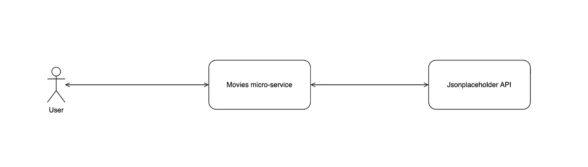
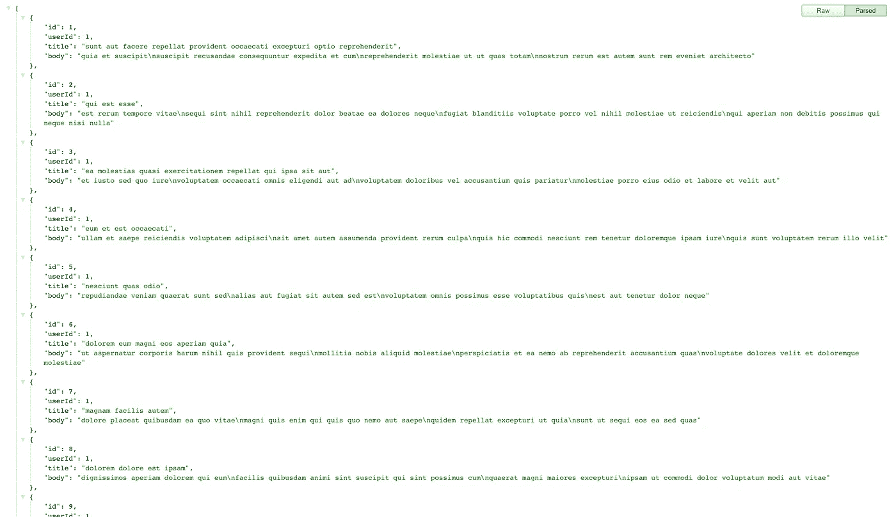

# Spring Boot 和 open feign——微服务之间的通信

> 原文：<https://betterprogramming.pub/spring-internal-micro-service-driven-communication-d75ab2c7363a>

## Spring 内部微服务驱动的通信

在解决方案架构阶段，特别是当我们谈论微服务时，我们需要某种内部数据交换。有很多工具可以做到这一点，比如 Spring rest template 和 web client，但是我使用的是我认为其中最简单的一个:是的，OpenFeign！

# 正在安装 OpenFeign

首先，我们添加 OpenFeign 依赖项(在`pom.xml`文件中)，因此它将由 Maven(我们的依赖项管理器)导入。

正如你已经注意到的，我们正在使用一个属于 Spring cloud 项目的工具，因此，我们需要设置我们正在使用的 Spring cloud 版本。在 properties 标记中，我们将添加 java 和 spring cloud 版本:

请注意，我使用的是 Spring boot 版本`2.6.1`
另外，请注意，我将使用以前文章中的[电影项目](https://github.com/xrio/spring-boot-movies-api)。

在拥有了所有需要的依赖项之后，我们仍然需要声明我们的应用程序在某个包中使用了 OpenFeign。

我们用带有目标包的`@EnableFeignClients`来装饰我们的主类，该目标包将拥有虚拟客户端。

# OpenFeign 客户端实现

在实现中，我将向 JSON 占位符 API(充当第二个微服务)发送一个简单的 get 请求，以使用 OpenFeign 获得帖子列表:

## 定义我们的 DTO

为了利用 Spring Boot 提供的 JSON/POJO 自动转换，我们将使用一个 DTO 来操作接收/发送的数据(posts)。
在`controller > dto`包中，我们创建了`PostDTO.java`文件:

注意，DTO 的结构是由 JSON 占位符 API 的响应定义的。

接下来，我们创建我们的 post 客户端(feign client)，如下所示:

`@FeignClient`将把这个接口声明为一个伪客户端，以便根据我们的需要来实现。

在这种情况下,`name`属性基本上没有用，因为我们不是用名称来寻址 API，而是使用它的 URL。在集成命名注册中心时使用这个名称(未来的文章正在撰写中)。

就像魔术一样，这就是我们客户的全部！

现在我们需要调用我们的客户端，并将响应返回给我们的用户。我们将创建一个`PostController`来完成这个任务:

最后，这就是调用这个`PostController`方法的结果:

感谢阅读。