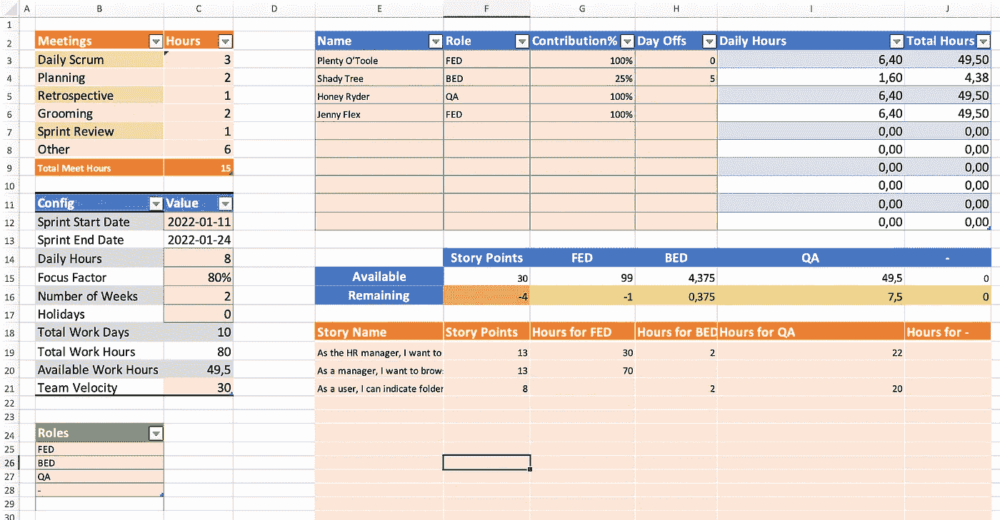

# 冲刺规划:最佳实践

> 原文：<https://betterprogramming.pub/sprint-planning-best-practices-1aad4103f6cb>

## 如何计划最大的成功

容量和速度规划计算器

我在上一篇文章中描述了[速度和容量规划](/sprint-planning-should-velocity-or-capacity-planning-be-used-4fd2aa355d74)之间的区别，但是在这篇文章中，我将分享证明对我的团队有效的 sprint 规划方法。我分享这个方法并不意味着它是绝对的真理。我坚信每个团队都应该尝试并找到最适合他们的方法。我希望这篇文章中的信息能为你的实验提供思路。

我们将规划会议分为以下几个部分:

*   产品负责人提出目标
*   团队了解他们的能力
*   团队分解故事
*   最终的目标是选择

我见过团队跳过一些步骤。我的团队有几个阶段我们跳过了能力计算，没有每小时估计子任务。当你有一个团队，其中大多数工程师一起工作了一年多，并且他们在同一个产品领域工作，那么这个团队就处于这样一种状态，他们只需要看看这些故事就能理解他们能交付什么。

但是，新团队或在新产品领域工作的团队通常需要在速度规划的同时进行详细的容量规划。

所以，不要认为这些步骤是一成不变的，试着去适应你的团队的需要。

# 产品负责人提出目标

每个策划会议都有它的准备:产品负责人做的功课。它包括以下内容:

## **1。定义下一次冲刺的目标**

这是团队应该交付的下一个增量。目标代表用户在成功冲刺后将获得的价值。我看到团队设定了像“发布软件版本 n.n.n .”这样的目标，这并不是一个好的目标，因为它并不代表我们的用户将实际获得什么。

我们通常定义像“用户将能够完成一些事情”类型的故事的目标，这些确实代表了我们将为我们的最终用户带来的确切结果。

这非常重要，因为团队应该清楚地了解他们在 sprint 中应该交付的工作范围。此外，目标应该指向用户从功能角度将获得什么的唯一结果，并且应该避免包含用户如何获得价值的确定性技术方法。团队可能会遇到一些阻碍，这些阻碍改变了他们的技术方法，但仍然为用户提供了想要的结果。

## **2。准备待办事项**

实现目标需要完成的所有故事都包含在 sprint backlog 中。产品负责人确保 sprint backlog 包含的故事总故事点数略高于团队的平均速度。

## 团队了解他们的能力

我们使用我创建的[速度和容量规划计算器](https://drive.google.com/uc?export=download&id=1u95VKdi1SXPkRZPZBG_yVbHILKULy8qQ)，它帮助我们了解我们的分配和可用容量。以下是我们在该表上所做的更新:

*   更新 C 列中的粉色单元格；确保我们排除了会议，例如，如果我们知道我们有一个假期，那么在单元格 C17 中加 1。
*   对于每个工程师，更新贡献百分比和休息日。贡献度用于这样的情况，即待命人员对 sprint 的贡献度为 0%，或者我们有一个贡献度为 0%的新员工，但另一个开发人员将帮助入职，因此我们对 sprint 的贡献度为 70%。

在这之后，我们将知道每个角色的能力(可用时间)——但是我想停下来强调一下，你的目标应该是只有一个角色，因为最好的 Scrum 团队是几乎所有工程师都可以互换工作的团队。当我们来到每个人都在做所有事情的状态时，我已经看到了我的团队的巨大的性能提高:测试、开发，以及帮助产品所有者定义故事。这可能听起来很奇怪，但我会试着就这个话题写另一篇文章。

## 团队分解故事

在这个阶段，团队从最高优先级开始检查每个故事。对于每个故事，团队集体讨论并定义需要完成的子任务，以满足故事完成的定义。

依我看，这是最重要的事情之一，要掌握并对故事进行正确的分解，并对子任务进行每小时的评估。即使在一个强大的团队中，他们知道仅仅基于速度可以交付什么，我仍然强烈建议通过跳过子任务的每小时评估来进行任务分解。

当故事被分解成子任务时，更新[速度和容量计划计算器](https://drive.google.com/uc?export=download&id=1u95VKdi1SXPkRZPZBG_yVbHILKULy8qQ)来指示每个角色的时间。由于工作表只是一个计算器，应该是一个帮助工具，你不需要一个一个地复制所有的故事，但只要确保你总结了每个角色的所有时间。

在每一次冲刺中，总有一些没有故事点的工作需要完成。例如，您有要解决的问题或要调查的事情。这些任务/问题的每小时估计值也会添加到工作表中。

您继续添加子任务和问题，直到其中一个角色没有更多的可用时间。这是一个合适的时间来讨论可以做些什么，就像其他角色可以为没有更多能力的角色做些什么一样。

例如，假设您的后端工程师已经预约满了，但是您有另一个故事需要一些后端工作。这是一个与前端开发人员讨论的好时机，看看他们是否能接受并交付整个故事。

这同样适用于 QA 角色。当 QA 没有更多能力时，其他工程师应该加入进来，帮助测试。

## 最终的目标是选择

当任务被分解，团队的能力被使用时，团队再次关注目标。在这个阶段，他们可能想改变目标。例如，也许团队不能接受所有的故事，或者也许他们有更多的能力，必须从产品 backlog 中加入另一个故事到 sprint 中。因此，这是团队致力于目标的时候。

作为一个提示，我可以说，并不是所有的故事都必须成为目标的一部分。目标可以代表 sprint backlog 中大约 80%的故事。

# 摘要

我建议在四个主要阶段进行规划:(1)产品负责人提出 sprint backlog，并描述他们希望团队交付的下一个增量。(2)团队了解他们的能力。(3)团队将故事分解成子任务。对 sprint 中包含的子任务和问题进行每小时评估。(4)每个人都重新审视目标，调整自己的工作，并致力于实现目标。

这种方法在过去几年里对我的团队很有效，我希望你能找到一些有用的要点来改进你的计划会议。但是，我想再次强调，没有什么是一成不变的，你应该让事情适应你自己团队的流程。

 [## 冲刺计划:应该使用速度计划还是容量计划？

### 这些年来，我参与了许多关于应该如何进行冲刺规划的辩论。有人说最好的方法是…

medium.com](https://medium.com/@gagiks/sprint-planning-should-velocity-or-capacity-planning-be-used-4fd2aa355d74)