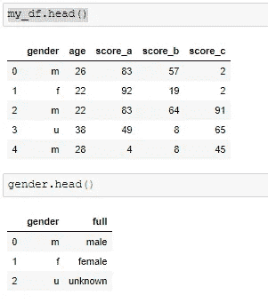
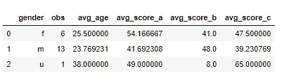
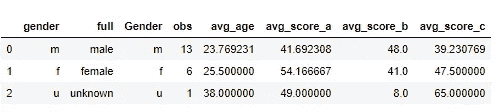
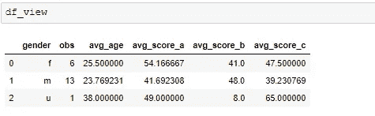

# 如何使用 SQL 语法查询熊猫数据框

> 原文：<https://betterprogramming.pub/sql-with-pandas-data-frames-5192e274c8aa>

## 利用 pandasql 包运行查询


杰斯·贝利在 [Unsplash](https://unsplash.com?utm_source=medium&utm_medium=referral) 上拍摄的照片。

[](https://jorgepit-14189.medium.com/membership) [## 用我的推荐链接加入媒体-乔治皮皮斯

### 阅读乔治·皮皮斯(以及媒体上成千上万的其他作家)的每一个故事。您的会员费直接支持…

jorgepit-14189.medium.com](https://jorgepit-14189.medium.com/membership) 

在以前的文章中，我们提供了如何执行高级 [pandas](https://pandas.pydata.org/) 操作的示例，如[重塑 pandas 数据帧](https://predictivehacks.com/reshape-pandas-data-frames/)、[基于多个条件赋值](https://predictivehacks.com/pandas-how-to-assign-values-based-on-multiple-conditions-of-different-columns/)、[在 pandas](https://predictivehacks.com/dplyr-like-pipes-for-data-manipulation-in-python-using-pandas/) 中使用 dplyr 管道等。

然而，有时编写一个简单的 SQL 查询更方便。下面，我们将向您展示如何使用 SQL 语法轻松查询 pandas 数据框。如果你熟悉 R，我们将使用的包类似于`sqldf`。

# pandasql

## 装置

我们可以下载如下软件包:

```
pip install -U pandasql
```

## 生成样本数据

出于演示目的，我们将生成两个数据帧:



## 使用 SQL 查询熊猫数据框

让我们看看如何查询数据框。

pandasql 中使用的主要函数是`sqldf`。`sqldf`接受两个参数:

*   SQL 查询字符串
*   一组会话/环境变量(`locals()`或`globals()`)

您可以键入以下命令，以避免每次想要运行查询时都指定该命令:

```
from pandasql import sqldf
pysqldf = lambda q: sqldf(q, globals())
```

让我们按性别和观察次数得出`my_df`数据框每一栏的平均分数:



现在假设我们想将这个表与性别表连接起来:



注意，输出是一个熊猫数据框。它可以这样储存:

# sqldf

我们还可以使用一个包装器来对`pandas.DataFrame`对象(Python)运行 SQL (SQLite)查询。

## 装置

我们可以安装它:

```
pip install sqldf
```

要求是:

*   Python >= 3.5
*   熊猫> = 1.0

## 使用 SQL 查询熊猫数据框

让我们提供与上面相同的例子:



注意`sqldf`的括号有问题。显然，您也不能运行子查询。在 GitHub 上随意看看更多的例子[。](https://github.com/christophelebrun/sqldf/blob/master/demo/SQLDF_demo.ipynb)

[](https://jorgepit-14189.medium.com/membership) [## 用我的推荐链接加入媒体-乔治皮皮斯

### 作为一个媒体会员，你的会员费的一部分会给你阅读的作家，你可以完全接触到每一个故事…

jorgepit-14189.medium.com](https://jorgepit-14189.medium.com/membership) 

*原载于* [*预测黑客*](https://predictivehacks.com/sql-with-pandas-data-frames/) *。*