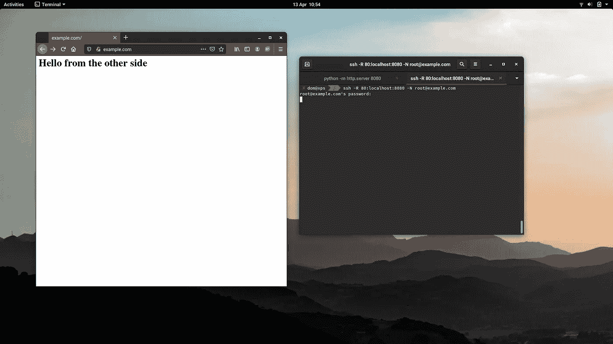

# SSH 反向代理和隧道

> 原文：<https://betterprogramming.pub/ssh-reverse-proxy-and-tunneling-b6d96ab2325>

## 将端口转发到本地机器


丹尼尔·赫雷斯在 [Unsplash](https://unsplash.com?utm_source=medium&utm_medium=referral) 上的照片。

假设您拥有域`example.com`并且端口`22`作为某个虚拟机/服务器的 SSH 端口。这意味着您可以像这样 SSH 到它:

```
ssh user@example.com
```

但是宋承宪可以做得更多。它的一个特性是反向 TCP 代理，可以通过一个命令暴露本地设备上的端口:

```
ssh -R \*:80:localhost:8080 -N root@example.com
```

不需要`-N`标志，也就是说我们不需要在隐藏后执行任何命令。这将适用于任何使用 TCP 的东西，比如 web 服务器、SSH 端口，甚至你的*《我的世界》*服务器。

这会将`example.com:80`绑定到你的`localhost:8080`。请记住，为了绑定到低端口(如`80`或`443`)，您需要以 root 身份使用 SSH。

# 使用密码启用 Root 登录

如果您还想启用带密码的 SSH root 登录:

```
echo "PermitRootLogin yes" | sudo tee -a /etc/ssh/sshd_config
sudo systemctl restart sshd
```

# 绑定到所有地址

如果您想让它在`localhost`以外的地址上可用(例如`0.0.0.0`让它公开可用):

```
echo "GatewayPorts=clientspecified" | sudo tee -a /etc/ssh/sshd_config
sudo systemctl restart sshd
```

# 启动简单的 HTTP 服务器

如果您在本地端口`8080`上启动一个 HTTP 服务器，它也将在`example.com`端口`80`上可用:

```
python -m http.server 8080
```

