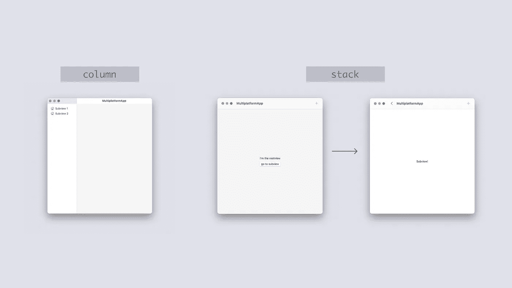
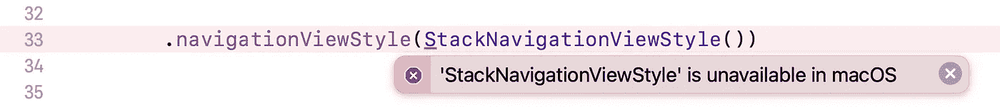
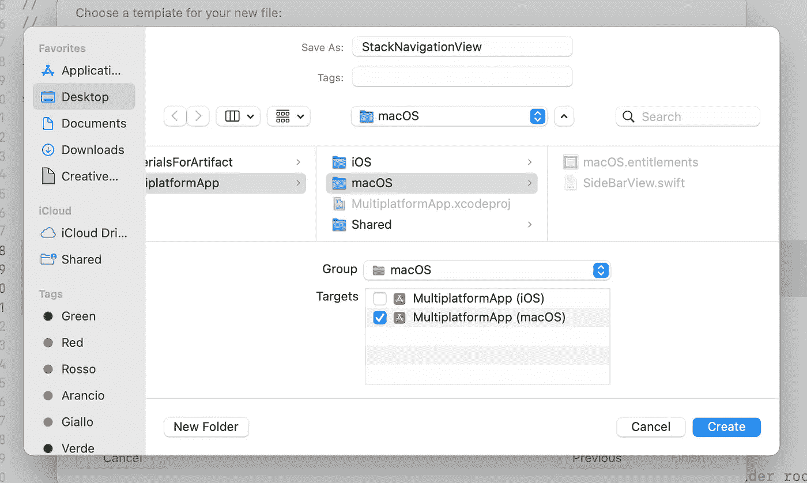
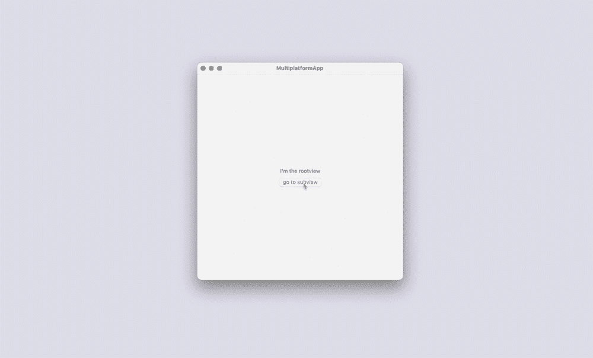
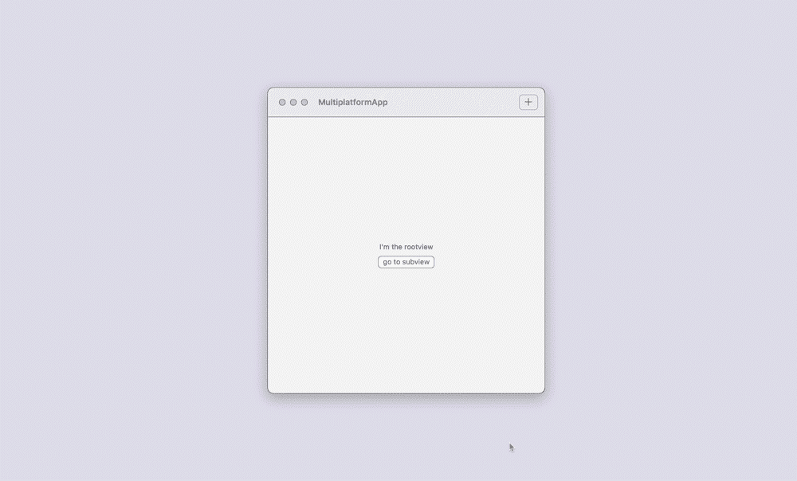
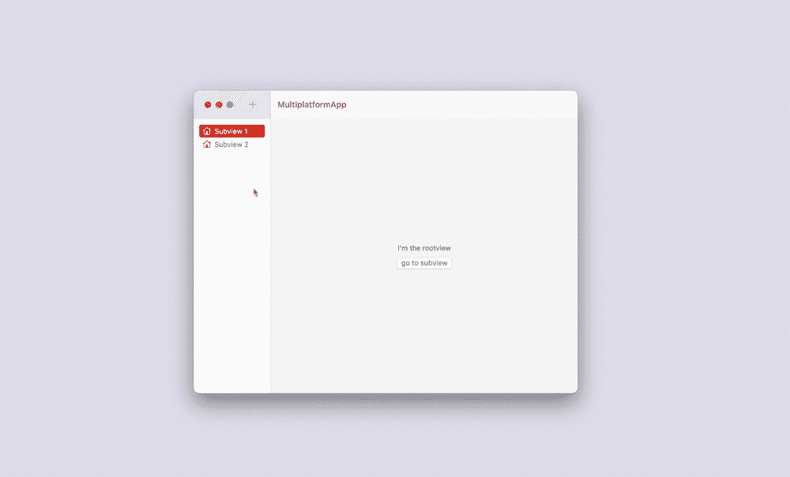

# SwiftUI 中 macOS 上的堆栈导航

> 原文：<https://betterprogramming.pub/stack-navigation-on-macos-41a40d8ec3a4>

## 如何在 macOS 上创建堆栈导航，并在 SwiftUI 中通过您的多平台应用程序实现一致的导航

列和堆栈导航样式比较

在 SwiftUI 中，我们可以选择两种导航视图样式:

*   **列导航—** 由列中的一系列视图表示。通常，你通过侧边栏导航；
*   **堆栈导航—** 由一个视图堆栈表示，一次只显示一个俯视图。

最佳实践是对小型设备使用堆栈导航样式，对大型设备使用列导航样式。

事实上，在小屏幕设备上，应用程序通常有一个标签栏来导航不同的部分，并使用堆栈导航来到达更深的层次；相反，在更大显示屏的设备上的应用程序通常会用侧边栏代替标签栏，侧边栏允许你拥有 5 个以上的元素(这是[人机界面指南](https://developer.apple.com/design/human-interface-guidelines/ios/bars/tab-bars/)建议标签栏拥有的最大元素数量)。

但是，如果您仍然需要层次导航，或者希望在您的多平台应用程序的所有环境中拥有一致的导航，该怎么办呢？

# SwiftUI 中的导航样式

为 iOS/iPadOS 设备编程时，堆栈导航很容易实现:

*   在**iphone 上，** *堆栈导航*是默认导航样式；
*   相反，在**ipad**上，默认行为是*列导航*，但是您可以使用`.navigationViewStyle()`修饰符指定您喜欢的导航样式:

但是 macOS 中的导航呢？

让我们假设你正在开发一个多平台的应用程序，并且已经解决了前面提到的 iPad 的“堆栈导航问题”。然后你试着在你的 Mac 上运行你的项目，你觉得会发生什么？

navigationViewStyle()方法上的编译器错误

像 iPads 上的 iOS 一样，macOS 默认使用分栏式导航，但在这种情况下，堆栈导航*不会像 iOS 一样免费提供*，因此，如果你需要它，你需要*自己创建*。

不过不用担心，下面我们就来看看如何实现这个目标！

# 创建 StackNavigationView 结构

*注意:在本文中,“根视图”指的是我们想要从其开始堆栈导航的父视图；“子视图”指的是我们想要从根视图“堆栈导航”的视图。*

首先，在 macOS 组文件夹中新建一个文件。它只需要 macOS 目标，因为我们只在这个环境中使用它。

创建 StackNavigationView.swift 文件并选择 macOS 目标

在这个文件中，我们创建了带有通用参数`RootContent`的`struct StackNavigationView()`，它符合`View`协议:

意思是我们可以提供任何一种我们喜欢的内容，但是必须符合`View`协议。

在这个`Struct`中，我们需要两个绑定值:

1.  `currentSubview`–告知我们想要在哪个视图中导航；
2.  `showingSubview`–告知我们想要导航的子视图是否显示。

然后，我们创建一个常量属性`rootView`，它返回根视图内容:

现在，我们可以初始化我们的`Struct`:

然后，在我们的`StackNavigationView`中，我们创建另一个`Struct`，`StackNavigationSubview`，它带有一个符合`View`协议的通用参数，保存我们想要显示的子视图:

该结构有两个参数:

1.  传达子视图是否可见的`Binding`
2.  返回子视图内容的属性。

在`StackNavigationSubview()`结构的主体中，我们放置了`contentView()`并创建了一个`ToolbarItem`，它显示了一个返回到根视图的后退按钮:

我们现在可以回到主`StackNavigationView()`并使用其主体内的条件语句来查看`showingSubview`参数并决定显示哪个视图，是根视图还是子视图:

我们的堆栈导航行为已经准备好了，让我们看看如何使用它。

## 准备好一切

在实现之前，我们需要一些简单的配置。在实际的根视图中，我们需要两个`@State`值，一个用于我们想要显示的子视图，另一个用于在显示和不显示子视图之间切换(这些是将值证明给我们在 StackNavigationView 结构中定义的两个绑定的属性):

显然，我们需要一个函数来获取我们想要显示的视图，并切换`showingSubview`状态:

⚠️:我们在根视图中写的东西只能在 macOS 环境中使用。因此，请记住将它包装在条件编译块中！

现在一切都设置为使用我们的`StackNavigationView()`。

# 实现堆栈导航视图

在根视图的主体内，我们实例化结构，在花括号内，我们放置根视图的内容，以及触发导航的控件，例如按钮:

这是结果:

堆栈导航示例

# 技巧

## **#1 工具栏**

因为您的子视图有一个工具栏元素，所以为了避免这个奇怪的结果，您需要在根视图中也有一个工具栏元素。

你可以在`StackNavigationView()`上附加一个`toolbar`，就像这样。

工具栏问题已修复的堆栈导航示例

## **#2 zIndex**

在一些更复杂的界面中，在转换过程中，根视图可能会与子视图重叠。为了确保避免这种行为，在`StackNavigationView()`中，您可以为根视图指定一个负的`zIndex`。

## **#3 侧边栏**

您也可以将堆栈导航与经典的栏导航(即边栏)一起使用。你只需要进入你的主视图(你的应用程序显示的第一个视图)，添加一个之前创建的侧边视图，然后把两个视图打包成一个`NavigationView()`:

带侧边栏的堆栈导航