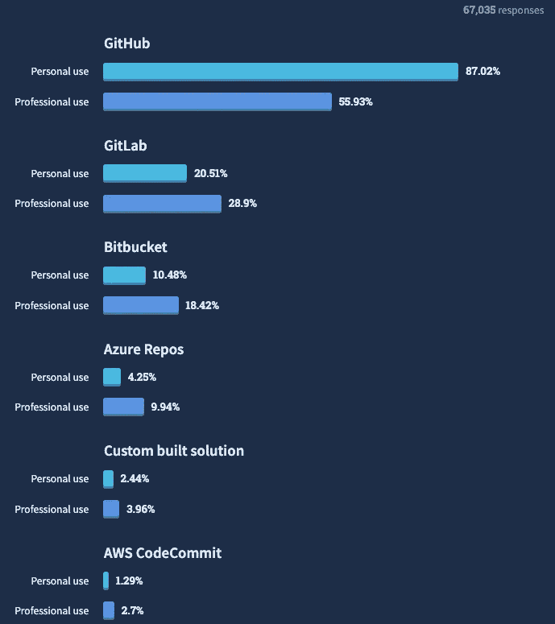
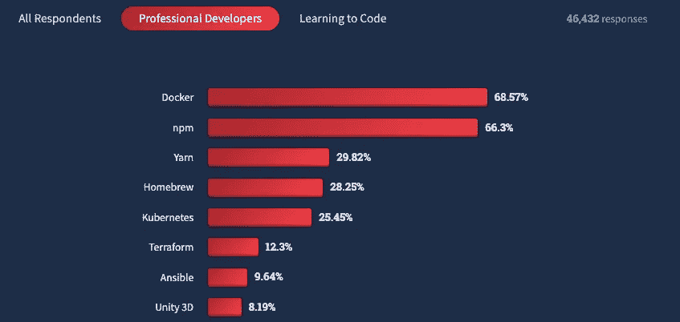
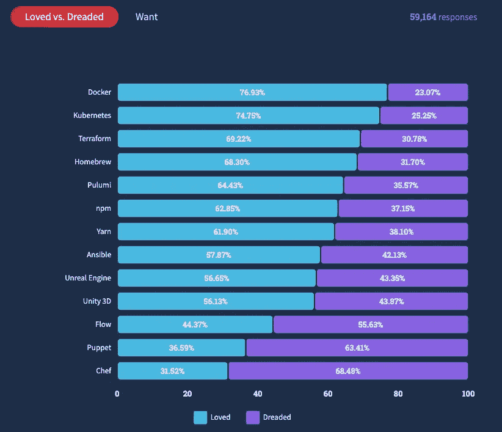
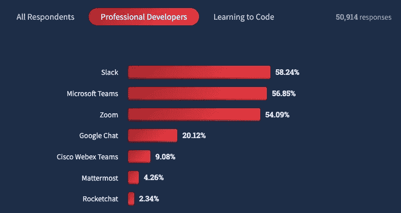
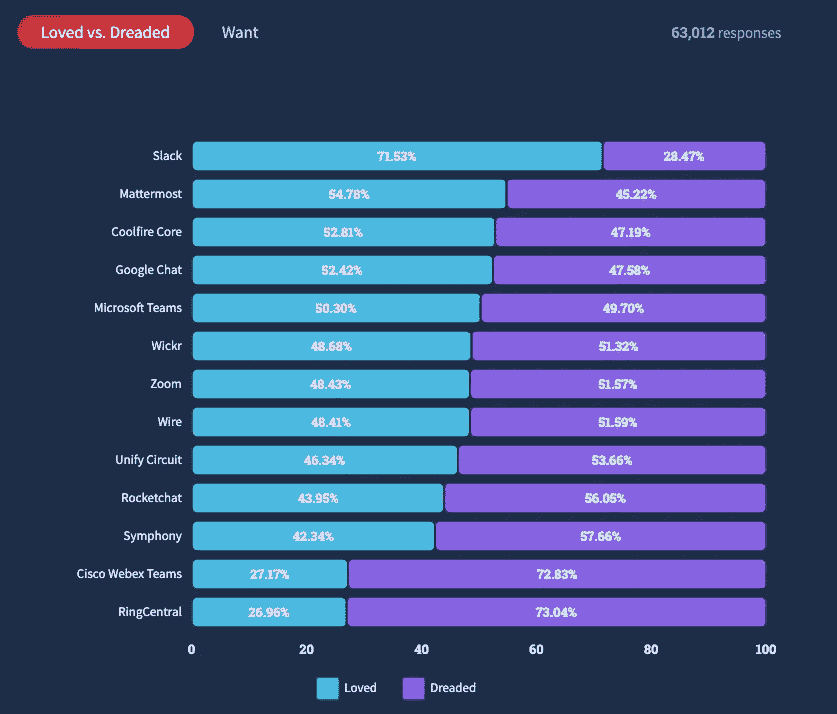
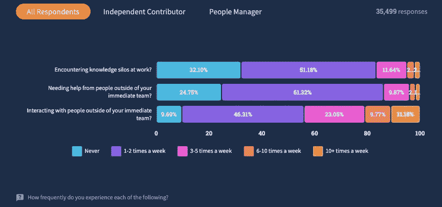
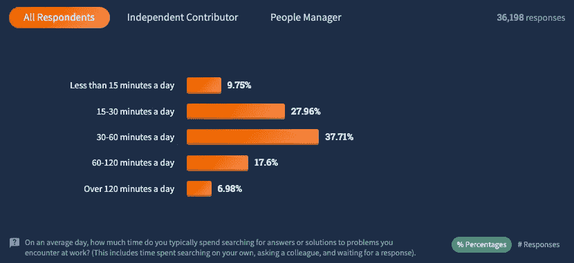
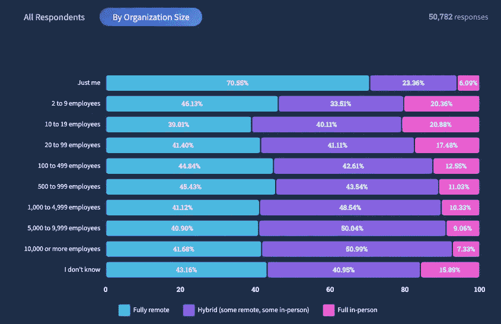
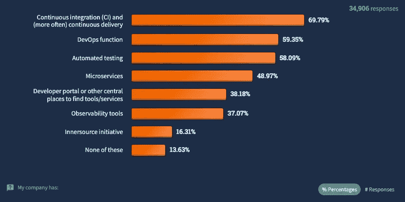

# 堆栈溢出 2022 开发者调查:行业走向何方？

> 原文：<https://betterprogramming.pub/stack-overflow-2022-developer-survey-where-is-the-industry-heading-3cd4a0cd41f3>

## 查看亮点，了解行业发展方向

克里斯蒂娜@ wocintechchat.com 在 [Unsplash](https://unsplash.com?utm_source=medium&utm_medium=referral) 上的照片

[栈溢出](https://stackoverflow.com/)的 2022 年开发者调查结果近日公布。该调查收集了来自不同国家、不同角色和不同技术的 70，000 名开发人员的信息。

> "这份报告是基于对全世界 180 个国家的 73，268 名软件开发人员的调查。"—堆栈溢出开发者调查 2022

让我们看看我从这些调查结果中总结出的要点，以了解该行业的发展方向。

# 1.Git 为王:Git 的使用逐年增加

> “没有其他技术像 Git 一样被广泛使用。尤其是在专业开发人员中。”

你使用的主要版本控制系统是什么？

# 2.版本控制宇宙:GitHub，GitLab，Bitbucket，Azure DevOps

如果你正在构建一个集成了版本控制平台的产品——这就是我在 [Oobeya](https://oobeya.io) 所做的——这就是你的世界:GitHub、GitLab、Bitbucket 和 Azure DevOps。您需要立即覆盖这些，因为整个软件开发行业都生活在这个宇宙中。

你正在使用什么版本控制托管服务？

# 3.码头工人的使用逐年增加

现在每个开发者应该都熟悉 [Docker](https://www.docker.com/) 。开发人员必须首先了解概念及其背后的技术。然后，他们必须获得实践经验。

> “去年，我们将 Git 视为开发人员的基本工具。今年，Docker 似乎正在成为专业开发人员的一个类似的基本工具，从 55%增加到 69%。”

在过去的一年中，您在哪些开发工具上做了大量的开发工作，在接下来的一年中，您希望在哪些工具上工作？

# 4.Docker 和 Kubernetes 是每个开发人员的工具箱

> " Docker 和 Kubernetes 分别是最受欢迎和最受欢迎的工具."

在过去的一年中，您在哪些开发工具上做了大量的开发工作，在接下来的一年中，您希望在哪些工具上工作？

# 5.沟通很重要:开发者喜欢 Slack

在过去的一年中，您经常使用哪些沟通工具，在接下来的一年中，您希望使用哪些工具？

但是不和谐在哪里？

我估计那些不喜欢[懈怠](https://slack.com/)的已经去了[不和谐](https://discord.com/)了，但是不和谐不在这次调查之内。为了与开发者和团队交流，我们在 [Oobeya](https://oobeya.io) 上有 Slack 和微软团队。我们还计划使用 Oobeya 为开发团队添加 Discord 集成。

在过去的一年中，您经常使用哪些沟通工具，在接下来的一年中，您希望使用哪些工具？

# 6.你可能有知识筒仓作为生产力杀手

> “68%的受访者表示，他们每周至少会遇到一次知识孤岛。对于人事经理来说，73%的人表示每周至少会遇到一次知识孤岛。

工程领导者必须首先改变一次性沟通的文化(一次快速地传达需要知道的信息),以打破现有的知识孤岛。

请参阅以下关于打破知识孤岛和提高整体生产力的提示:

1.  创建一个清晰准确的文档系统
2.  练习结对编程
3.  执行更好的代码评审(参见[这里的代码评审技巧](https://oobeya.io/blog/why-code-reviews-should-be-your-favorite-activity/))
4.  使用 Git 分析来识别开发团队中的知识孤岛。( [Oobeya](https://oobeya.io) 让您深入了解代码库和团队中现有的知识仓库。)

您经历以下各项的频率如何？

> “62%的受访者每天花 30 多分钟寻找问题的答案或解决方案。
> 
> 25%的人每天花费超过一小时。不管是独立贡献者还是人事经理，这都是可以用来学习或建设的时间。"

平均每天，你会花多少时间来寻找工作中遇到的问题的答案或解决方案？

> “对于一个由 50 名开发人员组成的团队来说，整个团队每周花费在寻找答案/解决方案上的时间总计在 333-651 个小时之间

# *7.较小的组织通常倾向于在办公室*

> *“85%的开发人员表示他们的组织至少部分是远程的。较小的组织最有可能是面对面的，2-19 名员工的组织中有 20%是面对面的。”*

**

*哪个最能描述你目前的工作情况？*

# *8.开发者体验:组织内的过程、工具和程序*

*我相信今天的软件组织应该在改善整体开发者体验上投入更多。开发团队应该对他们的软件开发和交付管道获得更多的可见性，并努力建立一个透明和负责的工作环境，以提高开发人员的经验和生产力。*

> *"只有 16%的组织有内部资源计划."*

**

*开发者体验*

# *资源*

*   *看这里的原帖:[https://OOB eya . io/blog/stack-overflow-2022-developer-survey-where-the-industry-heading/](https://oobeya.io/blog/stack-overflow-2022-developer-survey-where-is-the-industry-heading/)*
*   *查看完整的堆栈溢出[调查结果这里](https://survey.stackoverflow.co/2022/)！*
*   *了解更多信息的关键词:知识仓库、开发人员体验、git 分析、内部资源计划*