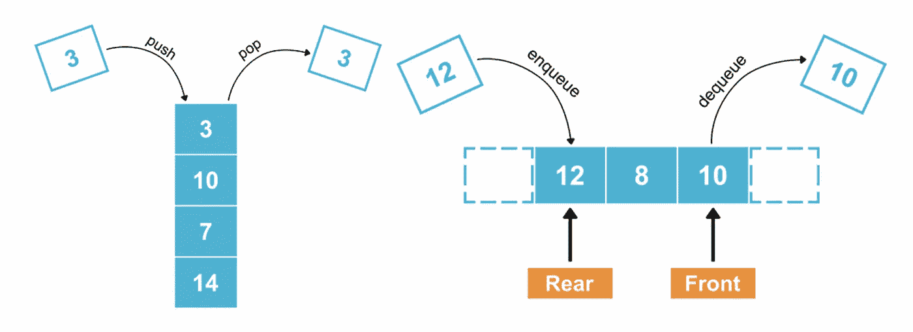
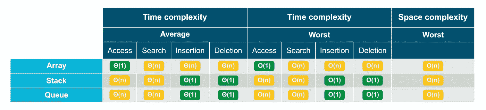
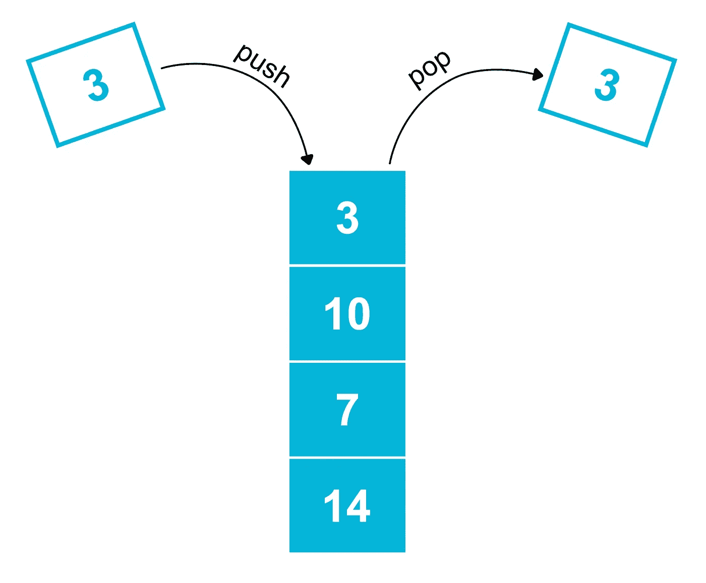
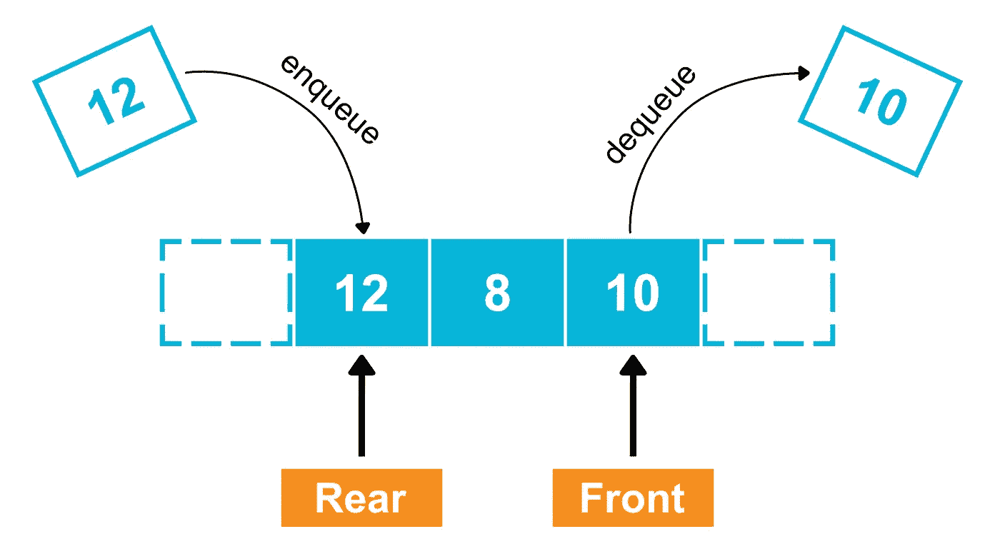
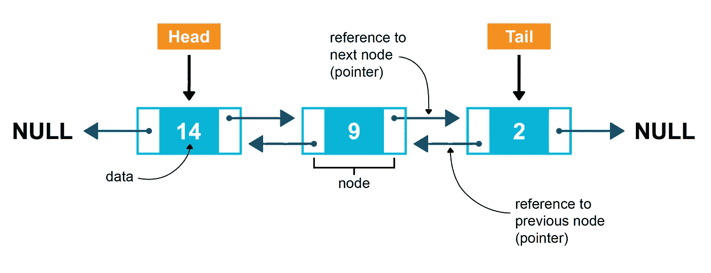

# 堆栈与队列——如何、何时以及为什么使用它们

> 原文：<https://betterprogramming.pub/stack-vs-queue-55d6ea7b2f4f>

## 关于使用堆栈和队列数据结构您需要知道的一切



堆栈和队列图|由作者创建

线性数据结构对于软件工程来说是必不可少的，它为构建我们日常使用的许多功能提供了基础——比如新闻提要和通知系统。当被赋予构建这些特性的任务时，许多工程师只是求助于数组，而没有考虑两个非常重要的数据结构:堆栈和队列。

本文深入探讨了堆栈和队列数据结构、它们的用例、权衡和实现。到本文结束时，您将对栈和队列有一个清晰的理解，能够在您自己的工程任务中使用它们。

# 目录

1.  为什么要关心堆栈和队列？
2.  [什么是栈？](#639c)
3.  [什么是队列？](#db40)
4.  [堆栈 vs 队列—用例](#8b97)
    a) [堆栈用例](#7ab7)
    b) [队列用例](#8fbe)
5.  [如何实现堆栈和队列](#c1d4)
    a) [如何构建堆栈](#fa8e)
    b) [如何构建队列](#215d)
6.  [堆栈与队列汇总](#7ee9)

# 为什么您应该关心堆栈和队列？

在深入兔子洞之前，最好理解为什么您可能想考虑堆栈或队列而不是数组。如前所述，堆栈、队列和数组都是线性数据结构——然而，性能最好的操作在这些数据结构之间是不同的。

> 在比较运算性能时，可以使用三种不同的符号——大 O、ω和θ。大 O 更常用，因为它代表最坏的情况。

通过使用连续内存存储，数组在三种数据结构中执行随机元素访问的速度最快，随机访问的时间复杂度为 O(1)。使用数组的缺点是在搜索、插入和删除元素时只能达到 O(n)。或者，当使用堆栈或队列进行随机访问时，只能达到 O(n ),但是插入和删除的时间复杂度为 O(1)。



数组与堆栈与队列时间和空间复杂性表|由作者创建

> 最终，您应该使用的数据结构取决于给定用例所需的最常见的操作。

既然您已经知道了何时应该避免使用数组，那么让我们来详细了解一下堆栈和队列。

# 什么是堆栈？

最直观的方法是想象一堆盘子。当添加一个盘子到你的堆栈时，你不会想把它放在中间的某个地方；相反，您将把它添加到堆栈的顶部。类似地，当你从盘子堆里拿走盘子时，你应该先从上面开始，然后往下走。这正是堆栈数据结构的行为方式，换句话说，它以后进先出的方式插入和删除元素。



堆栈图|由作者创建

为了实现插入和删除的恒定时间复杂度(O(1))，使用链表构建栈。这是因为当数组上发生插入或删除时，元素会改变它们在内存中的位置；因此它是线性时间复杂度(O(n))。然而这种行为不会出现在链表中，但是我们将在本文的后面对此进行更深入的探讨。

# 什么是队列？

就像堆栈一样，队列也存在于物理世界中——想象一下人们在收银机前排队。正如第一个排队的人将是第一个被服务的人一样，添加到队列中的第一个元素将是第一个被删除的元素——遵循 FIFO 原则(先进先出)。



队列图|由作者创建

队列还使用链表来保证插入和删除元素时的时间复杂度为 O(1)。

# 堆栈与队列—使用案例

由于这两种数据结构中性能最好的操作是插入和删除，唯一不同的因素是它们的 LIFO 或 FIFO 行为，所以在队列上使用堆栈的情况和在队列上使用堆栈的情况完全取决于场景是否需要 LIFO 或 FIFO 特性。下面是堆栈和队列的应用程序列表。

## 堆栈用例

*   堆栈可用于存储为实现撤消功能而触发的操作。
*   用于导航的“后退”按钮(“下一步”导航也使用堆栈)。
*   按时间顺序排列的新闻提要以后进先出的方式运行，以确保最新的条目位于提要的顶部，因此可以为此使用堆栈。

## 队列用例

*   后端任务管理，以类似队列的方式处理操作，如 API 调用、数据库写入和发布/订阅消息系统。
*   警报和通知系统倾向于具有 FIFO 行为，因此可以使用队列来建立这种行为。

值得注意的是，虽然堆栈和队列都使用链表，但是如果您需要的数据结构的用例不需要链表的所有功能，那么在堆栈和队列上使用链表并不理想。堆栈或队列的最佳实现是强制执行 LIFO 或 FIFO 行为的实现，这是因为它是自文档化的，可以保护您的应用程序免受 bug 的影响。

# 如何实现堆栈和队列

如前所述，构建堆栈和队列的最佳方式是使用链表。这是因为链表允许你在插入和删除元素时达到 O(1)的时间复杂度。

链表由包含数据的相邻节点组成，这些节点用指针连接在一起。链表有三种形式:单向链表、双向链表和循环链表；在我们的例子中，我们将使用双向链表。

双向链表有三个主要组成部分:头(第一个元素)、尾(最后一个元素)和节点(包含数据、指向下一个元素的指针和指向前一个元素的指针)。



双向链表图|由作者创建

在堆栈和队列之间一致的组件是节点，让我们看看如何在 Python 中构建节点:

```
# Creating a node classclass Node:

  def __init__(self, data):
    self.data = data
    self.next = None
    self.prev = None
```

如您所见，我们的节点包含数据和两个指针，一个指向上一个节点，一个指向下一个节点。

一旦你写好了这些，你就可以继续构建你的栈或者队列了。

堆栈和队列的主要方法与元素的插入和删除有关。然而，[堆栈抽象数据类型](https://runestone.academy/ns/books/published//pythonds/BasicDS/TheStackAbstractDataType.html)和[队列抽象数据类型](https://runestone.academy/ns/books/published//pythonds/BasicDS/TheQueueAbstractDataType.html)还包括其他三种方法——我们将把它们构建到我们的堆栈和队列类中:

*   `peek()` —返回堆栈中的第一个项目或队列前面的第一个项目，但不删除它。它不需要参数，也不修改堆栈或队列。
*   `isEmpty()` —测试堆栈或队列是否为空。它不需要参数，返回一个布尔值。
*   `size()`返回堆栈或队列中的项目数。它不需要参数，返回一个整数。

## 如何构建堆栈

虽然双向链表包含了头和尾，但是栈只关心它的头，它被称为栈的`top`。让我们首先为堆栈的`top`创建一个实例变量，以及一个`size`实例变量:

```
# Creating a stack classclass Stack:
  def __init__(self):
    self.top = None
    *self*.size = 0
```

**Size 方法** 接下来是`size`方法，它简单地返回堆栈的大小:

```
def getSize(*self*):
  *return* *self*.size
```

**isEmpty 方法**
接下来，我们可以实现`isEmpty`方法——所有需要做的就是测试堆栈是否为空并返回一个布尔值:

```
def isEmpty(*self*):
  *return* *self*.size == 0
```

**窥视法**
接下来，我们可以实施`peek`法，有两件事我们需要做:

1.  检查堆栈是否为空，如果为空，则引发异常。
2.  从栈顶返回数据。

```
def peek(*self*): *if* *self*.isEmpty(): #1
    *raise* Exception("Peeking from an empty stack")
  *return* *self*.top.data #2
```

现在我们可以继续我们的主要操作了:*将*元素推到*堆栈的顶部*并且*将*元素从堆栈的顶部弹出。

**推送方法**
从推送操作开始，需要四个步骤:

1.  创建一个节点实例，并将其`next`指针设置为堆栈的原始`top`节点。
2.  如果堆栈中有现有的`top`，将其`prev`变量设置为新节点。
3.  将`top`实例变量更新到新节点。
4.  将堆叠的`size`增加一个。

```
def push(self, new_el):
  new_node = Node(new_el) #1 - create node
  new_node.next = self.top #1 - set next pointerif self.top != None:
    self.top.prev = new_node #2self.top = new_node #3
  *self*.size += 1 #4
```

**弹出方法**
最后是弹出操作，需要六个步骤:

1.  从堆栈的`top`实例变量中检索第一个节点。
2.  将第二个节点的`prev`指针设置为`None`。
3.  将`top`实例变量更新到第二个节点。
4.  在要删除的节点上，将`next`指针设置为`None`。
5.  将堆栈的`size`减少一个。
6.  返回要删除的节点的数据。

```
def pop(self):
  if self.top == None:
    print("Stack is empty")
  else:
    del_node = self.top #1
    del_node.next.prev = None #2
    self.top = del_node.next #3
    del_node.next = None #4
    *self*.size -= 1 #5return del_node.data #6
```

构建好堆栈后，您可以这样使用它:

```
stack = Stack() # create a stack instancestack.isEmpty() # logs 'True'stack.push('c')
stack.push('b')
stack.push('a')stack.top.data # logs 'a'
stack.getSize() # logs '3'stack.peek() # logs 'a'
stack.pop() # logs 'a'
stack.top.data # logs 'b'
stack.getSize() # logs '2'
stack.isEmpty() # logs 'False'
```

# 如何构建队列

与堆栈不同，队列与双链表的头和尾组件有关，因为删除和插入发生在队列的两端，称为`front`(队列的右侧)和`rear`(队列的左侧)。在这种情况下，队列的`front`和`rear`需要一个实例变量，以及一个`size`实例变量。

```
# Creating a queue classclass Queue:
  def __init__(self):
    self.front = None
    self.rear = None
    self.size = 0
```

**Size 方法**
接下来是`size`方法，它简单地返回队列的大小:

```
def getSize(*self*):
  *return* *self*.size
```

**是空方法**
接下来，我们可以实现`isEmpty`方法——只需要测试队列是否为空并返回一个布尔值:

```
def isEmpty(*self*):
  *return* *self*.size == 0
```

**Peek 方法**
接下来，我们可以实施`peek`方法，我们需要做两件事:

1.  进行卫生检查，查看队列是否为空，如果为空，则引发异常。
2.  从堆栈的`front`元素返回数据。

```
def peek(*self*): *if* *self*.isEmpty(): #1
    *raise* Exception("Peeking from an empty queue")
  *return* *self*.top.data #2
```

现在我们可以继续我们的主要操作:*将*元素插入到队列的`rear`中，并且*从队列的`front`中删除*元素。

**入队方法**
入队方法从包含五个步骤的入队方法开始:

1.  创建一个节点实例，并将其`next`指针设置为指向队列的原始`rear`节点。
2.  如果队列中有一个现有的`rear`节点，将它的`prev`变量设置为新节点。
3.  如果队列中没有现有的`rear`节点(即队列为空)，则将`front`实例变量设置为新节点。
4.  将`rear`实例变量更新到新节点。
5.  将队列的`size`加 1。

```
def enqueue(self, new_el):
  new_node = Node(new_el) #1 - create node
  new_node.next = self.rear #1 - set next pointerif self.rear != None:
    self.rear.prev = new_node #2
  else:
    self.front = new_node #3self.rear = new_node #4
  *self*.size += 1 *#5*
```

**出列方法**
最后一步是构建出列方法，包括六个步骤:

1.  从队列的`front`实例变量中检索前端节点。
2.  从前面获取前一个节点，并将它的`next`指针设置为`None`。
3.  将`front`实例变量更新到步骤 2 中提到的节点。
4.  将`prev`指针设置为指向正在删除的节点上的`None`。
5.  将`queue`的尺寸减少一个。
6.  返回正在删除的节点的数据。

```
def dequeue(self):
  if self.front == None:
    print("Queue is empty")
  else:
    del_node = self.front #1
    del_node.prev.next = None #2
    self.front = del_node.prev #3
    del_node.prev = None #4
    *self*.size -= 1 *#5*return del_node.data #6
```

最后，您可以像这样使用队列:

```
queue = Queue() # create a queue instancequeue.isEmpty() # logs 'True'queue.enqueue('c')
queue.enqueue('b')
queue.enqueue('a')queue.front.data # logs 'c'
queue.rear.data # logs 'a'queue.getSize() *# logs 3*queue.peek() # logs 'c'
queue.dequeue() # logs 'c'
queue.top.data # logs 'b'
queue.rear.data # logs 'a'
queue.getSize() # logs '2'
queue.isEmpty() # logs 'False'
```

# 堆栈与队列:摘要

虽然堆栈和队列都是非原始的线性数据结构，最好使用链表来实现，但关键的区别是它们的 LIFO 和 FIFO 的本质。

由于在堆栈和队列中插入和删除元素的方式不同，使用数据结构的应用程序也完全不同。

让自己对每一种可用的数据结构有一个深入的了解，这将有助于你构建高性能和高效的应用程序，我希望这篇文章已经帮助你构建了这些知识！