# 堆栈和队列介绍

> 原文：<https://betterprogramming.pub/stacks-and-queues-7c322b5f4e35>

## 改进您的数据结构


潘卡杰·帕特尔在 [Unsplash](https://unsplash.com?utm_source=medium&utm_medium=referral) 上的照片。

# 背景

优化代码很少是一件容易的事情。代码可能按预期工作，但是如果执行时间太长，那么代码就是低效的，需要优化。数据结构——编码世界中不可避免的邪恶——代表了优化的主要症结。在正确的场景中使用正确的数据结构会使你的代码比使用暴力方法运行得更快。

这些数据结构之一是堆栈和队列。我个人感觉这是一个鲜为人知的数据结构，非常容易实现，而且没有得到足够的喜爱。

# 堆栈和队列

在我们深入研究之前，让我们定义一下什么是栈和队列。堆栈遵循先入后出(FILO)模式。队列遵循先进先出(FIFO)模式。尽管这两个术语通常作为一个短语捆绑在一起，但它们遵循两种不同的设计模式。

# 大量

让我们深入了解一下堆栈，从空堆栈开始。

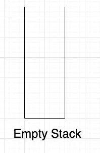

我们目前没有任何东西。接下来，让我们将 10 加到堆栈中。

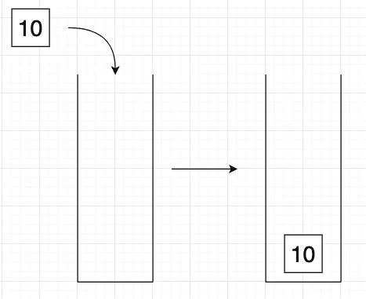

将“10”添加到空堆栈中。

将 10 添加到堆栈后，它会落到堆栈的底部。请记住，10 是堆栈中的第一个。如果您按此顺序将 20 和 30 相加，堆栈现在应该如下图所示:

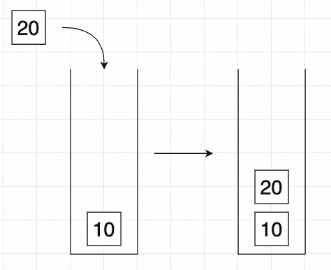

当前堆栈增加 20。

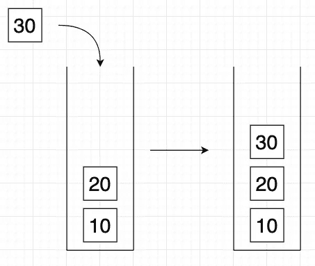

当前堆栈增加 30。

当前堆栈，从下到上，现在是 10，20 和 30。如果我想把 10 取出来呢？啊，我们现在不能，因为 30 号和 20 号挡住了路。我们需要取出 30 个，然后取出 20 个，最后取出 10 个。10 将是当前堆栈中的最后一个。

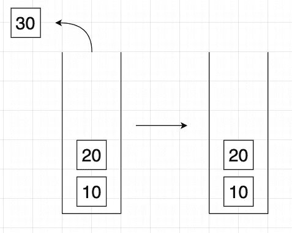

从当前堆栈中删除 30。

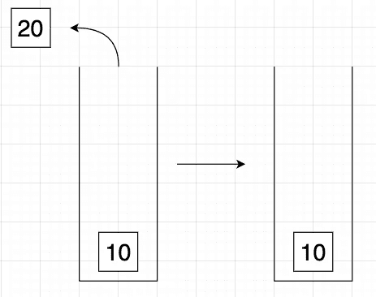

从当前堆栈中删除 20。

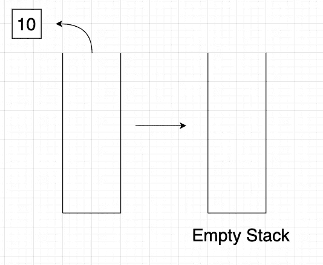

从当前堆栈中删除 10。

这就是先进后出(费罗)的意思。放入堆栈的第一个元素将是从堆栈中移除的最后一个元素。10 是放入堆栈的第一个元素(先进)，也是从堆栈中移除的最后一个元素(后进)。我知道这听起来有些多余，但是尽可能清楚地解释这些术语将有助于避免任何混淆。

# 代码术语中的堆栈

既然我们已经理解了成为 FILO 意味着什么以及栈是如何工作的，那么是时候从代码的角度实际实现一个栈了。我将使用 JavaScript 来演示这一点。但首先，为了给出一个更清晰的画面，让我们重复使用我们之前的例子。出于演示目的，让我们将堆栈顺时针旋转 90 度，使其看起来像这样:

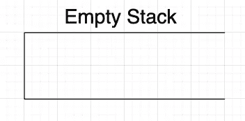

关于代码，我们可以用一个数组来表示一个空栈。

```
let stack = []
```

接下来，我们可以向空堆栈中添加 10。

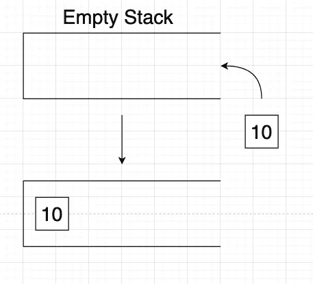

向空堆栈添加 10。

就代码而言，这与以下内容相同:

```
stack.push(10)
console.log(stack) // [10]
```

现在让我们依次放入 20 和 30。

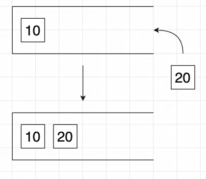

当前堆栈增加 20。

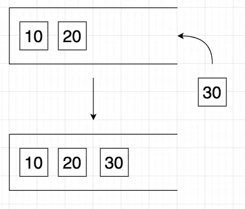

当前堆栈增加 30。

就代码而言，这与以下内容相同:

```
stack.push(20)
stack.push(30)
console.log(stack) // [10, 20, 30]
```

现在让我们把它拿回来，开始从堆栈中删除，从最近添加的开始。

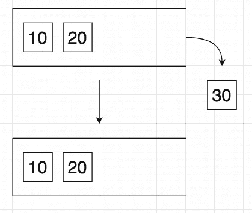

从当前堆栈中删除 30。

在代码中，这与:

```
stack.pop()
console.log(stack) // [10, 20]
```

为了简洁起见，我将跳过图片，但我们将对 20 和 10 做同样的事情。在代码中，我们会再调用两次`.pop()`方法。

```
stack.pop()
stack.pop()
console.log(stack) // []
```

实现一个堆栈就这么简单！由于 JavaScript 的内置方法，我们可以通过使用数组和使用`.push()`和`.pop()`创建自己的堆栈来实现堆栈数据结构。

# 行列

到目前为止，我们只讨论了堆栈和堆栈如何是 FILO。如果你能够理解栈是如何工作的，队列是非常相似的。因为队列遵循先进先出(FIFO)设计模式，所以我们也可以使用数组来表示队列。

另一种思考队列的方式是排队。通常，排队的人是根据他们到达的顺序得到服务的——就像你排队进入一个场地一样。

我打算将图像与代码结合起来，以节省一些时间和空间。

类似于我们如何开始一个空栈，让我们从一个空队列开始。

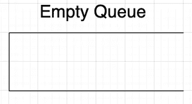

```
let queue = []
```

接下来，我们将按顺序将 10、20 和 30 添加到队列中。您可以使用我们对堆栈使用的相同图像作为队列的参考，因为它实际上在做同样的事情。就代码而言，我们仍将使用`.push()`方法。

```
queue.push(10)
queue.push(20)
queue.push(30)
console.log(queue) // [10, 20, 30]
```

到目前为止，先入部分保持不变。由于队列是先进先出的，这就是它与堆栈不同的地方。目前，我们的队列如下所示:

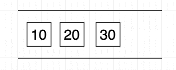

当前队列。

因为 10 是第一个添加的元素，所以现在它将是第一个删除的元素。

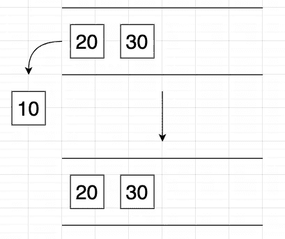

从当前队列中删除 10。

那么，我们如何用代码来实现呢？谢天谢地，JavaScript 也有一个内置的方法来为我们做这件事:`.shift()`。

```
queue.shift()
console.log(queue) // [20, 30]
```

现在，如果我们按照添加元素的顺序清空队列，我们将继续调用`.shift()`方法。

```
queue.shift()
queue.shift()
console.log(queue) // []
```

实现队列也是如此简单！与堆栈一样，我们可以使用 JavaScript 的内置方法，通过`.push()`方法实现先进先出，通过`.shift()`实现先进先出。

# 堆栈和队列的时间复杂度

对于本节，我做了以下假设:

1.  你理解时间复杂性和大 O 符号。
2.  您了解数组的内存分配机制。

如果你不理解上面提到的两个概念，我强烈建议你在继续学习之前先阅读一下。

对于堆栈来说，使用`.push()`的时间复杂度是 *O(1)* ，因为`.push()`总是添加到数组的末尾，索引推入的元素是一个操作，因为它增加了一个索引。使用`.pop()`也是 *O(1)* ，因为`.pop()`访问并移除数组的最后一个元素。当最后一个元素被删除时，其余的元素不受影响，因为它们不需要被重新索引。所以总体来说，栈的时间复杂度是 *O(1)* 。

对于队列，由于我们也使用了`.push()`，时间复杂度仍然是 *O(1)* ，原因和上一段提到的一样。但是，使用`.shift()`方法的时间复杂度为 *O(n)* 。这是因为当您从数组中移除第一个元素时，计算机将需要重新索引其余的元素，这取决于数组的长度。所以总体来说，使用队列的时间复杂度是 *O(n)* 。

希望您能够实现这一点。如果没有，至少你知道了一个额外的数据结构！