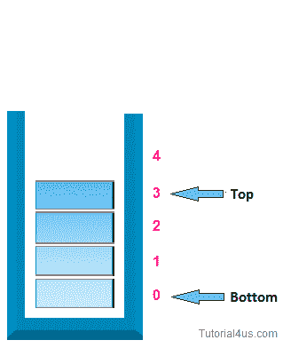
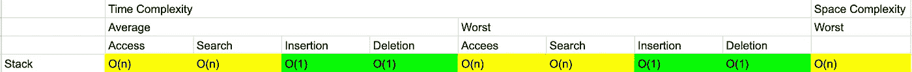

# JavaScript 中的堆栈

> 原文：<https://betterprogramming.pub/stacks-in-javascript-d2f0e4404eac>

## 当堆栈可以使用时，不要使用数组

照片由[布鲁克·拉克](https://unsplash.com/@brookelark?utm_source=medium&utm_medium=referral)在 [Unsplash](https://unsplash.com?utm_source=medium&utm_medium=referral) 上拍摄

堆栈是一种基本的线性数据结构，其中条目的插入和删除发生在称为堆栈顶部的一端。它遵循 LIFO(后进先出)或 FILO(先入后出)的顺序，最后添加到堆栈中的元素将是从堆栈中移除的第一个元素。堆叠的经典现实例子是自助餐中的一叠盘子，最上面的盘子总是第一个被拿走的。堆栈数据结构通常用于管理函数调用、撤销/重做和路由。

堆栈示例[(链接)](https://gist.github.com/njang/2d318820030fcfb7804ecb43771a74e3)

JavaScript 中没有内置的堆栈数据结构，但实现起来相对简单。

# **阵列实现**

即使 JavaScript 中没有内置的堆栈数据结构，我们也使用数组数据结构并借助`push()`、`pop()`、`unshift()`和`shift()`方法来创建堆栈。其中，`unshift()`和`shift()`需要对数组中的元素进行重新索引，增加了时间复杂度。所以`push()`和`pop()`是我们的首选。为了更好的理解栈的数组实现，下面我们将其应用到 [leetcode 问题](https://leetcode.com/problems/valid-parentheses/)中。

给定一个仅包含字符`'('`、`')'`、`'{'`、`'}'`、`'['`和`']'`的字符串，确定输入字符串是否有效。

在下列情况下，输入字符串有效:
1。左括号必须用相同类型的括号括起来。
2。左括号必须以正确的顺序结束。

请注意，空字符串也被视为有效。

**例 1:
输入:** `"()"`
**输出:** `true`

**例 2:
输入:** `"()[]{}"`
**输出:** `true`

**例 3:
输入:** `"(]"`
**输出:** `false`

**例 4:
输入:** `"([)]"`
**输出:** `false`

**例 5:
输入:** `"{[]}"`
**输出:** `true`

通常，当我们处理有效括号问题时，我们使用堆栈数据结构作为解决方案的一部分。

[https://gist . github . com/gaier ken/1508 b 0 e 75 EB 66 a86 a5d 98339088 f1 d 09](https://gist.github.com/GAierken/1508b0e75eb66a86a5d98339088f1d09)

# **链表实现**

为了用链表实现堆栈，我们创建了`Stack`类和`Node`类。

我们如何将新节点推入堆栈？首先，我们需要一个值来创建一个新节点。如果堆栈中没有节点，则将第一个和最后一个属性设置为新创建的节点。如果至少有一个节点，则创建一个变量来存储堆栈上的当前第一个属性，并将第一个属性重置为新创建的节点。将新的第一个属性的下一个属性设置为以前创建的变量。不要忘记将堆栈的大小增加 1。

[https://gist . github . com/gaier ken/7 feaaab 32 f 87 a4 BC 363 fbfa 07d 349 e 65](https://gist.github.com/GAierken/7feaaab32f87a4bc363fbfa07d349e65)

我们如何弹出节点？如果堆栈中没有节点，则返回 null。如果堆栈中有节点，则创建一个临时变量来存储堆栈中的第一个属性。如果只有一个节点，则将第一个和最后一个属性设置为 null。如果有多个节点，则将第一个属性设置为当前第一个节点的下一个属性。将大小减一，并返回被移除的节点的值。

[https://gist . github . com/gaier ken/9b 1580448 D6 CEB 60d 453 c8 ce 7 FB 8 cc 8d](https://gist.github.com/GAierken/9b1580448d6ceb60d453c8ce7fb8cc8d)

# **一叠叠的大 O**

一大堆

# 资源:

 [## JavaScript (JS)算法和数据结构大师班

### 嗨！我是柯尔特。我是一名热爱教学的开发人员。过去几年我一直在教人们…

www.udemy.com](https://www.udemy.com/course/js-algorithms-and-data-structures-masterclass/)  [## 堆栈数据结构- GeeksforGeeks

### 极客的计算机科学门户。它包含写得很好，很好的思想和很好的解释计算机科学和…

www.geeksforgeeks.org](https://www.geeksforgeeks.org/stack-data-structure/)  [## 数据结构/堆栈和队列

### 待办事项:队列实现为数组:循环和固定大小堆栈是一个基本的数据结构，可以在逻辑上…

en.wikibooks.org](https://en.wikibooks.org/wiki/Data_Structures/Stacks_and_Queues#:~:text=A%20stack%20is%20a%20basic,called%20top%20of%20the%20stack.)