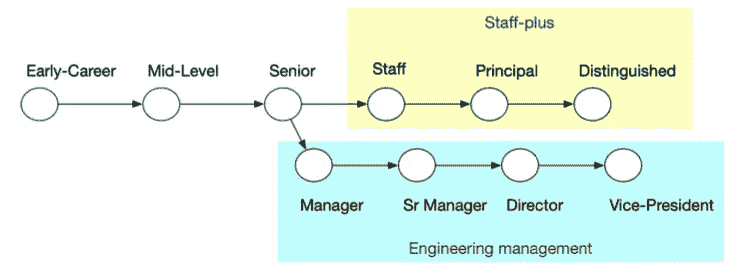
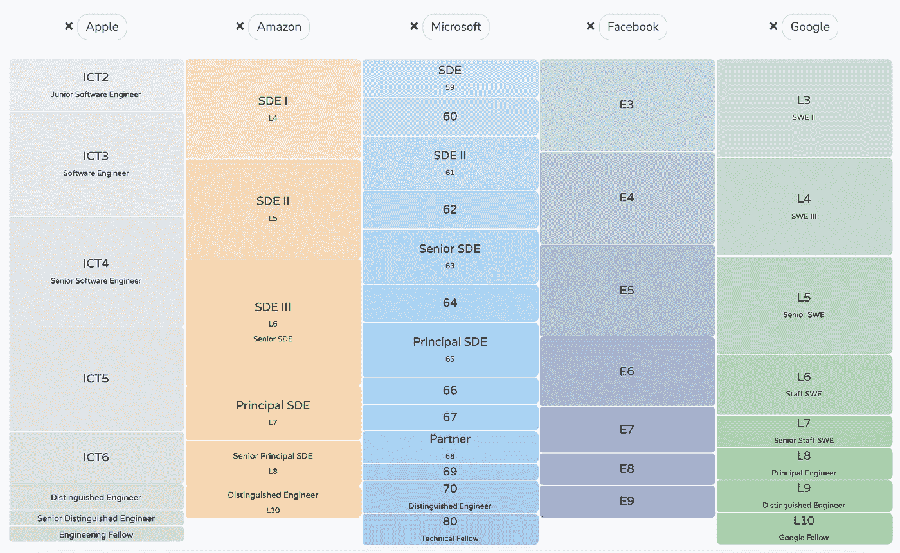

# 员工工程:已解释

> 原文：<https://betterprogramming.pub/staff-engineering-fd629ba1b2ef>

## 了解员工工程的含义以及员工工程师的角色和职责。

Joao Viegas 在 [Unsplash](https://unsplash.com?utm_source=medium&utm_medium=referral) 上拍摄的照片

2021 年初，威尔·拉森(Will Larson)在他的著作《员工工程师:超越管理轨道的领导力》(Staff Engineer:Leadership beyond the management track)中让员工工程学变得流行起来。随着这一概念越来越受欢迎，在过去几年中，员工工程跟踪已经成为技术职业框架中的一个新兴补充。

*资料来源:员工工程师:超越管理轨道的领导力，威尔·拉森著，2021 年。*

虽然“员工工程”这个术语可能相对较新，但职责的性质并不陌生。大多数拥有 10 年以上经验的工程专业人员都会以这样或那样的方式承担工程责任。系统架构师、软件架构师、企业架构师、首席开发人员、首席工程师等头衔。，在员工工程流行之前在行业中更普遍地被实践。

在几年前成为首席开发人员并领导多个不同复杂性的项目后，我不得不在员工工程和管理之间做出选择。当我还是一名开发人员时，成为一名架构师是我的梦想角色之一，并且公司中的一些其他架构师高度支持我担任该角色，但我最终选择继续从事工程管理。虽然管理之旅在智力上是有益的，但员工工程仍然是我最喜欢的角色，尤其是当我直接管理几名员工工程师的时候。

本文将探讨员工工程的含义和员工工程师的工作。

# 技术方向

作为一名员工兼工程师，设定技术方向是最重要的任务之一，但通常不是最频繁的任务。实际上，团队多久需要选择一个云提供商，或者团队多久需要决定是使用函数式编程还是面向对象编程？当员工+工程师必须经常为团队做出战略性技术决策时，团队可能会面临不同的挑战。然而，支持技术方向一致性的战术活动对于员工和工程师来说至关重要。

定义一个技术策略，有时被称为工程策略，需要员工+工程团队的大量投入和积极的技术。工程战略取决于产品战略，产品战略取决于组织战略。员工+工程团队需要确保技术策略与服务于产品并最终服务于业务的大局相一致。技术战略并不总是使用最新的技术，它不等同于产品战略，也不总是关于最新的想法。关于[技术策略](https://medium.com/@danielfoo/understanding-technical-strategy-in-engineering-f60798ae9c8a)我多写了几点思考。

根据工程团队的性质，一些团队有功能级的技术方向，例如，从 RESTful API 调用到事件驱动架构的后端方向，从 Kubernetes 集群到无服务器架构的 SRE 方向，对合同测试的 QA 投资等。一些团队(本质上通常是 B2B)有产品级的技术方向，例如，从将软件作为一个包来运输，或者派遣顾问来进行实现和集成，到软件即服务解决方案。前者需要更多的深度，而后者需要更广的技术优势。无论哪种方式，员工+工程团队都需要在推动这些方向取得成功的过程中展现出强大的领导力。

# 辅导和指导

职员+工程师应该是工程团队中最有经验的技术人员。他们通常被视为团队中的技术专家和导师，团队成员在面临技术挑战时会也应该向他们伸出援手。为资历较浅的工程师提供指导可能是工程团队最有价值的活动之一，也是个人职业生涯中最有收获的经历之一。技术领袖培养更多的技术领袖。

提供技术指导意味着分享过去的经验，包括成功和不成功的实施以及应对技术挑战。有时，可以分享解决重大工程挑战的思维过程。请注意，导师是分享相关的工程经验，而不是告诉学员做什么。

例如，“*如果我是你，我会这么做……*”或“*你应该做……*”这些都是不好的例子。一个好的指导对话听起来会像“*”在过去的项目中，我选择了多 AZ 复制而不是地理复制进行数据存储，因为 80%的客户都在该地区，并且由于当时数据的数量和重要性，成本不合理。不幸的是，这被证明是一个坏主意，因为剩下的 20%的客户贡献了超过 70%的收入。其中一些有我们不知道的可以从地理复制中受益的用例。*“看出区别了吗？

提供技术指导可能比辅导更棘手。辅导对话需要更多的技巧和结构才能有效。这是一次引导工程师发现问题根源或意识到并完全理解真正问题的对话。然后，通过提出具有启发性的问题，引导工程师找到解决方案。同样，员工+工程师不应该试图给出指令或战术步骤，而是引导工程师找到他们的解决方案。

# 为业务提供工程视角

员工+工程师经常参与业务关键的决策制定，如果不是推动重要的高价值项目的话。与传统企业不同，在传统企业中，技术是一种成本开销，许多现代商业模式将技术作为创收活动的推动者。通过让员工+工程师参与讨论来进行战略性技术投资和指导变得至关重要。这意味着职员+工程师必须具备足够的业务领域，以便向业务涉众提供上下文输入。

来自员工+工程师的技术领导力超越了系统实现。了解业务方向的员工+工程师主动为业务提供工程视角。基于已经到位或即将到位的系统，staff+ engineer 以确定云支出预测和优化、审查供应商成本、工具或替代方案投资、团队技能组合、技术里程碑和交付时间表、客户集成和迁移、后期制作所需的技术支持等形式提供业务环境。

技术选择有可能释放业务能力。例如，当客户数据不在同一个数据库中时，交叉销售多种产品的能力可能取决于客户数据的解放程度，以及是否有适当的机制或平台允许以安全、快速和高效的方式共享数据。这样的工程能力释放了商业潜力，员工+工程师在商业和工程之间的桥梁上扮演着重要的角色。

# 研究与开发

创新是每个科技公司的 DNA。缺乏创新是科技企业衰落的早期迹象。虽然许多公司坚持 20%的时间(20%的工程师能力用于创新工作)或创新冲刺(每五次冲刺将被用作一次创新冲刺)等做法，但 R&D 已融入员工+工程师的日常职责中。

然而，这并不意味着员工+工程师可以漫无目的地开始玩不相关的技术。毕竟，研究的自由不是自由时间。员工和工程师应成熟地识别 R&D 工作的目标领域，这些领域有可能使工程团队和业务受益。

R&D 的工作可能涉及研究技术方法的白皮书，为云提供商的新服务开发概念验证，测试可以提高性能或降低成本的优化技术，为新的 SDK 执行试点实施，等等。

这种 R&D 的工作通常是由资历较浅但富有灵感的工程师们作为一个有趣的宠物项目创意开始的。对员工+工程师的期望将是引导 R&D 成果使工程团队或业务受益。R&D 的成果之一是发布了一份内部沟通白皮书。

工作人员+工程师有时会将他们生产时间中有意义的部分用于编写文档，无论是为了技术方向的战略论证(回答诸如为什么我们需要再做一次这样的问题？)或作为工程师指南的战术实现(回答现在我明白为什么，但我如何做？).

# 编写代码与管理

职员+工程师还写代码吗？对大多数公司来说，答案是——可以，但要看程度。这将取决于这是否是将员工+工程师的时间用于该项目的最佳方式。例如，为了实施时间紧迫的概念验证，一名员工和一名工程师将利用从最近的 R&D 中学到的知识以及对产品领域的了解来构建概念验证，并与其他工程师分享解决方案。

如果员工+工程师解释概念、培训团队、审查并提供解决方案的修订版，可能需要多花三倍的时间。

对于基于 cadence 的产品交付周期，员工+工程师能写代码吗？是的，他们可以。但是他们应该吗？也许不会，如果其他资历较浅的工程师也能做到的话。职员+工程师需要问自己，写这段代码是我为工程团队和业务做贡献的最好方式吗？

尽管员工工程通常是个人贡献者的角色，但是假设员工+工程师在技术领导方面没有管理责任是不现实的。通常，员工+工程师将管理具有以下品质的技术计划:

*   实验性的或充满高度不确定性的
*   协调跨职能或跨业务领域的技术集成
*   管理需要详细技术输入的利益相关者
*   有时，在人事经理不在时，有少量直接下属(工程师)

但是，管理责任的百分比不应超过员工+工程师能力的 30%。

# 员工+工程师的职业框架

一个定义明确的职员+工程师的职业框架在大型科技公司比在小公司更常见。许多较小的团队可能甚至没有定义职业框架，头衔被随意抛来抛去。

如果你对技术领导感兴趣，并且认为传统的工程管理不适合你，员工工程当然是一个不错的选择，你应该专注于职业发展。谁知道呢，员工工程职业道路可能会很快成为主流？目前，许多公司拥抱员工工程有一个管理和员工+的平行轨道。

如果薪酬没有包含在职业框架中，这将是一个不完整的讨论。传统上，一些最有经验的工程师相当于初级经理。这两个角色在不同的方面同样具有挑战性。在过去的几年中，随着对员工工程贡献的重视，一些高影响力的员工+工程师有潜力超越经理，特别是那些通过工程镜头积极增加业务价值的人。

工作人员+能力的个人贡献者的上限最近已经提高。换句话说，如果一个人能迅速为企业打造出高质量、有影响力、有效的解决方案，那么作为员工+工程师的薪酬待遇可能会高于经理。

# 摘要

员工+工程可能是一个相对较新的术语，但它在科技行业并不是一个新概念。员工+责任在业务中一直存在，以不同的形式呈现。就我个人而言，我很高兴看到更多的科技公司开始区分并接受工程管理和员工工程之间的差异，为这两种轨道提供发展空间，而不是强迫每个工程师都进入管理轨道，这有时可能是一个错误。如果你对员工的工程职责感兴趣，热情地继续你的工作，要知道你的未来是光明的。