# 仅用 9 分钟就建立了一个 Node.js REST API

> 原文：<https://betterprogramming.pub/stand-up-a-node-js-rest-api-in-just-9-minutes-1a1f60fe5fc2>

## 现在，在您的 REST API 中快速包含 CRUD 操作、错误处理、排序和过滤


来自[像素](https://www.pexels.com/photo/man-wearing-white-sweater-and-black-shorts-about-to-run-936094/?utm_content=attributionCopyText&utm_medium=referral&utm_source=pexels)的[尿布](https://www.pexels.com/@nappy?utm_content=attributionCopyText&utm_medium=referral&utm_source=pexels)的照片

我会尽量让事情变得简单。我花了大量时间试图找到一个简单、可行、易于理解的 REST API 示例，在 Node.js 中执行 CRUD 操作、错误处理、排序和过滤，但是没有成功。

# 环境设置

好了，我们开始吧！首先，让我解释一下我们将使用的工具:

*   `Node.js` —一个开源的 JavaScript 运行时环境，允许你在浏览器之外运行代码。我们将在 Node.js 服务器上用 JavaScript 开发 RESTful API
*   `MongoDB` —我们将向其中写入数据的数据库
*   `Postman` —我们将用来测试我们的 API 的工具
*   `VSCode` —你可以使用任何你想要的文本编辑器，但我会使用它，因为它是我的最爱

如果您还没有设置这些工具，我已经创建了一个附带的片段来引导您完成这些步骤: [Node.js REST API 环境设置](https://medium.com/better-programming/my-node-js-mongodb-atlas-rest-api-environment-setup-71923cfbc98c)

# 目录

今天我们将解决创建 REST API 的所有基础问题。这些基本要素包括:

*   [REST API 概述/介绍](#eb22)
*   [请求](#4553)
*   [积垢操作](#2448)
*   [错误处理](#1730)
*   [排序](#c2c2)
*   [过滤](#d948)

# REST API 简介

在当今的技术世界里，你到处都听说过 REST API，但是它是什么呢？首先，API 代表**应用编程接口。**

API 的意义是什么？它允许两个软件互相交流。有许多类型的 API——SOAP、XML-RPC、JSON-RPC——但是今天我们将讨论 REST。

什么是休息？它代表代表性的状态转移。这是一种用于创建 web 服务的软件架构风格。REST 使得计算机系统通过互联网互相通信变得很容易。

它是如何工作的？这和你在 Google 中输入“rest api”并返回搜索结果非常相似。在最高级别，客户端以 URL 的形式向服务器发出请求，请求一些数据。下面是一个谷歌搜索“rest API”的例子:

```
[www.google.com/search?q=rest+api](http://www.google.com/search?q=rest+api).)
```

然后，服务器通过 HTTP 协议用数据(响应)进行响应。这些数据出现在 JSON 符号中，并在您的浏览器中转换成美观的视觉效果——您的 google 搜索结果。

简而言之，您以 URL 的形式发送请求，并以数据的形式接收响应。

这些数据通常是如何接收的？JSON (Javascript Object Notation)用键值对来描述数据。JSON 使得机器和人类读取数据变得容易。

让我们更深入地研究一下请求。

# 要求

首先，理解请求由四部分组成是很重要的。

*   **端点 *—*** 您请求的 URL。通常由一个根**和一个路径**组成。**例如[https://www.google.com/search?q=rest+api](https://www.google.com/search?q=rest+api)，其中根是 https://www.google.com，路径是/search？q=rest+api。以下是更多相关信息。**
*   **方法—** 你发送给服务器的请求类型，或者“HTTP 动词”。这就是我们能够执行 CRUD(创建、读取、更新或删除)操作的方式。这五种类型分别是`GET`、`POST`、`PUT`、`PATCH`和`DELETE`。
*   **Headers*—*****可以发送到客户端或服务器的附加信息，用于以某种方式辅助您的数据。例如，它可以用来验证用户，以便可以查看数据。或者它可以告诉你应该如何接收数据(application/JSON)。**
*   ****Data(body)——**我们希望从我们的请求中接收到的作为 JSON 的信息。**

**更多关于**端点**的信息:我们将会经常处理这些字符串，所以理解它们很重要。以下是您可能在端点中看到的内容:**

*   ****冒号(** `:` **) —** 用来表示字符串中的变量。在 API 文档中，你会看到带有`:username`(或者类似的东西)的端点。只要知道当你测试它的时候，你应该用一个真实的用户名替换那个`username`。假媒体端点的示例:**

```
**medium.com/users/**:username**/articles 
to 
medium.com/users/**ryangleason82**/articles**
```

*   ****问号(** `?` **) —** 开始查询参数。查询参数是一组键值对，可用于修改您的请求。以下是一个媒体端点的示例，我希望在其中看到我的文章，以及它们是否已发表:**

```
**medium.com/users/:username/articles**?query=value**
medium.com/users/ryangleason82/articles**?published=true****
```

*   ****与号(** `**&**` **) —** 当你想使用多个时用来分隔查询参数。例如，我们可以看到我发表的文章和今天张贴的。**

```
**medium.com/users/:username/articles?query=value**&query2=value2**
medium.com/users/ryangleason82/articles?published=true**&date=today****
```

**概念上的东西已经说得够多了，让我们深入编码吧！我将首先向您展示创建 REST API 的基础。它将由四部分组成:**

*   ****服务器—** 用于建立我们需要的所有连接，以及定义端点、端口和路由等重要信息。**
*   ****模型—** 我们的数据是什么样的？**
*   ****路线—** 我们的终点在哪里？**
*   ****控制器—** 我们的端点做什么？**

# **设置我们的服务器**

**server.js**

**让我解释一下这里发生了什么:**

*   **`Express` —`Node.js`的 web 应用框架。这将启动一个服务器并监听端口 3000 上的连接。**
*   **`Mongoose`—协助我们为 MongoDB 进行对象建模。它有助于管理数据之间的关系，验证模式，并且在从 Node.js 到 MongoDB 的通信中非常有用。**
*   **`bodyParser`—需要解释请求。工作方式是提取传入请求的主体部分，并将其公开为`req.body` 和 JSON。**
*   **`Entry`—这是我们模式的名称。我们需要将它包含在我们的 server.js 中，因为必须为我们使用的每个模型“注册”模式。**
*   **`mongoose.connect(uri string, {options})` —与我们的 MongoDB Atlas 数据库建立连接。我们设置这些选项来消除弃用警告。**
*   **`routes(app):` —定义应用程序的端点将如何响应客户端请求。这将指向我们自己定义的路线。**

**现在我们将创建我们的模型、路线和控制器。这是我的项目目录结构的样子:**

**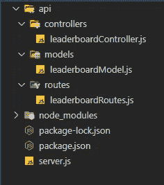**

# **创建模型**

**leaderboardModel.js**

**我已经创建了一个基本模型，只包含三个字段。理解我们使用的是 Mongoose 模式是很重要的。每个模式映射到一个 MongoDB 集合，并定义该集合中的文档结构。然后你会看到最后我们正在导出我们的模式，名为`Entry`，并把它暴露给应用程序的其余部分。**

**每个`Entry`将在我们的排行榜中代表一个不同的记录，其中一个`Entry`是玩家姓名、分数以及他们是否注册。**

# **定义我们的路线**

**leaderboardRoutes.js**

**路由将定义当用户点击我们的一个端点时会发生什么。这也是我们如何确定使用哪个 CRUD 操作与数据库中的数据进行交互。**

*   **创建一个条目**
*   **`GET` — **R** 读一个条目**
*   **`PUT` — **U** 更新条目**
*   **`DELETE` — **D** 删除条目**

# **构建控制器**

**我们的控制者**

**这里我们有逻辑。当我们的路线被攻击时会发生什么。这是一个功能完整的 API 所需要的最低要求。这些方法中的每一种都对应一条路线，您会注意到所有的名称都与路线相同。**

**这些方法中的每一个都接受两个参数:请求和响应(`req`、`res`)。然后，我们使用与我们试图实现的操作相一致的 Mongoose 方法。例如，对于一个`GET`请求，我们希望找到所有的文档，并将它们作为一个响应 JSON 对象返回。为此，我们使用`find()`方法。**

**同样的道理也适用于`POST`。我们想要创建一个记录，所以我们使用 Mongoose 方法`save()`将该记录写入数据库。**

****检查点**:为了确保我们正确地写入数据库，让我们在 Postman 中执行一个`POST`请求。**

**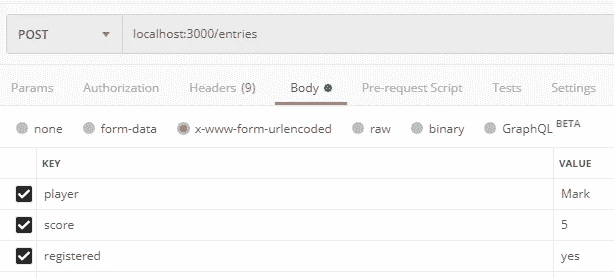**

**这就是我的`POST`请求发送到`localhost:3000/entries`的样子。这是你点击发送按钮后得到的回应:**

**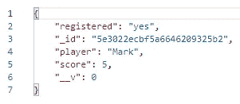**

**对`localhost:3000/entries`的`GET`请求将接收我们数据库中的所有文档作为响应。**

**对`localhost:3000/entries/:entryId`(上面的例子:`localhost:3000/entries/5e3022ecbf5a6646209325b2`)的`GET`请求将只返回一条记录。**

**发送到`localhost:3000/entries/:entryId` 的`PUT` 请求将使用您在主体中放置的内容更新条目。**

**发送到`localhost:3000/entries/:entryId` 的`DELETE`请求将删除指定的条目。**

**我想你明白了。这里面缺了什么？适当的错误处理。由于我们要求玩家和分数字段，如果这两个字段中有一个没有输入，那么响应将是错误的。我们需要一种优雅的方式来处理这件事。**

# **错误处理**

**对于 REST API 的错误处理，我们将使用 try-catch 语句。我们将“尝试”发出请求，如果失败，我们将“捕捉”错误。这是一种优雅地处理错误的方式。以下是创建 API 请求时可能会发现的错误类型:**

*   **`100 level (informational)` —服务器确认请求。**
*   **`200 level (Successful)` —服务器完成了请求。**
*   **`300 level (Redirect)` —客户端需要做更多来完成请求。**
*   **`400 level (Client Error)`—客户端发送了无效请求。**
*   **`500 level (Server Error)` —由于服务器错误，服务器无法完成请求。**

****检查点:**让我们发送一个错误请求，这样我们可以看看我们的错误处理是否有效。我将在错误处理之前和之后发布，这样您就可以看到不同之处。**

**在请求中，我将删除 player 字段。这将触发一个错误，因为它是必填字段:**

**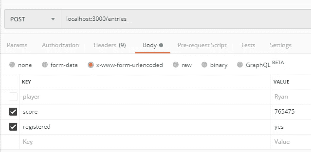**

**错误处理前:**

**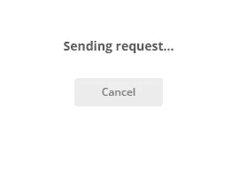**

**在`Postman`中，在添加错误处理之前，服务器会一直尝试发送请求。它没有任何东西可以捕捉错误，所以它最终会超时，而你也不知道你的请求有什么问题。**

**在您的控制台中，您只会看到以下混乱的输出:**

**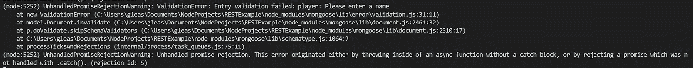**

**但是当我们添加错误处理时，我们得到的只是这个简单的响应:**

**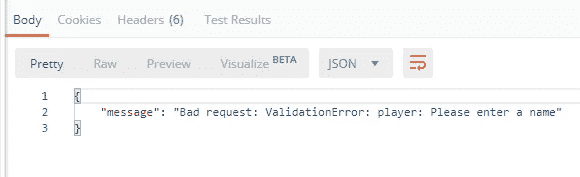**

**好多了！**

# **整理**

**由于这是一个排行榜，我们希望按分数降序排列。我们从 URL 字符串中取出排序参数，检查它是否为真，然后执行一个简单的排序。**

**我们只需要更新我们的`read_entries`方法:**

**我们从 URL 查询字符串中取出`sort`变量。我们访问它的方式是`req.query.sort`。**

****检查点:**在排序之前，当执行`GET`请求时，我们的输出应该是这样的:**

**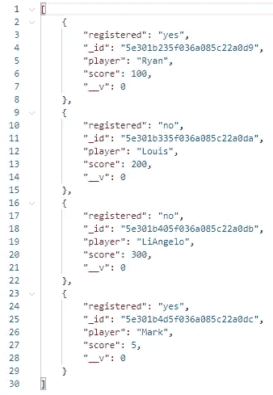**

**将`sort=true`添加到我们的端点后:**

**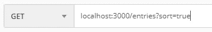**

**它应该是这样的:**

**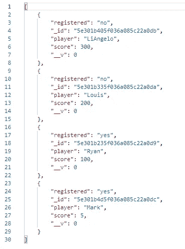**

**已经按降序排序了！**

# **过滤**

**我们现在只想显示注册的条目。我们如何做到这一点？通过添加过滤器。同样，为了简单起见，我们将只修改`read_entries`方法。**

**我们从 URL 中取出注册变量，如果它等于“是”，那么我们过滤掉所有未注册的条目。**

****检查点:**在添加过滤器之前，`GET`请求的结果将如下所示:**

****

**将`registered=yes`添加到端点后:**

****

**响应应该是这样的:**

**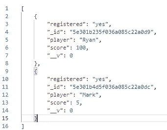**

**就是这样！您已经成功地从后端过滤了您的数据。**

# **回顾**

**在本教程中，您学习了如何成功地:**

*   **创建一个 REST 服务器**
*   **执行 CRUD 操作**
*   **优雅地处理错误**
*   **使用查询参数对数据进行排序**
*   **使用查询参数过滤数据**

**我希望这有所帮助！如果您有任何问题、意见或顾虑，请随时联系我们。**