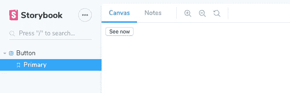
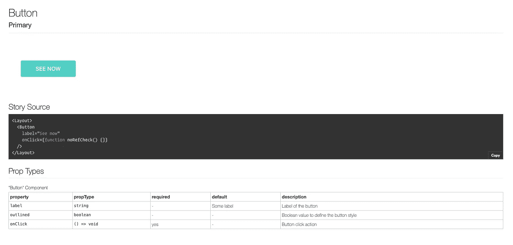
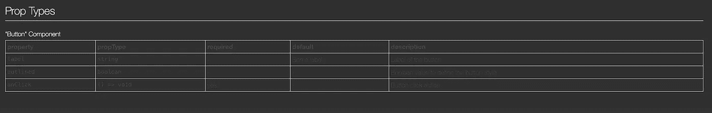

# 使用 Storybook、Tailwind CSS 和 TypeScript 启动组件库

> 原文：<https://betterprogramming.pub/start-a-component-library-with-storybook-tailwind-css-and-typescript-ebaffc33d098>

## 为您的 React 项目更快地构建组件


照片由 [Balázs Kétyi](https://unsplash.com/@balazsketyi?utm_source=unsplash&utm_medium=referral&utm_content=creditCopyText) 在 [Unsplash](https://unsplash.com/@balazsketyi?utm_source=unsplash&utm_medium=referral&utm_content=creditCopyText) 上拍摄

看看最后的[结果](https://storybook-btn.netlify.com/)。

# 什么是故事书？

Storybook 是一个用于独立开发 UI 组件的工具——这意味着我们可以在主应用程序之外拥有组件，进行必要的更改，并在知道组件外观的情况下将其导入我们的应用程序。

设计系统已经成为任何产品开发过程的一个重要部分，你可能已经在使用它了。这个系统为设计者和开发者提供了一个风格指南。您有许多具有不同模式和变化的 UI 组件。这是一个使用故事书的完美场景。

# 顺风的优势

Tailwind CSS 是一个高度可定制的低级 CSS 框架。

它不像许多其他框架那样是一个 UI 工具包——它通过 CSS 类让你完全控制你的网站的外观。

# 设置一个 React 应用程序并安装 Tailwind

我将从零开始用 Create React App 做一个项目。

```
npx create-react-app storybook-ts --template typescript
```

让我们安装依赖项。

```
npm install tailwindcss postcss-cli autoprefixer
```

用下面的代码在应用程序的根目录下创建一个名为`postcss.config.js`的新文件。

```
module.exports = {
  plugins: [require('tailwindcss'), require('autoprefixer')],
};
```

我们将使用 PostCSS 处理 Tailwind，`autoprefixer`将解析 CSS 并添加供应商前缀以支持浏览器。

现在，将这个脚本添加到`package.json`文件中。

```
{
  "scripts": {
    ...
    "build:tailwind": "postcss src/scss/base.scss -o src/scss/tailwind.scss"
  },
  ...
}
```

在`src`中创建一个新的`scss`文件夹。我会用 Sass 文件，因为我会用`base.scss`写更多的类，但是你可以用 CSS。

如果你决定使用 Sass，别忘了安装`node-sass`。

用这个内容在`scss`文件夹中创建一个`base.scss`文件。

```
@tailwind base;
@tailwind components;
@tailwind utilities;
```

在控制台上运行这个命令，将会生成顺风文件。

```
npm run build:tailwind
```

将生成的顺风文件放入您的应用程序组件。

```
// App.tsximport './scss/tailwind.scss';
```

在本教程中，我们将使用 Tailwind 的默认配置——您可以根据自己的需要随意调整。运行命令`npx tailwind init`，将会生成一个顺风配置文件。您可以添加更适合您的值。这是顺风的默认[配置](https://github.com/tailwindcss/tailwindcss/blob/master/stubs/defaultConfig.stub.js)——作为参考。

在`src`内新建一个`components`文件夹，并添加一个`button.tsx`文件。

button.tsx

# 让我们开始读故事书吧

为了用 Storybook 处理 TypeScript 文件，我们需要扩展 webpack 配置。让我们在项目的根目录下创建一个名为`.storybook`的新文件夹，并在其中创建一个`main.js`文件。

但是首先，让我们安装我们需要的依赖项。

```
npm install --save-dev @storybook/react @storybook/preset-create-react-app babel-loader react-docgen-typescript-loader @storybook/addon-actions @storybook/addon-info @storybook/addon-knobs @storybook/addon-notes @storybook/addons
```

我们将使用插件为我们的故事提供高级功能。

在`main.js`文件上，添加以下代码。

让我们创造我们的第一个故事。

在`src`中创建一个`stories`文件夹和一个名为`button.stories.tsx`的文件。我们要添加一些插件，直接从故事书里改变按钮的道具。

让我们在`package.json`文件上添加一个脚本来运行 Storybook。

```
{
    "scripts": {
        ...
    "build:tailwind": "postcss src/scss/base.scss -o src/scss/tailwind.scss",
    "storybook": "start-storybook -p 5000"
  },
  ...
}
```

现在，如果我们运行`npm run storybook`，我们将看到类似这样的内容。



这是我们的纽扣，但没有款式。让我们通过创建一个新的`Layout`组件来解决这个问题。从现在开始，我们创建的所有文件都将放在`.storybook`文件夹中。

```
import React from 'react';
import '../src/scss/tailwind.scss';

const Layout = ({ children }) => {
  return (
    <div className="px-20 py-10">
      {children}
    </div>
  )
}

export default Layout;
```

创建一个`preview.js`文件。

```
import React from 'react';
import { addDecorator } from '@storybook/react';
import { withInfo } from '@storybook/addon-info';
import Layout from './Layout';addDecorator(storyFn => <Layout>{storyFn()}</Layout>);
addDecorator(withInfo({
  inline: true,
  propTablesExclude: [Layout]
}));
```

如果您再次运行 Storybook，我们的故事现在看起来像这样。info 插件生成源代码和一个 Prop 类型表。



**注意事项**:

*   如果您在导入顺风文件时遇到问题，您需要在`main.js`上将`sass-loader`添加到 webpack 配置中。
*   如果您看不到任何适当类型，请检查您的组件文件。一定要像这样析构 React 导入或导入 React。或者尽量不要对你的组件使用`export default`。

```
import * as React from 'react'; import React, { FC } from 'react';export const Button = () => {} //don't use export default.
```

# 深色模式

我们的应用程序看起来很棒，但你知道我们如何才能让它看起来更好吗？是的，在黑暗模式下。

首先，创建一个`manager.js`文件，并添加以下代码。

```
import { addons } from '@storybook/addons';
import { themes } from '@storybook/theming';addons.setConfig({
  theme: themes.dark,
});
```

这将把黑暗主题添加到你的故事书应用程序中。

在之前的`preview.js`文件中，添加这个来改变信息的样式。

我们快成功了。但是现在道具类型表上的文本看起来不太好。



创建一个`preview-body.html`文件，并添加以下代码。

```
<style>
  .info-table, .info-table td, .info-table th{ 
    color: #fff;
  }
</style>
```

再次运行 Storybook。

现在你有了——story book 在黑暗模式下启动并运行，有了你的顺风组件和 TypeScript 支持。

检查这个[回购](https://github.com/elisealcala/storybook-tailwind-ts)中的代码。