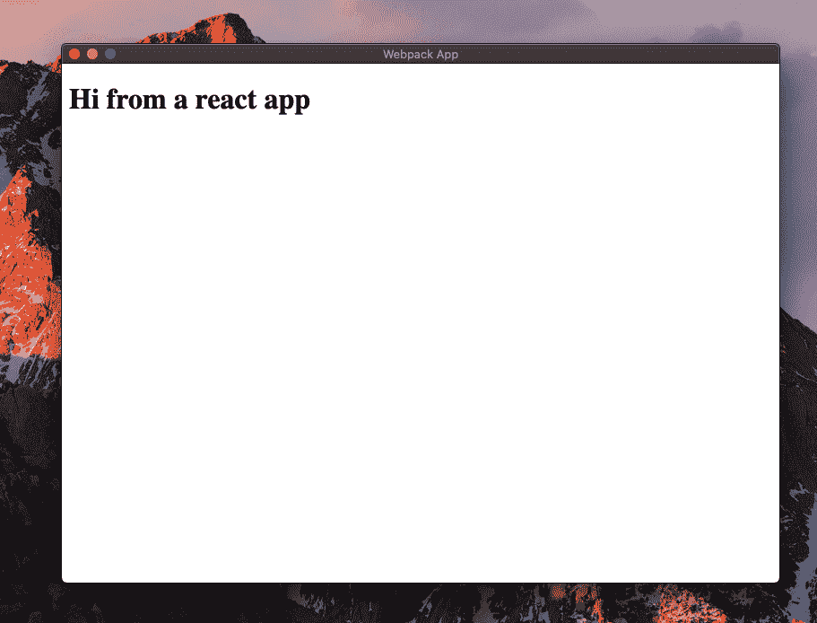

# 用 React 和 TypeScript 启动一个新的电子应用程序

> 原文：<https://betterprogramming.pub/start-a-new-electron-app-with-react-and-typescript-cdd6d9997933>

## 立即构建您的第一个桌面应用程序


[乔·塞拉斯](https://unsplash.com/@joaosilas?utm_source=unsplash&utm_medium=referral&utm_content=creditCopyText)在 [Unsplash](https://unsplash.com/s/photos/desktop?utm_source=unsplash&utm_medium=referral&utm_content=creditCopyText) 上的照片

# 什么是电子？

electronic 是一个创建本地应用程序的框架。它是开源的，跨平台的。如果你已经知道 Javascript、HTML 和 CSS，你可以用 electron 构建一个应用程序。

在本教程中，我将向您展示如何使用 webpack、React 和 Typescript 从头开始一个电子项目。

# 从电子开始

让我们首先创建一个新文件夹和一个新的`npm`项目。

```
mkdir electron-react-ts
cd electron-react-ts
npm init -y
```

现在，安装这些依赖项。

```
npm install --save-dev electron \
webpack webpack-cli webpack-dev-server \
babel-loader @babel/core @babel/preset-env \
@babel/preset-react @babel/preset-typescript
```

创建一个`tsconfig.json`文件。这允许您指定 typescript 编译器的配置。

```
{
  "compilerOptions": {
    "target": "es5",
    "module": "commonjs",
    "lib": [
      "dom",
      "es2015",
      "es2016",
      "es2017"
    ],
    "allowJs": true,
    "jsx": "react",
    "sourceMap": true,
    "outDir": "./dist",
    "strict": true,
    "esModuleInterop": true,
  }
}
```

创造一个`babel.config.js`:

```
module.exports = {
  presets: [
    '@babel/preset-env',
    '@babel/preset-react',
    '@babel/preset-typescript'
  ]
}
```

以及我们应用程序根目录下的一个`index.html`文件:

```
<html lang="en">
<head>
  <meta charset="UTF-8">
  <meta name="viewport" content="width=device-width, initial-scale=1.0">
  <title>New Electron App</title>
</head>
<body>
</body>
</html>
```

让我们在应用程序的根目录下创建一个名为`webpack.electron.config.js`的新文件。这个 webpack 文件将把我们的电子应用程序编译到一个`dist`文件夹中。

除了目标之外，这看起来像是 typescript 的普通 webpack 配置。目标是 webpack 将要编译的特定环境。这种情况下是`electron-main`。

创建一个`electron`文件夹，然后在一个`main.ts`文件中使用下面的代码。这个文件应该为你的应用程序创建窗口和处理系统事件。

模块将创建一个新窗口，并呈现我们的 react 应用程序。

现在让我们在`package.json`文件中添加一个脚本来运行 Electron。此外，我们必须为编译了我们的电子应用程序的路径更改`main`字段。

```
{
  "main": "./dist/main.js",
    "scripts": {
    "dev:electron": "NODE_ENV=development webpack --config webpack.electron.config.js --mode development && electron ."
  },
}
```

现在在控制台中运行`npm run dev:electron`。

**注意:**如果你使用的是 Windows，你很可能会遇到一个错误，这是因为`NODE_ENV`不被识别为命令。你必须安装 [crossenv](https://www.npmjs.com/package/cross-env) 并将命令放在`NODE_ENV`之前。

# 添加电抗器

现在我们已经运行了电子应用程序，让我们设置一个 React 应用程序在这个电子环境中运行。

我们需要安装一些依赖项。

```
npm install react react-dom @types/react @types/react-domnpm install --save-dev html-webpack-plugin
```

创建一个新的`webpack.react.config.js`文件。

我们的`package.json`文件现在应该是这样的。

```
{
  "main": "./dist/main.js",
    "scripts": {
      "dev:electron": "NODE_ENV=development webpack --config webpack.electron.config.js --mode development && electron .",
      "dev:react": "NODE_ENV=development webpack-dev-server --config webpack.react.config.js --mode development"
    },
 }
```

为了试用这个应用程序，让我们创建一个新文件夹`src`，里面有一个`app.tsx`文件。

```
import React from 'react';
import ReactDom from 'react-dom';const mainElement = document.createElement('div');
document.body.appendChild(mainElement);const App = () => {
  return (
    <h1>
      Hi from a react app
    </h1>
  )
}ReactDom.render(<App />, mainElement);
```

现在我们准备好了。

在一个控制台上运行`npm run dev:react`，在另一个控制台上运行`npm run dev: electron`。



检查此 [repo](https://github.com/elisealcala/electron-react-ts) 中的代码。