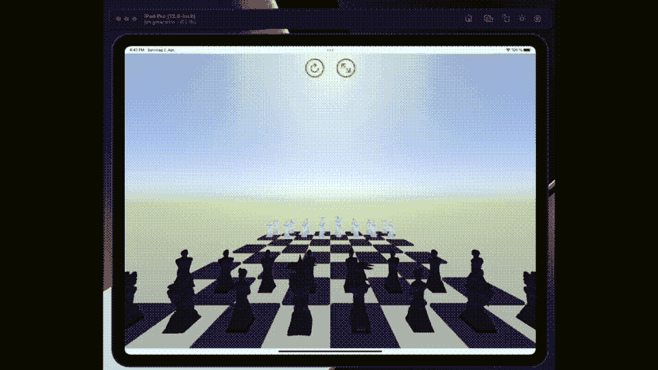
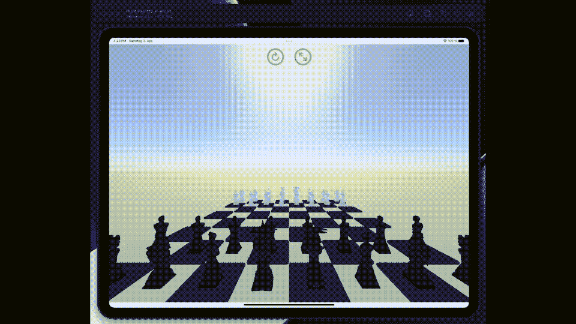
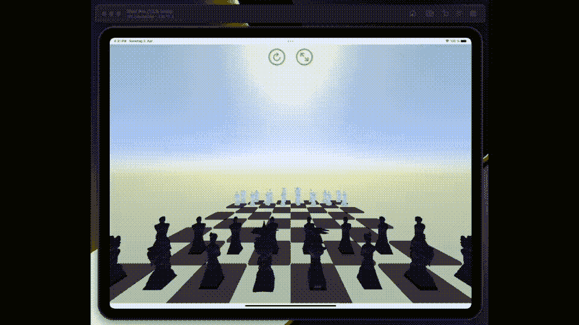

# 使用 SceneKit 和 SwiftUI 开始构建 3D 象棋游戏

> 原文：<https://betterprogramming.pub/start-building-a-3d-chess-game-using-scenekit-and-swiftui-3d072b025db2>

## 如何构建流行的国际象棋棋盘游戏



继续调查 SceneKit & SwiftUI 的旅程，我想我可能会尝试另一个经典。本文的目标是构建一个 3D 象棋游戏。

## 模型

我开始用模型看 SceneKit 和 SwiftUI。“usdz”格式的《星球大战》模型，它支持十几种或更多格式中的一种。

SceneKit 支持的格式肯定是一个移动的目标。我尝试在这个版本中使用“usdz”、“obj”格式和一个原生的“scn”。它们都可以工作，但有些比另一些更好，有一些细微的差异。例如，在“obj”模型上的 Xcode 编辑器中，虽然您可以更改颜色，但在渲染时这些更改不会反映出来。

如果你试图加载一个它不理解的模型，最好的情况是它会忽略你并且无法渲染——最坏的情况是它会崩溃。

有用的提示；看看苹果开发者网站上的工具/应用。有一个是把不同格式的文件转换成“usdz”。

# 棋盘

我最初的想法是使用一个你可以用核心图像框架构建的纹理贴图。但是因为我希望/需要能够处理每个方块，所以用黑白方格来创建白板更有意义。


你在这张图片顶部看到的绿色图标是管理棋盘位置的 HUD 的开始。当触发时，它们通过订阅运行操作来链接到电路板。棋盘本身是用一个简单的循环构建的，这个代码。

# 平视显示器

HUD 使用 Combine 框架将 SwiftUI 接口链接到`GameScene`类。我发现使用`@Published` / `@ObservedObjects`的代码模式效果更好。

类似这样的代码:

# 照相机

我认为相机是 SceneKit 编码中最具挑战性的方面之一。在这个项目中，我从使用。我的 SceneView 调用上的 allowcameracontrol 选项。

设置好 HUD 后，我用一些选项替换了它，让你可以在棋盘上来回移动来玩不同的游戏。

我想出了两个原则动作——绕着棋盘旋转相机，然后把它带到对面。弄清楚我需要做哪些操作超出了本文的范围，这是我计划在未来讨论的主题。与此同时，下面是将棋盘前后翻转的代码。

运行如下所示的代码——这里有五个动作，最初是成对并行运行，然后是单个动作，然后是另一对动作。我旋转棋盘的原因是我需要这样做，因为相机在那个点是上下颠倒的。



# 动作

我的第一个问题是，我不能使用触摸来检测模型上的点击。我把 SceneKit 和 SpriteKit 搞混了，在 sprite kit 中，你可以定义一个模型，给它一个实体，然后检测与另一个实体的接触。为了检测触摸，我需要通过创建一个隐藏的节点来给每一个部分一个几何图形，在这个节点上我附加了我的模型。我最初也想象用户拿起棋子并在棋盘上拖动它，但是这样做与移动棋盘本身相冲突[两者都需要拖动]，所以我使用了一个双重动作，用户选择他想要移动的棋子，然后选择他想要移动的方格。

很明显，在游戏的第一个版本中，我不会尝试验证你移动到了哪个方格——我相信玩家不会尝试进行非法移动。

当我写这篇文章的时候，我突然想到，事实上我可以给每一个棋子和方块一个物理模型来促进不同类型的移动，作为思考的食粮，也许是后续行动。

我没有花太多时间来说明当你拿起一块时会发生什么；我只是让它消失了，取而代之的是胜利者。更多`SCNActions`。



## 未来

正如他们所说，我现在有了一个最低限度的可行产品，至少从演示的角度来看是这样的。根据它被接受的程度，我可能还会回到这个项目上。未来的工作包括—

*   在 HUD 上实现一个乐谱，也许还有一个片段。
*   验证所做的动作，以确保没有人作弊。
*   实现一些网络代码，这样你就可以玩另一个玩家了。
*   实现一个拖放类型的界面，让游戏体验更真实一点。
*   让说话/失败更加戏剧化:)
*   实现某种计算机播放器。

我希望您喜欢阅读它，并在这里找到一些适用的代码，您将能够在您的项目中使用。

```
**Want to Connect?**Join me on [LinkedIn](https://www.linkedin.com/in/mark-lucking-4631049/) to connect, collaborate or just a chat.
```