# 从头到尾:让我们构建 Google 的字典小部件

> 原文：<https://betterprogramming.pub/start-to-finish-lets-build-google-s-dictionary-widget-f8a0fbef1c0>

## 学习使用 API、Vue.js、SCSS 和承诺，并编写语义 HTML5

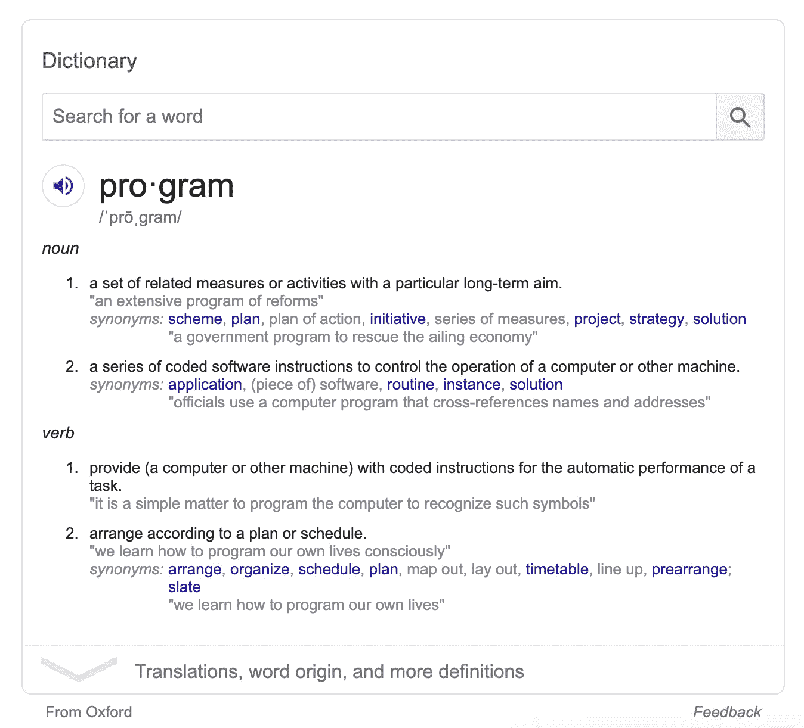

在本系列教程结束时，您将已经重新创建了这个字典小部件。

# 我们将一起采取的步骤

1.  分解小部件来理解我们应该使用什么 HTML 元素。
2.  研究、测试并注册一个 API 服务来获取我们需要的数据。
3.  将来自 WordsAPI 的模拟数据添加到我们的 HTML 模板中，以验证其结构。
4.  使用 Vue.js 使用来自 API 的数据快速构建我们的小部件原型
5.  一点一点地，用我们的 Vue 模型中的数据替换硬编码文本。
6.  测试我们的应用程序和更新部分，以说明从任何单词的 API 接收的数据。
7.  风格我们的应用程序使用 SCSS 模仿谷歌的小工具。

# 分解小部件来理解我们应该使用什么 HTML 元素

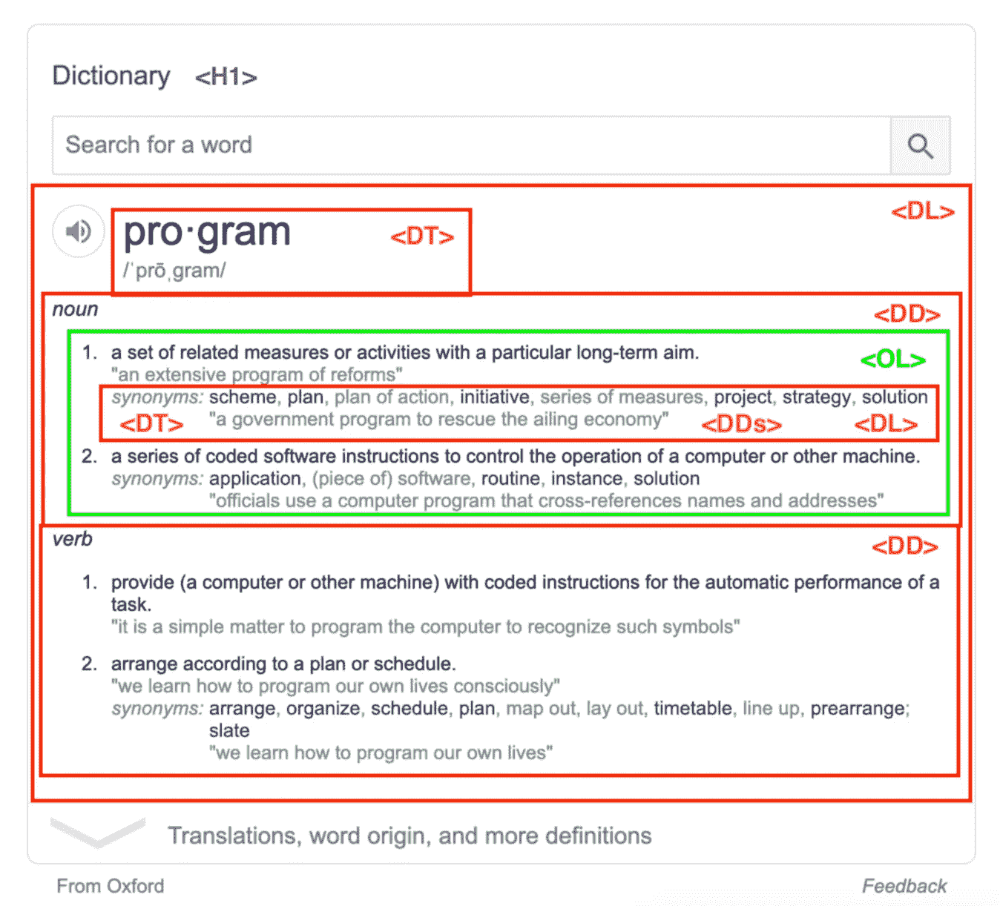

我选择的结构包含嵌套的

、一个

## 这是细目分类

*   这个小部件有一个标题，字典。
*   然后是一个简短的形式:一个`input`和`submit`按钮。
*   搜索的结果是一个定义列表，每组名词和动词都有一个`dt`和一个`dd`。
*   在每个`dd`中有一个`ol`，为每个名词或动词列出条目。
*   每个`li`将包含定义，可能包括句子中使用的术语和一个或多个同义词。定义是一个`p`。句子是一个包裹在`p,`中的`q`，同义词列表是另一个`dl`。

## 以下是在`{{ }}`中标记了内容占位符的 HTML

```
<div id="app">
  <h1>Dictionary</h1>
  <input type="text" />
  <button>Search</button>
  <dl>
    <dt>
      <p>{{syllables}}</p>
      <p>{{pronunciation}}</p>
    </dt>
    <dd>
      <p>noun</p>
      <ol>
        <li>
          <p>{{definition}}</p>
          <p>
            <q>{{sentence}}</q>
          </p>
          <dl>
            <dt>synonyms</dt>
            <dd>{{synonym}}</dd>
          </dl>
        </li>
      </ol>
    </dd>
    <dd>
      <p>verb</p>
      <ol>
        <li>
          <p>{{definition}}</p>
          <p>
            <q>{{sentence}}</q>
          </p>
          <dl>
            <dt>synonyms</dt>
            <dd>{{synonym}}</dd>
          </dl>
        </li>
      </ol>
    </dd>
  </dl>
</div>
```

# 研究、测试并注册一个 API 服务来获取我们需要的数据

在谷歌词典小工具的左下角，有一个标签，来自牛津。这引导我去谷歌`oxford dictionary api`，因此，官方的[牛津字典 API](https://developer.oxforddictionaries.com/) 。

## 不幸的是，我发现了两个瓶颈:

1.  每当调用 API 时，它都有一个相关的开销。我不愿意只为少数 API 调用付费。
2.  API 似乎没有返回同义词，而同义词是我们试图重新创建的小部件的关键部分。

很有可能我在网站上阅读的不够多，我认为的瓶颈实际上并不存在。

但是当另一个谷歌搜索`dictionary api`的功能是一个简单的英文资源调用 [WordsAPI](https://www.wordsapi.com/) 而没有上述瓶颈时，我很容易就做出了决定。

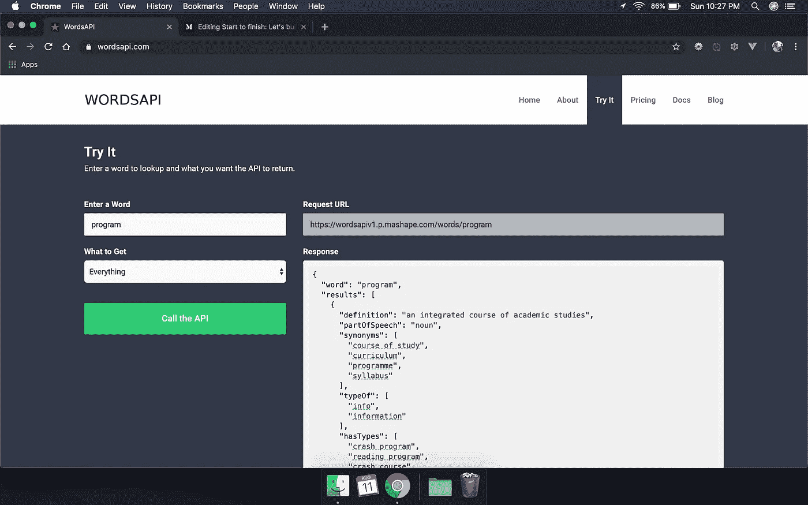

WordsAPI 主页截图；滚动到“尝试”部分，输入并查询“程序”一词。

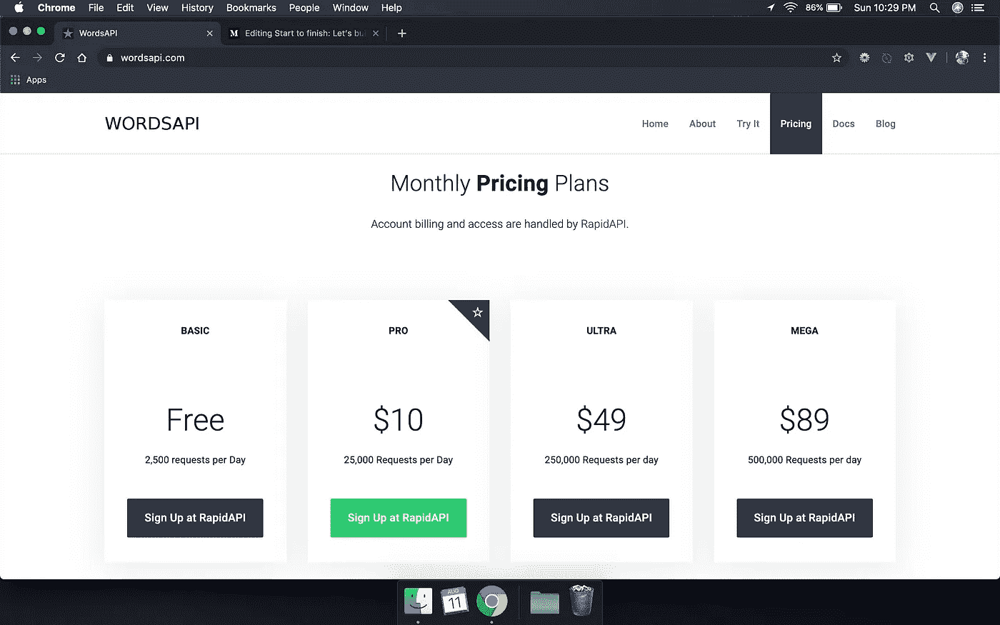

WordsAPI 是免费的，只要我们在任何 24 小时内不超过 2，500 个 API 请求。

## 使用 WordsAPI 和几乎所有的 API 都需要一个密钥

除其他原因外，该键用于跟踪一天中的请求数。

## 要获取 WordsAPI 密钥，您必须:

1.  在 RapidAPI 注册，通过这个伞式服务，你可以订阅 WordsAPI。
2.  输入计费信息，以防您超出免费层的限制，他们必须向您收费。
3.  订阅 WordsAPI，这样您对 API 的任何请求都可以得到验证，并且您可以得到真实的数据，而不是讨厌的错误消息。

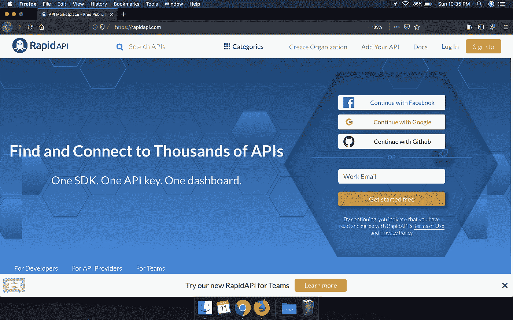

访问[rapidapi.com](https://rapidapi.com)并通过各种方式注册。

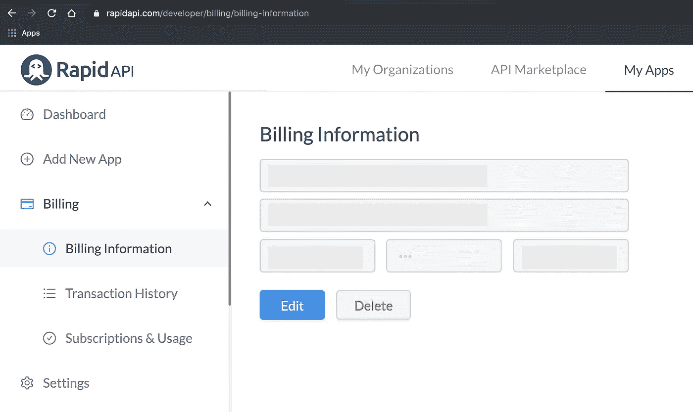

登录后，点击我的应用程序，然后点击账单和账单信息。单击编辑并输入您的信用卡信息。只有当您对 WordsApi 的 API 请求超过 2，500 次时，才会向您收取费用。


转到 API 市场选项卡。在搜索字段中，键入“wordsapi”并选择第一个结果。

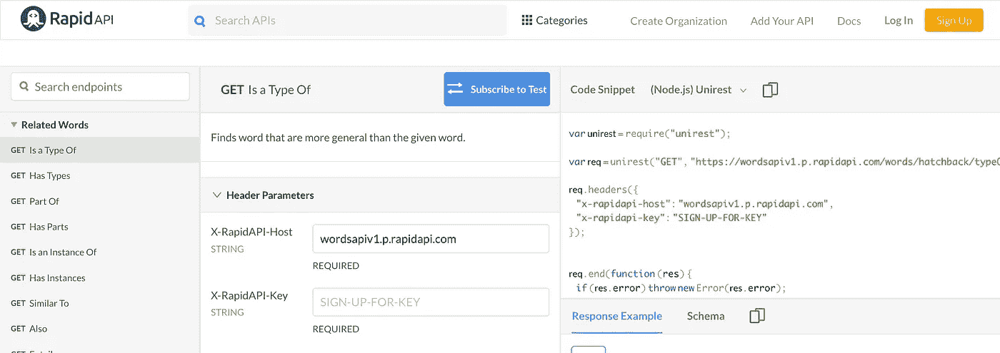

在 [WordsAPI 页面](https://rapidapi.com/dpventures/api/wordsapi)上，向下滚动一点，直到您看到标有 Subscribe to Test 的蓝色按钮。点击它订阅 WordsAPI。

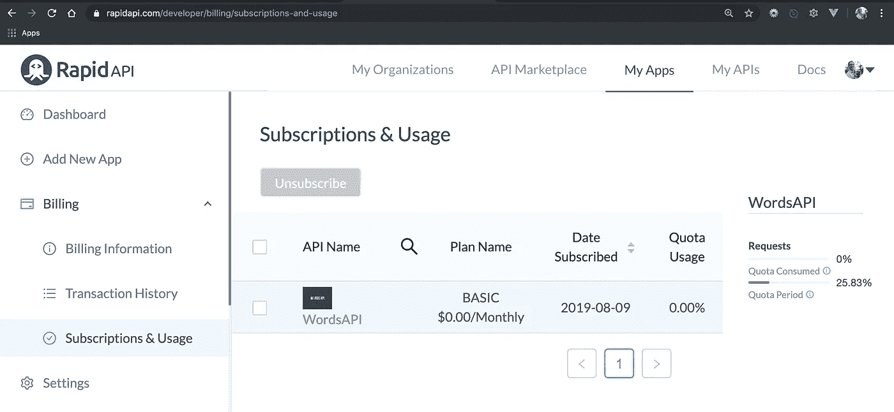

要验证您是否已订阅，请返回“我的应用”选项卡，单击“计费”，然后单击“订阅和使用”，并确认您看到列出的 WordsAPI。

# 将来自 WordsAPI 的模拟数据添加到我们的 HTML 模板中，以验证其结构


回想一下我们在 WordsAPI 主页的“尝试”部分对“程序”提出的请求

## 从该 API 请求返回的响应中感兴趣的部分如下所示

```
{
  "word": "program",
  "results": [
    {
      "definition": "an integrated course of academic studies",
      "partOfSpeech": "noun",
      "synonyms": [
        "course of study",
        "curriculum",
        "programme",
        "syllabus"
      ],
      "examples": [
        "he was admitted to a new program at the university"
      ]
    },
    // more result objects
  ],
  "syllables": {
    "count": 2,
    "list": [
      "pro",
      "gram"
    ]
  },
  "pronunciation": {
    "all": "'proʊgræm"
  }
}
```

在这一步中，我们必须回答的问题是，“我们是否设置了 HTML 模板来有效地显示上面显示的每个数据块？”

## 这是我们的模板

```
<div id="app">
  <h1>Dictionary</h1>
  <input type="text" />
  <button>Search</button>
  <dl>
    <dt>
      <p>{{syllables}}</p>
      <p>{{pronunciation}}</p>
    </dt>
    <dd> <!-- will repeat for each result that is a noun -->
      <p>noun</p>
      <ol>
        <li>
          <p>{{definition}}</p>
          <p>
            <q>{{sentence}}</q> <!-- repeat for each example -->
          </p>
          <dl>
            <dt>synonyms</dt>
            <dd>{{synonym}}</dd> <!-- repeat for each synonym -->
          </dl>
        </li>
      </ol>
    </dd>
    <dd> <!-- will repeat for each result that is a verb -->
      <p>verb</p>
      <ol>
        <li>
          <p>{{definition}}</p>
          <p>
            <q>{{sentence}}</q>
          </p>
          <dl>
            <dt>synonyms</dt>
            <dd>{{synonym}}</dd> <!-- repeat for each synonym -->
          </dl>
        </li>
      </ol>
    </dd>
  </dl>
</div>
```

*   `{{ syllables }}`可以从`syllables.list`数组中获得。
*   `{{ pronunciation }}`是从同名财产中给我们的。
*   `{{ sentence }}`可以从每个结果的`examples`数组中获得。
*   每个`{{ synonym }}`都可以从`synonyms`数组中获得。
*   `{{ definition }}`是同名财产给我们的。
*   我们可以根据每个结果的`partOfSpeech`属性正确地对名词和动词进行分组。

我们的 HTML 模板已经准备好了。现在让我们创建一个 Vue 实例，并在该模板中显示来自响应对象的数据。

# **使用 Vue.js 使用来自 API 的数据快速构建我们的小部件原型**

## 让我们在整个步骤中记住:

*   当构建原型时，我们希望快速工作。
*   我们的目标是让一些东西工作，仅用于演示和学习目的。
*   在这个阶段，我们不一定关心使用最佳实践、编写生产就绪代码或考虑所有边缘情况。

有了这样的理解，我发现 [Vue.js，一个进步的 JavaScript 框架](https://vuejs.org)，让我在制作这样的小部件原型时工作得最快。

## 如何将 Vue.js 添加到项目中

使用加载了 HTML 文件的代码编辑器？在结束的`</body>`标签之前添加一个`script`标签，将`src`属性设置为 Vue.js 可用的众多 cdn 之一，如下所示:

```
...
    <script src="[https://unpkg.com/vue@2.6.10/dist/vue.js](https://unpkg.com/vue@2.6.10/dist/vue.js)" />
  </body>
</html>
```

使用类似于 [Codepen](https://codepen.io) 的服务？从你的笔中，点击 JS 旁边的齿轮并搜索 *vue* 。它应该自动填充一个列表，第一个是 Vue.js。选择它添加到您的笔。保存并关闭。

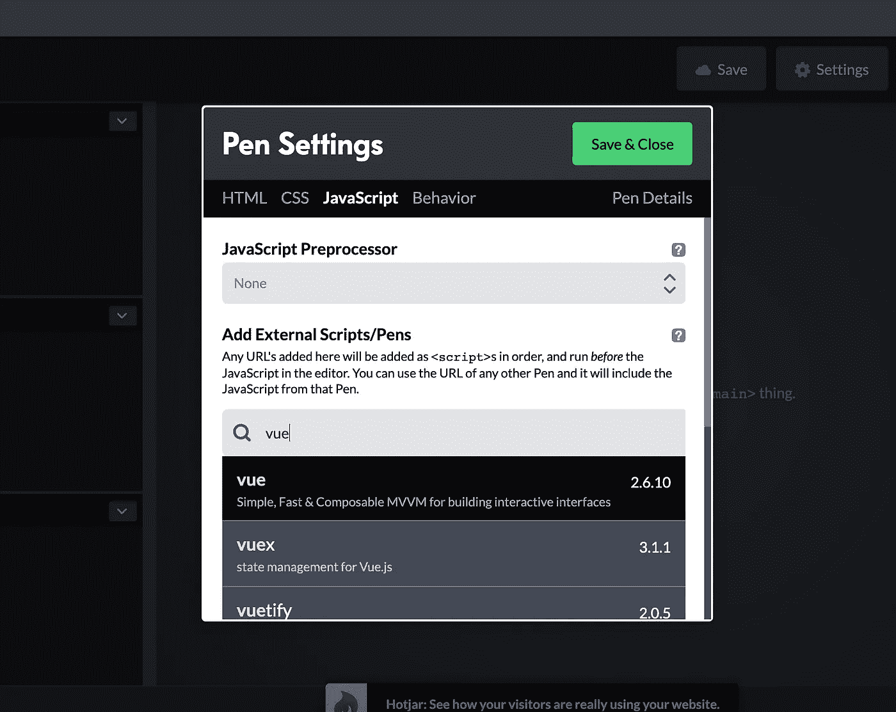

在笔设置模式窗口的 JavaScript 选项卡中搜索“vue”。

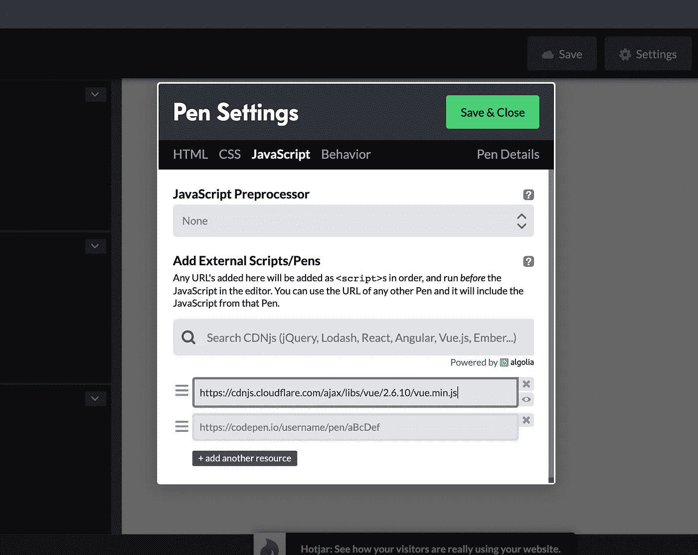

从选项列表中选择 Vue 后，您会看到第一个文本框中添加了一个到 cloudflare.com 的链接。

## 如何用 Vue.js 开始原型制作

`Vue`是一个构造函数:它是一个构造对象的函数。这意味着为了使用 Vue，我们必须包含`new`关键字，一组`()`括号，并将返回的内容保存在一个变量中，就像这样。

```
var app = new Vue();
```

像大多数函数一样，当您调用 Vue 时，它需要一个或多个参数。出于我们的目的，我们将传入一个参数，一个对象。

```
var app = new Vue( {} );
```

这个对象将有几个属性，每个属性都是 Vue 所期望的。让我们从将 Vue 插入小部件的属性开始。回想一下，在我们的 HTML 模板中，我用`app`的`id`将所有东西包装在一个`<div>`中。

```
<div id="app">
   ...
</div>
```

我这么做是为了 Vue。Vue 插入到一个 HTML 元素中，当目标是一个元素时，使用`id`是最容易的。

```
var app = new Vue({
  el: "#app"
});
```

我们在传递给 Vue 构造函数的对象中添加了一个`key: value`对。`key`是`el`，是`element`的简称，值是`"#app"`，一个包含 CSS 选择器的字符串，目标是我们的`div`。

就这样，我们的`div`现在是一个 Vue 实例！可悲的是，它还没有做任何事情。让我们解决这个问题。

## 如何向我们的 Vue 实例添加默认状态

让我们给对象添加另一个`key: value`对。这一对在 Vue 实例中扮演着重要的角色:它保存着我们的应用程序的状态。这个`key`叫做`data`，它的值是一个对象，如下图。

```
var app = new Vue({
  el: "#app",
  data: {}
});
```

在这个对象内部，我们可以随意添加带有任何名称的`key: value`对，因为它们对于我们的应用程序是唯一的，而不是由 Vue 指定或预期的。

我们只需要存储两条数据:来自 API 请求的响应和我们想要查找的单词。

我们需要为每个项目设置初始值和默认值，以便 Vue 可以正确地注册和跟踪每个项目的任何未来更改。

```
var app = new Vue({
  el: "#app",
  data: {
    response: null,
    word: ""
  }
});
```

我为每个数据对象键选择了直观的标签，`response`为 API 响应，`word`为我们想要查找的单词。

## 如何将 WordsAPI 请求设置为我们的 Vue 实例的一部分

这一步有三个部分:

*   我们需要向 WordsAPI 发送一个 GET 请求，其中包含我们想要查找的单词。
*   当我们从 API 得到响应时，我们希望将它转换成 JSON，这样我们就可以对它执行操作。
*   在将其转换为 JSON 之后，我们希望将响应对象存储在用`null`作为值初始化的`data`对象的`response`属性中。

我们将在一个`function`中完成所有这些。该函数将存储在我们的 Vue 实例中，因为 Vue 将在适当的时候调用它。

让我们开始编写函数:

```
function handleAPIRequest() {
  ...
}
```

这是一个很长的函数名，但是它的功能非常清楚:它处理我们的 API 请求。

发送 GET 请求的一种方便的内置方式是通过[获取 API](https://developer.mozilla.org/en-US/docs/Web/API/Fetch_API/Using_Fetch) 。

Mozilla Developer Network 上的文章[使用 Fetch](https://developer.mozilla.org/en-US/docs/Web/API/Fetch_API/Using_Fetch) 提供了一个有用的基本示例:

```
fetch('http://example.com/movies.json')
  .then(function(response) {
    return response.json();
  })
  .then(function(myJson) {
    console.log(JSON.stringify(myJson));
  });
```

## 这里发生了什么事？嗯，很多。

*   `fetch`是一个用单个参数调用的`function`:一个包含 URL 的字符串，在本例中指向一个 JSON 文件
*   下一行实际上是第一行的延续:`fetch`函数调用返回一个对象。我们立即调用`then`方法(也称为函数)，向它传递一个参数:a `function`。
*   这个函数——作为参数传递给`then`函数调用的函数——在被调用时，需要一个参数——在这里标记为`response`。这个函数执行一个命令:返回调用`json`的结果。这个命令可以有效地将 API 请求发送的文本字符串转换成我们更喜欢使用的 JavaScript 对象。
*   下一行是第一行的`fetch`函数调用的延续。它的工作方式与前面的`then`函数调用相同。传递给它的函数需要一个参数。它将接收前一个函数调用返回的 JSON 对象。
*   我们将用一个将 JSON 对象存储到 Vue 实例的`data`对象的`response`属性中的命令来替换`console.log()`命令。

用更简单但更高级的术语来说，Fetch 返回一个承诺。每个`then`函数调用记录了当承诺成功解析时要执行的后续动作。

## 我们如何修改代码样本来满足我们的需求？

在四个重要方面:

1.  我们需要向不同的 URL 发送请求。
2.  我们需要向该 URL 追加一段数据。
3.  我们需要在发送之前配置该请求，以便 WordsAPI 可以正确地验证我们的请求。
4.  我们需要将最终的 JSON 存储回 Vue 实例中。

```
fetch(`[https://wordsapiv1.p.mashape.com/words/${this.word}`](https://wordsapiv1.p.mashape.com/words/${this.word}`), {
   headers: {
      "X-Mashape-Key": "someCrazyLongAPIKeyThatContainsNumbersAndLetters"
   }
})
   .then(function(response) { return response.json() })
   .then(function(myJson) { this.response = myJson })
```

## 使用哪个 URL？

我们从 WordsAPI 得到这个。他们的文档指出，当查找一个单词时，我们使用这个 URL:[https://wordsapiv1.p.mashape.com/words/](https://wordsapiv1.p.mashape.com/words/${this.word}`)

## 我们如何将数据添加到那个 URL？

该 URL 需要在`words/`部分之后的最后一位:我们想要查找的单词。在我们的 Vue 实例中，该值将存储在`data`对象内标记为`word`的属性中。Vue 为我们提供了一种便捷的方式来引用存储在`data`对象中的任何值:我们写`this.word`而不是`this.data.word`或者必须通过其他方式访问 word。

我们可以使用一个`template literal`来清楚地写出完整的 URL，包括我们的数据。模板文字被反勾号包围:在大多数键盘上，`1`左边的底部符号。

模板文字允许我们使用以下语法将评估的数据插入到字符串中:`${ expression }`。

因此，我们传递给`fetch`的字符串将如下所示:

```
fetch(`[https://wordsapiv1.p.mashape.com/words/${this.word}`](https://wordsapiv1.p.mashape.com/words/${this.word}`))
```

## 我们如何在请求中发送所需的 API 键，以便 WordsAPI 不会返回关于无效访问的错误？

`fetch`函数调用接受第二个参数:一个用于配置 API 请求的对象。

```
fetch(`[https://wordsapiv1.p.mashape.com/words/${this.word}`](https://wordsapiv1.p.mashape.com/words/${this.word}`), {})
```

这个对象允许多种可能的`key: value`对。我们只需要设置一个，`headers`。

```
fetch(`[https://wordsapiv1.p.mashape.com/words/${this.word}`](https://wordsapiv1.p.mashape.com/words/${this.word}`), {
  headers: {}
})
```

WordsAPI 要求我们向`headers`对象添加一个`key: value`对。密钥是`X-Mashape-Key`,值是一个长字符串，在您订阅 WordsAPI 时分配给您的帐户。

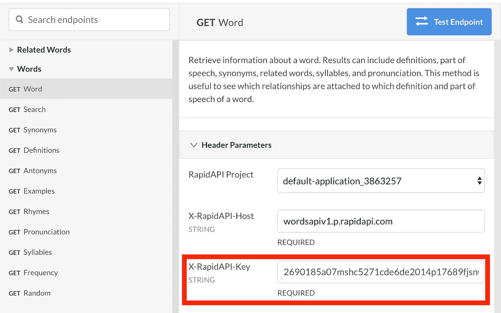

用红色突出显示的是 API 请求所需的密钥。只要您已经登录，[使用此链接跳转到此页面并复制粘贴您的密钥](https://rapidapi.com/dpventures/api/wordsapi)。

```
fetch(`[https://wordsapiv1.p.mashape.com/words/${this.word}`](https://wordsapiv1.p.mashape.com/words/${this.word}`), {
   headers: {
      "X-Mashape-Key": "yourAPIKeyThatContainsNumbersAndLetters"
   }
})
```

将这个 API 调用放在我们函数的上下文中，现在看起来像这样:

```
function handleAPIRequest() {
   fetch(`[https://wordsapiv1.p.mashape.com/words/${this.word}`](https://wordsapiv1.p.mashape.com/words/${this.word}`), {
      headers: {
         "X-Mashape-Key": "yourAPIKeyThatContainsNumbersAndLetters"
      }
   })
}
```

回想一下，MDN 示例代码中有两个对`then`的链式调用:

```
fetch('http://example.com/movies.json')
  .then(function(response) {
    return response.json();
  })
  .then(function(myJson) {
    console.log(JSON.stringify(myJson));
  });
```

我们可以完全按照编写的内容复制第一个`then`调用。

```
function handleAPIRequest() {
   fetch(`[https://wordsapiv1.p.mashape.com/words/${this.word}`](https://wordsapiv1.p.mashape.com/words/${this.word}`), {
      headers: {
         "X-Mashape-Key": "yourAPIKeyThatContainsNumbersAndLetters"
      }
    })
    .then(function(response) {
       return response.json();
    })
}
```

我们需要修改第二个`then`调用，将 JSON 存储回 Vue 实例的`response`属性。

```
function handleAPIRequest() {
   fetch(`[https://wordsapiv1.p.mashape.com/words/${this.word}`](https://wordsapiv1.p.mashape.com/words/${this.word}`), {
      headers: {
         "X-Mashape-Key": "yourAPIKeyThatContainsNumbersAndLetters"
      }
    })
    .then(function(response) {
       return response.json();
    })
    .then(function(body) {
       this.response = body;
    })
}
```

就像使用`word`一样，我们可以通过`this.`方便地引用存储在 Vue 的`data`对象中的任何属性，然后引用属性的名称，而不必插入`this.data.`或通过其他方式。

如果您更喜欢使用 JavaScript 较新的 arrow `=>`函数，您的`handleAPIRequest`函数将如下所示:

```
function handleAPIRequest() {
   fetch(`[https://wordsapiv1.p.mashape.com/words/${this.word}`](https://wordsapiv1.p.mashape.com/words/${this.word}`), {
      headers: {
         "X-Mashape-Key": "yourAPIKeyThatContainsNumbersAndLetters"
      }
    })
    .then(response => response.json())
    .then(body => this.response = body)
}
```

## 我们把这个函数放在 Vue 的什么地方？

您的 Vue 配置对象上目前有两对`key: value`:`el`和`data`。再补充一个 Vue 认可的:`methods`。它的值是一个存储一个或多个函数的对象。

```
var app = new Vue({
  el: "#app",
  data: {
    response: null,
    word: ""
  },
  methods: {}
});
```

我们的`handleAPIRequest`函数可以是这个对象的属性值之一，就像这样:

```
var app = new Vue({
  el: "#app",
  data: {
    response: null,
    word: ""
  },
  methods: {
    handleAPIRequest: function () {
      fetch(`[https://wordsapiv1.p.mashape.com/words/${this.word}`](https://wordsapiv1.p.mashape.com/words/${this.word}`), {
         headers: {
            "X-Mashape-Key": "yourAPIKey"
         }
      })
       .then(response => response.json())
       .then(body => this.response = body)
    }
  }
});
```

## 我们如何用我们想要的任何单词触发 API 请求？

让我们回到 HTML 模板的一部分:

```
<div id="app>
  <h1>Dictionary</h1>
  <input type="text" />
  <button>Search</button>
   ...
</div>
```

我们需要做两件事:

1.  将`input`绑定到我们的`data`对象中的`word`属性。
2.  向按钮添加一个事件监听器，以便在单击时调用`handleAPIRequest`函数。

## 将`input`绑定到我们的`data`对象中的`word`属性

当您在`input`字段中输入文本时，该文本应该作为重新分配给`word`属性的值保存在 Vue 的`data`对象中。此外，无论存储在`word`中的是什么，都应该始终显示为`input`字段的值。

这被称为双向数据绑定，Vue 为创建它提供了一个非常方便的语法:`v-model`指令。

Vue 指令被方便地写成仿 HTML 属性，并带有前缀`v-`。

Vue 的`model`指令和许多其他指令一样，是这样写的:

```
<input v-model="word" type="text" />
```

引号内的内容是任何有效的 JavaScript 表达式(也就是通常写在赋值操作符右边的内容，`=`)

我们只需要把四个字符的字符串`word`放在引号之间，如上图所示。我们的 HTML 模板的开头看起来像这样:

```
<div id="app>
  <h1>Dictionary</h1>
  <input v-model="word" type="text" />
  <button>Search</button>
   ...
</div>
```

## 向按钮添加一个事件监听器，以便在单击时调用`handleAPIRequest`函数

Vue 有一个用于监听 DOM 事件的指令:`on`。

它的语法一开始有点奇怪。

```
<button v-on:click="handleAPIRequest">Search</button>
```

*   以`v-`为前缀。
*   然后是指令名，`on`。
*   然后是冒号，表示后面是一个参数(很像调用函数)。
*   然后是参数的名称。在这种情况下，它必须是一个有效的 DOM 事件，比如`click`。
*   然后是通常的等号，开盘价，和收盘价。
*   引号之间是 JavaScript 表达式。在这种情况下，我们输入应该调用的函数的名称。仔细看:我们没有调用函数(没有括号)。

## 我们的模板现在看起来像这样:

```
<div id="app>
  <h1>Dictionary</h1>
  <input v-model="word" type="text" />
  <button v-on:click="handleAPIRequest">Search</button>
   ...
</div>
```

## 如何在模板中显示响应对象的各个部分

回到我们的模板，我们需要显示几个项目，每个项目都来自 API 请求返回的 JSON:

*   `{{ syllables }}`
*   `{{ pronunciation }}`
*   `{{ definition }}` `{{ sentences }}`和`{{ synonyms }}`为每个名词或动词

Vue 提供了两种存储数据的方式，一种依赖于另一种:

*   对象存储所有的原始数据
*   一个`computed`对象可以存储从`data`中存储的值中导出的数据

例如，`data`可能存储了数组，`[1, 2, 3, 4, 5]`。如果我想在模板的某个地方显示数组`[1, 3, 5]`的子集奇数，我会使用一个`computed`属性，它是该数组的过滤副本。

在我们的例子中，上面我们想要在模板中显示的每个标签都可以从 JSON 对象中派生出来，我们将把它存储在`response`的`data`对象中。因此，我们将为每一个创建`computed`属性。每个`computed`属性本质上将存储从`response`中提取的值。

## 让我们从音节开始，掌握事情的诀窍

记住我们的目标:

*   将数据从一种结构转换为另一种结构——从 API 响应的数据结构到我们希望在模板中呈现的数据结构

对于音节，我们给出了一个数组:

```
"syllables": {
    "count": 2,
    "list": [
      "pro",
      "gram"
    ]
},
```

…我们希望我们的模板显示`pro•gram`。

*   我们必须从一个数组`list`到一个字符串。
*   数组的元素将被链接(也称为组合)在一起，用项目符号作为粘合剂。

`list`是父对象`syllables`的属性，父对象是由我们的 API 请求返回的父对象的属性，并存储在我们的 Vue 实例的`data`对象的`response`属性中。

这就是我们在 Vue 实例中访问`list`的方式:

```
this.response.syllables.list
```

JavaScript 中的所有数组都可以访问一个名为`join`的函数。调用时，它使用作为函数参数传入的字符合并数组中的每个元素。这正是我们实现目标所需的功能:

```
this.response.syllables.list.join("•")
// "pro•gram"
```

我们知道如何进行翻译。现在，让我们将这个命令作为一个`computed`属性放在 Vue 中。

回想一下到目前为止我们的 Vue 实例的形状:

```
var app = new Vue({
  el: "#app",
  data: {...},
  methods: {
    handleAPIRequest: function() {...}
  }
});
```

Vue 的`computed`属性与`methods`非常相似:它存储一个属性都指向函数的对象。

让我们添加`computed`和它的第一个`key: value`对来存储`syllables`:

```
var app = new Vue({
  el: "#app",
  data: {...},
  methods: {
    handleAPIRequest: function() {...}
  },
  computed: {
    syllables: function() {
      return this.response.syllables.list.join("•");
    }
  }
});
```

## 有一点我们必须说明

在我们查一个词之前，`this.response`会是它的默认值，`null`。

因此，当我们试图访问`this.response.syllables`时，JavaScript 将抛出一个错误，因为`null.syllables`不存在。

我们需要控制 JavaScript 的流程:

*   如果`this.response`是`null`，返回比方说一个空数组(真的，任何空对象都可以)。
*   否则(当`this.response`是返回的 JSON 对象时)，返回`this.response.syllables.list.join("•")`。

为了以简洁的方式实现这一点，我们将使用 JavaScript 的`ternary operator`，它采用以下伪形式:

```
(is this true) ? [yes: do this] : [no: do this instead]
```

换句话说，就是:

```
condition ? true : false
```

我们更新后的`syllables`函数如下所示:

```
var app = new Vue({
  el: "#app",
  data: {...},
  methods: {
    handleAPIRequest: function() {...}
  },
  computed: {
    syllables: function() {
      return this.response === null ? [] : this.response.syllables.list.join("•");
    }
  }
});
```

如果`this.response`为`null`，则返回一个空数组。否则，返回我们的`join`函数调用。

作为一种快进，以下是所有四个`computed`属性及其相应的函数值:

```
var app = new Vue({
  el: "#app",
  data: {...},
  methods: {
    handleAPIRequest: function() {...}
  },
  computed: {
    syllables: function() {
      return this.response === null ? [] : this.response.syllables.list.join("•");
    },
    pronunciation: function() {
      return this.response === null ? [] : `/${this.response.pronunciation.all}/`
    },
    nouns: function() {
      return this.response === null ? [] : this.response.results.filter(result => result.partOfSpeech === "noun"
    },
    verbs: function() {
      return this.response === null ? [] : this.response.results.filter(result => result.partOfSpeech === "verb"
    }
  }
});
```

*   发音被格式化为附加到`pronunciation.all`的字符串。出于演示目的，我们在开头和结尾添加了`/`字符。
*   `nouns`和`verbs`是通过过滤`response`中的`results`数组得到的，分别只包含`partOfSpeech`属性为字符串`noun`或`verb`的结果。两者都将返回数组

## 在我们的模板中显示所有这些数据…终于！

为了在我们的模板中显示这些计算出的属性，我们首先需要查看另外两个 Vue 指令:`v-if`和`v-for`。

*   `v-if`会评估一个表达式。如果为 true，DOM 元素及其所有子元素将被添加到组件中。如果为 false，将从组件中移除 DOM 元素及其所有子元素。
*   将遍历一个对象或数组，为每个键值对或元素生成 DOM 元素。

先说我们最亲的`<dl>`。它应该只在用户输入一个单词，按下按钮，并且 API 返回一个带有定义数据的响应时出现。换句话说，如果用户没有查找一个单词，或者这个单词对于 API 来说是无效的，那么我们就不会在页面或 DOM 中看到一个`<dl>`。

因此，开头的`<dl>`标记现在看起来是这样的:

```
<dl v-if="response">
```

如果`response`是`null`，则该表达式将计算为`false`。如果`response`是 JSON 对象，它将计算为`true`。

接下来，两个`<dd>`可能包含一个单词的定义列表，分为`nouns`和`verbs`。

根据我们的`computed`属性，无论`response`是什么，这两个值都将是数组。唯一的区别就是每一个是不是空的。

因此，我们的`v-if`指令可以检查数组的`length`以确定`<dd>`是否呈现(length>0)(length = = 0)。

```
<dd v-if="nouns.length">
  ...
</dd>
<dd v-if="verbs.length">
  ...
</dd>
```

在给定的结果中，有三样东西可能包含 0、1 或更多元素:

*   定义的数量。
*   例句的数量。
*   同义词的数量。

对于这些潜在的项目集合中的每一个，我们将利用 Vue 的`v-for`指令为每个项目清除一个 DOM 元素。

下面是列表项上下文中 Vue 的`v-for`指令的语法:

```
<li v-for="item in collection">...</li>
```

在`<li>`内部，我们可以使用`item`来引用迭代中的当前元素。

回想一下前面的模板部分，我们现在可以将适当的`v-for`指令添加到标记中:

```
<dd v-if="nouns.length">
      <p>noun</p>
      <ol>
        <li v-for="noun in nouns">
          <p>{{noun.definition}}</p>
          <p v-for="sentence in noun.examples">
            <q>{{noun.sentence}}</q>
          </p>
          <dl>
            <dt>synonyms</dt>
            <dd v-for="synonym in synonyms">{{synonym}}</dd>
          </dl>
        </li>
      </ol>
    </dd>
```

*   每个结果一个`<li>`。
*   每个例句都有一个`<p>`和`<q>`。
*   每个同义词一个`<dd>`。

# 测试我们的应用程序和更新部分，以说明从任何单词的 API 接收的数据

唉！现在，您应该有了测试小部件所需的标记、脚本和 API 键。

## 超文本标记语言

```
<div id="app">
  <h1>Dictionary</h1>
  <input type="text" v-model="word" />
  <button [@click](http://twitter.com/click)="lookup">Look-up</button>
  <dl v-if="response">
    <dt>
      <p class="syllables">{{syllables}}</p>
      <p class="pronunciation">{{pronunciation}}</p>
    </dt>
    <dd v-if="nouns.length">
      <p class="part-of-speech">noun</p>
      <ol>
        <li class="definition-group" v-for="noun in nouns">
          <p>{{noun.definition}}</p>
          <p v-for="example in noun.examples">
            <q class="example">{{example}}</q>
          </p>
          <dl>
            <dt class="synonym-heading">synonyms</dt>
            <dd class="synonym" v-for="synonym in noun.synonyms">
              {{synonym}}
            </dd>
          </dl>
        </li>
      </ol>
    </dd>
    <dd v-if="verbs.length">
      <p class="part-of-speech">verb</p>
      <ol>
        <li class="definition-group" v-for="verb in verbs">
          <p>{{verb.definition}}</p>
          <p v-for="example in verb.examples">
            <q class="example">{{example}}</q>
          </p>
          <dl>
            <dt class="synonym-heading">synonyms</dt>
            <dd class="synonym" v-for="synonym in verb.synonyms">
              {{synonym}}
            </dd>
          </dl>
        </li>
      </ol>
    </dd>
  </dl>
</div>
```

## Java Script 语言

```
var vm = new Vue({
  el: "#app",
  data: {
    response: null,
    word: "program"
  },
  computed: {
    syllables() {
      return this.response !== null ? this.response.syllables.list.join("•") : [];
    },
    pronunciation() {
      return this.response !== null ? `/${this.response.pronunciation.all}/` : [];
    },
    verbs() {
      return this.response !== null ? this.response.results.filter(result => result.partOfSpeech === "verb") : [];
    },
    nouns() {
      return this.response !== null ? this.response.results.filter(result => result.partOfSpeech === "noun") : [];
    },
  },
  methods: {
    lookup() {
      fetch(`[https://wordsapiv1.p.mashape.com/words/${this.word}`](https://wordsapiv1.p.mashape.com/words/${this.word}`), {
        headers: {
          "X-Mashape-Key": "yourAPIKeyHere"
        }
      })
        .then(response => response.json())
        .then(body => this.response = body)
    },
  }
})
```

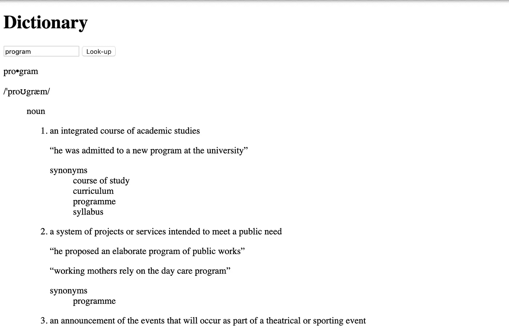

它缺乏造型，但它的工作预期！

## 我们的代码中缺少两个特性，我会留给你们做作业

1.  如果一个单词没有同义词，我们的小部件仍然会在不应该显示的时候显示单词`synonyms`。
2.  在谷歌的版本中，许多同义词可以作为超链接来查找该词的定义。然而，并非所有人都是如此。我们怎样才能达到同样的效果和行为呢？

如果你雄心勃勃，可以研究 Vue 的基于组件的架构，将这个单一组件的应用重构为由几个组件组成的应用。

# 最后，让我们使用 SCSS 模仿谷歌的小部件来设计我们的应用程序

在本节末尾的代码片段中，您会看到几次`&`字符。这个特殊字符使作者能够有效地将作为另一个元素的子元素的元素样式嵌套在该元素的样式声明块中，同时仍然在子选择器中的任何位置引用该父元素。

例如:

```
.synonym-heading {
    font-style: italic;

    &::after {
      content: ":";
    }
}
```

在常规 CSS 中应该是这样的:

```
.synonym-heading {
    font-style: italic;
}
.synonym-heading::after {
    content: ":";
}
```

因此，当选择器块被解释时，上下文中的`&`被编译成`.synonym-heading`。

## SCSS

```
#app {
  min-width: 50vw;
  max-width: 600px;
  margin: 2em auto;
  font-family: sans-serif;
  border: 1px solid lightgray;
  border-radius: 10px;
  padding: 1em;

  h1 {
    font-weight: normal;
    font-size: 2em;
    line-height: 1;
    margin-top: 1em;
  }

  input, button {
    font-size: 1.5em;
    color: gray;
  }

  .syllables {
    font-size: 2em;
    margin: 0;
    line-height: 1;
  }

  .pronunciation {
    color: gray;
  }

  .synonym-heading {
    font-style: italic;

    &::after {
      content: ":"
    }
  }

  .synonym {
    &:not(:last-child)::after {
      content: ", ";
    }
  }

  .synonym-heading,
  .synonym {
    color: gray;
    margin: 0;
    display: inline;
  }

  .part-of-speech {
    font-style: italic;
  }

  .definition-group {
    margin-bottom: 1em;
  }

  .definition-item {
    margin: 0;
  }

  .example {
    color: gray;
  }}
```

你到达了终点——无论是通过勇气还是通过滚动页面。

不管怎样，谢谢你的阅读。我希望你跟着做，因为这样做会让你成为一个更强的前端开发人员。