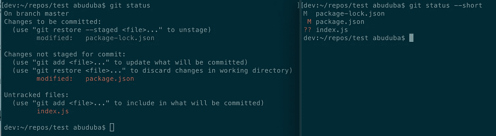
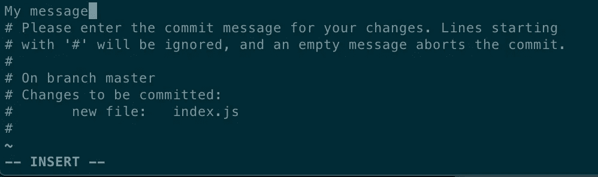
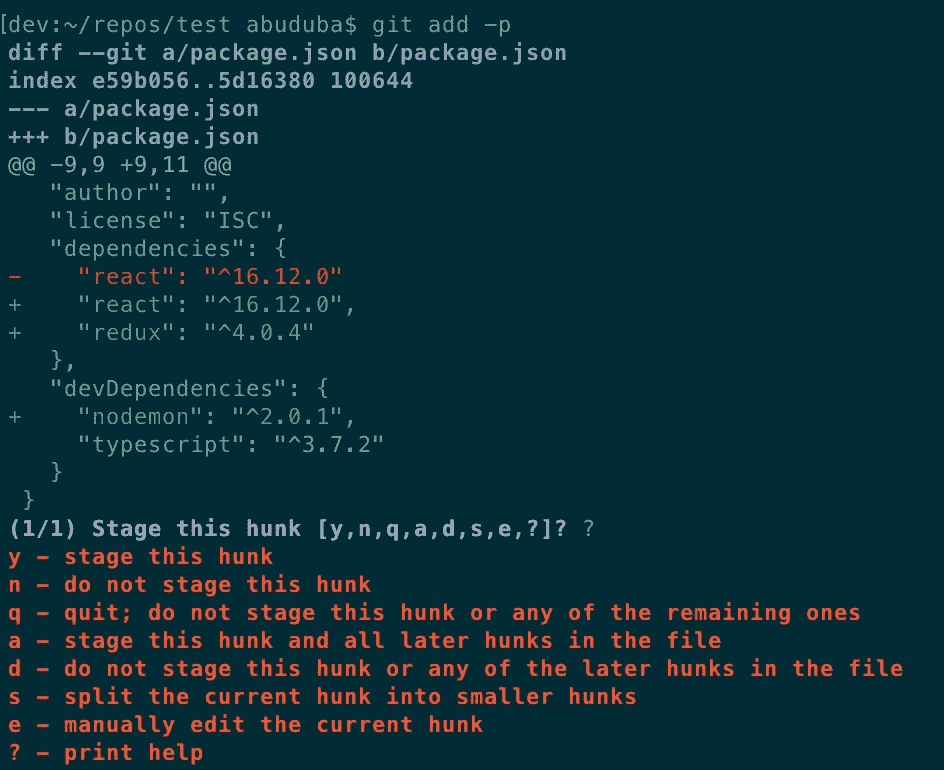
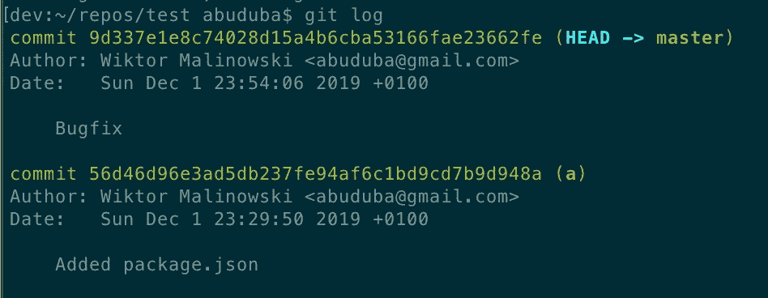
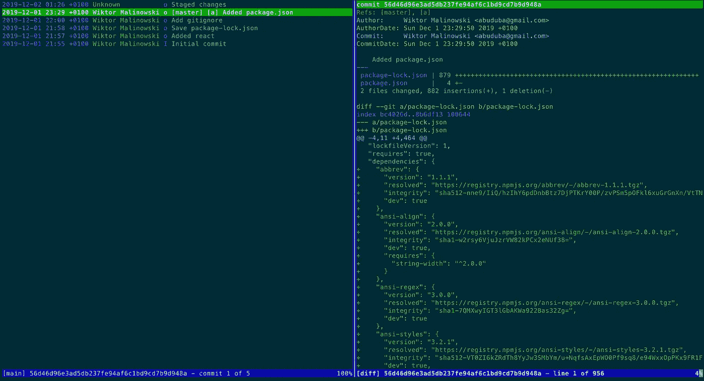

# 五分钟内像专业人士一样在命令行上开始使用 Git

> 原文：<https://betterprogramming.pub/start-using-git-on-the-command-line-like-a-pro-in-5-minutes-36a6e0007e9f>

## 基本 Git 命令的快速浏览


你每天都写代码，对吗？为什么不像写代码一样写 Git 命令，而不是点击你的 GUI 工具？

好吧，你需要一些时间来熟悉自己，但是一旦熟悉了，你会比以前更有效率。

我将向您展示一些基本的 Git 命令及其特性。不过，这不是另一个 Git 文档。

# **Git 状态**

`git status`命令显示完整状态是什么，`HEAD`在哪里，以及有哪些更改(已暂存、未暂存、未跟踪的文件)。

一旦您熟悉了长输出，您可以使用`git status --short`来查看缩小的结果:



# 操纵变化

以下是一些允许您操作更改的命令列表:

*   `git add file` —将`file`文件添加到 stage 部分
*   `git restore file` —放弃对`file`的更改
*   `git restore --staged file` —从载物台部分移除`file`

`file`可能被替换为您想要修改的任何文件或目录路径。

# 检查差异

*   `git diff` —显示工作树中未暂存的变更
*   `git diff --staged` —显示阶段性变更
*   `git diff dev` —显示工作树和`dev`分支之间的变化。您可以使用提交散列或标记来代替。
*   `git diff master..dev` —显示分支`master`和`dev`之间的变化

您可以将文件或目录的路径作为附加参数传递，以过滤指定路径的差异。

如果您只想检查文件名，使用`--name-only`开关。如果您需要知道哪些文件被修改、添加或删除，请使用`--name-status`开关。

# **提交**

一旦你有一些阶段性的改变，使用`git commit -m 'Commit message'`。
如果不使用`-m`开关，它会打开默认的文本编辑器。如果是 VIM 也不要惊讶。保存文件，并关闭窗口以完成提交。



您可以在配置中修改默认编辑器，如下所示:

```
git config --global core.editor your-editor-executable-path 
```

# 在添加/恢复/切换/区分命令中使用通配符

例如，您只想添加来自`src`目录的所有 TypeScript 文件，以便提交:

```
git add src/**/*.ts
```

放弃`test`目录中所有未暂存的更改:

```
git restore test/
```

放弃从当前目录开始的所有暂存更改(移至未暂存部分):

```
git restore --staged .
```

它支持 [glob](https://en.wikipedia.org/wiki/Glob_%28programming%29) 模式，因此您可以很好地控制元素的选择。出于测试目的，您也可以使用一个`-n`参数来模拟运行该命令。

# 交互式选择大块

使用`-p`开关(或`--patch`)通过添加(重置或恢复)命令交互选择想要修补的代码块。您决定添加哪一部分(或整个文件)。`-p`开关将输出变为:



# 转换

switch 命令可用于在分支之间切换。

*   `git switch branch-name` —切换到`branch-name`分支
*   `git switch -b abc` —创建分支`abc`并切换到它
*   `git switch -` —切换到上一个分支
*   `git checkout [args]` —作为`switch`工作，但也可以将头移动到任何提交/标记*

*`switch`和`restore`是最近的命令，旨在为众所周知的多功能`checkout`提供更好的接口。

如果你想深入研究，这里有一些详细的文章:

[](https://medium.com/blue-harvest-tech-blog/git-2-23-0-forget-about-checkout-and-switch-to-restore-ac2682b737b3) [## Git 2.23.0:忘记签出，切换到恢复。

### Git 符合可用性。

medium.com](https://medium.com/blue-harvest-tech-blog/git-2-23-0-forget-about-checkout-and-switch-to-restore-ac2682b737b3) 

# 分支

*   `git branch` —返回本地分支的列表。
    使用`-r`仅列出远程分支，或使用`-a`获取所有分支
*   `git branch abc` —创建`abc`分支
*   `git branch -d abc` —删除已经合并的`abc`。
    如果没有，使用`-D`强制删除。

# 记录结果

使用`git log`查看提交历史。



这里有很多选项，比如:

*   在提交描述旁边显示更改:
    `git log -p`
*   从当前位置返回`n`最新提交:
    `git log -2 # display two recent commits`
*   显示特定分支/版本的日志:
    `git log branch-name`
*   仅过滤特定文件的日志(此处适用全局模式):
    `git log *.js # or git log branch-name:*.js`
*   过滤作者提交的内容(接受部分名称):
    `git log --author wiktor`
*   按日期过滤:
    `git log --since 2019-10-01`
*   使用动态日期范围(日、周、月、年)按日期过滤:
    `git log --since 2months --until 1week`

# **设置别名**

您不需要每次都键入完整的 Git 命令。别名有一些基本的设置。把它粘贴到你的`.gitconfig`文件中。

```
[alias]
  br = branch
  st = status
  rt = restore
  sw = switch
  ci = commit
  d = diff
  dc = diff --cached
  l = log
  last = l -1 # it's possible to reuse existing alias
```

现在，你可以简单地用`git st`代替`git status`等等。

也可以从命令行添加别名。例如为`log`命令设置`l`别名:`git config --global alias l log`。

行动中的别名:


# 合并

`git merge abc` —将`abc`分支合并到您的分支中。

有时您不希望在合并变更时包含提交的历史。有一个选项可以将所有的更改压缩到一次提交中。

`git merge --squash your-branch`

它导致目标分支中的阶段性变化，因此您仍然可以在合并之前修改它。

# 设置 SSH 密钥

要从外部服务器访问/修改您的存储库，您必须获得授权。

您可以通过 HTTPS 使用您的凭证，或者设置您的 SSH 密钥来提供无需键入的密码。与密码相比，SSH 密钥有许多优势，例如:

*   更好的安全性，因为暴力破解或猜测的可能性极小
*   提供无需键入的密码(直到在没有密码短语的情况下创建密钥)

为了创建 SSH 密钥对，使用`ssh-keygen`命令:

`ssh-keygen -t rsa -b 4096`

它创建了一个密钥大小为 4096 位的 [RSA](https://en.wikipedia.org/wiki/RSA_(cryptosystem)) 密钥，以获得更好的安全性。默认情况下，在`~/.ssh`目录下生成密钥。请注意私钥`id_rsa`是秘密的，不得共享。

然后，将公钥`~/.ssh/id_rsa.pub`发送到您的 GitHub 帐户。

有一个官方教程:

 [## 向您的 GitHub 帐户添加新的 SSH 密钥

### 要配置您的 GitHub 帐户使用您的新(或现有)SSH 密钥，您还需要将它添加到您的 GitHub…

help.github.com](https://help.github.com/en/github/authenticating-to-github/adding-a-new-ssh-key-to-your-github-account) 

从现在开始，您无需密码就可以访问和写入存储库。

请注意，它也适用于 GitLab、Bitbucket 或其他任何东西。这个过程看起来应该非常相似。

# 还在吗？

你一定要尝试一个名为 [tig](https://linux.die.net/man/1/tig) 的文本模式 Git 工具。它有助于浏览存储库中的变更。看截图:



# 就是这样！

这只是使用基本 Git 命令的一个简单例子。每个命令都非常全面，您必须为它们分别写一篇文章(或一系列文章)。`log`命令的手册只有 2300+行。

```
git log --help | wc -l
2334
```

我希望你喜欢阅读！