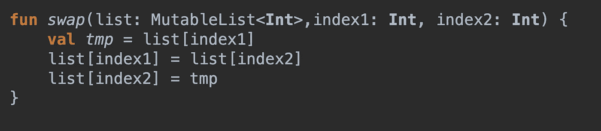
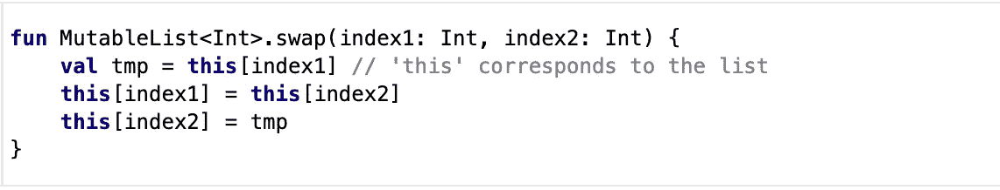
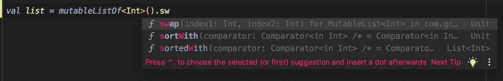

# 提升你的代码:今天就开始编写扩展

> 原文：<https://betterprogramming.pub/start-writing-extensions-today-8bbd6d010f2d>

## 通过编写扩展来扩展代码和语言

由[沙哈达特拉赫曼](https://unsplash.com/@hishahadat?utm_source=medium&utm_medium=referral)在 [Unsplash](https://unsplash.com?utm_source=medium&utm_medium=referral) 上拍摄的照片。

你曾经需要交换数组或列表中的两个项目吗？也许你写一个这样的函数:

好的，这是可行的，而且是可重用的，而不是仅仅在函数中编写逻辑。也许你把这个函数扔进了一个实用类。这是一个好的开始。

唯一的问题是有人需要*知道*这个代码在那里。要重用这段代码，需要有人找到它，然后使用它。他们可以“搜索所有”来寻找`swap`。他们可以看看实用程序类。但是这不是一个可扩展的解决方案。这是不可发现的。

所以你的朋友需要同样的功能。他没有发现你的功能。他写了几乎相同的代码，但是他写了一个扩展:

科特林的扩展的官方例子。

哦，这就像一个函数，我可以用在可变的整数列表上？太酷了。

但是如果你只是回顾这段代码，它隐藏了扩展的真正力量。你朋友写的`swap`函数现在出现在这里:

更多自动完成选项！

当处理一个可变的整数列表时，你朋友写的函数会在 autocomplete 菜单中显示出来。这是函数可发现性的巨大胜利。

你朋友所做的实际上是扩展了语言的功能，因此得名*扩展*。现在，代码库中任何地方的任何人都可以重用您的扩展，而无需明确知道代码在哪里。如果你的扩展命名恰当，它将融入语言本身！

不幸的是，作为一名程序员，你很容易永远不写扩展。这并不意味着你的生活将会结束，或者你的事业将永远不会进步。

但是如果你计划在一个代码库上工作很长一段时间，你会发现创建这个容易重用的代码有很大的好处。运用你最好的判断力。你写的代码会对其他人有用吗？这种功能是您正在使用的对象的自然延伸吗？把它变成一个扩展！

# 并非所有的扩展都是平等的

也不是所有的语言都同样对待扩展。在我现在主要使用的语言(Swift、Kotlin)中，扩展是“一级”的，不需要特殊的思想或使用模式。如果你创建了一个扩展，你可以使用它！它的行为就像一个普通的函数。

但是多年来，我一直从事 JavaScript 工作——JavaScript 中的扩展意味着原型。JavaScript 中的原型是编程中真正的狂野西部。我害怕它们，也从未学会如何使用它们。

我想我现在已经看到了扩展的用处，我写了很多 JavaScript。我对使用原型的真正恐惧几乎一无所知(缺乏类型安全性？这通常是一个 Javascript 问题)，但解决这些问题可能是值得的。

如果你正在编写 JavaScript，你应该使用类型安全的风格，比如 Typescript。

# **自己试试吧！**

了解如何用您选择的语言编写扩展。将几个助手或实用函数改为扩展。在你眼前感受改变语言的力量。

只要确保你的扩展没有任何[副作用](https://softwareengineering.stackexchange.com/questions/40297/what-is-a-side-effect)。