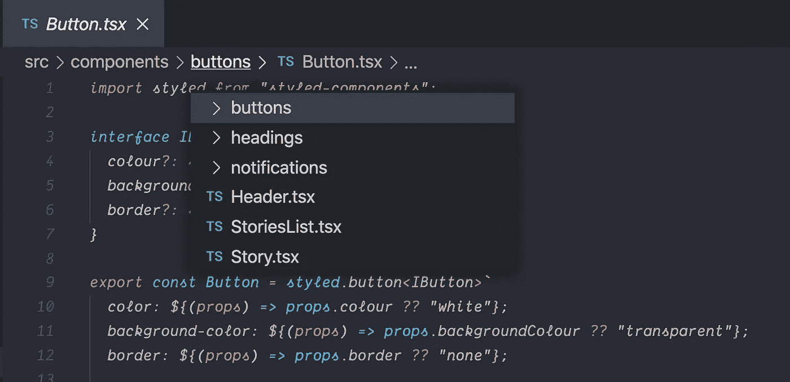
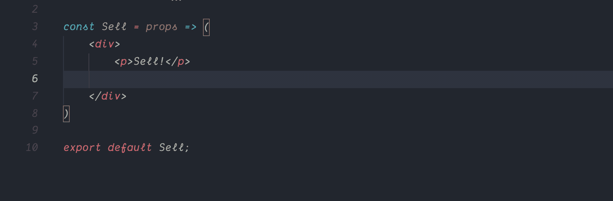
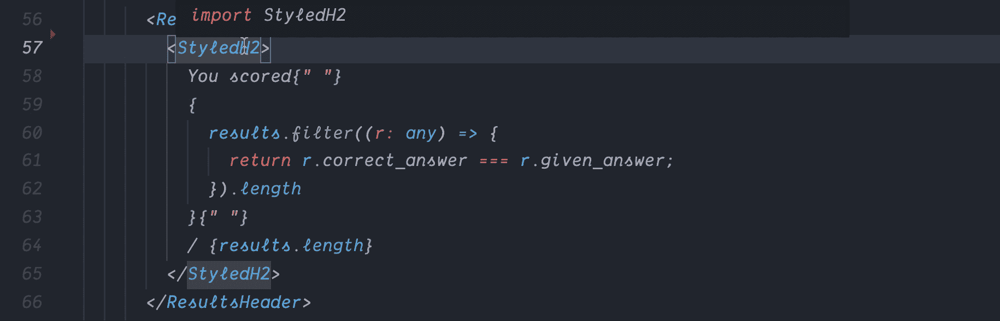
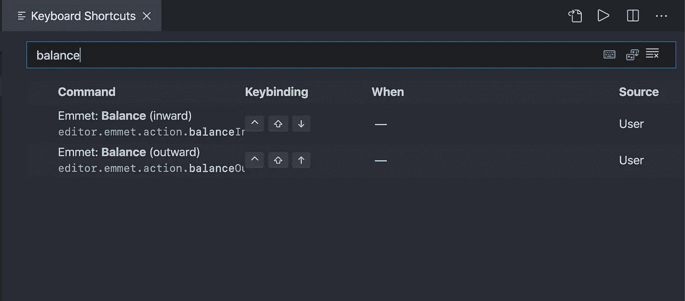
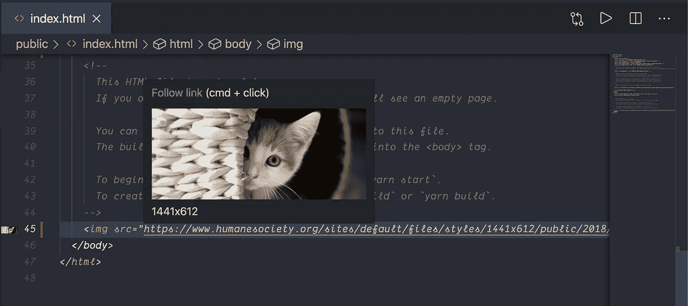
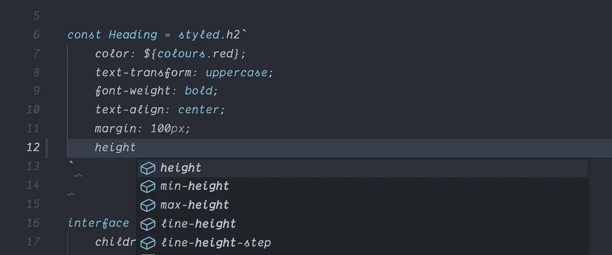
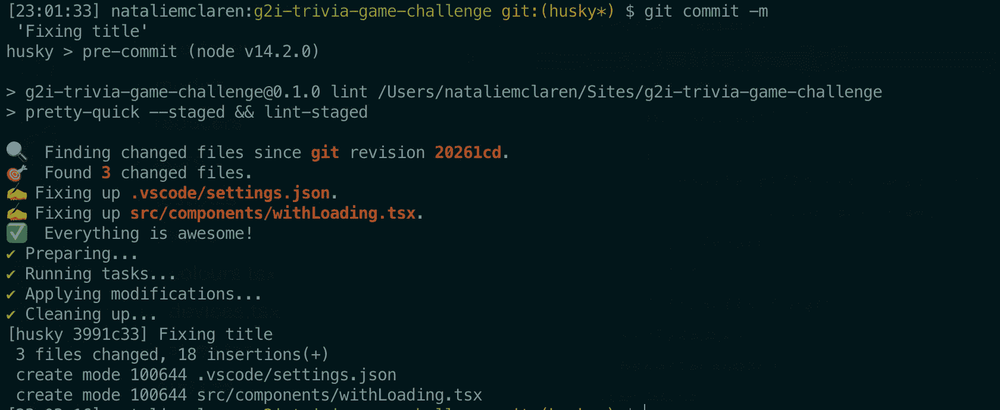

# 用这些快速 VS 代码工具和技巧开始你的一天，最大化生产力

> 原文：<https://betterprogramming.pub/start-your-day-with-these-quick-vs-code-tips-tricks-to-enhance-productivity-4da6e5224862>

## 2.面包屑


凯文·巴加特在 [Unsplash](https://unsplash.com/?utm_source=unsplash&utm_medium=referral&utm_content=creditCopyText) 上拍摄的照片

# 1.给你的标题栏增加一点色彩

VS Code 允许用户随意定制他们的环境，但是我特别喜欢的一个定制是改变标题栏背景颜色的能力。

经过几个小时的开发，一些引人注目的容易区分代码库的东西非常受欢迎。此外，您可以根据代码库设置不同的颜色，或者为所有代码设置默认颜色。


实现上述目标的步骤:

*   点击`cmd` + `,`打开 VS 代码设置
*   点击**“工作区**”选项卡
*   在搜索栏中搜索**“work bench”**,您应该看到“work bench→“Color Customizations”作为第一个选项。点击`settings.json`链接，将以下内容添加到您的设置 JSON 对象的根目录中:

```
"workbench.colorCustomizations": {
    "titleBar.activeForeground": <color of choice>, "titleBar.inactiveForeground": <color of choice>, "titleBar.activeBackground": <color of choice>, "titleBar.inactiveBackground": <color of choice>}
```

`foreground`设置将负责标题栏文本和标题栏颜色的`background`。

瞧。

**注意:**除非你告诉你的`.gitignore`否则这些变化会被推上你的回购协议，所以如果你在一个团队中工作，你可能想在做出这些变化之前先和他们核实一下！

# 2.面包屑

VS 代码给我们带来了另一个非常有用的现成特性——面包屑。轻松浏览当前目录中的文件并在它们之间导航。



要激活此设置:

*   点击`cmd` + `shift` + `p`切换命令面板
*   接下来，输入“**视图:切换面包屑**”并点击回车

# 3.Emmet 的键盘技巧

我最喜欢的扩展之一必须是[Emmet](https://code.visualstudio.com/docs/editor/emmet)——它现在默认带有 VS 代码。Emmet 提供了有用的快捷方式，可以一次快速创建多个 HTML 元素及其类和 id。



实现上述目标的步骤:

*   键入`p*3` *(或者用* `*p*` *代替您选择的元素)*然后点击`tab`
*   在点击每个元素内部的同时按下`alt`键，将光标放在所有三个元素上
*   根据需要对任意数量的元素重复第一步

要设置类，您可以使用句号— `<element>.<class name>` —来完成，对于 id，使用标签— `<element>#<id name>` —并在两者之后点击 tab 来生成您的元素。

## 还有更多…

Emmet 的功能不仅仅是创建 HTML 元素，它还允许您使用一个简单的快捷方式选择整个元素及其子元素。不需要跳格或过多的`down`按键。



实现上述目标的步骤:

*   点击`cmd` + `shift` + `p`，输入**快捷键**
*   点击**偏好设置:打开键盘快捷键**，搜索**“天平**”。



*   向内选项负责突出显示特定元素的所有子元素。
*   outward 选项负责突出显示一个特定元素及其所有子元素**。**
*   点击它们添加您想要的快捷方式；我用`ctrl` + `shift` + `down`向内，`ctrl` + `shift` + `up`向外。

现在，当您将光标放在一个元素上并触发这些快捷键中的任何一个时，您的整个元素——及其子元素或仅其子元素——将被高亮显示，而无需对每一行重复使用鼠标或箭头。

**注意:**尽管 Emmet 默认带有 VS 代码，但它必须被激活才能在 React 组件中使用。

要激活此功能，点击`cmd` + `,`打开设置。在“工作区”选项卡中，导航至**扩展** → **Emmet** → **排除语言，**并点击**“在 settings.json** 中编辑”。在根对象中添加以下内容:

```
"emmet.includeLanguages": { "javascript": "javascriptreact",}
```

Emmet 现在应该也可以在 React 组件中使用了。

更多的语法缩写，查看他们的[文档](https://docs.emmet.io/abbreviations/syntax/)。

# 4.iTerm 初始工作目录

我花了比我愿意承认的更长的时间在我的 iTerm 上输入`cd ..`来获得我的回复——并认为这是结束了。为什么不直接从你存放回购文件的文件夹中打开它呢？

对于像我一样使用 macOS 的人:

*   **iTerm** → **偏好** → **简介** → **通用**。在“工作目录”下填写您的初始工作目录。

对于 Windows:

*   在 Windows 搜索中搜索**命令提示符** →右键点击**【打开文件位置】** →右键点击命令提示符快捷方式→ **属性** → **快捷方式**。在“开始于”下填写您的初始工作目录。

如果做不到这一点，这篇[文章](https://techsupportwhale.com/change-default-directory-in-command-prompt/)探索了在 Windows 上改变这个初始目录的替代方法。

# 5.图像预览扩展

[图像预览](https://marketplace.visualstudio.com/items?itemName=kisstkondoros.vscode-gutter-preview&WT.mc_id=vscodecandothat-dotcom-team)扩展为开发者提供了一个`img` `src`在悬停时以及在编辑器的装订线内的预览。



# 6.缩进快捷方式

因为我们并不总是第一次就做对，所以点击`alt` + `shift` + `f`来自动缩进并美化你的代码。

这不仅适用于`.html`文件，也适用于`.js`、`.tsx`和`.json`文件。

# 7.样式化组件的语法高亮显示

样式化组件允许 CSS-in-JS 和代码在整个前端应用程序中的可重用性。然而，这样做的缺点是，由于样式是在 t [模板文字](https://developer.mozilla.org/en-US/docs/Web/JavaScript/Reference/Template_literals)中定义的，因此很容易忽略错误。vscode-styled-components 扩展消除了用我们都知道和喜欢的 CSS 语法突出样式化组件的所有顾虑。突出显示使得发现和纠正我们风格中的语法错误变得更加容易。

这个包不仅仅提供高亮显示，它还通过在你输入的时候显示一个建议的样式列表，为开发者提供了与他们在编写`.css`文件时相同的体验。



# 8.埃斯林特

你可能会认为这是一个显而易见的问题，但我们通常认为这是理所当然的。ESLint 是一个 [linter](https://en.wikipedia.org/wiki/Lint_(software)) ，坐在幕后确保我们的代码在语法上是正确的，并且符合最佳实践。ESLint 可以集成到 VS 代码中，既可以格式化我们的代码，也可以对其进行分析以提出改进建议。

要使用 ESLint 扩展，您需要在当前工作区或全局安装软件包。命令如下:

```
npm install eslint
```

然后，简单地安装[扩展](https://marketplace.visualstudio.com/items?itemName=dbaeumer.vscode-eslint)并确保它已启用。当您在窗口底部看到以下内容时，您将知道它正在工作:


VS 代码窗口的右下角

ESLint 将根据标准规则检查您的代码。但是您也可以将它配置为使用您自己的规则。要设置自己的规则，您需要在项目的根目录下创建一个`.eslintrc`文件——这个文件将作为 ESLint 的配置文件，包含您所有的规则。

VS 代码有一个方便的快捷方式来正确设置 ESLint(我推荐这种方式，而不是手动创建配置文件):

*   点击`cmd` + `shift` + `p`来切换命令面板
*   搜索“ **ESLint:创建 ESLint 配置**，点击`enter`

一个 VS 代码终端将会打开，你将会被询问一些关于你的应用和林挺风格偏好的问题。你可以选择你自己的定制`.eslintrc`文件，或者扩展你的配置文件，比如从一个被认可的文件扩展而来，比如由 [Airbnb](https://github.com/airbnb/javascript) 开发的文件。

# 9.提交前挂钩

如果处理许多文件或组件，您可能不一定会意识到您无意中遗漏了一些文件。预提交钩子非常适合在将代码提交给共享存储库之前进行最后的检查。

一个钩子允许你在应用程序的特定点添加一些功能，方法是“钩”入这些点并触发功能。

当提交我的 repos 时，我使用预提交钩子来美化我的代码。在提交时，我的钩子将触发我的 ESLint 和 Prettier 命令，在提交之前检查我所有更改的文件是否都是有序的。任何违反最佳实践的情况都被标记为警告和错误，提示用户在再次尝试提交之前修复它们。



我选择的工具是[husky](https://typicode.github.io/husky/#/)——一个根据定义的配置轻松触发 Git 挂钩的工具。我使用 husky 来 lint 我的代码，使用 ESLint 来格式化我的代码。

假设你已经安装了 ESLint，用下面的命令安装 husky 和 Prettier:

```
npm install husky --save-devnpm install --save-dev --save-exact prettier
```

在您的`package.json`中，在根对象的底部添加以下内容:

```
"husky": { "hooks": { "pre-commit": "npm run lint" }}
```

这个块让 husky 知道我们想要使用它的“预提交”钩子。这意味着当我们提交时，husky 现在将运行我们的自定义命令—在本例中为`npm run lint`。`npm run`用于运行我们的`script`对象下的任何命令。但是，你可能已经注意到了，在我们的`package.json`中，你没有一个名为`lint`的剧本。还没有。这让我们进入下一步。

将下面一行添加到`package.json`文件中的`scripts`对象:

```
"lint": "pretty-quick --staged && lint-staged"
```

现在我们有一个名为`lint`的命令来运行`“pretty-quick —- staged && lint-staged”`。`pretty-quick —- staged`指的是一个开箱即用的漂亮命令，但是`lint-staged`呢？`lint-staged`是对预期存在于`package.json`中的另一个命令的引用。这就把我们带到了最后一步——定义在这个新命令下 ESLint 应该 Lint 哪些文件。

将以下内容添加到您的`package.json`文件中的根对象(确保您将此**添加到您的`scripts`对象**之前):

```
"lint-staged": { "*.{tsx,ts,js, jsx}": "eslint --cache --fix"},
```

简要回顾一下我们所做的工作:

*   我们在第一个代码块的`package.json`文件中定义了一个**预提交 husky 钩子**，带有一个**自定义命令**，我们可以使用来**触发它。**
*   在第二个代码块中，我们已经指定了在我们的`script`对象中运行我们的自定义命令后应该触发的特定功能。
*   最后，我们的特定功能之一(`lint-staged`)是对另一个命令的引用，所以我们定义了这个命令在最后的代码块中应该做什么。

下次您提交对以下任一类型文件的更改时:`tsx, ts, js, jsx`当您提交时，您将在终端中看到以下内容:


# 概述

开发人员社区受益于大量的工具，在日常工作中最大限度地提高生产率和代码质量。在这篇文章中，我列举了一些我一天都离不开的东西。

*   给你的窗口标题栏增加一点色彩
*   通过面包屑导航更快
*   使用 Emmet 充分利用键盘技巧
*   设置 iTerm 的初始目录
*   悬停时预览您的 HTML 图像
*   注意缩进
*   样式化组件语法突出显示
*   配置 ESLint
*   添加预提交挂钩

# 有用的资源

*   [ESLint 演示](https://eslint.org/demo)
*   [更漂亮的游乐场](https://prettier.io/playground/)
*   [埃米特备忘单](https://docs.emmet.io/cheat-sheet/)

编码快乐！😎