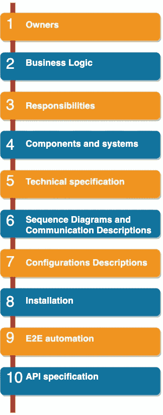

# 创业和生产准备流程

> 原文：<https://betterprogramming.pub/startups-and-the-production-readiness-process-6d407f9c0b94>

## 定义和控制将软件应用程序交付到生产环境的方式

在 [Unsplash](https://unsplash.com?utm_source=medium&utm_medium=referral) 上由 [Jacalyn Beales](https://unsplash.com/@jacalynbeales?utm_source=medium&utm_medium=referral) 拍摄的照片

稳定性和治理是任何软件开发过程中都应该处理的最热门的话题。从开发阶段到生产环境中的部署和运行阶段，这两个主题都需要解决。

有助于掌握软件开发、部署和服务运行的流程或技术之一是生产准备流程。该过程是一系列任务和项目验证，需要在软件开发过程中进行检查，以确保服务:

*   有适当的文件
*   准备在生产环境中运行
*   符合所有采用的标准和非功能特性

为每个开发的服务检查上述信息将有助于

*   提供关于服务内部的透明信息
*   开发和 SRE/部署团队之间的平稳交接
*   让 SRE/部署团队对在生产中运行和支持服务充满信心

在这篇文章中，我将说明如何定义一个基本的生产准备过程，我将解释这个过程应该解决的每一个项目。

生产准备流程/清单包括两个主要部分:

*   服务描述:这些项目将描述服务并提供服务标识。这些项目中的大部分被认为是服务文档，并且在发生变化时总是需要更新。
*   标准:这些是为了使服务符合所采用的标准和支持的非功能特性而需要实现的项目。

# 服务描述项目

以下是服务描述部分中可能包含的项目的列表和简要描述:

图片来源:作者

*   **所有者**:列出服务所有者和贡献者(工程师、业务所有者)的角色和职责。当需要对服务做出决策时，或者在生产环境中发生事故时，这些信息非常有用。
*   **业务逻辑**:描述服务用例以及业务逻辑。这将有助于其他团队了解服务在内部是如何工作的，并将使团队之间的交接更加顺畅。
*   **职责**:描述服务的主要职责和特点，以便能够理解服务角色和需求。
*   **组件和系统**:描述服务架构和内部组件或服务。
*   **技术规格**:提供服务技术规格和要求，如

→基础设施硬件和软件要求(操作系统、RAM、CPU)

→使用的技术(编程语言、库、第三方工具)

*   **序列图和流程**:描述服务的所有依赖关系，解释服务和其他微服务之间的流程和通信。这些信息非常有用，尤其是在发生事故并且需要调查问题时。这些图表应该至少涵盖以下两种情况。

→对第三方的服务依赖

→服务与堆栈中其他服务的通信

*   **配置描述**:提供并描述将服务安装并部署到环境中所需的所有可能的服务配置。受支持的配置集可以属于以下一个或多个配置类别:

→构建时配置:在构建服务包时提供的配置，例如，支持的操作系统。

→部署时配置:这些配置可以在部署时作为环境变量传递给服务流程。这种配置的一个例子是数据库连接字符串。

→运行时配置:这些是持久的配置，可以在服务运行时加载和更改(即无需重启服务)，例如服务支持的主要语言。

→机密:这些是不应以纯文本形式存储或共享的敏感信息，如数据库密码、私钥和第三方 API 机密。

*   **安装**:描述服务的安装和部署所需的步骤。应该对此进行详细描述，并涵盖部署服务和对正在运行的实例进行故障排除所需的所有方面和步骤。
*   **E2E 自动化**:描述受服务影响的端到端测试用例。
*   **API 规范**:定义并记录 API 规范，以防服务提供的 API 应该被其他服务使用。

# 标准和非功能特性

*   **代码风格**:服务应该兼容所采用的代码风格。有几个工具可以与 CI/CD 管道集成，以确保集成的代码与代码风格兼容。例如，对于 Ruby 应用程序来说， [Rubocop](https://github.com/rubocop-hq/rubocop) 可以用来轻松完成这项任务。
*   **安全**:服务安全是最重要、最敏感的话题之一。因此，需要扫描服务源代码、Docker 映像和其他包，并针对已知的漏洞进行验证。

→为 Ruby 应用程序使用静态分析库，如 [Brakeman](https://github.com/presidentbeef/brakeman) 。

→扫描 Docker 映像，查找操作系统漏洞。

*   **应用日志**:生产服务需要支持服务生产日志的一致方式。以下是定义记录系统和方法时要考虑的一些建议要点。

→日志级别可通过环境变量进行配置。(在生产中，级别应该是 INFO。)

→支持单行日志(每个 web 请求或事件只有一个日志行)。

→支持键值/JSON 日志格式。这将使解析和发布日志变得更加容易。

*   **健康检查端点集成**

部署到生产环境中的每个服务都必须支持运行状况检查端点，以便能够验证服务的状态和运行状况。这些端点可以由监控系统或容器编制器解决方案(Swarm 或 Kubernetes)使用。运行状况检查端点是支持高可用性和零停机部署的一项要求。

*   **请求跟踪多个服务**

如果软件遵循微服务架构，并且为一个请求提供服务可能会导致对多个服务的多次调用，我们必须确保这些服务的日志相互关联，并且可以被识别为单个请求。这个日志集合不仅适用于服务之间的同步通信，也适用于异步通信，比如后台作业、RabbitMQ 订阅者、Kafka 消费者等等。

*   **Docker 支持和 Kubernetes 支持**

在本地容器或云中托管应用程序是支持更好、更流畅、可移植的部署和易伸缩性的必要条件。因此，需要确保服务可以在这些系统上运行。一个好主意是为开发团队提供一些标准和文档，以便能够在开发的早期阶段对服务进行分类。以下是该主题需要涵盖的一些领域。

→将服务归档并创建归档文件。

→创建 Makefile，用于构建 Docker 映像的统一接口。

→创建 Kubernetes 资源。

→为服务创建一个舵图。

→创建用于构建 Docker 映像的 Jenkins 管道。

*   **性能测试**:需要执行性能测试，以便能够验证和理解新服务和整个堆栈的性能和限制。
*   **CI/CD** :确保在 Jenkins 中实现并创建所有需要的 CI/CD 管道。

→运行单元测试。

→构建 Docker 映像。

→制作舵图。

→部署到所有支持的环境。

→等等。—以上项目列表只是生产准备清单中可包含的项目示例。这些项目取决于服务的性质、编程语言以及将为其创建项目清单的软件架构。例如，在拥有 Rails 应用程序的情况下，您可能需要添加一个项目来控制和收集来自 Rails 控制台的日志。

另一方面，在移动应用程序的情况下，上述列表中的一些项目根本不适用，需要考虑新的项目，例如:

*   遵守谷歌和苹果开发者计划和应用商店条款和条件
*   强制更新
*   远程功能标志
*   支持的版本和设备
*   其他…

# 结论

生产准备过程是开始控制开发过程和维护生产系统中服务稳定性的好主意。它还有助于获得在生产中运行和支持服务的信心。文章中介绍的过程并不是一成不变的。事实上，强烈建议定制和构建一个适合项目和软件服务需求的过程。