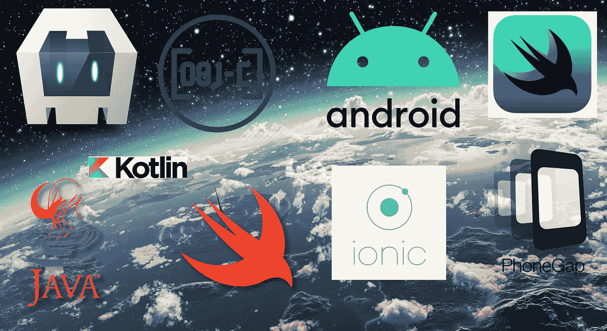
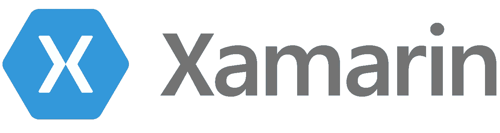
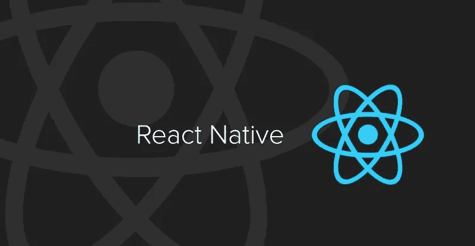
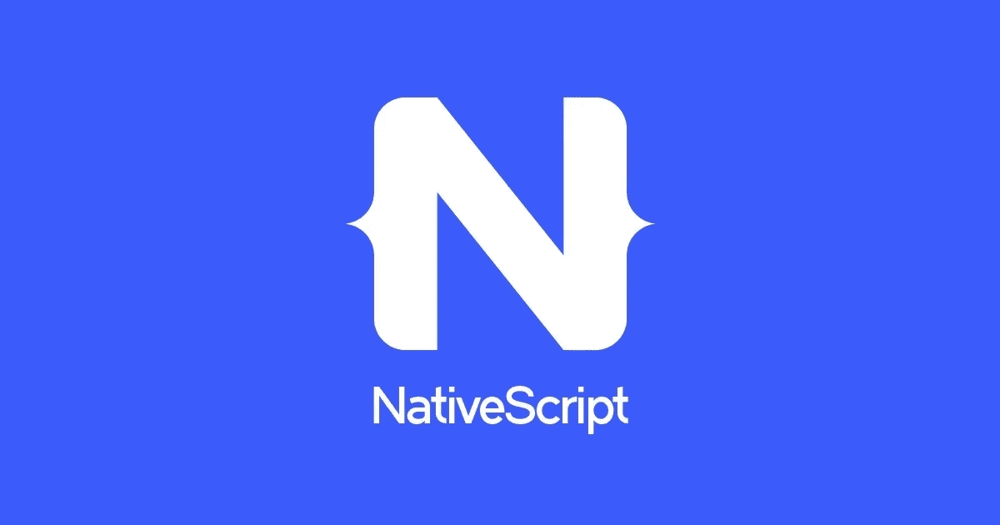
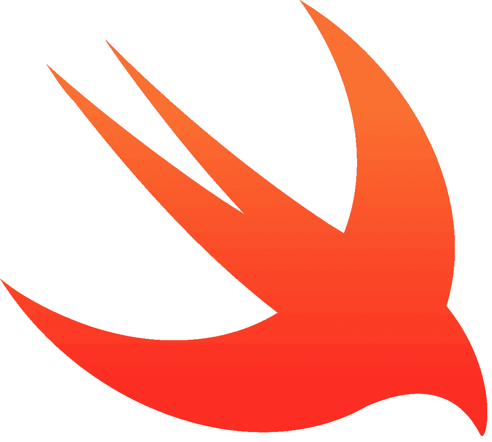
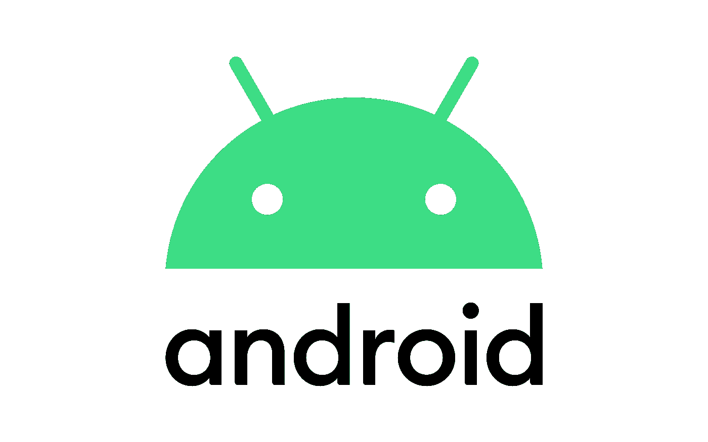

# 2021 年移动应用开发状况

> 原文：<https://betterprogramming.pub/state-of-mobile-development-in-2021-4266a4098667>

## 颤振，反应原生，iOS，还是安卓？选择最适合你的团队的一个



David Fekke 的图片说明

如果你是移动开发新手，为 iOS/iPadOS 和 Android 平台构建应用程序可能会令人望而生畏，但有许多不同的选项可以开发这些可能符合你需求的应用程序。在本文中，我将介绍开发移动应用程序的一些选择，并讨论每个不同选择的优缺点。

移动开发选项可以分为三大类:基于 web 的、跨平台的本机和纯本机开发。我将尝试深入开发人员在构建移动应用程序时可能会用到的每个选项。

# 基于网络的框架

有许多不同的框架面向 web 开发人员，允许他们构建可以从各自的商店安装的应用程序。这些应用程序可以仅使用 HTML、CSS 和 JavaScript 来构建。我们也可以认为这些类型的应用程序是打包的 WebViews。

## 科尔多瓦


Cordova 是一个框架，它源于使用 HTML/CSS 和 JavaScript 等 web 技术构建应用程序，并将 HTML 应用程序嵌入到原生容器中。这对于已经精通 web 技术的现有 web 前端开发人员来说是一个巨大的推动。原生应用可以像常规的原生应用一样被提交到单独的应用商店。

如果您正在使用 Cordova，请确保使用最新版本的 Cordova。早期版本包含对苹果 UIWebView 的引用。苹果将不接受包含 UIWebView 引用的新应用。

**优点**

*   如果你是一个现有的网络开发人员，很容易过渡
*   许多为移动应用程序构建的 HTML 和 JavaScript 框架
*   轻松添加插件以利用推送通知等本机功能

**缺点**

*   归根结底，这是一个封装的 WebView。
*   因为 UI 是用 web 框架而不是原生框架构建的，所以用户会有一种神秘谷的感觉
*   扩展功能需要了解 Objective-C 和 Java


## PhoneGap

已弃用！Cordova 是 PhoneGap 的开源项目。PhoneGap 是一个商业项目，最终被 Adobe 收购。Adobe 已经停止了对 PhoneGap 和 Cordova 的投资。Cordova 继续作为一个开源项目。

不要使用 PhoneGap 启动任何新的应用程序。如果你正在接手一个基于 PhoneGap 的项目，那么就过渡到 Cordova 或者考虑在另一个框架中重建。

## 离子的

[Ionic](https://ionicframework.com/) 是围绕 Angular 和 Cordova 构建的框架。如果你熟悉 Angular 生态系统并且喜欢 Cordova，这可能是一个你有兴趣学习的框架。

## 替代 WebView 开发

我有一些关于如何在特定的原生平台上创建你自己的网络视图的博文。在这篇[帖子](https://fek.io/blog/you-do-not-need-cordova/)中，我描述了如何在原生 iOS 应用中使用 iOS 中的 WKWebView，而不必使用 Cordova。在后续的[帖子](https://fek.io/blog/using-a-web-view-on-android-still-no-need-for-cordova)中，我展示了如何在 Android 应用程序中做同样的事情。

# 跨平台选项

构建共享代码的多平台移动应用程序有许多不同的选择。软件工程师的一个愿望是能够构建 WORA 的应用程序，即“编写一次，在任何地方运行”Java 平台最初被认为是一种语言和一个系统，只需编写一次应用程序，就可以在任何地方运行。

## 摆动

[Flutter](https://flutter.dev/) 是谷歌的另一个跨平台框架。与 Cordova 不同，Flutter 不使用 WebView，而是使用一种称为 Dart 的通用语言来开发应用程序。Dart 最初的目标是作为 JavaScript 的替代品。

**优点**

*   不仅为 Android 和 iOS，还为许多其他操作系统构建跨平台应用
*   制作动画的好工具
*   您可以使用小部件构建应用程序
*   将与 Fuschia 兼容

**缺点**

*   主要的开发语言是 Dart
*   一些性能问题
*   并非所有的原生特性都适用于 Flutter 开发者
*   没有太多用于扩展功能的插件
*   难以制作特定于平台的 UI
*   不是一项成熟的技术



## Xamarin

现在正式成为微软和 Visual Studio 一部分的 Xamarin 框架是基于。NET 和 C#。如果你是一个. NET 开发者，不熟悉 Android 上的 Java/Kotlin 和 iOS 上的 Swift/Objective-C，这可能是适合你的框架。您可以使用 Visual Studio 解决方案构建和组织您的应用程序。在您的解决方案中，您可以将项目分为 iOS 和 Android 的共享代码项目和单独项目。这使得开发人员可以根据目标平台的特定用户界面定制他们的应用程序。它还允许开发人员共享两个平台的业务逻辑。

**优点**

*   如果你有熟悉。NET 中，语言和工具与他们使用的是相同的
*   允许在 Android 和 iOS 之间重用代码
*   使用提前编译来创建本地应用
*   一些 API 来自。可与 Xamarin 一起使用的 NET

**缺点**

*   需要 Mac 来编译 iOS 应用程序
*   没有 Visual Studio 对 M1 MAC 的支持

## Xamarin。形式

[Xamarin。Forms](https://docs.microsoft.com/en-us/xamarin/xamarin-forms/) 提供了一个跨平台的工具，用于创建在 iOS 和 Android 上都能工作的用户界面。并非所有的 UI 元素在两个平台上都可用。



## 反应自然

[React Native](https://reactnative.dev/) 框架与 React.js 应用程序使用的框架相同。React 是一个非常流行的基于 JavaScript 的视图引擎，用于构建基于组件的 ui。React Native 有自己的本地视图，可以使用 React 进行组合。它也有自己的 Flexbox 实现来布局用户界面。

JavaScript 桥用于将业务逻辑绑定到用户界面组件。React Native 为桥使用 JavaScript 核心。和 React.js 一样，这个项目也是由脸书赞助的。

**优点**

*   使用 JavaScript JSX 构建原生应用，同时仍然是一个原生应用
*   使用 React 本机模块轻松扩展您的应用程序
*   可以使用 React 开发人员构建移动应用
*   也可以构建 React 本地 web 应用程序

**缺点**

*   使用 JavaScript 桥会遇到性能问题
*   编写定制模块需要了解 iOS 上的 Objective-C 和 Android 上的 Java
*   滚动性能次优
*   Airbnb 写了一些关于他们与 React Native 之间问题的文章:“[在 Airbnb 的 React Native](https://medium.com/airbnb-engineering/react-native-at-airbnb-f95aa460be1c)、“[在 Airbnb 的 React Native:技术](https://medium.com/airbnb-engineering/react-native-at-airbnb-the-technology-dafd0b43838)、“[建立跨平台移动团队](https://medium.com/airbnb-engineering/building-a-cross-platform-mobile-team-3e1837b40a88)”和“[Airbnb 的下一步移动是什么](https://medium.com/airbnb-engineering/whats-next-for-mobile-at-airbnb-5e71618576ab)”



## 原生脚本

[NativeScript](https://nativescript.org/) 与 React Native 的模型相似。但与 React 不同，它的框架最初是基于 Angular 的。NativeScript 还支持 Vue、Svelte 和 React。

NativeScript 展示了 Angular、Vue 和 React 不仅仅是 web 应用程序框架，还可以仅仅作为应用程序框架使用。这个项目是 OpenJS 基金会的一部分。

**优点**

*   相似的反应框架
*   使用 JavaScript 或 TypeScript 构建本地应用
*   支持多种应用框架，包括 Vue、Svelte 和 Angular

**缺点**

*   在 React Native 中遇到的类似性能问题
*   开发人员可以访问的一组有限的本机 API

# 原生 iOS/iPadOS

苹果和谷歌希望你为他们各自的操作系统编写应用程序的方式将是原生的。iOS 和 iPadOS 都有自己的框架和语言。苹果的 macOS 最初是基于 NextStep 操作系统的，它的所有框架都使用 Objective-C。

## IDE 和工具

Apple 有一个名为 Xcode 的集成开发环境，在一个工具中拥有构建原生应用程序所需的所有工具。Xcode 允许开发人员用 C、C++、Objective-C 和 Swift 编程语言编写代码。它包括基于 LLVM 的 Swiftc 和 Clang 编译器。

它还附带了由苹果公司设计的用于开发 iOS/iPadOS 软件的 Cocoa Touch 框架。它最初是从 MacOS 的 Objective-C 可可粉中提取的。

## 目标-C

Objective-C 是为 NextStep 和 Mac OS X 开发软件的主要语言，也是 iOS 最初七年的主要语言。Objective-C 最初被设计为在 C 编程语言之上构建面向对象软件的一种方式。Objective-C 类通常由两个文件组成，一个头文件`.h`和一个实现文件`.m`。你也可以通过添加一个额外的*m*`.mm`到所谓的 Objective-C++的实现文件中来组合 C++代码。



## 迅速发生的

2014 年，苹果推出了 [Swift](https://developer.apple.com/swift/) 编程语言。像 Objective-C 一样，Swift 是一种通用语言，但具有许多功能特性。Swift 拥有先进的通用特性、闭包和错误处理语法。

```
let greeting = "Hello!"
print(greeting)
// Output: Hello!
```

## 斯威夫特伊

苹果在 2019 年推出了 [SwiftUI](https://developer.apple.com/xcode/swiftui/) ，允许开发者用代码构建声明性 UI。与传统的 Cocoa Touch 中的类不同，视图由轻量级结构组成。

**优点**

*   构建特定于平台的应用
*   来自 Apple 的强大支持选项
*   完全访问所有公开可用的 API

**缺点**

*   Objective-C 和 C 对于一些开发人员来说可能太低级了，但是现在大多数开发都可以用 Swift 完成
*   web 开发人员更陡峭的学习曲线



# 原生 Android

Android 操作系统基于 Linux，API 基于 Java。由于它是基于 Java 的，开发人员可以将现有的 Java 库添加到他们的应用程序中。

## IDE 和工具

Android Studio 是谷歌从 Jet Brains 获得许可的 IDE，Jet Brains 是开发 IntelliJ 系列 IDE 的公司。它配有 cod 编辑器、ADB 工具和 Android 模拟器，用于测试您的应用程序。

## Java 语言(一种计算机语言，尤用于创建网站)

Java 最初是由 Sun 在 20 世纪 90 年代开发的，是一种面向对象的通用编程语言。Java 代码通常被编译成字节码或中间代码，而不是为一个处理器构建的可执行程序。当前版本的 Android 开发者工具实际上是使用 ART 来编译应用程序的，ART 提前编译机器代码。

## 科特林

Kotlin 是一种较新的通用面向对象编程语言，最初由 Jet Brains 开发，它是流行的程序员 ide 和开发工具的制造商。它现在是 Android 开发的默认编程语言，运行在 Java 生态系统中。

## Jetpack 撰写

谷歌目前正在开发一个新的声明式 UI 框架，类似于 Android 的 SwiftUI，名为 Compose。它仍处于测试阶段，但开发者可以下载并开始使用金丝雀版本。

**优点**

*   构建特定于 Android 平台的应用
*   完全访问所有公开可用的 API

**缺点**

*   Java 和 C 对于一些开发人员来说可能太低级了，但是大多数开发人员现在都可以用 Kotlin 完成
*   web 开发人员更陡峭的学习曲线

# 游戏开发

在手机上构建跨平台游戏有很多不同的选择。在这篇文章中，我只打算尝试涵盖其中的一些。你也可以使用各厂商的原生工具来开发游戏，但是下面的框架是更高级的，被认为更容易构建游戏。

## 一致

[Unity3D](https://unity.com/) 是一个程序和引擎，用于在多个平台上构建应用和游戏，包括 iOS 和 Android。他们可以选择 3D 游戏和 2D 游戏。他们还可以选择多种编程语言，包括 Lua、C#和 JavaScript。

**优点**

*   使用 Unity3D 引擎轻松创建游戏
*   可以用 JavaScript，Lua，C#，C++，IronPython，Rust 和 Boo 扩展那些游戏

**缺点**

*   Unity 许可对一些开发者来说可能太贵了
*   Unity 可能为需要 GPU 访问的开发人员提供了太多的抽象

## 一夫一妻

一夫一妻制框架允许游戏开发者针对包括 iOS/Android 在内的多个平台。开发者可以用 C#或者其他。NET 语言来构建他们的游戏。

**优点**

*   开源项目
*   使用构建游戏。NET 之类的框架和 C#之类的语言

**缺点**

*   没有专业支持选项

# 结论

有一种说法是，你应该使用最好的工具来完成这项工作。我开发移动软件已经有十多年了，我在开发的大部分时间里使用的都是原生工具。这主要是因为我喜欢完全访问平台上的所有 API。

你能做的事情之一就是混合搭配框架。你可以为 iOS 构建一个本地应用程序，它也使用科尔多瓦构建的部分。对于一些 React 本地应用程序来说，部分内容完全是本地的也很常见，有些视图是使用 React 构建的。选择最适合您需求的工具。

*最初发布于*[*http://fek . io*](https://fek.io/blog/state-of-mobile-development-in-2021/)*。*